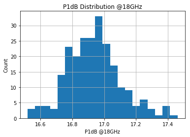
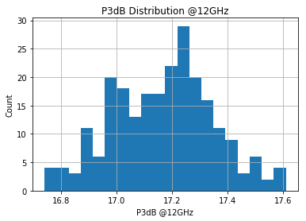

# Plotting Current and Gain Distributions with Matplotlib


```python
import csv
import time
import string
import requests
import json
import numpy
import pandas as pd
import matplotlib.pyplot as plt
import scrapy
from scrapy.crawler import CrawlerProcess
```

# Power Data Cleaning


```python
power = pd.read_csv('docs/B18U01_805A_Power_NC_power.csv')
power.head()
```


<div>
<style scoped>
    .dataframe tbody tr th:only-of-type {
        vertical-align: middle;
    }

    .dataframe tbody tr th {
        vertical-align: top;
    }

    .dataframe thead th {
        text-align: right;
    }
</style>
<table border="1" class="dataframe">
  <thead>
    <tr style="text-align: right;">
      <th></th>
      <th>Unnamed: 0</th>
      <th>Test</th>
      <th>Die</th>
      <th>VDD (V)</th>
      <th>Unnamed: 4</th>
      <th>Unnamed: 5</th>
      <th>Unnamed: 6</th>
      <th>Id1 (mA)</th>
      <th>Id2 ( mA)</th>
      <th>Freq (GHz)</th>
      <th>...</th>
      <th>Unnamed: 17</th>
      <th>Unnamed: 18</th>
      <th>Unnamed: 19</th>
      <th>Unnamed: 20</th>
      <th>Unnamed: 21</th>
      <th>Unnamed: 22</th>
      <th>Unnamed: 23</th>
      <th>Unnamed: 24</th>
      <th>Unnamed: 25</th>
      <th>Unnamed: 26</th>
    </tr>
  </thead>
  <tbody>
    <tr>
      <th>0</th>
      <td>694255</td>
      <td>POW1</td>
      <td>AB10</td>
      <td>4</td>
      <td>#</td>
      <td>#</td>
      <td>#</td>
      <td>40.87</td>
      <td>91.48</td>
      <td>6</td>
      <td>...</td>
      <td>#</td>
      <td>#</td>
      <td>#</td>
      <td>#</td>
      <td>#</td>
      <td>#</td>
      <td>#</td>
      <td>#</td>
      <td>#</td>
      <td>#</td>
    </tr>
    <tr>
      <th>1</th>
      <td>694255</td>
      <td>POW1</td>
      <td>AB10</td>
      <td>4</td>
      <td>#</td>
      <td>#</td>
      <td>#</td>
      <td>40.80</td>
      <td>90.39</td>
      <td>9</td>
      <td>...</td>
      <td>#</td>
      <td>#</td>
      <td>#</td>
      <td>#</td>
      <td>#</td>
      <td>#</td>
      <td>#</td>
      <td>#</td>
      <td>#</td>
      <td>#</td>
    </tr>
    <tr>
      <th>2</th>
      <td>694255</td>
      <td>POW1</td>
      <td>AB10</td>
      <td>4</td>
      <td>#</td>
      <td>#</td>
      <td>#</td>
      <td>40.75</td>
      <td>90.28</td>
      <td>12</td>
      <td>...</td>
      <td>#</td>
      <td>#</td>
      <td>#</td>
      <td>#</td>
      <td>#</td>
      <td>#</td>
      <td>#</td>
      <td>#</td>
      <td>#</td>
      <td>#</td>
    </tr>
    <tr>
      <th>3</th>
      <td>694255</td>
      <td>POW1</td>
      <td>AB10</td>
      <td>4</td>
      <td>#</td>
      <td>#</td>
      <td>#</td>
      <td>40.68</td>
      <td>90.13</td>
      <td>15</td>
      <td>...</td>
      <td>#</td>
      <td>#</td>
      <td>#</td>
      <td>#</td>
      <td>#</td>
      <td>#</td>
      <td>#</td>
      <td>#</td>
      <td>#</td>
      <td>#</td>
    </tr>
    <tr>
      <th>4</th>
      <td>694255</td>
      <td>POW1</td>
      <td>AB10</td>
      <td>4</td>
      <td>#</td>
      <td>#</td>
      <td>#</td>
      <td>40.63</td>
      <td>89.54</td>
      <td>18</td>
      <td>...</td>
      <td>#</td>
      <td>#</td>
      <td>#</td>
      <td>#</td>
      <td>#</td>
      <td>#</td>
      <td>#</td>
      <td>#</td>
      <td>#</td>
      <td>#</td>
    </tr>
  </tbody>
</table>
<p>5 rows × 27 columns</p>
</div>


```python
# Drop unnecessary columns
power = power.drop(columns=['Unnamed: 4', 'Unnamed: 5', 'Unnamed: 6', 'Unnamed: 11', 
                            'Unnamed: 13', 'Unnamed: 16', 'Unnamed: 17', 'Unnamed: 18', 
                            'Unnamed: 19', 'Unnamed: 20', 'Unnamed: 21', 'Unnamed: 22', 
                            'Unnamed: 23', 'Unnamed: 24', 'Unnamed: 25', 'Unnamed: 26'])
power.head()
```


<div>
<style scoped>
    .dataframe tbody tr th:only-of-type {
        vertical-align: middle;
    }

    .dataframe tbody tr th {
        vertical-align: top;
    }

    .dataframe thead th {
        text-align: right;
    }
</style>
<table border="1" class="dataframe">
  <thead>
    <tr style="text-align: right;">
      <th></th>
      <th>Unnamed: 0</th>
      <th>Test</th>
      <th>Die</th>
      <th>VDD (V)</th>
      <th>Id1 (mA)</th>
      <th>Id2 ( mA)</th>
      <th>Freq (GHz)</th>
      <th>Pin (dBm)</th>
      <th>Pin (dBm).1</th>
      <th>Pout (dBm)</th>
      <th>Gain (dB)</th>
    </tr>
  </thead>
  <tbody>
    <tr>
      <th>0</th>
      <td>694255</td>
      <td>POW1</td>
      <td>AB10</td>
      <td>4</td>
      <td>40.87</td>
      <td>91.48</td>
      <td>6</td>
      <td>-13</td>
      <td>-13.02219</td>
      <td>10.166</td>
      <td>23.166</td>
    </tr>
    <tr>
      <th>1</th>
      <td>694255</td>
      <td>POW1</td>
      <td>AB10</td>
      <td>4</td>
      <td>40.80</td>
      <td>90.39</td>
      <td>9</td>
      <td>-13</td>
      <td>-12.97462</td>
      <td>9.035</td>
      <td>22.035</td>
    </tr>
    <tr>
      <th>2</th>
      <td>694255</td>
      <td>POW1</td>
      <td>AB10</td>
      <td>4</td>
      <td>40.75</td>
      <td>90.28</td>
      <td>12</td>
      <td>-13</td>
      <td>-13.02288</td>
      <td>9.278</td>
      <td>22.278</td>
    </tr>
    <tr>
      <th>3</th>
      <td>694255</td>
      <td>POW1</td>
      <td>AB10</td>
      <td>4</td>
      <td>40.68</td>
      <td>90.13</td>
      <td>15</td>
      <td>-13</td>
      <td>-13.03762</td>
      <td>9.631</td>
      <td>22.631</td>
    </tr>
    <tr>
      <th>4</th>
      <td>694255</td>
      <td>POW1</td>
      <td>AB10</td>
      <td>4</td>
      <td>40.63</td>
      <td>89.54</td>
      <td>18</td>
      <td>-13</td>
      <td>-13.01050</td>
      <td>7.811</td>
      <td>20.811</td>
    </tr>
  </tbody>
</table>
</div>


```python
# Rename columns
power.columns = ['ID', 'Test', 'Die', 'Vdd', 'Id1', 'Id2', 'Freq', 'Pin', 'Pin_measured', 'Pout', 'Gain']
power.head()
```


<div>
<style scoped>
    .dataframe tbody tr th:only-of-type {
        vertical-align: middle;
    }

    .dataframe tbody tr th {
        vertical-align: top;
    }

    .dataframe thead th {
        text-align: right;
    }
</style>
<table border="1" class="dataframe">
  <thead>
    <tr style="text-align: right;">
      <th></th>
      <th>ID</th>
      <th>Test</th>
      <th>Die</th>
      <th>Vdd</th>
      <th>Id1</th>
      <th>Id2</th>
      <th>Freq</th>
      <th>Pin</th>
      <th>Pin_measured</th>
      <th>Pout</th>
      <th>Gain</th>
    </tr>
  </thead>
  <tbody>
    <tr>
      <th>0</th>
      <td>694255</td>
      <td>POW1</td>
      <td>AB10</td>
      <td>4</td>
      <td>40.87</td>
      <td>91.48</td>
      <td>6</td>
      <td>-13</td>
      <td>-13.02219</td>
      <td>10.166</td>
      <td>23.166</td>
    </tr>
    <tr>
      <th>1</th>
      <td>694255</td>
      <td>POW1</td>
      <td>AB10</td>
      <td>4</td>
      <td>40.80</td>
      <td>90.39</td>
      <td>9</td>
      <td>-13</td>
      <td>-12.97462</td>
      <td>9.035</td>
      <td>22.035</td>
    </tr>
    <tr>
      <th>2</th>
      <td>694255</td>
      <td>POW1</td>
      <td>AB10</td>
      <td>4</td>
      <td>40.75</td>
      <td>90.28</td>
      <td>12</td>
      <td>-13</td>
      <td>-13.02288</td>
      <td>9.278</td>
      <td>22.278</td>
    </tr>
    <tr>
      <th>3</th>
      <td>694255</td>
      <td>POW1</td>
      <td>AB10</td>
      <td>4</td>
      <td>40.68</td>
      <td>90.13</td>
      <td>15</td>
      <td>-13</td>
      <td>-13.03762</td>
      <td>9.631</td>
      <td>22.631</td>
    </tr>
    <tr>
      <th>4</th>
      <td>694255</td>
      <td>POW1</td>
      <td>AB10</td>
      <td>4</td>
      <td>40.63</td>
      <td>89.54</td>
      <td>18</td>
      <td>-13</td>
      <td>-13.01050</td>
      <td>7.811</td>
      <td>20.811</td>
    </tr>
  </tbody>
</table>
</div>


```python
# Check datatypes
print(power.dtypes)
```

    ID                int64
    Test             object
    Die              object
    Vdd               int64
    Id1             float64
    Id2             float64
    Freq              int64
    Pin               int64
    Pin_measured    float64
    Pout            float64
    Gain            float64
    dtype: object


```python
# Extract only the data for Pin=-13
power = power.loc[power['Pin'] == -13]
power.head()
```


<div>
<style scoped>
    .dataframe tbody tr th:only-of-type {
        vertical-align: middle;
    }

    .dataframe tbody tr th {
        vertical-align: top;
    }

    .dataframe thead th {
        text-align: right;
    }
</style>
<table border="1" class="dataframe">
  <thead>
    <tr style="text-align: right;">
      <th></th>
      <th>ID</th>
      <th>Test</th>
      <th>Die</th>
      <th>Vdd</th>
      <th>Id1</th>
      <th>Id2</th>
      <th>Freq</th>
      <th>Pin</th>
      <th>Pin_measured</th>
      <th>Pout</th>
      <th>Gain</th>
    </tr>
  </thead>
  <tbody>
    <tr>
      <th>0</th>
      <td>694255</td>
      <td>POW1</td>
      <td>AB10</td>
      <td>4</td>
      <td>40.87</td>
      <td>91.48</td>
      <td>6</td>
      <td>-13</td>
      <td>-13.02219</td>
      <td>10.166</td>
      <td>23.166</td>
    </tr>
    <tr>
      <th>1</th>
      <td>694255</td>
      <td>POW1</td>
      <td>AB10</td>
      <td>4</td>
      <td>40.80</td>
      <td>90.39</td>
      <td>9</td>
      <td>-13</td>
      <td>-12.97462</td>
      <td>9.035</td>
      <td>22.035</td>
    </tr>
    <tr>
      <th>2</th>
      <td>694255</td>
      <td>POW1</td>
      <td>AB10</td>
      <td>4</td>
      <td>40.75</td>
      <td>90.28</td>
      <td>12</td>
      <td>-13</td>
      <td>-13.02288</td>
      <td>9.278</td>
      <td>22.278</td>
    </tr>
    <tr>
      <th>3</th>
      <td>694255</td>
      <td>POW1</td>
      <td>AB10</td>
      <td>4</td>
      <td>40.68</td>
      <td>90.13</td>
      <td>15</td>
      <td>-13</td>
      <td>-13.03762</td>
      <td>9.631</td>
      <td>22.631</td>
    </tr>
    <tr>
      <th>4</th>
      <td>694255</td>
      <td>POW1</td>
      <td>AB10</td>
      <td>4</td>
      <td>40.63</td>
      <td>89.54</td>
      <td>18</td>
      <td>-13</td>
      <td>-13.01050</td>
      <td>7.811</td>
      <td>20.811</td>
    </tr>
  </tbody>
</table>
</div>


# Gain Distribution (Pin=-13dBm, Freq=6GHz)


```python
# Extract all rows for Freq=6
power_6GHz = power.loc[power['Freq'] == 6].drop(['ID', 'Test', 'Die', 'Vdd', 'Pin_measured'], axis=1)
power_6GHz.head()
```


<div>
<style scoped>
    .dataframe tbody tr th:only-of-type {
        vertical-align: middle;
    }

    .dataframe tbody tr th {
        vertical-align: top;
    }

    .dataframe thead th {
        text-align: right;
    }
</style>
<table border="1" class="dataframe">
  <thead>
    <tr style="text-align: right;">
      <th></th>
      <th>Id1</th>
      <th>Id2</th>
      <th>Freq</th>
      <th>Pin</th>
      <th>Pout</th>
      <th>Gain</th>
    </tr>
  </thead>
  <tbody>
    <tr>
      <th>0</th>
      <td>40.87</td>
      <td>91.48</td>
      <td>6</td>
      <td>-13</td>
      <td>10.166</td>
      <td>23.166</td>
    </tr>
    <tr>
      <th>80</th>
      <td>40.65</td>
      <td>89.51</td>
      <td>6</td>
      <td>-13</td>
      <td>10.164</td>
      <td>23.164</td>
    </tr>
    <tr>
      <th>160</th>
      <td>41.42</td>
      <td>89.49</td>
      <td>6</td>
      <td>-13</td>
      <td>10.196</td>
      <td>23.196</td>
    </tr>
    <tr>
      <th>240</th>
      <td>39.96</td>
      <td>88.08</td>
      <td>6</td>
      <td>-13</td>
      <td>10.203</td>
      <td>23.203</td>
    </tr>
    <tr>
      <th>320</th>
      <td>40.90</td>
      <td>88.66</td>
      <td>6</td>
      <td>-13</td>
      <td>10.190</td>
      <td>23.190</td>
    </tr>
  </tbody>
</table>
</div>


```python
# Export data to csv
power_6GHz.to_csv('docs/B18U01_805A_Power_NC_power_6GHz.csv')
```


```python
# Plot gain distribution at 6GHz
power_6GHz.Gain.hist(bins=20)
plt.title('Gain Distribution @6GHz')
plt.xlabel('Gain @6GHz')
plt.ylabel('Count')
plt.show()
```


    

    


# Key Statistics (Pin=-13dBm, Freq=6GHz)


```python
power_6GHz.describe()
```


<div>
<style scoped>
    .dataframe tbody tr th:only-of-type {
        vertical-align: middle;
    }

    .dataframe tbody tr th {
        vertical-align: top;
    }

    .dataframe thead th {
        text-align: right;
    }
</style>
<table border="1" class="dataframe">
  <thead>
    <tr style="text-align: right;">
      <th></th>
      <th>Id1</th>
      <th>Id2</th>
      <th>Freq</th>
      <th>Pin</th>
      <th>Pout</th>
      <th>Gain</th>
    </tr>
  </thead>
  <tbody>
    <tr>
      <th>count</th>
      <td>235.000000</td>
      <td>235.000000</td>
      <td>235.0</td>
      <td>235.0</td>
      <td>235.000000</td>
      <td>235.000000</td>
    </tr>
    <tr>
      <th>mean</th>
      <td>40.023404</td>
      <td>87.898936</td>
      <td>6.0</td>
      <td>-13.0</td>
      <td>10.269426</td>
      <td>23.269426</td>
    </tr>
    <tr>
      <th>std</th>
      <td>1.413705</td>
      <td>2.947539</td>
      <td>0.0</td>
      <td>0.0</td>
      <td>0.207678</td>
      <td>0.207678</td>
    </tr>
    <tr>
      <th>min</th>
      <td>36.350000</td>
      <td>81.940000</td>
      <td>6.0</td>
      <td>-13.0</td>
      <td>8.546000</td>
      <td>21.546000</td>
    </tr>
    <tr>
      <th>25%</th>
      <td>39.085000</td>
      <td>85.585000</td>
      <td>6.0</td>
      <td>-13.0</td>
      <td>10.167500</td>
      <td>23.167500</td>
    </tr>
    <tr>
      <th>50%</th>
      <td>40.050000</td>
      <td>87.950000</td>
      <td>6.0</td>
      <td>-13.0</td>
      <td>10.290000</td>
      <td>23.290000</td>
    </tr>
    <tr>
      <th>75%</th>
      <td>40.780000</td>
      <td>89.505000</td>
      <td>6.0</td>
      <td>-13.0</td>
      <td>10.412500</td>
      <td>23.412500</td>
    </tr>
    <tr>
      <th>max</th>
      <td>46.830000</td>
      <td>97.260000</td>
      <td>6.0</td>
      <td>-13.0</td>
      <td>10.622000</td>
      <td>23.622000</td>
    </tr>
  </tbody>
</table>
</div>


# Gain Distribution (Pin=-13dBm, Freq=9GHz)


```python
# Extract all rows for Freq=9
power_9GHz = power.loc[power['Freq'] == 9].drop(['ID', 'Test', 'Die', 'Vdd', 'Pin_measured'], axis=1)
power_9GHz.head()
```


<div>
<style scoped>
    .dataframe tbody tr th:only-of-type {
        vertical-align: middle;
    }

    .dataframe tbody tr th {
        vertical-align: top;
    }

    .dataframe thead th {
        text-align: right;
    }
</style>
<table border="1" class="dataframe">
  <thead>
    <tr style="text-align: right;">
      <th></th>
      <th>Id1</th>
      <th>Id2</th>
      <th>Freq</th>
      <th>Pin</th>
      <th>Pout</th>
      <th>Gain</th>
    </tr>
  </thead>
  <tbody>
    <tr>
      <th>1</th>
      <td>40.80</td>
      <td>90.39</td>
      <td>9</td>
      <td>-13</td>
      <td>9.035</td>
      <td>22.035</td>
    </tr>
    <tr>
      <th>81</th>
      <td>40.60</td>
      <td>88.50</td>
      <td>9</td>
      <td>-13</td>
      <td>9.047</td>
      <td>22.047</td>
    </tr>
    <tr>
      <th>161</th>
      <td>41.40</td>
      <td>88.42</td>
      <td>9</td>
      <td>-13</td>
      <td>9.157</td>
      <td>22.157</td>
    </tr>
    <tr>
      <th>241</th>
      <td>39.93</td>
      <td>87.12</td>
      <td>9</td>
      <td>-13</td>
      <td>9.108</td>
      <td>22.108</td>
    </tr>
    <tr>
      <th>321</th>
      <td>40.87</td>
      <td>87.62</td>
      <td>9</td>
      <td>-13</td>
      <td>9.160</td>
      <td>22.160</td>
    </tr>
  </tbody>
</table>
</div>


```python
# Export data to csv
power_9GHz.to_csv('docs/B18U01_805A_Power_NC_power_9GHz.csv')
```


```python
# Plot gain distribution at 9GHz
power_9GHz.Gain.hist(bins=20)
plt.title('Gain Distribution @9GHz')
plt.xlabel('Gain @9GHz')
plt.ylabel('Count')
plt.show()
```


    

    


# Key Statistics (Pin=-13dBm, Freq=9GHz)


```python
power_9GHz.describe()
```


<div>
<style scoped>
    .dataframe tbody tr th:only-of-type {
        vertical-align: middle;
    }

    .dataframe tbody tr th {
        vertical-align: top;
    }

    .dataframe thead th {
        text-align: right;
    }
</style>
<table border="1" class="dataframe">
  <thead>
    <tr style="text-align: right;">
      <th></th>
      <th>Id1</th>
      <th>Id2</th>
      <th>Freq</th>
      <th>Pin</th>
      <th>Pout</th>
      <th>Gain</th>
    </tr>
  </thead>
  <tbody>
    <tr>
      <th>count</th>
      <td>235.000000</td>
      <td>235.000000</td>
      <td>235.0</td>
      <td>235.0</td>
      <td>235.000000</td>
      <td>235.000000</td>
    </tr>
    <tr>
      <th>mean</th>
      <td>39.986596</td>
      <td>86.915064</td>
      <td>9.0</td>
      <td>-13.0</td>
      <td>9.216723</td>
      <td>22.216723</td>
    </tr>
    <tr>
      <th>std</th>
      <td>1.404441</td>
      <td>2.902639</td>
      <td>0.0</td>
      <td>0.0</td>
      <td>0.186458</td>
      <td>0.186458</td>
    </tr>
    <tr>
      <th>min</th>
      <td>36.380000</td>
      <td>80.860000</td>
      <td>9.0</td>
      <td>-13.0</td>
      <td>8.636000</td>
      <td>21.636000</td>
    </tr>
    <tr>
      <th>25%</th>
      <td>39.080000</td>
      <td>84.555000</td>
      <td>9.0</td>
      <td>-13.0</td>
      <td>9.107500</td>
      <td>22.107500</td>
    </tr>
    <tr>
      <th>50%</th>
      <td>40.020000</td>
      <td>86.960000</td>
      <td>9.0</td>
      <td>-13.0</td>
      <td>9.231000</td>
      <td>22.231000</td>
    </tr>
    <tr>
      <th>75%</th>
      <td>40.770000</td>
      <td>88.505000</td>
      <td>9.0</td>
      <td>-13.0</td>
      <td>9.352500</td>
      <td>22.352500</td>
    </tr>
    <tr>
      <th>max</th>
      <td>46.770000</td>
      <td>96.090000</td>
      <td>9.0</td>
      <td>-13.0</td>
      <td>9.570000</td>
      <td>22.570000</td>
    </tr>
  </tbody>
</table>
</div>


# Gain Distribution (Pin=-13dBm, Freq=12GHz)


```python
# Extract all rows for Freq=12
power_12GHz = power.loc[power['Freq'] == 12].drop(['ID', 'Test', 'Die', 'Vdd', 'Pin_measured'], axis=1)
power_12GHz.head()
```


<div>
<style scoped>
    .dataframe tbody tr th:only-of-type {
        vertical-align: middle;
    }

    .dataframe tbody tr th {
        vertical-align: top;
    }

    .dataframe thead th {
        text-align: right;
    }
</style>
<table border="1" class="dataframe">
  <thead>
    <tr style="text-align: right;">
      <th></th>
      <th>Id1</th>
      <th>Id2</th>
      <th>Freq</th>
      <th>Pin</th>
      <th>Pout</th>
      <th>Gain</th>
    </tr>
  </thead>
  <tbody>
    <tr>
      <th>2</th>
      <td>40.75</td>
      <td>90.28</td>
      <td>12</td>
      <td>-13</td>
      <td>9.278</td>
      <td>22.278</td>
    </tr>
    <tr>
      <th>82</th>
      <td>40.52</td>
      <td>88.39</td>
      <td>12</td>
      <td>-13</td>
      <td>9.273</td>
      <td>22.273</td>
    </tr>
    <tr>
      <th>162</th>
      <td>41.31</td>
      <td>88.37</td>
      <td>12</td>
      <td>-13</td>
      <td>9.415</td>
      <td>22.415</td>
    </tr>
    <tr>
      <th>242</th>
      <td>39.89</td>
      <td>87.00</td>
      <td>12</td>
      <td>-13</td>
      <td>9.322</td>
      <td>22.322</td>
    </tr>
    <tr>
      <th>322</th>
      <td>40.79</td>
      <td>87.49</td>
      <td>12</td>
      <td>-13</td>
      <td>9.434</td>
      <td>22.434</td>
    </tr>
  </tbody>
</table>
</div>


```python
# Export data to csv
power_12GHz.to_csv('docs/B18U01_805A_Power_NC_power_12GHz.csv')
```


```python
# Plot gain distribution at 12GHz
power_12GHz.Gain.hist(bins=20)
plt.title('Gain Distribution @12GHz')
plt.xlabel('Gain @12GHz')
plt.ylabel('Count')
plt.show()
```


    

    


# Key Statistics (Pin=-13dBm, Freq=12GHz)


```python
power_12GHz.describe()
```


<div>
<style scoped>
    .dataframe tbody tr th:only-of-type {
        vertical-align: middle;
    }

    .dataframe tbody tr th {
        vertical-align: top;
    }

    .dataframe thead th {
        text-align: right;
    }
</style>
<table border="1" class="dataframe">
  <thead>
    <tr style="text-align: right;">
      <th></th>
      <th>Id1</th>
      <th>Id2</th>
      <th>Freq</th>
      <th>Pin</th>
      <th>Pout</th>
      <th>Gain</th>
    </tr>
  </thead>
  <tbody>
    <tr>
      <th>count</th>
      <td>235.000000</td>
      <td>235.000000</td>
      <td>235.0</td>
      <td>235.0</td>
      <td>235.000000</td>
      <td>235.000000</td>
    </tr>
    <tr>
      <th>mean</th>
      <td>39.923021</td>
      <td>86.849149</td>
      <td>12.0</td>
      <td>-13.0</td>
      <td>9.441706</td>
      <td>22.441706</td>
    </tr>
    <tr>
      <th>std</th>
      <td>1.406057</td>
      <td>2.894384</td>
      <td>0.0</td>
      <td>0.0</td>
      <td>0.168541</td>
      <td>0.168541</td>
    </tr>
    <tr>
      <th>min</th>
      <td>36.300000</td>
      <td>80.710000</td>
      <td>12.0</td>
      <td>-13.0</td>
      <td>8.895000</td>
      <td>21.895000</td>
    </tr>
    <tr>
      <th>25%</th>
      <td>39.020000</td>
      <td>84.520000</td>
      <td>12.0</td>
      <td>-13.0</td>
      <td>9.332000</td>
      <td>22.332000</td>
    </tr>
    <tr>
      <th>50%</th>
      <td>39.950000</td>
      <td>86.830000</td>
      <td>12.0</td>
      <td>-13.0</td>
      <td>9.452000</td>
      <td>22.452000</td>
    </tr>
    <tr>
      <th>75%</th>
      <td>40.680000</td>
      <td>88.470000</td>
      <td>12.0</td>
      <td>-13.0</td>
      <td>9.570000</td>
      <td>22.570000</td>
    </tr>
    <tr>
      <th>max</th>
      <td>46.740000</td>
      <td>95.930000</td>
      <td>12.0</td>
      <td>-13.0</td>
      <td>9.785000</td>
      <td>22.785000</td>
    </tr>
  </tbody>
</table>
</div>


# Gain Distribution (Pin=-13dBm, Freq=15GHz)


```python
# Extract all rows for Freq=15
power_15GHz = power.loc[power['Freq'] == 15].drop(['ID', 'Test', 'Die', 'Vdd', 'Pin_measured'], axis=1)
power_15GHz.head()
```


<div>
<style scoped>
    .dataframe tbody tr th:only-of-type {
        vertical-align: middle;
    }

    .dataframe tbody tr th {
        vertical-align: top;
    }

    .dataframe thead th {
        text-align: right;
    }
</style>
<table border="1" class="dataframe">
  <thead>
    <tr style="text-align: right;">
      <th></th>
      <th>Id1</th>
      <th>Id2</th>
      <th>Freq</th>
      <th>Pin</th>
      <th>Pout</th>
      <th>Gain</th>
    </tr>
  </thead>
  <tbody>
    <tr>
      <th>3</th>
      <td>40.68</td>
      <td>90.13</td>
      <td>15</td>
      <td>-13</td>
      <td>9.631</td>
      <td>22.631</td>
    </tr>
    <tr>
      <th>83</th>
      <td>40.45</td>
      <td>88.23</td>
      <td>15</td>
      <td>-13</td>
      <td>9.561</td>
      <td>22.561</td>
    </tr>
    <tr>
      <th>163</th>
      <td>41.25</td>
      <td>88.24</td>
      <td>15</td>
      <td>-13</td>
      <td>9.682</td>
      <td>22.682</td>
    </tr>
    <tr>
      <th>243</th>
      <td>39.78</td>
      <td>86.87</td>
      <td>15</td>
      <td>-13</td>
      <td>9.544</td>
      <td>22.544</td>
    </tr>
    <tr>
      <th>323</th>
      <td>40.73</td>
      <td>87.33</td>
      <td>15</td>
      <td>-13</td>
      <td>9.662</td>
      <td>22.662</td>
    </tr>
  </tbody>
</table>
</div>


```python
# Export data to csv
power_15GHz.to_csv('docs/B18U01_805A_Power_NC_power_15GHz.csv')
```


```python
# Plot gain distribution at 15GHz
power_15GHz.Gain.hist(bins=20)
plt.title('Gain Distribution @15GHz')
plt.xlabel('Gain @15GHz')
plt.ylabel('Count')
plt.show()
```


    

    


# Key Statistics (Pin=-13dBm, Freq=15GHz)


```python
power_15GHz.describe()
```


<div>
<style scoped>
    .dataframe tbody tr th:only-of-type {
        vertical-align: middle;
    }

    .dataframe tbody tr th {
        vertical-align: top;
    }

    .dataframe thead th {
        text-align: right;
    }
</style>
<table border="1" class="dataframe">
  <thead>
    <tr style="text-align: right;">
      <th></th>
      <th>Id1</th>
      <th>Id2</th>
      <th>Freq</th>
      <th>Pin</th>
      <th>Pout</th>
      <th>Gain</th>
    </tr>
  </thead>
  <tbody>
    <tr>
      <th>count</th>
      <td>235.000000</td>
      <td>235.000000</td>
      <td>235.0</td>
      <td>235.0</td>
      <td>235.000000</td>
      <td>235.000000</td>
    </tr>
    <tr>
      <th>mean</th>
      <td>39.833149</td>
      <td>86.703915</td>
      <td>15.0</td>
      <td>-13.0</td>
      <td>9.652800</td>
      <td>22.652800</td>
    </tr>
    <tr>
      <th>std</th>
      <td>1.402872</td>
      <td>2.908010</td>
      <td>0.0</td>
      <td>0.0</td>
      <td>0.129627</td>
      <td>0.129627</td>
    </tr>
    <tr>
      <th>min</th>
      <td>36.210000</td>
      <td>80.490000</td>
      <td>15.0</td>
      <td>-13.0</td>
      <td>9.175000</td>
      <td>22.175000</td>
    </tr>
    <tr>
      <th>25%</th>
      <td>38.910000</td>
      <td>84.390000</td>
      <td>15.0</td>
      <td>-13.0</td>
      <td>9.563000</td>
      <td>22.563000</td>
    </tr>
    <tr>
      <th>50%</th>
      <td>39.870000</td>
      <td>86.690000</td>
      <td>15.0</td>
      <td>-13.0</td>
      <td>9.659000</td>
      <td>22.659000</td>
    </tr>
    <tr>
      <th>75%</th>
      <td>40.610000</td>
      <td>88.315000</td>
      <td>15.0</td>
      <td>-13.0</td>
      <td>9.738500</td>
      <td>22.738500</td>
    </tr>
    <tr>
      <th>max</th>
      <td>46.670000</td>
      <td>95.820000</td>
      <td>15.0</td>
      <td>-13.0</td>
      <td>10.108000</td>
      <td>23.108000</td>
    </tr>
  </tbody>
</table>
</div>


# Gain Distribution (Pin=-13dBm, Freq=18GHz)


```python
# Extract all rows for Freq=18
power_18GHz = power.loc[power['Freq'] == 18].drop(['ID', 'Test', 'Die', 'Vdd', 'Pin_measured'], axis=1)
power_18GHz.head()
```


<div>
<style scoped>
    .dataframe tbody tr th:only-of-type {
        vertical-align: middle;
    }

    .dataframe tbody tr th {
        vertical-align: top;
    }

    .dataframe thead th {
        text-align: right;
    }
</style>
<table border="1" class="dataframe">
  <thead>
    <tr style="text-align: right;">
      <th></th>
      <th>Id1</th>
      <th>Id2</th>
      <th>Freq</th>
      <th>Pin</th>
      <th>Pout</th>
      <th>Gain</th>
    </tr>
  </thead>
  <tbody>
    <tr>
      <th>4</th>
      <td>40.63</td>
      <td>89.54</td>
      <td>18</td>
      <td>-13</td>
      <td>7.811</td>
      <td>20.811</td>
    </tr>
    <tr>
      <th>84</th>
      <td>40.39</td>
      <td>87.68</td>
      <td>18</td>
      <td>-13</td>
      <td>7.746</td>
      <td>20.746</td>
    </tr>
    <tr>
      <th>164</th>
      <td>41.20</td>
      <td>87.62</td>
      <td>18</td>
      <td>-13</td>
      <td>7.836</td>
      <td>20.836</td>
    </tr>
    <tr>
      <th>244</th>
      <td>39.75</td>
      <td>86.32</td>
      <td>18</td>
      <td>-13</td>
      <td>7.670</td>
      <td>20.670</td>
    </tr>
    <tr>
      <th>324</th>
      <td>40.66</td>
      <td>86.71</td>
      <td>18</td>
      <td>-13</td>
      <td>7.765</td>
      <td>20.765</td>
    </tr>
  </tbody>
</table>
</div>


```python
# Export data to csv
power_18GHz.to_csv('docs/B18U01_805A_Power_NC_power_18GHz.csv')
```


```python
# Plot gain distribution at 18GHz
power_18GHz.Gain.hist(bins=20)
plt.title('Gain Distribution @18GHz')
plt.xlabel('Gain @18GHz')
plt.ylabel('Count')
plt.show()
```


    

    


# Key Statistics (Pin=-13dBm, Freq=18GHz)


```python
power_18GHz.describe()
```


<div>
<style scoped>
    .dataframe tbody tr th:only-of-type {
        vertical-align: middle;
    }

    .dataframe tbody tr th {
        vertical-align: top;
    }

    .dataframe thead th {
        text-align: right;
    }
</style>
<table border="1" class="dataframe">
  <thead>
    <tr style="text-align: right;">
      <th></th>
      <th>Id1</th>
      <th>Id2</th>
      <th>Freq</th>
      <th>Pin</th>
      <th>Pout</th>
      <th>Gain</th>
    </tr>
  </thead>
  <tbody>
    <tr>
      <th>count</th>
      <td>235.000000</td>
      <td>235.000000</td>
      <td>235.0</td>
      <td>235.0</td>
      <td>235.000000</td>
      <td>235.000000</td>
    </tr>
    <tr>
      <th>mean</th>
      <td>39.805660</td>
      <td>86.129447</td>
      <td>18.0</td>
      <td>-13.0</td>
      <td>7.767506</td>
      <td>20.767506</td>
    </tr>
    <tr>
      <th>std</th>
      <td>1.399622</td>
      <td>2.873435</td>
      <td>0.0</td>
      <td>0.0</td>
      <td>0.150884</td>
      <td>0.150884</td>
    </tr>
    <tr>
      <th>min</th>
      <td>36.200000</td>
      <td>79.860000</td>
      <td>18.0</td>
      <td>-13.0</td>
      <td>7.272000</td>
      <td>20.272000</td>
    </tr>
    <tr>
      <th>25%</th>
      <td>38.895000</td>
      <td>83.865000</td>
      <td>18.0</td>
      <td>-13.0</td>
      <td>7.673000</td>
      <td>20.673000</td>
    </tr>
    <tr>
      <th>50%</th>
      <td>39.830000</td>
      <td>86.110000</td>
      <td>18.0</td>
      <td>-13.0</td>
      <td>7.771000</td>
      <td>20.771000</td>
    </tr>
    <tr>
      <th>75%</th>
      <td>40.585000</td>
      <td>87.725000</td>
      <td>18.0</td>
      <td>-13.0</td>
      <td>7.848500</td>
      <td>20.848500</td>
    </tr>
    <tr>
      <th>max</th>
      <td>46.630000</td>
      <td>95.140000</td>
      <td>18.0</td>
      <td>-13.0</td>
      <td>8.387000</td>
      <td>21.387000</td>
    </tr>
  </tbody>
</table>
</div>


# ID1 Distribution (Pin=-13dBm, Freq=6GHz)


```python
# Plot Id1 distribution
power_6GHz.Id1.hist(bins=20)
plt.title('Id1 Distribution')
plt.xlabel('Id1')
plt.ylabel('Count')
plt.show()
```


    

    


# ID2 Distribution (Pin=-13dBm, Freq=6GHz)


```python
# Plot Id2 distribution
power_6GHz.Id2.hist(bins=20)
plt.title('Id2 Distribution')
plt.xlabel('Id2')
plt.ylabel('Count')
plt.show()
```


    

    


# Compression Data Cleaning


```python
compression = pd.read_csv('docs/B18U01_805A_Power_NC_compression.csv')
compression.head()
```


<div>
<style scoped>
    .dataframe tbody tr th:only-of-type {
        vertical-align: middle;
    }

    .dataframe tbody tr th {
        vertical-align: top;
    }

    .dataframe thead th {
        text-align: right;
    }
</style>
<table border="1" class="dataframe">
  <thead>
    <tr style="text-align: right;">
      <th></th>
      <th>Unnamed: 0</th>
      <th>Test</th>
      <th>Die</th>
      <th>VDD (V)</th>
      <th>Unnamed: 4</th>
      <th>Freq (GHz)</th>
      <th>Comp. level (dB)</th>
      <th>Pin_comp(dBm)</th>
      <th>Pout_comp (dBm)</th>
      <th>Linear Gain (dB)</th>
      <th>...</th>
      <th>Unnamed: 17</th>
      <th>Unnamed: 18</th>
      <th>Unnamed: 19</th>
      <th>Unnamed: 20</th>
      <th>Unnamed: 21</th>
      <th>Unnamed: 22</th>
      <th>Unnamed: 23</th>
      <th>Unnamed: 24</th>
      <th>Unnamed: 25</th>
      <th>Unnamed: 26</th>
    </tr>
  </thead>
  <tbody>
    <tr>
      <th>0</th>
      <td>694255</td>
      <td>PDB2</td>
      <td>AB10</td>
      <td>4</td>
      <td>#</td>
      <td>6</td>
      <td>1</td>
      <td>-6.61</td>
      <td>15.55</td>
      <td>23.16</td>
      <td>...</td>
      <td>#</td>
      <td>#</td>
      <td>#</td>
      <td>#</td>
      <td>#</td>
      <td>#</td>
      <td>PASS</td>
      <td>#</td>
      <td>#</td>
      <td>#</td>
    </tr>
    <tr>
      <th>1</th>
      <td>694255</td>
      <td>PDB2</td>
      <td>AB10</td>
      <td>4</td>
      <td>#</td>
      <td>9</td>
      <td>1</td>
      <td>-5.11</td>
      <td>15.92</td>
      <td>22.03</td>
      <td>...</td>
      <td>#</td>
      <td>#</td>
      <td>#</td>
      <td>#</td>
      <td>#</td>
      <td>#</td>
      <td>PASS</td>
      <td>#</td>
      <td>#</td>
      <td>#</td>
    </tr>
    <tr>
      <th>2</th>
      <td>694255</td>
      <td>PDB2</td>
      <td>AB10</td>
      <td>4</td>
      <td>#</td>
      <td>12</td>
      <td>1</td>
      <td>-4.99</td>
      <td>16.28</td>
      <td>22.27</td>
      <td>...</td>
      <td>#</td>
      <td>#</td>
      <td>#</td>
      <td>#</td>
      <td>#</td>
      <td>#</td>
      <td>PASS</td>
      <td>#</td>
      <td>#</td>
      <td>#</td>
    </tr>
    <tr>
      <th>3</th>
      <td>694255</td>
      <td>PDB2</td>
      <td>AB10</td>
      <td>4</td>
      <td>#</td>
      <td>15</td>
      <td>1</td>
      <td>-4.98</td>
      <td>16.64</td>
      <td>22.63</td>
      <td>...</td>
      <td>#</td>
      <td>#</td>
      <td>#</td>
      <td>#</td>
      <td>#</td>
      <td>#</td>
      <td>PASS</td>
      <td>#</td>
      <td>#</td>
      <td>#</td>
    </tr>
    <tr>
      <th>4</th>
      <td>694255</td>
      <td>PDB2</td>
      <td>AB10</td>
      <td>4</td>
      <td>#</td>
      <td>18</td>
      <td>1</td>
      <td>-2.54</td>
      <td>17.26</td>
      <td>20.81</td>
      <td>...</td>
      <td>#</td>
      <td>#</td>
      <td>#</td>
      <td>#</td>
      <td>#</td>
      <td>#</td>
      <td>PASS</td>
      <td>#</td>
      <td>#</td>
      <td>#</td>
    </tr>
  </tbody>
</table>
<p>5 rows × 27 columns</p>
</div>


```python
# Drop unnecessary columns
compression = compression.drop(columns=['Unnamed: 0', 'Unnamed: 4', 'Unnamed: 10', 'Unnamed: 11', 
                                        'Unnamed: 12', 'Unnamed: 13', 'Unnamed: 14', 'Unnamed: 15',
                                        'Unnamed: 16', 'Unnamed: 17', 'Unnamed: 18', 'Unnamed: 19', 
                                        'Unnamed: 20', 'Unnamed: 21', 'Unnamed: 22', 'Unnamed: 23', 
                                        'Unnamed: 24', 'Unnamed: 25', 'Unnamed: 26'])
compression.head()
```


<div>
<style scoped>
    .dataframe tbody tr th:only-of-type {
        vertical-align: middle;
    }

    .dataframe tbody tr th {
        vertical-align: top;
    }

    .dataframe thead th {
        text-align: right;
    }
</style>
<table border="1" class="dataframe">
  <thead>
    <tr style="text-align: right;">
      <th></th>
      <th>Test</th>
      <th>Die</th>
      <th>VDD (V)</th>
      <th>Freq (GHz)</th>
      <th>Comp. level (dB)</th>
      <th>Pin_comp(dBm)</th>
      <th>Pout_comp (dBm)</th>
      <th>Linear Gain (dB)</th>
    </tr>
  </thead>
  <tbody>
    <tr>
      <th>0</th>
      <td>PDB2</td>
      <td>AB10</td>
      <td>4</td>
      <td>6</td>
      <td>1</td>
      <td>-6.61</td>
      <td>15.55</td>
      <td>23.16</td>
    </tr>
    <tr>
      <th>1</th>
      <td>PDB2</td>
      <td>AB10</td>
      <td>4</td>
      <td>9</td>
      <td>1</td>
      <td>-5.11</td>
      <td>15.92</td>
      <td>22.03</td>
    </tr>
    <tr>
      <th>2</th>
      <td>PDB2</td>
      <td>AB10</td>
      <td>4</td>
      <td>12</td>
      <td>1</td>
      <td>-4.99</td>
      <td>16.28</td>
      <td>22.27</td>
    </tr>
    <tr>
      <th>3</th>
      <td>PDB2</td>
      <td>AB10</td>
      <td>4</td>
      <td>15</td>
      <td>1</td>
      <td>-4.98</td>
      <td>16.64</td>
      <td>22.63</td>
    </tr>
    <tr>
      <th>4</th>
      <td>PDB2</td>
      <td>AB10</td>
      <td>4</td>
      <td>18</td>
      <td>1</td>
      <td>-2.54</td>
      <td>17.26</td>
      <td>20.81</td>
    </tr>
  </tbody>
</table>
</div>


```python
print(compression.dtypes)
```

    Test                 object
    Die                  object
    VDD (V)               int64
    Freq (GHz)            int64
    Comp. level (dB)      int64
    Pin_comp(dBm)       float64
    Pout_comp (dBm)     float64
    Linear Gain (dB)    float64
    dtype: object


```python
# Rename columns
compression.columns = ['Test', 'Die', 'Vdd', 'Freq', 'Compression Level', 'Pin_comp', 'Pout_comp', 'Linear Gain']
compression.head()
```


<div>
<style scoped>
    .dataframe tbody tr th:only-of-type {
        vertical-align: middle;
    }

    .dataframe tbody tr th {
        vertical-align: top;
    }

    .dataframe thead th {
        text-align: right;
    }
</style>
<table border="1" class="dataframe">
  <thead>
    <tr style="text-align: right;">
      <th></th>
      <th>Test</th>
      <th>Die</th>
      <th>Vdd</th>
      <th>Freq</th>
      <th>Compression Level</th>
      <th>Pin_comp</th>
      <th>Pout_comp</th>
      <th>Linear Gain</th>
    </tr>
  </thead>
  <tbody>
    <tr>
      <th>0</th>
      <td>PDB2</td>
      <td>AB10</td>
      <td>4</td>
      <td>6</td>
      <td>1</td>
      <td>-6.61</td>
      <td>15.55</td>
      <td>23.16</td>
    </tr>
    <tr>
      <th>1</th>
      <td>PDB2</td>
      <td>AB10</td>
      <td>4</td>
      <td>9</td>
      <td>1</td>
      <td>-5.11</td>
      <td>15.92</td>
      <td>22.03</td>
    </tr>
    <tr>
      <th>2</th>
      <td>PDB2</td>
      <td>AB10</td>
      <td>4</td>
      <td>12</td>
      <td>1</td>
      <td>-4.99</td>
      <td>16.28</td>
      <td>22.27</td>
    </tr>
    <tr>
      <th>3</th>
      <td>PDB2</td>
      <td>AB10</td>
      <td>4</td>
      <td>15</td>
      <td>1</td>
      <td>-4.98</td>
      <td>16.64</td>
      <td>22.63</td>
    </tr>
    <tr>
      <th>4</th>
      <td>PDB2</td>
      <td>AB10</td>
      <td>4</td>
      <td>18</td>
      <td>1</td>
      <td>-2.54</td>
      <td>17.26</td>
      <td>20.81</td>
    </tr>
  </tbody>
</table>
</div>


```python
# Extract P-1dB data
compression_level_1dB = compression.loc[compression['Compression Level'] == 1]
compression_level_1dB.head()
```


<div>
<style scoped>
    .dataframe tbody tr th:only-of-type {
        vertical-align: middle;
    }

    .dataframe tbody tr th {
        vertical-align: top;
    }

    .dataframe thead th {
        text-align: right;
    }
</style>
<table border="1" class="dataframe">
  <thead>
    <tr style="text-align: right;">
      <th></th>
      <th>Test</th>
      <th>Die</th>
      <th>Vdd</th>
      <th>Freq</th>
      <th>Compression Level</th>
      <th>Pin_comp</th>
      <th>Pout_comp</th>
      <th>Linear Gain</th>
    </tr>
  </thead>
  <tbody>
    <tr>
      <th>0</th>
      <td>PDB2</td>
      <td>AB10</td>
      <td>4</td>
      <td>6</td>
      <td>1</td>
      <td>-6.61</td>
      <td>15.55</td>
      <td>23.16</td>
    </tr>
    <tr>
      <th>1</th>
      <td>PDB2</td>
      <td>AB10</td>
      <td>4</td>
      <td>9</td>
      <td>1</td>
      <td>-5.11</td>
      <td>15.92</td>
      <td>22.03</td>
    </tr>
    <tr>
      <th>2</th>
      <td>PDB2</td>
      <td>AB10</td>
      <td>4</td>
      <td>12</td>
      <td>1</td>
      <td>-4.99</td>
      <td>16.28</td>
      <td>22.27</td>
    </tr>
    <tr>
      <th>3</th>
      <td>PDB2</td>
      <td>AB10</td>
      <td>4</td>
      <td>15</td>
      <td>1</td>
      <td>-4.98</td>
      <td>16.64</td>
      <td>22.63</td>
    </tr>
    <tr>
      <th>4</th>
      <td>PDB2</td>
      <td>AB10</td>
      <td>4</td>
      <td>18</td>
      <td>1</td>
      <td>-2.54</td>
      <td>17.26</td>
      <td>20.81</td>
    </tr>
  </tbody>
</table>
</div>


```python
# Extract P-3dB data
compression_level_3dB = compression.loc[compression['Compression Level'] == 3]
compression_level_3dB.head()
```


<div>
<style scoped>
    .dataframe tbody tr th:only-of-type {
        vertical-align: middle;
    }

    .dataframe tbody tr th {
        vertical-align: top;
    }

    .dataframe thead th {
        text-align: right;
    }
</style>
<table border="1" class="dataframe">
  <thead>
    <tr style="text-align: right;">
      <th></th>
      <th>Test</th>
      <th>Die</th>
      <th>Vdd</th>
      <th>Freq</th>
      <th>Compression Level</th>
      <th>Pin_comp</th>
      <th>Pout_comp</th>
      <th>Linear Gain</th>
    </tr>
  </thead>
  <tbody>
    <tr>
      <th>5</th>
      <td>PDB2</td>
      <td>AB10</td>
      <td>4</td>
      <td>6</td>
      <td>3</td>
      <td>-3.94</td>
      <td>16.21</td>
      <td>23.16</td>
    </tr>
    <tr>
      <th>6</th>
      <td>PDB2</td>
      <td>AB10</td>
      <td>4</td>
      <td>9</td>
      <td>3</td>
      <td>-1.95</td>
      <td>17.07</td>
      <td>22.03</td>
    </tr>
    <tr>
      <th>7</th>
      <td>PDB2</td>
      <td>AB10</td>
      <td>4</td>
      <td>12</td>
      <td>3</td>
      <td>-1.77</td>
      <td>17.49</td>
      <td>22.27</td>
    </tr>
    <tr>
      <th>8</th>
      <td>PDB2</td>
      <td>AB10</td>
      <td>4</td>
      <td>15</td>
      <td>3</td>
      <td>-1.62</td>
      <td>18.00</td>
      <td>22.63</td>
    </tr>
    <tr>
      <th>9</th>
      <td>PDB2</td>
      <td>AB10</td>
      <td>4</td>
      <td>18</td>
      <td>3</td>
      <td>1.01</td>
      <td>18.82</td>
      <td>20.81</td>
    </tr>
  </tbody>
</table>
</div>


# P1dB Distribution (Freq=6GHz)


```python
compression_level_1dB_6GHz = compression_level_1dB.loc[compression_level_1dB['Freq'] == 6].drop(['Test', 'Die', 'Vdd'], axis=1)
compression_level_1dB_6GHz.head()
```


<div>
<style scoped>
    .dataframe tbody tr th:only-of-type {
        vertical-align: middle;
    }

    .dataframe tbody tr th {
        vertical-align: top;
    }

    .dataframe thead th {
        text-align: right;
    }
</style>
<table border="1" class="dataframe">
  <thead>
    <tr style="text-align: right;">
      <th></th>
      <th>Freq</th>
      <th>Compression Level</th>
      <th>Pin_comp</th>
      <th>Pout_comp</th>
      <th>Linear Gain</th>
    </tr>
  </thead>
  <tbody>
    <tr>
      <th>0</th>
      <td>6</td>
      <td>1</td>
      <td>-6.61</td>
      <td>15.55</td>
      <td>23.16</td>
    </tr>
    <tr>
      <th>10</th>
      <td>6</td>
      <td>1</td>
      <td>-6.62</td>
      <td>15.53</td>
      <td>23.16</td>
    </tr>
    <tr>
      <th>20</th>
      <td>6</td>
      <td>1</td>
      <td>-6.70</td>
      <td>15.49</td>
      <td>23.19</td>
    </tr>
    <tr>
      <th>30</th>
      <td>6</td>
      <td>1</td>
      <td>-6.70</td>
      <td>15.49</td>
      <td>23.20</td>
    </tr>
    <tr>
      <th>40</th>
      <td>6</td>
      <td>1</td>
      <td>-6.69</td>
      <td>15.49</td>
      <td>23.19</td>
    </tr>
  </tbody>
</table>
</div>


```python
# Export data to csv
compression_level_1dB_6GHz.to_csv('docs/B18U01_805A_Power_NC_compression_level_1dB_6GHz.csv')
```


```python
# Plot P1dB distribution at 6GHz
compression_level_1dB_6GHz.Pout_comp.hist(bins=20)
plt.title('P1dB Distribution @6GHz')
plt.xlabel('P1dB @6GHz')
plt.ylabel('Count')
plt.show()
```


    

    


# Key Statistics (P1dB, Freq=6GHz)


```python
compression_level_1dB_6GHz.describe()
```


<div>
<style scoped>
    .dataframe tbody tr th:only-of-type {
        vertical-align: middle;
    }

    .dataframe tbody tr th {
        vertical-align: top;
    }

    .dataframe thead th {
        text-align: right;
    }
</style>
<table border="1" class="dataframe">
  <thead>
    <tr style="text-align: right;">
      <th></th>
      <th>Freq</th>
      <th>Compression Level</th>
      <th>Pin_comp</th>
      <th>Pout_comp</th>
      <th>Linear Gain</th>
    </tr>
  </thead>
  <tbody>
    <tr>
      <th>count</th>
      <td>235.0</td>
      <td>235.0</td>
      <td>235.000000</td>
      <td>235.000000</td>
      <td>235.000000</td>
    </tr>
    <tr>
      <th>mean</th>
      <td>6.0</td>
      <td>1.0</td>
      <td>-6.942468</td>
      <td>15.316511</td>
      <td>23.264809</td>
    </tr>
    <tr>
      <th>std</th>
      <td>0.0</td>
      <td>0.0</td>
      <td>0.295545</td>
      <td>0.187755</td>
      <td>0.207964</td>
    </tr>
    <tr>
      <th>min</th>
      <td>6.0</td>
      <td>1.0</td>
      <td>-7.680000</td>
      <td>14.870000</td>
      <td>21.540000</td>
    </tr>
    <tr>
      <th>25%</th>
      <td>6.0</td>
      <td>1.0</td>
      <td>-7.100000</td>
      <td>15.235000</td>
      <td>23.160000</td>
    </tr>
    <tr>
      <th>50%</th>
      <td>6.0</td>
      <td>1.0</td>
      <td>-6.940000</td>
      <td>15.330000</td>
      <td>23.290000</td>
    </tr>
    <tr>
      <th>75%</th>
      <td>6.0</td>
      <td>1.0</td>
      <td>-6.755000</td>
      <td>15.430000</td>
      <td>23.410000</td>
    </tr>
    <tr>
      <th>max</th>
      <td>6.0</td>
      <td>1.0</td>
      <td>-5.570000</td>
      <td>15.970000</td>
      <td>23.620000</td>
    </tr>
  </tbody>
</table>
</div>


# P1dB Distribution (Freq=9GHz)


```python
compression_level_1dB_9GHz = compression_level_1dB.loc[compression_level_1dB['Freq'] == 9].drop(['Test', 'Die', 'Vdd'], axis=1)
compression_level_1dB_9GHz.head()
```


<div>
<style scoped>
    .dataframe tbody tr th:only-of-type {
        vertical-align: middle;
    }

    .dataframe tbody tr th {
        vertical-align: top;
    }

    .dataframe thead th {
        text-align: right;
    }
</style>
<table border="1" class="dataframe">
  <thead>
    <tr style="text-align: right;">
      <th></th>
      <th>Freq</th>
      <th>Compression Level</th>
      <th>Pin_comp</th>
      <th>Pout_comp</th>
      <th>Linear Gain</th>
    </tr>
  </thead>
  <tbody>
    <tr>
      <th>1</th>
      <td>9</td>
      <td>1</td>
      <td>-5.11</td>
      <td>15.92</td>
      <td>22.03</td>
    </tr>
    <tr>
      <th>11</th>
      <td>9</td>
      <td>1</td>
      <td>-5.16</td>
      <td>15.87</td>
      <td>22.04</td>
    </tr>
    <tr>
      <th>21</th>
      <td>9</td>
      <td>1</td>
      <td>-5.31</td>
      <td>15.84</td>
      <td>22.15</td>
    </tr>
    <tr>
      <th>31</th>
      <td>9</td>
      <td>1</td>
      <td>-5.31</td>
      <td>15.79</td>
      <td>22.10</td>
    </tr>
    <tr>
      <th>41</th>
      <td>9</td>
      <td>1</td>
      <td>-5.33</td>
      <td>15.82</td>
      <td>22.16</td>
    </tr>
  </tbody>
</table>
</div>


```python
# Export data to csv
compression_level_1dB_9GHz.to_csv('docs/B18U01_805A_Power_NC_compression_level_1dB_9GHz.csv')
```


```python
# Plot P1dB distribution at 9GHz
compression_level_1dB_9GHz.Pout_comp.hist(bins=20)
plt.title('P1dB Distribution @9GHz')
plt.xlabel('P1dB @9GHz')
plt.ylabel('Count')
plt.show()
```


    

    


# Key Statistics (P1dB, Freq=9GHz)


```python
compression_level_1dB_9GHz.describe()
```


<div>
<style scoped>
    .dataframe tbody tr th:only-of-type {
        vertical-align: middle;
    }

    .dataframe tbody tr th {
        vertical-align: top;
    }

    .dataframe thead th {
        text-align: right;
    }
</style>
<table border="1" class="dataframe">
  <thead>
    <tr style="text-align: right;">
      <th></th>
      <th>Freq</th>
      <th>Compression Level</th>
      <th>Pin_comp</th>
      <th>Pout_comp</th>
      <th>Linear Gain</th>
    </tr>
  </thead>
  <tbody>
    <tr>
      <th>count</th>
      <td>235.0</td>
      <td>235.0</td>
      <td>235.000000</td>
      <td>235.000000</td>
      <td>235.000000</td>
    </tr>
    <tr>
      <th>mean</th>
      <td>9.0</td>
      <td>1.0</td>
      <td>-5.603191</td>
      <td>15.604043</td>
      <td>22.212255</td>
    </tr>
    <tr>
      <th>std</th>
      <td>0.0</td>
      <td>0.0</td>
      <td>0.307016</td>
      <td>0.173644</td>
      <td>0.186583</td>
    </tr>
    <tr>
      <th>min</th>
      <td>9.0</td>
      <td>1.0</td>
      <td>-6.390000</td>
      <td>15.130000</td>
      <td>21.630000</td>
    </tr>
    <tr>
      <th>25%</th>
      <td>9.0</td>
      <td>1.0</td>
      <td>-5.800000</td>
      <td>15.510000</td>
      <td>22.100000</td>
    </tr>
    <tr>
      <th>50%</th>
      <td>9.0</td>
      <td>1.0</td>
      <td>-5.630000</td>
      <td>15.620000</td>
      <td>22.230000</td>
    </tr>
    <tr>
      <th>75%</th>
      <td>9.0</td>
      <td>1.0</td>
      <td>-5.405000</td>
      <td>15.705000</td>
      <td>22.350000</td>
    </tr>
    <tr>
      <th>max</th>
      <td>9.0</td>
      <td>1.0</td>
      <td>-4.730000</td>
      <td>15.990000</td>
      <td>22.570000</td>
    </tr>
  </tbody>
</table>
</div>


# P1dB Distribution (Freq=12GHz)


```python
compression_level_1dB_12GHz = compression_level_1dB.loc[compression_level_1dB['Freq'] == 12].drop(['Test', 'Die', 'Vdd'], axis=1)
compression_level_1dB_12GHz.head()
```


<div>
<style scoped>
    .dataframe tbody tr th:only-of-type {
        vertical-align: middle;
    }

    .dataframe tbody tr th {
        vertical-align: top;
    }

    .dataframe thead th {
        text-align: right;
    }
</style>
<table border="1" class="dataframe">
  <thead>
    <tr style="text-align: right;">
      <th></th>
      <th>Freq</th>
      <th>Compression Level</th>
      <th>Pin_comp</th>
      <th>Pout_comp</th>
      <th>Linear Gain</th>
    </tr>
  </thead>
  <tbody>
    <tr>
      <th>2</th>
      <td>12</td>
      <td>1</td>
      <td>-4.99</td>
      <td>16.28</td>
      <td>22.27</td>
    </tr>
    <tr>
      <th>12</th>
      <td>12</td>
      <td>1</td>
      <td>-5.10</td>
      <td>16.17</td>
      <td>22.27</td>
    </tr>
    <tr>
      <th>22</th>
      <td>12</td>
      <td>1</td>
      <td>-5.22</td>
      <td>16.18</td>
      <td>22.41</td>
    </tr>
    <tr>
      <th>32</th>
      <td>12</td>
      <td>1</td>
      <td>-5.26</td>
      <td>16.05</td>
      <td>22.32</td>
    </tr>
    <tr>
      <th>42</th>
      <td>12</td>
      <td>1</td>
      <td>-5.29</td>
      <td>16.14</td>
      <td>22.43</td>
    </tr>
  </tbody>
</table>
</div>


```python
# Export data to csv
compression_level_1dB_12GHz.to_csv('docs/B18U01_805A_Power_NC_compression_level_1dB_12GHz.csv')
```


```python
# Plot P1dB distribution at 12GHz
compression_level_1dB_12GHz.Pout_comp.hist(bins=20)
plt.title('P1dB Distribution @12GHz')
plt.xlabel('P1dB @12GHz')
plt.ylabel('Count')
plt.show()
```


    

    


# Key Statistics (P1dB, Freq=12GHz)


```python
compression_level_1dB_12GHz.describe()
```


<div>
<style scoped>
    .dataframe tbody tr th:only-of-type {
        vertical-align: middle;
    }

    .dataframe tbody tr th {
        vertical-align: top;
    }

    .dataframe thead th {
        text-align: right;
    }
</style>
<table border="1" class="dataframe">
  <thead>
    <tr style="text-align: right;">
      <th></th>
      <th>Freq</th>
      <th>Compression Level</th>
      <th>Pin_comp</th>
      <th>Pout_comp</th>
      <th>Linear Gain</th>
    </tr>
  </thead>
  <tbody>
    <tr>
      <th>count</th>
      <td>235.0</td>
      <td>235.0</td>
      <td>235.000000</td>
      <td>235.000000</td>
      <td>235.000000</td>
    </tr>
    <tr>
      <th>mean</th>
      <td>12.0</td>
      <td>1.0</td>
      <td>-5.510723</td>
      <td>15.921489</td>
      <td>22.437064</td>
    </tr>
    <tr>
      <th>std</th>
      <td>0.0</td>
      <td>0.0</td>
      <td>0.284806</td>
      <td>0.158192</td>
      <td>0.168557</td>
    </tr>
    <tr>
      <th>min</th>
      <td>12.0</td>
      <td>1.0</td>
      <td>-6.190000</td>
      <td>15.550000</td>
      <td>21.890000</td>
    </tr>
    <tr>
      <th>25%</th>
      <td>12.0</td>
      <td>1.0</td>
      <td>-5.720000</td>
      <td>15.805000</td>
      <td>22.330000</td>
    </tr>
    <tr>
      <th>50%</th>
      <td>12.0</td>
      <td>1.0</td>
      <td>-5.560000</td>
      <td>15.920000</td>
      <td>22.450000</td>
    </tr>
    <tr>
      <th>75%</th>
      <td>12.0</td>
      <td>1.0</td>
      <td>-5.340000</td>
      <td>16.000000</td>
      <td>22.570000</td>
    </tr>
    <tr>
      <th>max</th>
      <td>12.0</td>
      <td>1.0</td>
      <td>-4.520000</td>
      <td>16.370000</td>
      <td>22.780000</td>
    </tr>
  </tbody>
</table>
</div>


# P1dB Distribution (Freq=15GHz)


```python
compression_level_1dB_15GHz = compression_level_1dB.loc[compression_level_1dB['Freq'] == 15].drop(['Test', 'Die', 'Vdd'], axis=1)
compression_level_1dB_15GHz.head()
```


<div>
<style scoped>
    .dataframe tbody tr th:only-of-type {
        vertical-align: middle;
    }

    .dataframe tbody tr th {
        vertical-align: top;
    }

    .dataframe thead th {
        text-align: right;
    }
</style>
<table border="1" class="dataframe">
  <thead>
    <tr style="text-align: right;">
      <th></th>
      <th>Freq</th>
      <th>Compression Level</th>
      <th>Pin_comp</th>
      <th>Pout_comp</th>
      <th>Linear Gain</th>
    </tr>
  </thead>
  <tbody>
    <tr>
      <th>3</th>
      <td>15</td>
      <td>1</td>
      <td>-4.98</td>
      <td>16.64</td>
      <td>22.63</td>
    </tr>
    <tr>
      <th>13</th>
      <td>15</td>
      <td>1</td>
      <td>-4.97</td>
      <td>16.58</td>
      <td>22.56</td>
    </tr>
    <tr>
      <th>23</th>
      <td>15</td>
      <td>1</td>
      <td>-5.13</td>
      <td>16.54</td>
      <td>22.68</td>
    </tr>
    <tr>
      <th>33</th>
      <td>15</td>
      <td>1</td>
      <td>-5.06</td>
      <td>16.47</td>
      <td>22.54</td>
    </tr>
    <tr>
      <th>43</th>
      <td>15</td>
      <td>1</td>
      <td>-5.15</td>
      <td>16.50</td>
      <td>22.66</td>
    </tr>
  </tbody>
</table>
</div>


```python
# Export data to csv
compression_level_1dB_15GHz.to_csv('docs/B18U01_805A_Power_NC_compression_level_1dB_15GHz.csv')
```


```python
# Plot P1dB distribution at 15GHz
compression_level_1dB_15GHz.Pout_comp.hist(bins=20)
plt.title('P1dB Distribution @15GHz')
plt.xlabel('P1dB @15GHz')
plt.ylabel('Count')
plt.show()
```


    

    


# Key Statistics (P1dB, Freq=15GHz)


```python
compression_level_1dB_15GHz.describe()
```


<div>
<style scoped>
    .dataframe tbody tr th:only-of-type {
        vertical-align: middle;
    }

    .dataframe tbody tr th {
        vertical-align: top;
    }

    .dataframe thead th {
        text-align: right;
    }
</style>
<table border="1" class="dataframe">
  <thead>
    <tr style="text-align: right;">
      <th></th>
      <th>Freq</th>
      <th>Compression Level</th>
      <th>Pin_comp</th>
      <th>Pout_comp</th>
      <th>Linear Gain</th>
    </tr>
  </thead>
  <tbody>
    <tr>
      <th>count</th>
      <td>235.0</td>
      <td>235.0</td>
      <td>235.000000</td>
      <td>235.000000</td>
      <td>235.00000</td>
    </tr>
    <tr>
      <th>mean</th>
      <td>15.0</td>
      <td>1.0</td>
      <td>-5.354170</td>
      <td>16.288638</td>
      <td>22.64834</td>
    </tr>
    <tr>
      <th>std</th>
      <td>0.0</td>
      <td>0.0</td>
      <td>0.228975</td>
      <td>0.171678</td>
      <td>0.12950</td>
    </tr>
    <tr>
      <th>min</th>
      <td>15.0</td>
      <td>1.0</td>
      <td>-5.890000</td>
      <td>15.910000</td>
      <td>22.17000</td>
    </tr>
    <tr>
      <th>25%</th>
      <td>15.0</td>
      <td>1.0</td>
      <td>-5.520000</td>
      <td>16.165000</td>
      <td>22.56000</td>
    </tr>
    <tr>
      <th>50%</th>
      <td>15.0</td>
      <td>1.0</td>
      <td>-5.380000</td>
      <td>16.290000</td>
      <td>22.65000</td>
    </tr>
    <tr>
      <th>75%</th>
      <td>15.0</td>
      <td>1.0</td>
      <td>-5.210000</td>
      <td>16.390000</td>
      <td>22.73500</td>
    </tr>
    <tr>
      <th>max</th>
      <td>15.0</td>
      <td>1.0</td>
      <td>-4.720000</td>
      <td>16.760000</td>
      <td>23.10000</td>
    </tr>
  </tbody>
</table>
</div>


# P1dB Distribution (Freq=18GHz)


```python
compression_level_1dB_18GHz = compression_level_1dB.loc[compression_level_1dB['Freq'] == 18].drop(['Test', 'Die', 'Vdd'], axis=1)
compression_level_1dB_18GHz.head()
```


<div>
<style scoped>
    .dataframe tbody tr th:only-of-type {
        vertical-align: middle;
    }

    .dataframe tbody tr th {
        vertical-align: top;
    }

    .dataframe thead th {
        text-align: right;
    }
</style>
<table border="1" class="dataframe">
  <thead>
    <tr style="text-align: right;">
      <th></th>
      <th>Freq</th>
      <th>Compression Level</th>
      <th>Pin_comp</th>
      <th>Pout_comp</th>
      <th>Linear Gain</th>
    </tr>
  </thead>
  <tbody>
    <tr>
      <th>4</th>
      <td>18</td>
      <td>1</td>
      <td>-2.54</td>
      <td>17.26</td>
      <td>20.81</td>
    </tr>
    <tr>
      <th>14</th>
      <td>18</td>
      <td>1</td>
      <td>-2.58</td>
      <td>17.16</td>
      <td>20.74</td>
    </tr>
    <tr>
      <th>24</th>
      <td>18</td>
      <td>1</td>
      <td>-2.66</td>
      <td>17.17</td>
      <td>20.83</td>
    </tr>
    <tr>
      <th>34</th>
      <td>18</td>
      <td>1</td>
      <td>-2.58</td>
      <td>17.08</td>
      <td>20.67</td>
    </tr>
    <tr>
      <th>44</th>
      <td>18</td>
      <td>1</td>
      <td>-2.62</td>
      <td>17.14</td>
      <td>20.76</td>
    </tr>
  </tbody>
</table>
</div>


```python
# Export data to csv
compression_level_1dB_18GHz.to_csv('docs/B18U01_805A_Power_NC_compression_level_1dB_18GHz.csv')
```


```python
# Plot P1dB distribution at 18GHz
compression_level_1dB_18GHz.Pout_comp.hist(bins=20)
plt.title('P1dB Distribution @18GHz')
plt.xlabel('P1dB @18GHz')
plt.ylabel('Count')
plt.show()
```


    

    


# Key Statistics (P1dB, Freq=18GHz)


```python
compression_level_1dB_18GHz.describe()
```


<div>
<style scoped>
    .dataframe tbody tr th:only-of-type {
        vertical-align: middle;
    }

    .dataframe tbody tr th {
        vertical-align: top;
    }

    .dataframe thead th {
        text-align: right;
    }
</style>
<table border="1" class="dataframe">
  <thead>
    <tr style="text-align: right;">
      <th></th>
      <th>Freq</th>
      <th>Compression Level</th>
      <th>Pin_comp</th>
      <th>Pout_comp</th>
      <th>Linear Gain</th>
    </tr>
  </thead>
  <tbody>
    <tr>
      <th>count</th>
      <td>235.0</td>
      <td>235.0</td>
      <td>235.000000</td>
      <td>235.000000</td>
      <td>235.000000</td>
    </tr>
    <tr>
      <th>mean</th>
      <td>18.0</td>
      <td>1.0</td>
      <td>-2.820766</td>
      <td>16.936894</td>
      <td>20.763064</td>
    </tr>
    <tr>
      <th>std</th>
      <td>0.0</td>
      <td>0.0</td>
      <td>0.211572</td>
      <td>0.169759</td>
      <td>0.150790</td>
    </tr>
    <tr>
      <th>min</th>
      <td>18.0</td>
      <td>1.0</td>
      <td>-3.400000</td>
      <td>16.520000</td>
      <td>20.270000</td>
    </tr>
    <tr>
      <th>25%</th>
      <td>18.0</td>
      <td>1.0</td>
      <td>-2.960000</td>
      <td>16.825000</td>
      <td>20.670000</td>
    </tr>
    <tr>
      <th>50%</th>
      <td>18.0</td>
      <td>1.0</td>
      <td>-2.830000</td>
      <td>16.930000</td>
      <td>20.770000</td>
    </tr>
    <tr>
      <th>75%</th>
      <td>18.0</td>
      <td>1.0</td>
      <td>-2.670000</td>
      <td>17.020000</td>
      <td>20.845000</td>
    </tr>
    <tr>
      <th>max</th>
      <td>18.0</td>
      <td>1.0</td>
      <td>-2.270000</td>
      <td>17.460000</td>
      <td>21.380000</td>
    </tr>
  </tbody>
</table>
</div>


# P3dB Distribution (Freq=6GHz)


```python
compression_level_3dB_6GHz = compression_level_3dB.loc[compression_level_3dB['Freq'] == 6].drop(['Test', 'Die', 'Vdd'], axis=1)
compression_level_3dB_6GHz.head()
```


<div>
<style scoped>
    .dataframe tbody tr th:only-of-type {
        vertical-align: middle;
    }

    .dataframe tbody tr th {
        vertical-align: top;
    }

    .dataframe thead th {
        text-align: right;
    }
</style>
<table border="1" class="dataframe">
  <thead>
    <tr style="text-align: right;">
      <th></th>
      <th>Freq</th>
      <th>Compression Level</th>
      <th>Pin_comp</th>
      <th>Pout_comp</th>
      <th>Linear Gain</th>
    </tr>
  </thead>
  <tbody>
    <tr>
      <th>5</th>
      <td>6</td>
      <td>3</td>
      <td>-3.94</td>
      <td>16.21</td>
      <td>23.16</td>
    </tr>
    <tr>
      <th>15</th>
      <td>6</td>
      <td>3</td>
      <td>-3.93</td>
      <td>16.22</td>
      <td>23.16</td>
    </tr>
    <tr>
      <th>25</th>
      <td>6</td>
      <td>3</td>
      <td>-4.01</td>
      <td>16.17</td>
      <td>23.19</td>
    </tr>
    <tr>
      <th>35</th>
      <td>6</td>
      <td>3</td>
      <td>-3.98</td>
      <td>16.21</td>
      <td>23.20</td>
    </tr>
    <tr>
      <th>45</th>
      <td>6</td>
      <td>3</td>
      <td>-3.96</td>
      <td>16.22</td>
      <td>23.19</td>
    </tr>
  </tbody>
</table>
</div>


```python
# Export data to csv
compression_level_3dB_6GHz.to_csv('docs/B18U01_805A_Power_NC_compression_level_3dB_6GHz.csv')
```


```python
# Plot P1dB distribution at 6GHz
compression_level_3dB_6GHz.Pout_comp.hist(bins=20)
plt.title('P3dB Distribution @6GHz')
plt.xlabel('P3dB @6GHz')
plt.ylabel('Count')
plt.show()
```


    

    


# Key Statistics (P3dB, Freq=6GHz)


```python
compression_level_3dB_6GHz.describe()
```


<div>
<style scoped>
    .dataframe tbody tr th:only-of-type {
        vertical-align: middle;
    }

    .dataframe tbody tr th {
        vertical-align: top;
    }

    .dataframe thead th {
        text-align: right;
    }
</style>
<table border="1" class="dataframe">
  <thead>
    <tr style="text-align: right;">
      <th></th>
      <th>Freq</th>
      <th>Compression Level</th>
      <th>Pin_comp</th>
      <th>Pout_comp</th>
      <th>Linear Gain</th>
    </tr>
  </thead>
  <tbody>
    <tr>
      <th>count</th>
      <td>235.0</td>
      <td>235.0</td>
      <td>235.000000</td>
      <td>235.000000</td>
      <td>235.000000</td>
    </tr>
    <tr>
      <th>mean</th>
      <td>6.0</td>
      <td>3.0</td>
      <td>-4.171830</td>
      <td>16.087745</td>
      <td>23.264809</td>
    </tr>
    <tr>
      <th>std</th>
      <td>0.0</td>
      <td>0.0</td>
      <td>0.280871</td>
      <td>0.225693</td>
      <td>0.207964</td>
    </tr>
    <tr>
      <th>min</th>
      <td>6.0</td>
      <td>3.0</td>
      <td>-4.880000</td>
      <td>15.460000</td>
      <td>21.540000</td>
    </tr>
    <tr>
      <th>25%</th>
      <td>6.0</td>
      <td>3.0</td>
      <td>-4.340000</td>
      <td>15.950000</td>
      <td>23.160000</td>
    </tr>
    <tr>
      <th>50%</th>
      <td>6.0</td>
      <td>3.0</td>
      <td>-4.150000</td>
      <td>16.080000</td>
      <td>23.290000</td>
    </tr>
    <tr>
      <th>75%</th>
      <td>6.0</td>
      <td>3.0</td>
      <td>-3.980000</td>
      <td>16.210000</td>
      <td>23.410000</td>
    </tr>
    <tr>
      <th>max</th>
      <td>6.0</td>
      <td>3.0</td>
      <td>-3.070000</td>
      <td>16.990000</td>
      <td>23.620000</td>
    </tr>
  </tbody>
</table>
</div>


# P3dB Distribution (Freq=9GHz)


```python
compression_level_3dB_9GHz = compression_level_3dB.loc[compression_level_3dB['Freq'] == 9].drop(['Test', 'Die', 'Vdd'], axis=1)
compression_level_3dB_9GHz.head()
```


<div>
<style scoped>
    .dataframe tbody tr th:only-of-type {
        vertical-align: middle;
    }

    .dataframe tbody tr th {
        vertical-align: top;
    }

    .dataframe thead th {
        text-align: right;
    }
</style>
<table border="1" class="dataframe">
  <thead>
    <tr style="text-align: right;">
      <th></th>
      <th>Freq</th>
      <th>Compression Level</th>
      <th>Pin_comp</th>
      <th>Pout_comp</th>
      <th>Linear Gain</th>
    </tr>
  </thead>
  <tbody>
    <tr>
      <th>6</th>
      <td>9</td>
      <td>3</td>
      <td>-1.95</td>
      <td>17.07</td>
      <td>22.03</td>
    </tr>
    <tr>
      <th>16</th>
      <td>9</td>
      <td>3</td>
      <td>-2.02</td>
      <td>17.02</td>
      <td>22.04</td>
    </tr>
    <tr>
      <th>26</th>
      <td>9</td>
      <td>3</td>
      <td>-2.14</td>
      <td>17.01</td>
      <td>22.15</td>
    </tr>
    <tr>
      <th>36</th>
      <td>9</td>
      <td>3</td>
      <td>-2.15</td>
      <td>16.95</td>
      <td>22.10</td>
    </tr>
    <tr>
      <th>46</th>
      <td>9</td>
      <td>3</td>
      <td>-2.16</td>
      <td>16.99</td>
      <td>22.16</td>
    </tr>
  </tbody>
</table>
</div>


```python
# Export data to csv
compression_level_3dB_9GHz.to_csv('docs/B18U01_805A_Power_NC_compression_level_3dB_9GHz.csv')
```


```python
# Plot P1dB distribution at 9GHz
compression_level_3dB_9GHz.Pout_comp.hist(bins=20)
plt.title('P3dB Distribution @9GHz')
plt.xlabel('P3dB @9GHz')
plt.ylabel('Count')
plt.show()
```


    

    


# Key Statistics (P3dB, Freq=9GHz)


```python
compression_level_3dB_9GHz.describe()
```


<div>
<style scoped>
    .dataframe tbody tr th:only-of-type {
        vertical-align: middle;
    }

    .dataframe tbody tr th {
        vertical-align: top;
    }

    .dataframe thead th {
        text-align: right;
    }
</style>
<table border="1" class="dataframe">
  <thead>
    <tr style="text-align: right;">
      <th></th>
      <th>Freq</th>
      <th>Compression Level</th>
      <th>Pin_comp</th>
      <th>Pout_comp</th>
      <th>Linear Gain</th>
    </tr>
  </thead>
  <tbody>
    <tr>
      <th>count</th>
      <td>235.0</td>
      <td>235.0</td>
      <td>235.000000</td>
      <td>235.000000</td>
      <td>235.000000</td>
    </tr>
    <tr>
      <th>mean</th>
      <td>9.0</td>
      <td>3.0</td>
      <td>-2.433574</td>
      <td>16.773574</td>
      <td>22.212255</td>
    </tr>
    <tr>
      <th>std</th>
      <td>0.0</td>
      <td>0.0</td>
      <td>0.308600</td>
      <td>0.176468</td>
      <td>0.186583</td>
    </tr>
    <tr>
      <th>min</th>
      <td>9.0</td>
      <td>3.0</td>
      <td>-3.180000</td>
      <td>16.330000</td>
      <td>21.630000</td>
    </tr>
    <tr>
      <th>25%</th>
      <td>9.0</td>
      <td>3.0</td>
      <td>-2.640000</td>
      <td>16.655000</td>
      <td>22.100000</td>
    </tr>
    <tr>
      <th>50%</th>
      <td>9.0</td>
      <td>3.0</td>
      <td>-2.460000</td>
      <td>16.790000</td>
      <td>22.230000</td>
    </tr>
    <tr>
      <th>75%</th>
      <td>9.0</td>
      <td>3.0</td>
      <td>-2.220000</td>
      <td>16.890000</td>
      <td>22.350000</td>
    </tr>
    <tr>
      <th>max</th>
      <td>9.0</td>
      <td>3.0</td>
      <td>-1.550000</td>
      <td>17.290000</td>
      <td>22.570000</td>
    </tr>
  </tbody>
</table>
</div>


# P3dB Distribution (Freq=12GHz)


```python
compression_level_3dB_12GHz = compression_level_3dB.loc[compression_level_3dB['Freq'] == 12].drop(['Test', 'Die', 'Vdd'], axis=1)
compression_level_3dB_12GHz.head()
```


<div>
<style scoped>
    .dataframe tbody tr th:only-of-type {
        vertical-align: middle;
    }

    .dataframe tbody tr th {
        vertical-align: top;
    }

    .dataframe thead th {
        text-align: right;
    }
</style>
<table border="1" class="dataframe">
  <thead>
    <tr style="text-align: right;">
      <th></th>
      <th>Freq</th>
      <th>Compression Level</th>
      <th>Pin_comp</th>
      <th>Pout_comp</th>
      <th>Linear Gain</th>
    </tr>
  </thead>
  <tbody>
    <tr>
      <th>7</th>
      <td>12</td>
      <td>3</td>
      <td>-1.77</td>
      <td>17.49</td>
      <td>22.27</td>
    </tr>
    <tr>
      <th>17</th>
      <td>12</td>
      <td>3</td>
      <td>-1.84</td>
      <td>17.42</td>
      <td>22.27</td>
    </tr>
    <tr>
      <th>27</th>
      <td>12</td>
      <td>3</td>
      <td>-1.98</td>
      <td>17.43</td>
      <td>22.41</td>
    </tr>
    <tr>
      <th>37</th>
      <td>12</td>
      <td>3</td>
      <td>-1.97</td>
      <td>17.34</td>
      <td>22.32</td>
    </tr>
    <tr>
      <th>47</th>
      <td>12</td>
      <td>3</td>
      <td>-2.03</td>
      <td>17.40</td>
      <td>22.43</td>
    </tr>
  </tbody>
</table>
</div>


```python
# Export data to csv
compression_level_3dB_12GHz.to_csv('docs/B18U01_805A_Power_NC_compression_level_3dB_12GHz.csv')
```


```python
# Plot P1dB distribution at 12GHz
compression_level_3dB_12GHz.Pout_comp.hist(bins=20)
plt.title('P3dB Distribution @12GHz')
plt.xlabel('P3dB @12GHz')
plt.ylabel('Count')
plt.show()
```


    

    


# Key Statistics (P3dB, Freq=12GHz)


```python
compression_level_3dB_12GHz.describe()
```


<div>
<style scoped>
    .dataframe tbody tr th:only-of-type {
        vertical-align: middle;
    }

    .dataframe tbody tr th {
        vertical-align: top;
    }

    .dataframe thead th {
        text-align: right;
    }
</style>
<table border="1" class="dataframe">
  <thead>
    <tr style="text-align: right;">
      <th></th>
      <th>Freq</th>
      <th>Compression Level</th>
      <th>Pin_comp</th>
      <th>Pout_comp</th>
      <th>Linear Gain</th>
    </tr>
  </thead>
  <tbody>
    <tr>
      <th>count</th>
      <td>235.0</td>
      <td>235.0</td>
      <td>235.000000</td>
      <td>235.000000</td>
      <td>235.000000</td>
    </tr>
    <tr>
      <th>mean</th>
      <td>12.0</td>
      <td>3.0</td>
      <td>-2.262723</td>
      <td>17.168383</td>
      <td>22.437064</td>
    </tr>
    <tr>
      <th>std</th>
      <td>0.0</td>
      <td>0.0</td>
      <td>0.303697</td>
      <td>0.180232</td>
      <td>0.168557</td>
    </tr>
    <tr>
      <th>min</th>
      <td>12.0</td>
      <td>3.0</td>
      <td>-2.960000</td>
      <td>16.740000</td>
      <td>21.890000</td>
    </tr>
    <tr>
      <th>25%</th>
      <td>12.0</td>
      <td>3.0</td>
      <td>-2.485000</td>
      <td>17.030000</td>
      <td>22.330000</td>
    </tr>
    <tr>
      <th>50%</th>
      <td>12.0</td>
      <td>3.0</td>
      <td>-2.300000</td>
      <td>17.190000</td>
      <td>22.450000</td>
    </tr>
    <tr>
      <th>75%</th>
      <td>12.0</td>
      <td>3.0</td>
      <td>-2.060000</td>
      <td>17.285000</td>
      <td>22.570000</td>
    </tr>
    <tr>
      <th>max</th>
      <td>12.0</td>
      <td>3.0</td>
      <td>-1.320000</td>
      <td>17.610000</td>
      <td>22.780000</td>
    </tr>
  </tbody>
</table>
</div>


# P3dB Distribution (Freq=15GHz)


```python
compression_level_3dB_15GHz = compression_level_3dB.loc[compression_level_3dB['Freq'] == 15].drop(['Test', 'Die', 'Vdd'], axis=1)
compression_level_3dB_15GHz.head()
```


<div>
<style scoped>
    .dataframe tbody tr th:only-of-type {
        vertical-align: middle;
    }

    .dataframe tbody tr th {
        vertical-align: top;
    }

    .dataframe thead th {
        text-align: right;
    }
</style>
<table border="1" class="dataframe">
  <thead>
    <tr style="text-align: right;">
      <th></th>
      <th>Freq</th>
      <th>Compression Level</th>
      <th>Pin_comp</th>
      <th>Pout_comp</th>
      <th>Linear Gain</th>
    </tr>
  </thead>
  <tbody>
    <tr>
      <th>8</th>
      <td>15</td>
      <td>3</td>
      <td>-1.62</td>
      <td>18.00</td>
      <td>22.63</td>
    </tr>
    <tr>
      <th>18</th>
      <td>15</td>
      <td>3</td>
      <td>-1.63</td>
      <td>17.93</td>
      <td>22.56</td>
    </tr>
    <tr>
      <th>28</th>
      <td>15</td>
      <td>3</td>
      <td>-1.77</td>
      <td>17.90</td>
      <td>22.68</td>
    </tr>
    <tr>
      <th>38</th>
      <td>15</td>
      <td>3</td>
      <td>-1.69</td>
      <td>17.85</td>
      <td>22.54</td>
    </tr>
    <tr>
      <th>48</th>
      <td>15</td>
      <td>3</td>
      <td>-1.77</td>
      <td>17.88</td>
      <td>22.66</td>
    </tr>
  </tbody>
</table>
</div>


```python
# Export data to csv
compression_level_3dB_15GHz.to_csv('docs/B18U01_805A_Power_NC_compression_level_3dB_15GHz.csv')
```


```python
# Plot P1dB distribution at 15GHz
compression_level_3dB_15GHz.Pout_comp.hist(bins=20)
plt.title('P3dB Distribution @15GHz')
plt.xlabel('P3dB @15GHz')
plt.ylabel('Count')
plt.show()
```


    

    


# Key Statistics (P3dB, Freq=15GHz)


```python
compression_level_3dB_15GHz.describe()
```


<div>
<style scoped>
    .dataframe tbody tr th:only-of-type {
        vertical-align: middle;
    }

    .dataframe tbody tr th {
        vertical-align: top;
    }

    .dataframe thead th {
        text-align: right;
    }
</style>
<table border="1" class="dataframe">
  <thead>
    <tr style="text-align: right;">
      <th></th>
      <th>Freq</th>
      <th>Compression Level</th>
      <th>Pin_comp</th>
      <th>Pout_comp</th>
      <th>Linear Gain</th>
    </tr>
  </thead>
  <tbody>
    <tr>
      <th>count</th>
      <td>235.0</td>
      <td>235.0</td>
      <td>235.000000</td>
      <td>235.000000</td>
      <td>235.00000</td>
    </tr>
    <tr>
      <th>mean</th>
      <td>15.0</td>
      <td>3.0</td>
      <td>-1.965532</td>
      <td>17.678170</td>
      <td>22.64834</td>
    </tr>
    <tr>
      <th>std</th>
      <td>0.0</td>
      <td>0.0</td>
      <td>0.228694</td>
      <td>0.174215</td>
      <td>0.12950</td>
    </tr>
    <tr>
      <th>min</th>
      <td>15.0</td>
      <td>3.0</td>
      <td>-2.540000</td>
      <td>17.250000</td>
      <td>22.17000</td>
    </tr>
    <tr>
      <th>25%</th>
      <td>15.0</td>
      <td>3.0</td>
      <td>-2.125000</td>
      <td>17.550000</td>
      <td>22.56000</td>
    </tr>
    <tr>
      <th>50%</th>
      <td>15.0</td>
      <td>3.0</td>
      <td>-1.970000</td>
      <td>17.690000</td>
      <td>22.65000</td>
    </tr>
    <tr>
      <th>75%</th>
      <td>15.0</td>
      <td>3.0</td>
      <td>-1.810000</td>
      <td>17.790000</td>
      <td>22.73500</td>
    </tr>
    <tr>
      <th>max</th>
      <td>15.0</td>
      <td>3.0</td>
      <td>-1.360000</td>
      <td>18.140000</td>
      <td>23.10000</td>
    </tr>
  </tbody>
</table>
</div>


# P3dB Distribution (Freq=18GHz)


```python
compression_level_3dB_18GHz = compression_level_3dB.loc[compression_level_3dB['Freq'] == 18].drop(['Test', 'Die', 'Vdd'], axis=1)
compression_level_3dB_18GHz.head()
```


<div>
<style scoped>
    .dataframe tbody tr th:only-of-type {
        vertical-align: middle;
    }

    .dataframe tbody tr th {
        vertical-align: top;
    }

    .dataframe thead th {
        text-align: right;
    }
</style>
<table border="1" class="dataframe">
  <thead>
    <tr style="text-align: right;">
      <th></th>
      <th>Freq</th>
      <th>Compression Level</th>
      <th>Pin_comp</th>
      <th>Pout_comp</th>
      <th>Linear Gain</th>
    </tr>
  </thead>
  <tbody>
    <tr>
      <th>9</th>
      <td>18</td>
      <td>3</td>
      <td>1.01</td>
      <td>18.82</td>
      <td>20.81</td>
    </tr>
    <tr>
      <th>19</th>
      <td>18</td>
      <td>3</td>
      <td>1.00</td>
      <td>18.75</td>
      <td>20.74</td>
    </tr>
    <tr>
      <th>29</th>
      <td>18</td>
      <td>3</td>
      <td>0.88</td>
      <td>18.72</td>
      <td>20.83</td>
    </tr>
    <tr>
      <th>39</th>
      <td>18</td>
      <td>3</td>
      <td>1.01</td>
      <td>18.68</td>
      <td>20.67</td>
    </tr>
    <tr>
      <th>49</th>
      <td>18</td>
      <td>3</td>
      <td>0.93</td>
      <td>18.70</td>
      <td>20.76</td>
    </tr>
  </tbody>
</table>
</div>


```python
# Export data to csv
compression_level_3dB_18GHz.to_csv('docs/B18U01_805A_Power_NC_compression_level_3dB_18GHz.csv')
```


```python
# Plot P1dB distribution at 18GHz
compression_level_3dB_18GHz.Pout_comp.hist(bins=20)
plt.title('P3dB Distribution @18GHz')
plt.xlabel('P3dB @18GHz')
plt.ylabel('Count')
plt.show()
```


    

    


# Key Statistics (P3dB, Freq=18GHz)


```python
compression_level_3dB_18GHz.describe()
```


<div>
<style scoped>
    .dataframe tbody tr th:only-of-type {
        vertical-align: middle;
    }

    .dataframe tbody tr th {
        vertical-align: top;
    }

    .dataframe thead th {
        text-align: right;
    }
</style>
<table border="1" class="dataframe">
  <thead>
    <tr style="text-align: right;">
      <th></th>
      <th>Freq</th>
      <th>Compression Level</th>
      <th>Pin_comp</th>
      <th>Pout_comp</th>
      <th>Linear Gain</th>
    </tr>
  </thead>
  <tbody>
    <tr>
      <th>count</th>
      <td>235.0</td>
      <td>235.0</td>
      <td>235.000000</td>
      <td>235.000000</td>
      <td>235.000000</td>
    </tr>
    <tr>
      <th>mean</th>
      <td>18.0</td>
      <td>3.0</td>
      <td>0.741404</td>
      <td>18.508809</td>
      <td>20.763064</td>
    </tr>
    <tr>
      <th>std</th>
      <td>0.0</td>
      <td>0.0</td>
      <td>0.224315</td>
      <td>0.172328</td>
      <td>0.150790</td>
    </tr>
    <tr>
      <th>min</th>
      <td>18.0</td>
      <td>3.0</td>
      <td>0.130000</td>
      <td>18.080000</td>
      <td>20.270000</td>
    </tr>
    <tr>
      <th>25%</th>
      <td>18.0</td>
      <td>3.0</td>
      <td>0.575000</td>
      <td>18.385000</td>
      <td>20.670000</td>
    </tr>
    <tr>
      <th>50%</th>
      <td>18.0</td>
      <td>3.0</td>
      <td>0.750000</td>
      <td>18.530000</td>
      <td>20.770000</td>
    </tr>
    <tr>
      <th>75%</th>
      <td>18.0</td>
      <td>3.0</td>
      <td>0.910000</td>
      <td>18.620000</td>
      <td>20.845000</td>
    </tr>
    <tr>
      <th>max</th>
      <td>18.0</td>
      <td>3.0</td>
      <td>1.300000</td>
      <td>18.960000</td>
      <td>21.380000</td>
    </tr>
  </tbody>
</table>
</div>


