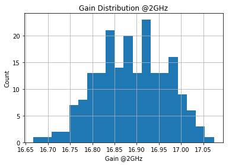
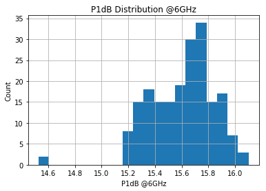
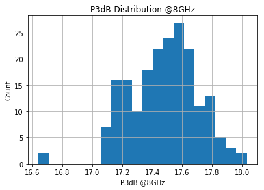

# Plotting Current and Gain Distributions with Matplotlib


```python
import csv
import time
import string
import requests
import json
import numpy
import pandas as pd
import matplotlib.pyplot as plt
import scrapy
from scrapy.crawler import CrawlerProcess
```

# Power Data Cleaning


```python
power = pd.read_csv('docs/B18U01_804A_Power_NC_power.csv')
power.head()
```


<div>
<style scoped>
    .dataframe tbody tr th:only-of-type {
        vertical-align: middle;
    }

    .dataframe tbody tr th {
        vertical-align: top;
    }

    .dataframe thead th {
        text-align: right;
    }
</style>
<table border="1" class="dataframe">
  <thead>
    <tr style="text-align: right;">
      <th></th>
      <th>Unnamed: 0</th>
      <th>Test</th>
      <th>Die</th>
      <th>VDD (V)</th>
      <th>Unnamed: 4</th>
      <th>Unnamed: 5</th>
      <th>Unnamed: 6</th>
      <th>Id (mA)</th>
      <th>Unnamed: 8</th>
      <th>Freq (GHz)</th>
      <th>...</th>
      <th>Unnamed: 17</th>
      <th>Unnamed: 18</th>
      <th>Unnamed: 19</th>
      <th>Unnamed: 20</th>
      <th>Unnamed: 21</th>
      <th>Unnamed: 22</th>
      <th>Unnamed: 23</th>
      <th>Unnamed: 24</th>
      <th>Unnamed: 25</th>
      <th>Unnamed: 26</th>
    </tr>
  </thead>
  <tbody>
    <tr>
      <th>0</th>
      <td>693862</td>
      <td>POW1</td>
      <td>AD10</td>
      <td>5</td>
      <td>#</td>
      <td>#</td>
      <td>#</td>
      <td>58.76</td>
      <td>#</td>
      <td>0.5</td>
      <td>...</td>
      <td>#</td>
      <td>#</td>
      <td>#</td>
      <td>#</td>
      <td>#</td>
      <td>#</td>
      <td>#</td>
      <td>#</td>
      <td>#</td>
      <td>#</td>
    </tr>
    <tr>
      <th>1</th>
      <td>693862</td>
      <td>POW1</td>
      <td>AD10</td>
      <td>5</td>
      <td>#</td>
      <td>#</td>
      <td>#</td>
      <td>58.23</td>
      <td>#</td>
      <td>2.0</td>
      <td>...</td>
      <td>#</td>
      <td>#</td>
      <td>#</td>
      <td>#</td>
      <td>#</td>
      <td>#</td>
      <td>#</td>
      <td>#</td>
      <td>#</td>
      <td>#</td>
    </tr>
    <tr>
      <th>2</th>
      <td>693862</td>
      <td>POW1</td>
      <td>AD10</td>
      <td>5</td>
      <td>#</td>
      <td>#</td>
      <td>#</td>
      <td>58.30</td>
      <td>#</td>
      <td>6.0</td>
      <td>...</td>
      <td>#</td>
      <td>#</td>
      <td>#</td>
      <td>#</td>
      <td>#</td>
      <td>#</td>
      <td>#</td>
      <td>#</td>
      <td>#</td>
      <td>#</td>
    </tr>
    <tr>
      <th>3</th>
      <td>693862</td>
      <td>POW1</td>
      <td>AD10</td>
      <td>5</td>
      <td>#</td>
      <td>#</td>
      <td>#</td>
      <td>58.42</td>
      <td>#</td>
      <td>8.0</td>
      <td>...</td>
      <td>#</td>
      <td>#</td>
      <td>#</td>
      <td>#</td>
      <td>#</td>
      <td>#</td>
      <td>#</td>
      <td>#</td>
      <td>#</td>
      <td>#</td>
    </tr>
    <tr>
      <th>4</th>
      <td>693862</td>
      <td>POW1</td>
      <td>AD10</td>
      <td>5</td>
      <td>#</td>
      <td>#</td>
      <td>#</td>
      <td>58.84</td>
      <td>#</td>
      <td>12.0</td>
      <td>...</td>
      <td>#</td>
      <td>#</td>
      <td>#</td>
      <td>#</td>
      <td>#</td>
      <td>#</td>
      <td>#</td>
      <td>#</td>
      <td>#</td>
      <td>#</td>
    </tr>
  </tbody>
</table>
<p>5 rows × 27 columns</p>
</div>


```python
# Drop unnecessary columns
power = power.drop(columns=['Unnamed: 4', 'Unnamed: 5', 'Unnamed: 6', 'Unnamed: 8', 
                            'Unnamed: 11', 'Unnamed: 13', 'Unnamed: 16', 'Unnamed: 17', 
                            'Unnamed: 18', 'Unnamed: 19', 'Unnamed: 20', 'Unnamed: 21', 
                            'Unnamed: 22', 'Unnamed: 23', 'Unnamed: 24', 'Unnamed: 25', 
                            'Unnamed: 26'])
power.head()
```


<div>
<style scoped>
    .dataframe tbody tr th:only-of-type {
        vertical-align: middle;
    }

    .dataframe tbody tr th {
        vertical-align: top;
    }

    .dataframe thead th {
        text-align: right;
    }
</style>
<table border="1" class="dataframe">
  <thead>
    <tr style="text-align: right;">
      <th></th>
      <th>Unnamed: 0</th>
      <th>Test</th>
      <th>Die</th>
      <th>VDD (V)</th>
      <th>Id (mA)</th>
      <th>Freq (GHz)</th>
      <th>Pin (dBm)</th>
      <th>Pin (dBm).1</th>
      <th>Pout (dBm)</th>
      <th>Gain (dB)</th>
    </tr>
  </thead>
  <tbody>
    <tr>
      <th>0</th>
      <td>693862</td>
      <td>POW1</td>
      <td>AD10</td>
      <td>5</td>
      <td>58.76</td>
      <td>0.5</td>
      <td>-9</td>
      <td>-9.035750</td>
      <td>7.550</td>
      <td>16.550</td>
    </tr>
    <tr>
      <th>1</th>
      <td>693862</td>
      <td>POW1</td>
      <td>AD10</td>
      <td>5</td>
      <td>58.23</td>
      <td>2.0</td>
      <td>-9</td>
      <td>-8.983687</td>
      <td>7.952</td>
      <td>16.952</td>
    </tr>
    <tr>
      <th>2</th>
      <td>693862</td>
      <td>POW1</td>
      <td>AD10</td>
      <td>5</td>
      <td>58.30</td>
      <td>6.0</td>
      <td>-9</td>
      <td>-9.026563</td>
      <td>7.698</td>
      <td>16.698</td>
    </tr>
    <tr>
      <th>3</th>
      <td>693862</td>
      <td>POW1</td>
      <td>AD10</td>
      <td>5</td>
      <td>58.42</td>
      <td>8.0</td>
      <td>-9</td>
      <td>-8.969000</td>
      <td>8.024</td>
      <td>17.024</td>
    </tr>
    <tr>
      <th>4</th>
      <td>693862</td>
      <td>POW1</td>
      <td>AD10</td>
      <td>5</td>
      <td>58.84</td>
      <td>12.0</td>
      <td>-9</td>
      <td>-8.952312</td>
      <td>9.724</td>
      <td>18.724</td>
    </tr>
  </tbody>
</table>
</div>


```python
# Rename columns
power.columns = ['ID', 'Test', 'Die', 'Vdd', 'Id', 'Freq', 'Pin', 'Pin_measured', 'Pout', 'Gain']
power.head()
```


<div>
<style scoped>
    .dataframe tbody tr th:only-of-type {
        vertical-align: middle;
    }

    .dataframe tbody tr th {
        vertical-align: top;
    }

    .dataframe thead th {
        text-align: right;
    }
</style>
<table border="1" class="dataframe">
  <thead>
    <tr style="text-align: right;">
      <th></th>
      <th>ID</th>
      <th>Test</th>
      <th>Die</th>
      <th>Vdd</th>
      <th>Id</th>
      <th>Freq</th>
      <th>Pin</th>
      <th>Pin_measured</th>
      <th>Pout</th>
      <th>Gain</th>
    </tr>
  </thead>
  <tbody>
    <tr>
      <th>0</th>
      <td>693862</td>
      <td>POW1</td>
      <td>AD10</td>
      <td>5</td>
      <td>58.76</td>
      <td>0.5</td>
      <td>-9</td>
      <td>-9.035750</td>
      <td>7.550</td>
      <td>16.550</td>
    </tr>
    <tr>
      <th>1</th>
      <td>693862</td>
      <td>POW1</td>
      <td>AD10</td>
      <td>5</td>
      <td>58.23</td>
      <td>2.0</td>
      <td>-9</td>
      <td>-8.983687</td>
      <td>7.952</td>
      <td>16.952</td>
    </tr>
    <tr>
      <th>2</th>
      <td>693862</td>
      <td>POW1</td>
      <td>AD10</td>
      <td>5</td>
      <td>58.30</td>
      <td>6.0</td>
      <td>-9</td>
      <td>-9.026563</td>
      <td>7.698</td>
      <td>16.698</td>
    </tr>
    <tr>
      <th>3</th>
      <td>693862</td>
      <td>POW1</td>
      <td>AD10</td>
      <td>5</td>
      <td>58.42</td>
      <td>8.0</td>
      <td>-9</td>
      <td>-8.969000</td>
      <td>8.024</td>
      <td>17.024</td>
    </tr>
    <tr>
      <th>4</th>
      <td>693862</td>
      <td>POW1</td>
      <td>AD10</td>
      <td>5</td>
      <td>58.84</td>
      <td>12.0</td>
      <td>-9</td>
      <td>-8.952312</td>
      <td>9.724</td>
      <td>18.724</td>
    </tr>
  </tbody>
</table>
</div>


```python
# Check datatypes
print(power.dtypes)
```

    ID                int64
    Test             object
    Die              object
    Vdd               int64
    Id              float64
    Freq            float64
    Pin               int64
    Pin_measured    float64
    Pout            float64
    Gain            float64
    dtype: object


```python
# Extract only the data for Pin=-9
power = power.loc[power['Pin'] == -9]
power.head()
```


<div>
<style scoped>
    .dataframe tbody tr th:only-of-type {
        vertical-align: middle;
    }

    .dataframe tbody tr th {
        vertical-align: top;
    }

    .dataframe thead th {
        text-align: right;
    }
</style>
<table border="1" class="dataframe">
  <thead>
    <tr style="text-align: right;">
      <th></th>
      <th>ID</th>
      <th>Test</th>
      <th>Die</th>
      <th>Vdd</th>
      <th>Id</th>
      <th>Freq</th>
      <th>Pin</th>
      <th>Pin_measured</th>
      <th>Pout</th>
      <th>Gain</th>
    </tr>
  </thead>
  <tbody>
    <tr>
      <th>0</th>
      <td>693862</td>
      <td>POW1</td>
      <td>AD10</td>
      <td>5</td>
      <td>58.76</td>
      <td>0.5</td>
      <td>-9</td>
      <td>-9.035750</td>
      <td>7.550</td>
      <td>16.550</td>
    </tr>
    <tr>
      <th>1</th>
      <td>693862</td>
      <td>POW1</td>
      <td>AD10</td>
      <td>5</td>
      <td>58.23</td>
      <td>2.0</td>
      <td>-9</td>
      <td>-8.983687</td>
      <td>7.952</td>
      <td>16.952</td>
    </tr>
    <tr>
      <th>2</th>
      <td>693862</td>
      <td>POW1</td>
      <td>AD10</td>
      <td>5</td>
      <td>58.30</td>
      <td>6.0</td>
      <td>-9</td>
      <td>-9.026563</td>
      <td>7.698</td>
      <td>16.698</td>
    </tr>
    <tr>
      <th>3</th>
      <td>693862</td>
      <td>POW1</td>
      <td>AD10</td>
      <td>5</td>
      <td>58.42</td>
      <td>8.0</td>
      <td>-9</td>
      <td>-8.969000</td>
      <td>8.024</td>
      <td>17.024</td>
    </tr>
    <tr>
      <th>4</th>
      <td>693862</td>
      <td>POW1</td>
      <td>AD10</td>
      <td>5</td>
      <td>58.84</td>
      <td>12.0</td>
      <td>-9</td>
      <td>-8.952312</td>
      <td>9.724</td>
      <td>18.724</td>
    </tr>
  </tbody>
</table>
</div>


# Gain Distribution (Pin=-9dBm, Freq=0.5GHz)


```python
# Extract all rows for Freq=0.5
power_500MHz = power.loc[power['Freq'] == 0.5].drop(['ID', 'Test', 'Die', 'Vdd', 'Pin_measured'], axis=1)
power_500MHz.head()
```


<div>
<style scoped>
    .dataframe tbody tr th:only-of-type {
        vertical-align: middle;
    }

    .dataframe tbody tr th {
        vertical-align: top;
    }

    .dataframe thead th {
        text-align: right;
    }
</style>
<table border="1" class="dataframe">
  <thead>
    <tr style="text-align: right;">
      <th></th>
      <th>Id</th>
      <th>Freq</th>
      <th>Pin</th>
      <th>Pout</th>
      <th>Gain</th>
    </tr>
  </thead>
  <tbody>
    <tr>
      <th>0</th>
      <td>58.76</td>
      <td>0.5</td>
      <td>-9</td>
      <td>7.550</td>
      <td>16.550</td>
    </tr>
    <tr>
      <th>80</th>
      <td>58.51</td>
      <td>0.5</td>
      <td>-9</td>
      <td>7.654</td>
      <td>16.654</td>
    </tr>
    <tr>
      <th>160</th>
      <td>58.64</td>
      <td>0.5</td>
      <td>-9</td>
      <td>7.606</td>
      <td>16.606</td>
    </tr>
    <tr>
      <th>240</th>
      <td>58.38</td>
      <td>0.5</td>
      <td>-9</td>
      <td>7.280</td>
      <td>16.280</td>
    </tr>
    <tr>
      <th>281</th>
      <td>59.05</td>
      <td>0.5</td>
      <td>-9</td>
      <td>7.632</td>
      <td>16.632</td>
    </tr>
  </tbody>
</table>
</div>


```python
# Export data to csv
power_500MHz.to_csv('docs/B18U01_804A_Power_NC_power_500MHz.csv')
```


```python
# Plot gain distribution at 0.5GHz
power_500MHz.Gain.hist(bins=20)
plt.title('Gain Distribution @500MHz')
plt.xlabel('Gain @500MHz')
plt.ylabel('Count')
plt.show()
```


    

    


# Key Statistics (Pin=-9dBm, Freq=0.5GHz)


```python
power_500MHz.describe()
```


<div>
<style scoped>
    .dataframe tbody tr th:only-of-type {
        vertical-align: middle;
    }

    .dataframe tbody tr th {
        vertical-align: top;
    }

    .dataframe thead th {
        text-align: right;
    }
</style>
<table border="1" class="dataframe">
  <thead>
    <tr style="text-align: right;">
      <th></th>
      <th>Id</th>
      <th>Freq</th>
      <th>Pin</th>
      <th>Pout</th>
      <th>Gain</th>
    </tr>
  </thead>
  <tbody>
    <tr>
      <th>count</th>
      <td>199.000000</td>
      <td>199.0</td>
      <td>199.0</td>
      <td>199.000000</td>
      <td>199.000000</td>
    </tr>
    <tr>
      <th>mean</th>
      <td>58.790352</td>
      <td>0.5</td>
      <td>-9.0</td>
      <td>7.442050</td>
      <td>16.442050</td>
    </tr>
    <tr>
      <th>std</th>
      <td>0.287915</td>
      <td>0.0</td>
      <td>0.0</td>
      <td>0.091517</td>
      <td>0.091517</td>
    </tr>
    <tr>
      <th>min</th>
      <td>58.160000</td>
      <td>0.5</td>
      <td>-9.0</td>
      <td>7.249000</td>
      <td>16.249000</td>
    </tr>
    <tr>
      <th>25%</th>
      <td>58.610000</td>
      <td>0.5</td>
      <td>-9.0</td>
      <td>7.370500</td>
      <td>16.370500</td>
    </tr>
    <tr>
      <th>50%</th>
      <td>58.780000</td>
      <td>0.5</td>
      <td>-9.0</td>
      <td>7.436000</td>
      <td>16.436000</td>
    </tr>
    <tr>
      <th>75%</th>
      <td>58.990000</td>
      <td>0.5</td>
      <td>-9.0</td>
      <td>7.502500</td>
      <td>16.502500</td>
    </tr>
    <tr>
      <th>max</th>
      <td>59.420000</td>
      <td>0.5</td>
      <td>-9.0</td>
      <td>7.673000</td>
      <td>16.673000</td>
    </tr>
  </tbody>
</table>
</div>


# Gain Distribution (Pin=-9dBm, Freq=2GHz)


```python
# Extract all rows for Freq=2
power_2GHz = power.loc[power['Freq'] == 2].drop(['ID', 'Test', 'Die', 'Vdd', 'Pin_measured'], axis=1)
power_2GHz.head()
```


<div>
<style scoped>
    .dataframe tbody tr th:only-of-type {
        vertical-align: middle;
    }

    .dataframe tbody tr th {
        vertical-align: top;
    }

    .dataframe thead th {
        text-align: right;
    }
</style>
<table border="1" class="dataframe">
  <thead>
    <tr style="text-align: right;">
      <th></th>
      <th>Id</th>
      <th>Freq</th>
      <th>Pin</th>
      <th>Pout</th>
      <th>Gain</th>
    </tr>
  </thead>
  <tbody>
    <tr>
      <th>1</th>
      <td>58.23</td>
      <td>2.0</td>
      <td>-9</td>
      <td>7.952</td>
      <td>16.952</td>
    </tr>
    <tr>
      <th>81</th>
      <td>57.89</td>
      <td>2.0</td>
      <td>-9</td>
      <td>8.044</td>
      <td>17.044</td>
    </tr>
    <tr>
      <th>161</th>
      <td>58.09</td>
      <td>2.0</td>
      <td>-9</td>
      <td>7.994</td>
      <td>16.994</td>
    </tr>
    <tr>
      <th>241</th>
      <td>57.74</td>
      <td>2.0</td>
      <td>-9</td>
      <td>7.836</td>
      <td>16.836</td>
    </tr>
    <tr>
      <th>282</th>
      <td>58.45</td>
      <td>2.0</td>
      <td>-9</td>
      <td>7.999</td>
      <td>16.999</td>
    </tr>
  </tbody>
</table>
</div>


```python
# Export data to csv
power_2GHz.to_csv('docs/B18U01_804A_Power_NC_power_2GHz.csv')
```


```python
# Plot gain distribution at 2GHz
power_2GHz.Gain.hist(bins=20)
plt.title('Gain Distribution @2GHz')
plt.xlabel('Gain @2GHz')
plt.ylabel('Count')
plt.show()
```


    

    


# Key Statistics (Pin=-9dBm, Freq=2GHz)


```python
power_2GHz.describe()
```


<div>
<style scoped>
    .dataframe tbody tr th:only-of-type {
        vertical-align: middle;
    }

    .dataframe tbody tr th {
        vertical-align: top;
    }

    .dataframe thead th {
        text-align: right;
    }
</style>
<table border="1" class="dataframe">
  <thead>
    <tr style="text-align: right;">
      <th></th>
      <th>Id</th>
      <th>Freq</th>
      <th>Pin</th>
      <th>Pout</th>
      <th>Gain</th>
    </tr>
  </thead>
  <tbody>
    <tr>
      <th>count</th>
      <td>199.000000</td>
      <td>199.0</td>
      <td>199.0</td>
      <td>199.000000</td>
      <td>199.000000</td>
    </tr>
    <tr>
      <th>mean</th>
      <td>58.081508</td>
      <td>2.0</td>
      <td>-9.0</td>
      <td>7.889543</td>
      <td>16.889543</td>
    </tr>
    <tr>
      <th>std</th>
      <td>0.311156</td>
      <td>0.0</td>
      <td>0.0</td>
      <td>0.079377</td>
      <td>0.079377</td>
    </tr>
    <tr>
      <th>min</th>
      <td>57.450000</td>
      <td>2.0</td>
      <td>-9.0</td>
      <td>7.667000</td>
      <td>16.667000</td>
    </tr>
    <tr>
      <th>25%</th>
      <td>57.850000</td>
      <td>2.0</td>
      <td>-9.0</td>
      <td>7.831000</td>
      <td>16.831000</td>
    </tr>
    <tr>
      <th>50%</th>
      <td>58.070000</td>
      <td>2.0</td>
      <td>-9.0</td>
      <td>7.888000</td>
      <td>16.888000</td>
    </tr>
    <tr>
      <th>75%</th>
      <td>58.285000</td>
      <td>2.0</td>
      <td>-9.0</td>
      <td>7.949500</td>
      <td>16.949500</td>
    </tr>
    <tr>
      <th>max</th>
      <td>58.870000</td>
      <td>2.0</td>
      <td>-9.0</td>
      <td>8.074000</td>
      <td>17.074000</td>
    </tr>
  </tbody>
</table>
</div>


# Gain Distribution (Pin=-9dBm, Freq=6GHz)


```python
# Extract all rows for Freq=6
power_6GHz = power.loc[power['Freq'] == 6].drop(['ID', 'Test', 'Die', 'Vdd', 'Pin_measured'], axis=1)
power_6GHz.head()
```


<div>
<style scoped>
    .dataframe tbody tr th:only-of-type {
        vertical-align: middle;
    }

    .dataframe tbody tr th {
        vertical-align: top;
    }

    .dataframe thead th {
        text-align: right;
    }
</style>
<table border="1" class="dataframe">
  <thead>
    <tr style="text-align: right;">
      <th></th>
      <th>Id</th>
      <th>Freq</th>
      <th>Pin</th>
      <th>Pout</th>
      <th>Gain</th>
    </tr>
  </thead>
  <tbody>
    <tr>
      <th>2</th>
      <td>58.30</td>
      <td>6.0</td>
      <td>-9</td>
      <td>7.698</td>
      <td>16.698</td>
    </tr>
    <tr>
      <th>82</th>
      <td>57.97</td>
      <td>6.0</td>
      <td>-9</td>
      <td>7.756</td>
      <td>16.756</td>
    </tr>
    <tr>
      <th>162</th>
      <td>58.17</td>
      <td>6.0</td>
      <td>-9</td>
      <td>7.732</td>
      <td>16.732</td>
    </tr>
    <tr>
      <th>242</th>
      <td>57.90</td>
      <td>6.0</td>
      <td>-9</td>
      <td>6.752</td>
      <td>15.752</td>
    </tr>
    <tr>
      <th>283</th>
      <td>58.59</td>
      <td>6.0</td>
      <td>-9</td>
      <td>7.728</td>
      <td>16.728</td>
    </tr>
  </tbody>
</table>
</div>


```python
# Export data to csv
power_6GHz.to_csv('docs/B18U01_804A_Power_NC_power_6GHz.csv')
```


```python
# Plot gain distribution at 6GHz
power_6GHz.Gain.hist(bins=20)
plt.title('Gain Distribution @6GHz')
plt.xlabel('Gain @6GHz')
plt.ylabel('Count')
plt.show()
```


    

    


# Key Statistics (Pin=-9dBm, Freq=6GHz)


```python
power_6GHz.describe()
```


<div>
<style scoped>
    .dataframe tbody tr th:only-of-type {
        vertical-align: middle;
    }

    .dataframe tbody tr th {
        vertical-align: top;
    }

    .dataframe thead th {
        text-align: right;
    }
</style>
<table border="1" class="dataframe">
  <thead>
    <tr style="text-align: right;">
      <th></th>
      <th>Id</th>
      <th>Freq</th>
      <th>Pin</th>
      <th>Pout</th>
      <th>Gain</th>
    </tr>
  </thead>
  <tbody>
    <tr>
      <th>count</th>
      <td>199.000000</td>
      <td>199.0</td>
      <td>199.0</td>
      <td>199.000000</td>
      <td>199.000000</td>
    </tr>
    <tr>
      <th>mean</th>
      <td>58.196935</td>
      <td>6.0</td>
      <td>-9.0</td>
      <td>7.668819</td>
      <td>16.668819</td>
    </tr>
    <tr>
      <th>std</th>
      <td>0.303582</td>
      <td>0.0</td>
      <td>0.0</td>
      <td>0.103030</td>
      <td>0.103030</td>
    </tr>
    <tr>
      <th>min</th>
      <td>57.550000</td>
      <td>6.0</td>
      <td>-9.0</td>
      <td>6.752000</td>
      <td>15.752000</td>
    </tr>
    <tr>
      <th>25%</th>
      <td>57.970000</td>
      <td>6.0</td>
      <td>-9.0</td>
      <td>7.618000</td>
      <td>16.618000</td>
    </tr>
    <tr>
      <th>50%</th>
      <td>58.190000</td>
      <td>6.0</td>
      <td>-9.0</td>
      <td>7.667000</td>
      <td>16.667000</td>
    </tr>
    <tr>
      <th>75%</th>
      <td>58.395000</td>
      <td>6.0</td>
      <td>-9.0</td>
      <td>7.734500</td>
      <td>16.734500</td>
    </tr>
    <tr>
      <th>max</th>
      <td>58.980000</td>
      <td>6.0</td>
      <td>-9.0</td>
      <td>7.845000</td>
      <td>16.845000</td>
    </tr>
  </tbody>
</table>
</div>


# Gain Distribution (Pin=-9dBm, Freq=8GHz)


```python
# Extract all rows for Freq=8
power_8GHz = power.loc[power['Freq'] == 8].drop(['ID', 'Test', 'Die', 'Vdd', 'Pin_measured'], axis=1)
power_8GHz.head()
```


<div>
<style scoped>
    .dataframe tbody tr th:only-of-type {
        vertical-align: middle;
    }

    .dataframe tbody tr th {
        vertical-align: top;
    }

    .dataframe thead th {
        text-align: right;
    }
</style>
<table border="1" class="dataframe">
  <thead>
    <tr style="text-align: right;">
      <th></th>
      <th>Id</th>
      <th>Freq</th>
      <th>Pin</th>
      <th>Pout</th>
      <th>Gain</th>
    </tr>
  </thead>
  <tbody>
    <tr>
      <th>3</th>
      <td>58.42</td>
      <td>8.0</td>
      <td>-9</td>
      <td>8.024</td>
      <td>17.024</td>
    </tr>
    <tr>
      <th>83</th>
      <td>58.23</td>
      <td>8.0</td>
      <td>-9</td>
      <td>8.183</td>
      <td>17.183</td>
    </tr>
    <tr>
      <th>163</th>
      <td>58.33</td>
      <td>8.0</td>
      <td>-9</td>
      <td>8.048</td>
      <td>17.048</td>
    </tr>
    <tr>
      <th>284</th>
      <td>58.77</td>
      <td>8.0</td>
      <td>-9</td>
      <td>8.075</td>
      <td>17.075</td>
    </tr>
    <tr>
      <th>364</th>
      <td>57.95</td>
      <td>8.0</td>
      <td>-9</td>
      <td>8.056</td>
      <td>17.056</td>
    </tr>
  </tbody>
</table>
</div>


```python
# Export data to csv
power_8GHz.to_csv('docs/B18U01_804A_Power_NC_power_8GHz.csv')
```


```python
# Plot gain distribution at 8GHz
power_8GHz.Gain.hist(bins=20)
plt.title('Gain Distribution @8GHz')
plt.xlabel('Gain @8GHz')
plt.ylabel('Count')
plt.show()
```


    

    


# Key Statistics (Pin=-9dBm, Freq=8GHz)


```python
power_8GHz.describe()
```


<div>
<style scoped>
    .dataframe tbody tr th:only-of-type {
        vertical-align: middle;
    }

    .dataframe tbody tr th {
        vertical-align: top;
    }

    .dataframe thead th {
        text-align: right;
    }
</style>
<table border="1" class="dataframe">
  <thead>
    <tr style="text-align: right;">
      <th></th>
      <th>Id</th>
      <th>Freq</th>
      <th>Pin</th>
      <th>Pout</th>
      <th>Gain</th>
    </tr>
  </thead>
  <tbody>
    <tr>
      <th>count</th>
      <td>198.000000</td>
      <td>198.0</td>
      <td>198.0</td>
      <td>198.000000</td>
      <td>198.000000</td>
    </tr>
    <tr>
      <th>mean</th>
      <td>58.442980</td>
      <td>8.0</td>
      <td>-9.0</td>
      <td>7.998076</td>
      <td>16.998076</td>
    </tr>
    <tr>
      <th>std</th>
      <td>0.293867</td>
      <td>0.0</td>
      <td>0.0</td>
      <td>0.093862</td>
      <td>0.093862</td>
    </tr>
    <tr>
      <th>min</th>
      <td>57.770000</td>
      <td>8.0</td>
      <td>-9.0</td>
      <td>7.690000</td>
      <td>16.690000</td>
    </tr>
    <tr>
      <th>25%</th>
      <td>58.262500</td>
      <td>8.0</td>
      <td>-9.0</td>
      <td>7.952500</td>
      <td>16.952500</td>
    </tr>
    <tr>
      <th>50%</th>
      <td>58.430000</td>
      <td>8.0</td>
      <td>-9.0</td>
      <td>7.988000</td>
      <td>16.988000</td>
    </tr>
    <tr>
      <th>75%</th>
      <td>58.640000</td>
      <td>8.0</td>
      <td>-9.0</td>
      <td>8.056000</td>
      <td>17.056000</td>
    </tr>
    <tr>
      <th>max</th>
      <td>59.110000</td>
      <td>8.0</td>
      <td>-9.0</td>
      <td>8.200000</td>
      <td>17.200000</td>
    </tr>
  </tbody>
</table>
</div>


# Gain Distribution (Pin=-9dBm, Freq=12GHz)


```python
# Extract all rows for Freq=12
power_12GHz = power.loc[power['Freq'] == 12].drop(['ID', 'Test', 'Die', 'Vdd', 'Pin_measured'], axis=1)
power_12GHz.head()
```


<div>
<style scoped>
    .dataframe tbody tr th:only-of-type {
        vertical-align: middle;
    }

    .dataframe tbody tr th {
        vertical-align: top;
    }

    .dataframe thead th {
        text-align: right;
    }
</style>
<table border="1" class="dataframe">
  <thead>
    <tr style="text-align: right;">
      <th></th>
      <th>Id</th>
      <th>Freq</th>
      <th>Pin</th>
      <th>Pout</th>
      <th>Gain</th>
    </tr>
  </thead>
  <tbody>
    <tr>
      <th>4</th>
      <td>58.84</td>
      <td>12.0</td>
      <td>-9</td>
      <td>9.724</td>
      <td>18.724</td>
    </tr>
    <tr>
      <th>84</th>
      <td>58.58</td>
      <td>12.0</td>
      <td>-9</td>
      <td>9.591</td>
      <td>18.591</td>
    </tr>
    <tr>
      <th>164</th>
      <td>58.72</td>
      <td>12.0</td>
      <td>-9</td>
      <td>9.601</td>
      <td>18.601</td>
    </tr>
    <tr>
      <th>285</th>
      <td>59.16</td>
      <td>12.0</td>
      <td>-9</td>
      <td>9.757</td>
      <td>18.757</td>
    </tr>
    <tr>
      <th>365</th>
      <td>58.37</td>
      <td>12.0</td>
      <td>-9</td>
      <td>9.717</td>
      <td>18.717</td>
    </tr>
  </tbody>
</table>
</div>


```python
# Export data to csv
power_12GHz.to_csv('docs/B18U01_804A_Power_NC_power_12GHz.csv')
```


```python
# Plot gain distribution at 12GHz
power_12GHz.Gain.hist(bins=20)
plt.title('Gain Distribution @12GHz')
plt.xlabel('Gain @12GHz')
plt.ylabel('Count')
plt.show()
```


    

    


# Key Statistics (Pin=-9dBm, Freq=12GHz)


```python
power_12GHz.describe()
```


<div>
<style scoped>
    .dataframe tbody tr th:only-of-type {
        vertical-align: middle;
    }

    .dataframe tbody tr th {
        vertical-align: top;
    }

    .dataframe thead th {
        text-align: right;
    }
</style>
<table border="1" class="dataframe">
  <thead>
    <tr style="text-align: right;">
      <th></th>
      <th>Id</th>
      <th>Freq</th>
      <th>Pin</th>
      <th>Pout</th>
      <th>Gain</th>
    </tr>
  </thead>
  <tbody>
    <tr>
      <th>count</th>
      <td>198.000000</td>
      <td>198.0</td>
      <td>198.0</td>
      <td>198.000000</td>
      <td>198.000000</td>
    </tr>
    <tr>
      <th>mean</th>
      <td>58.881515</td>
      <td>12.0</td>
      <td>-9.0</td>
      <td>9.699510</td>
      <td>18.699510</td>
    </tr>
    <tr>
      <th>std</th>
      <td>0.298056</td>
      <td>0.0</td>
      <td>0.0</td>
      <td>0.158162</td>
      <td>0.158162</td>
    </tr>
    <tr>
      <th>min</th>
      <td>58.170000</td>
      <td>12.0</td>
      <td>-9.0</td>
      <td>9.052000</td>
      <td>18.052000</td>
    </tr>
    <tr>
      <th>25%</th>
      <td>58.692500</td>
      <td>12.0</td>
      <td>-9.0</td>
      <td>9.648250</td>
      <td>18.648250</td>
    </tr>
    <tr>
      <th>50%</th>
      <td>58.880000</td>
      <td>12.0</td>
      <td>-9.0</td>
      <td>9.716500</td>
      <td>18.716500</td>
    </tr>
    <tr>
      <th>75%</th>
      <td>59.080000</td>
      <td>12.0</td>
      <td>-9.0</td>
      <td>9.775750</td>
      <td>18.775750</td>
    </tr>
    <tr>
      <th>max</th>
      <td>59.610000</td>
      <td>12.0</td>
      <td>-9.0</td>
      <td>10.029000</td>
      <td>19.029000</td>
    </tr>
  </tbody>
</table>
</div>


# Vg1 Distribution (DC)


```python
dc = pd.read_csv('docs/B18U01_804A_Power_NC_DC.csv')
dc.head()
```


<div>
<style scoped>
    .dataframe tbody tr th:only-of-type {
        vertical-align: middle;
    }

    .dataframe tbody tr th {
        vertical-align: top;
    }

    .dataframe thead th {
        text-align: right;
    }
</style>
<table border="1" class="dataframe">
  <thead>
    <tr style="text-align: right;">
      <th></th>
      <th>Unnamed: 0</th>
      <th>Test</th>
      <th>Die</th>
      <th>VDD (V)</th>
      <th>Unnamed: 4</th>
      <th>Unnamed: 5</th>
      <th>Unnamed: 6</th>
      <th>Unnamed: 7</th>
      <th>Unnamed: 8</th>
      <th>Unnamed: 9</th>
      <th>...</th>
      <th>Unnamed: 17</th>
      <th>Unnamed: 18</th>
      <th>Unnamed: 19</th>
      <th>Unnamed: 20</th>
      <th>Unnamed: 21</th>
      <th>Unnamed: 22</th>
      <th>Unnamed: 23</th>
      <th>Unnamed: 24</th>
      <th>Unnamed: 25</th>
      <th>Unnamed: 26</th>
    </tr>
  </thead>
  <tbody>
    <tr>
      <th>0</th>
      <td>693862.0</td>
      <td>TCC2</td>
      <td>AD10</td>
      <td>5.0</td>
      <td>#</td>
      <td>#</td>
      <td>#</td>
      <td>#</td>
      <td>#</td>
      <td>#</td>
      <td>...</td>
      <td>#</td>
      <td>#</td>
      <td>#</td>
      <td>#</td>
      <td>#</td>
      <td>#</td>
      <td>#</td>
      <td>#</td>
      <td>#</td>
      <td>#</td>
    </tr>
    <tr>
      <th>1</th>
      <td>693862.0</td>
      <td>TCC2</td>
      <td>AD15</td>
      <td>5.0</td>
      <td>#</td>
      <td>#</td>
      <td>#</td>
      <td>#</td>
      <td>#</td>
      <td>#</td>
      <td>...</td>
      <td>#</td>
      <td>#</td>
      <td>#</td>
      <td>#</td>
      <td>#</td>
      <td>#</td>
      <td>#</td>
      <td>#</td>
      <td>#</td>
      <td>#</td>
    </tr>
    <tr>
      <th>2</th>
      <td>693862.0</td>
      <td>TCC2</td>
      <td>AD16</td>
      <td>5.0</td>
      <td>#</td>
      <td>#</td>
      <td>#</td>
      <td>#</td>
      <td>#</td>
      <td>#</td>
      <td>...</td>
      <td>#</td>
      <td>#</td>
      <td>#</td>
      <td>#</td>
      <td>#</td>
      <td>#</td>
      <td>#</td>
      <td>#</td>
      <td>#</td>
      <td>#</td>
    </tr>
    <tr>
      <th>3</th>
      <td>693862.0</td>
      <td>TCC2</td>
      <td>AD17</td>
      <td>5.0</td>
      <td>#</td>
      <td>#</td>
      <td>#</td>
      <td>#</td>
      <td>#</td>
      <td>#</td>
      <td>...</td>
      <td>#</td>
      <td>#</td>
      <td>#</td>
      <td>#</td>
      <td>#</td>
      <td>#</td>
      <td>#</td>
      <td>#</td>
      <td>#</td>
      <td>#</td>
    </tr>
    <tr>
      <th>4</th>
      <td>693862.0</td>
      <td>TCC2</td>
      <td>AD18</td>
      <td>5.0</td>
      <td>#</td>
      <td>#</td>
      <td>#</td>
      <td>#</td>
      <td>#</td>
      <td>#</td>
      <td>...</td>
      <td>#</td>
      <td>#</td>
      <td>#</td>
      <td>#</td>
      <td>#</td>
      <td>#</td>
      <td>#</td>
      <td>#</td>
      <td>#</td>
      <td>#</td>
    </tr>
  </tbody>
</table>
<p>5 rows × 27 columns</p>
</div>


```python
# Drop unnecessary columns
dc = dc.drop(columns=['Unnamed: 4', 'Unnamed: 5', 'Unnamed: 6', 'Unnamed: 7', 'Unnamed: 8', 'Unnamed: 9', 'Unnamed: 12', 
                      'Unnamed: 13', 'Unnamed: 14', 'Unnamed: 15', 'Unnamed: 16', 'Unnamed: 17',  'Unnamed: 18', 
                      'Unnamed: 19', 'Unnamed: 20', 'Unnamed: 21', 'Unnamed: 22', 'Unnamed: 23', 'Unnamed: 24', 
                      'Unnamed: 25', 'Unnamed: 26']).dropna()

dc.columns = ['ID', 'Test', 'Die', 'Vdd', 'Vg1', 'Idd']
dc.head()
```


<div>
<style scoped>
    .dataframe tbody tr th:only-of-type {
        vertical-align: middle;
    }

    .dataframe tbody tr th {
        vertical-align: top;
    }

    .dataframe thead th {
        text-align: right;
    }
</style>
<table border="1" class="dataframe">
  <thead>
    <tr style="text-align: right;">
      <th></th>
      <th>ID</th>
      <th>Test</th>
      <th>Die</th>
      <th>Vdd</th>
      <th>Vg1</th>
      <th>Idd</th>
    </tr>
  </thead>
  <tbody>
    <tr>
      <th>0</th>
      <td>693862.0</td>
      <td>TCC2</td>
      <td>AD10</td>
      <td>5.0</td>
      <td>-0.426875</td>
      <td>0.05789</td>
    </tr>
    <tr>
      <th>1</th>
      <td>693862.0</td>
      <td>TCC2</td>
      <td>AD15</td>
      <td>5.0</td>
      <td>-0.399375</td>
      <td>0.05774</td>
    </tr>
    <tr>
      <th>2</th>
      <td>693862.0</td>
      <td>TCC2</td>
      <td>AD16</td>
      <td>5.0</td>
      <td>-0.402813</td>
      <td>0.05783</td>
    </tr>
    <tr>
      <th>3</th>
      <td>693862.0</td>
      <td>TCC2</td>
      <td>AD17</td>
      <td>5.0</td>
      <td>-0.399375</td>
      <td>0.05754</td>
    </tr>
    <tr>
      <th>4</th>
      <td>693862.0</td>
      <td>TCC2</td>
      <td>AD18</td>
      <td>5.0</td>
      <td>-0.402813</td>
      <td>0.05822</td>
    </tr>
  </tbody>
</table>
</div>


```python
# Plot Vg1 distribution
dc.Vg1.hist(bins=20)
plt.title('Vg1 Distribution')
plt.xlabel('Vg1')
plt.ylabel('Count')
plt.show()
```


    

    


# Key Statistics (DC)


```python
dc.describe()
```


<div>
<style scoped>
    .dataframe tbody tr th:only-of-type {
        vertical-align: middle;
    }

    .dataframe tbody tr th {
        vertical-align: top;
    }

    .dataframe thead th {
        text-align: right;
    }
</style>
<table border="1" class="dataframe">
  <thead>
    <tr style="text-align: right;">
      <th></th>
      <th>ID</th>
      <th>Vdd</th>
      <th>Vg1</th>
      <th>Idd</th>
    </tr>
  </thead>
  <tbody>
    <tr>
      <th>count</th>
      <td>199.0</td>
      <td>199.0</td>
      <td>199.000000</td>
      <td>199.000000</td>
    </tr>
    <tr>
      <th>mean</th>
      <td>693862.0</td>
      <td>5.0</td>
      <td>-0.389460</td>
      <td>0.058003</td>
    </tr>
    <tr>
      <th>std</th>
      <td>0.0</td>
      <td>0.0</td>
      <td>0.026801</td>
      <td>0.000294</td>
    </tr>
    <tr>
      <th>min</th>
      <td>693862.0</td>
      <td>5.0</td>
      <td>-0.461250</td>
      <td>0.057430</td>
    </tr>
    <tr>
      <th>25%</th>
      <td>693862.0</td>
      <td>5.0</td>
      <td>-0.406250</td>
      <td>0.057820</td>
    </tr>
    <tr>
      <th>50%</th>
      <td>693862.0</td>
      <td>5.0</td>
      <td>-0.392500</td>
      <td>0.058010</td>
    </tr>
    <tr>
      <th>75%</th>
      <td>693862.0</td>
      <td>5.0</td>
      <td>-0.366719</td>
      <td>0.058210</td>
    </tr>
    <tr>
      <th>max</th>
      <td>693862.0</td>
      <td>5.0</td>
      <td>-0.344375</td>
      <td>0.058560</td>
    </tr>
  </tbody>
</table>
</div>


# Compression Data Cleaning


```python
compression = pd.read_csv('docs/B18U01_804A_Power_NC_compression.csv')
compression.head()
```


<div>
<style scoped>
    .dataframe tbody tr th:only-of-type {
        vertical-align: middle;
    }

    .dataframe tbody tr th {
        vertical-align: top;
    }

    .dataframe thead th {
        text-align: right;
    }
</style>
<table border="1" class="dataframe">
  <thead>
    <tr style="text-align: right;">
      <th></th>
      <th>Unnamed: 0</th>
      <th>Test</th>
      <th>Die</th>
      <th>VDD (V)</th>
      <th>Unnamed: 4</th>
      <th>Freq (GHz)</th>
      <th>Comp. level (dB)</th>
      <th>Pin_comp(dBm)</th>
      <th>Pout_comp (dBm)</th>
      <th>Linear Gain</th>
      <th>...</th>
      <th>Unnamed: 17</th>
      <th>Unnamed: 18</th>
      <th>Unnamed: 19</th>
      <th>Unnamed: 20</th>
      <th>Unnamed: 21</th>
      <th>Unnamed: 22</th>
      <th>Unnamed: 23</th>
      <th>Unnamed: 24</th>
      <th>Unnamed: 25</th>
      <th>Unnamed: 26</th>
    </tr>
  </thead>
  <tbody>
    <tr>
      <th>0</th>
      <td>693862</td>
      <td>PDB2</td>
      <td>AD10</td>
      <td>5</td>
      <td>#</td>
      <td>0.5</td>
      <td>1</td>
      <td>1.33</td>
      <td>16.88</td>
      <td>16.55</td>
      <td>...</td>
      <td>#</td>
      <td>#</td>
      <td>#</td>
      <td>#</td>
      <td>#</td>
      <td>#</td>
      <td>PASS</td>
      <td>#</td>
      <td>#</td>
      <td>#</td>
    </tr>
    <tr>
      <th>1</th>
      <td>693862</td>
      <td>PDB2</td>
      <td>AD10</td>
      <td>5</td>
      <td>#</td>
      <td>2.0</td>
      <td>1</td>
      <td>0.11</td>
      <td>16.06</td>
      <td>16.95</td>
      <td>...</td>
      <td>#</td>
      <td>#</td>
      <td>#</td>
      <td>#</td>
      <td>#</td>
      <td>#</td>
      <td>PASS</td>
      <td>#</td>
      <td>#</td>
      <td>#</td>
    </tr>
    <tr>
      <th>2</th>
      <td>693862</td>
      <td>PDB2</td>
      <td>AD10</td>
      <td>5</td>
      <td>#</td>
      <td>6.0</td>
      <td>1</td>
      <td>0.10</td>
      <td>15.79</td>
      <td>16.69</td>
      <td>...</td>
      <td>#</td>
      <td>#</td>
      <td>#</td>
      <td>#</td>
      <td>#</td>
      <td>#</td>
      <td>PASS</td>
      <td>#</td>
      <td>#</td>
      <td>#</td>
    </tr>
    <tr>
      <th>3</th>
      <td>693862</td>
      <td>PDB2</td>
      <td>AD10</td>
      <td>5</td>
      <td>#</td>
      <td>8.0</td>
      <td>1</td>
      <td>-0.35</td>
      <td>15.67</td>
      <td>17.02</td>
      <td>...</td>
      <td>#</td>
      <td>#</td>
      <td>#</td>
      <td>#</td>
      <td>#</td>
      <td>#</td>
      <td>PASS</td>
      <td>#</td>
      <td>#</td>
      <td>#</td>
    </tr>
    <tr>
      <th>4</th>
      <td>693862</td>
      <td>PDB2</td>
      <td>AD10</td>
      <td>5</td>
      <td>#</td>
      <td>12.0</td>
      <td>1</td>
      <td>-4.62</td>
      <td>13.09</td>
      <td>18.72</td>
      <td>...</td>
      <td>#</td>
      <td>#</td>
      <td>#</td>
      <td>#</td>
      <td>#</td>
      <td>#</td>
      <td>PASS</td>
      <td>#</td>
      <td>#</td>
      <td>#</td>
    </tr>
  </tbody>
</table>
<p>5 rows × 27 columns</p>
</div>


```python
# Drop unnecessary columns
compression = compression.drop(columns=['Unnamed: 4','Unnamed: 11', 'Unnamed: 12', 'Unnamed: 13', 
                                        'Unnamed: 14', 'Unnamed: 15', 'Unnamed: 16', 'Unnamed: 17', 
                                        'Unnamed: 18', 'Unnamed: 19', 'Unnamed: 20', 'Unnamed: 21', 
                                        'Unnamed: 22', 'Unnamed: 23', 'Unnamed: 24', 'Unnamed: 25', 
                                        'Unnamed: 26'])
compression.head()
```


<div>
<style scoped>
    .dataframe tbody tr th:only-of-type {
        vertical-align: middle;
    }

    .dataframe tbody tr th {
        vertical-align: top;
    }

    .dataframe thead th {
        text-align: right;
    }
</style>
<table border="1" class="dataframe">
  <thead>
    <tr style="text-align: right;">
      <th></th>
      <th>Unnamed: 0</th>
      <th>Test</th>
      <th>Die</th>
      <th>VDD (V)</th>
      <th>Freq (GHz)</th>
      <th>Comp. level (dB)</th>
      <th>Pin_comp(dBm)</th>
      <th>Pout_comp (dBm)</th>
      <th>Linear Gain</th>
      <th>Id (mA)</th>
    </tr>
  </thead>
  <tbody>
    <tr>
      <th>0</th>
      <td>693862</td>
      <td>PDB2</td>
      <td>AD10</td>
      <td>5</td>
      <td>0.5</td>
      <td>1</td>
      <td>1.33</td>
      <td>16.88</td>
      <td>16.55</td>
      <td>66.390</td>
    </tr>
    <tr>
      <th>1</th>
      <td>693862</td>
      <td>PDB2</td>
      <td>AD10</td>
      <td>5</td>
      <td>2.0</td>
      <td>1</td>
      <td>0.11</td>
      <td>16.06</td>
      <td>16.95</td>
      <td>64.855</td>
    </tr>
    <tr>
      <th>2</th>
      <td>693862</td>
      <td>PDB2</td>
      <td>AD10</td>
      <td>5</td>
      <td>6.0</td>
      <td>1</td>
      <td>0.10</td>
      <td>15.79</td>
      <td>16.69</td>
      <td>64.274</td>
    </tr>
    <tr>
      <th>3</th>
      <td>693862</td>
      <td>PDB2</td>
      <td>AD10</td>
      <td>5</td>
      <td>8.0</td>
      <td>1</td>
      <td>-0.35</td>
      <td>15.67</td>
      <td>17.02</td>
      <td>62.335</td>
    </tr>
    <tr>
      <th>4</th>
      <td>693862</td>
      <td>PDB2</td>
      <td>AD10</td>
      <td>5</td>
      <td>12.0</td>
      <td>1</td>
      <td>-4.62</td>
      <td>13.09</td>
      <td>18.72</td>
      <td>60.268</td>
    </tr>
  </tbody>
</table>
</div>


```python
print(compression.dtypes)
```

    Unnamed: 0            int64
    Test                 object
    Die                  object
    VDD (V)               int64
    Freq (GHz)          float64
    Comp. level (dB)      int64
    Pin_comp(dBm)       float64
    Pout_comp (dBm)     float64
    Linear Gain         float64
    Id (mA)             float64
    dtype: object


```python
# Rename columns
compression.columns = ['ID', 'Test', 'Die', 'Vdd', 'Freq', 'Compression Level', 'Pin_comp', 'Pout_comp', 'Linear Gain', 'Id']
compression.head()
```


<div>
<style scoped>
    .dataframe tbody tr th:only-of-type {
        vertical-align: middle;
    }

    .dataframe tbody tr th {
        vertical-align: top;
    }

    .dataframe thead th {
        text-align: right;
    }
</style>
<table border="1" class="dataframe">
  <thead>
    <tr style="text-align: right;">
      <th></th>
      <th>ID</th>
      <th>Test</th>
      <th>Die</th>
      <th>Vdd</th>
      <th>Freq</th>
      <th>Compression Level</th>
      <th>Pin_comp</th>
      <th>Pout_comp</th>
      <th>Linear Gain</th>
      <th>Id</th>
    </tr>
  </thead>
  <tbody>
    <tr>
      <th>0</th>
      <td>693862</td>
      <td>PDB2</td>
      <td>AD10</td>
      <td>5</td>
      <td>0.5</td>
      <td>1</td>
      <td>1.33</td>
      <td>16.88</td>
      <td>16.55</td>
      <td>66.390</td>
    </tr>
    <tr>
      <th>1</th>
      <td>693862</td>
      <td>PDB2</td>
      <td>AD10</td>
      <td>5</td>
      <td>2.0</td>
      <td>1</td>
      <td>0.11</td>
      <td>16.06</td>
      <td>16.95</td>
      <td>64.855</td>
    </tr>
    <tr>
      <th>2</th>
      <td>693862</td>
      <td>PDB2</td>
      <td>AD10</td>
      <td>5</td>
      <td>6.0</td>
      <td>1</td>
      <td>0.10</td>
      <td>15.79</td>
      <td>16.69</td>
      <td>64.274</td>
    </tr>
    <tr>
      <th>3</th>
      <td>693862</td>
      <td>PDB2</td>
      <td>AD10</td>
      <td>5</td>
      <td>8.0</td>
      <td>1</td>
      <td>-0.35</td>
      <td>15.67</td>
      <td>17.02</td>
      <td>62.335</td>
    </tr>
    <tr>
      <th>4</th>
      <td>693862</td>
      <td>PDB2</td>
      <td>AD10</td>
      <td>5</td>
      <td>12.0</td>
      <td>1</td>
      <td>-4.62</td>
      <td>13.09</td>
      <td>18.72</td>
      <td>60.268</td>
    </tr>
  </tbody>
</table>
</div>


```python
# Extract P-1dB data
compression_level_1dB = compression.loc[compression['Compression Level'] == 1].dropna()
compression_level_1dB.head()
```


<div>
<style scoped>
    .dataframe tbody tr th:only-of-type {
        vertical-align: middle;
    }

    .dataframe tbody tr th {
        vertical-align: top;
    }

    .dataframe thead th {
        text-align: right;
    }
</style>
<table border="1" class="dataframe">
  <thead>
    <tr style="text-align: right;">
      <th></th>
      <th>ID</th>
      <th>Test</th>
      <th>Die</th>
      <th>Vdd</th>
      <th>Freq</th>
      <th>Compression Level</th>
      <th>Pin_comp</th>
      <th>Pout_comp</th>
      <th>Linear Gain</th>
      <th>Id</th>
    </tr>
  </thead>
  <tbody>
    <tr>
      <th>0</th>
      <td>693862</td>
      <td>PDB2</td>
      <td>AD10</td>
      <td>5</td>
      <td>0.5</td>
      <td>1</td>
      <td>1.33</td>
      <td>16.88</td>
      <td>16.55</td>
      <td>66.390</td>
    </tr>
    <tr>
      <th>1</th>
      <td>693862</td>
      <td>PDB2</td>
      <td>AD10</td>
      <td>5</td>
      <td>2.0</td>
      <td>1</td>
      <td>0.11</td>
      <td>16.06</td>
      <td>16.95</td>
      <td>64.855</td>
    </tr>
    <tr>
      <th>2</th>
      <td>693862</td>
      <td>PDB2</td>
      <td>AD10</td>
      <td>5</td>
      <td>6.0</td>
      <td>1</td>
      <td>0.10</td>
      <td>15.79</td>
      <td>16.69</td>
      <td>64.274</td>
    </tr>
    <tr>
      <th>3</th>
      <td>693862</td>
      <td>PDB2</td>
      <td>AD10</td>
      <td>5</td>
      <td>8.0</td>
      <td>1</td>
      <td>-0.35</td>
      <td>15.67</td>
      <td>17.02</td>
      <td>62.335</td>
    </tr>
    <tr>
      <th>4</th>
      <td>693862</td>
      <td>PDB2</td>
      <td>AD10</td>
      <td>5</td>
      <td>12.0</td>
      <td>1</td>
      <td>-4.62</td>
      <td>13.09</td>
      <td>18.72</td>
      <td>60.268</td>
    </tr>
  </tbody>
</table>
</div>


```python
# Extract P-3dB data
compression_level_3dB = compression.loc[compression['Compression Level'] == 3].dropna()
compression_level_3dB.head()
```


<div>
<style scoped>
    .dataframe tbody tr th:only-of-type {
        vertical-align: middle;
    }

    .dataframe tbody tr th {
        vertical-align: top;
    }

    .dataframe thead th {
        text-align: right;
    }
</style>
<table border="1" class="dataframe">
  <thead>
    <tr style="text-align: right;">
      <th></th>
      <th>ID</th>
      <th>Test</th>
      <th>Die</th>
      <th>Vdd</th>
      <th>Freq</th>
      <th>Compression Level</th>
      <th>Pin_comp</th>
      <th>Pout_comp</th>
      <th>Linear Gain</th>
      <th>Id</th>
    </tr>
  </thead>
  <tbody>
    <tr>
      <th>5</th>
      <td>693862</td>
      <td>PDB2</td>
      <td>AD10</td>
      <td>5</td>
      <td>0.5</td>
      <td>3</td>
      <td>5.16</td>
      <td>18.71</td>
      <td>16.55</td>
      <td>70.883</td>
    </tr>
    <tr>
      <th>6</th>
      <td>693862</td>
      <td>PDB2</td>
      <td>AD10</td>
      <td>5</td>
      <td>2.0</td>
      <td>3</td>
      <td>3.90</td>
      <td>17.86</td>
      <td>16.95</td>
      <td>70.517</td>
    </tr>
    <tr>
      <th>7</th>
      <td>693862</td>
      <td>PDB2</td>
      <td>AD10</td>
      <td>5</td>
      <td>6.0</td>
      <td>3</td>
      <td>4.02</td>
      <td>17.71</td>
      <td>16.69</td>
      <td>69.217</td>
    </tr>
    <tr>
      <th>8</th>
      <td>693862</td>
      <td>PDB2</td>
      <td>AD10</td>
      <td>5</td>
      <td>8.0</td>
      <td>3</td>
      <td>3.80</td>
      <td>17.82</td>
      <td>17.02</td>
      <td>65.642</td>
    </tr>
    <tr>
      <th>9</th>
      <td>693862</td>
      <td>PDB2</td>
      <td>AD10</td>
      <td>5</td>
      <td>12.0</td>
      <td>3</td>
      <td>0.06</td>
      <td>15.78</td>
      <td>18.72</td>
      <td>62.861</td>
    </tr>
  </tbody>
</table>
</div>


# P1dB Distribution (Freq=0.5GHz)


```python
compression_level_1dB_500MHz = compression_level_1dB.loc[compression_level_1dB['Freq'] == 0.5].drop(['ID', 'Test', 'Die', 'Vdd'], axis=1).dropna()
compression_level_1dB_500MHz.head()
```


<div>
<style scoped>
    .dataframe tbody tr th:only-of-type {
        vertical-align: middle;
    }

    .dataframe tbody tr th {
        vertical-align: top;
    }

    .dataframe thead th {
        text-align: right;
    }
</style>
<table border="1" class="dataframe">
  <thead>
    <tr style="text-align: right;">
      <th></th>
      <th>Freq</th>
      <th>Compression Level</th>
      <th>Pin_comp</th>
      <th>Pout_comp</th>
      <th>Linear Gain</th>
      <th>Id</th>
    </tr>
  </thead>
  <tbody>
    <tr>
      <th>0</th>
      <td>0.5</td>
      <td>1</td>
      <td>1.33</td>
      <td>16.88</td>
      <td>16.55</td>
      <td>66.390</td>
    </tr>
    <tr>
      <th>10</th>
      <td>0.5</td>
      <td>1</td>
      <td>0.97</td>
      <td>16.63</td>
      <td>16.65</td>
      <td>64.983</td>
    </tr>
    <tr>
      <th>20</th>
      <td>0.5</td>
      <td>1</td>
      <td>1.11</td>
      <td>16.72</td>
      <td>16.60</td>
      <td>65.554</td>
    </tr>
    <tr>
      <th>30</th>
      <td>0.5</td>
      <td>1</td>
      <td>1.16</td>
      <td>16.79</td>
      <td>16.63</td>
      <td>66.031</td>
    </tr>
    <tr>
      <th>40</th>
      <td>0.5</td>
      <td>1</td>
      <td>1.08</td>
      <td>16.66</td>
      <td>16.58</td>
      <td>65.069</td>
    </tr>
  </tbody>
</table>
</div>


```python
# Export data to csv
compression_level_1dB_500MHz.to_csv('docs/B18U01_804A_Power_NC_compression_level_1dB_500MHz.csv')
```


```python
# Plot P1dB distribution at 0.5GHz
compression_level_1dB_500MHz.Pout_comp.hist(bins=20)
plt.title('P1dB Distribution @0.5GHz')
plt.xlabel('P1dB @0.5GHz')
plt.ylabel('Count')
plt.show()
```


    

    


# Key Statistics (P1dB, Freq=0.5GHz)


```python
compression_level_1dB_500MHz.describe()
```


<div>
<style scoped>
    .dataframe tbody tr th:only-of-type {
        vertical-align: middle;
    }

    .dataframe tbody tr th {
        vertical-align: top;
    }

    .dataframe thead th {
        text-align: right;
    }
</style>
<table border="1" class="dataframe">
  <thead>
    <tr style="text-align: right;">
      <th></th>
      <th>Freq</th>
      <th>Compression Level</th>
      <th>Pin_comp</th>
      <th>Pout_comp</th>
      <th>Linear Gain</th>
      <th>Id</th>
    </tr>
  </thead>
  <tbody>
    <tr>
      <th>count</th>
      <td>198.0</td>
      <td>198.0</td>
      <td>198.000000</td>
      <td>198.000000</td>
      <td>198.000000</td>
      <td>198.000000</td>
    </tr>
    <tr>
      <th>mean</th>
      <td>0.5</td>
      <td>1.0</td>
      <td>0.944040</td>
      <td>16.386970</td>
      <td>16.438687</td>
      <td>65.134843</td>
    </tr>
    <tr>
      <th>std</th>
      <td>0.0</td>
      <td>0.0</td>
      <td>0.314287</td>
      <td>0.325064</td>
      <td>0.090897</td>
      <td>1.044362</td>
    </tr>
    <tr>
      <th>min</th>
      <td>0.5</td>
      <td>1.0</td>
      <td>-0.220000</td>
      <td>15.290000</td>
      <td>16.240000</td>
      <td>62.016000</td>
    </tr>
    <tr>
      <th>25%</th>
      <td>0.5</td>
      <td>1.0</td>
      <td>0.732500</td>
      <td>16.160000</td>
      <td>16.370000</td>
      <td>64.329750</td>
    </tr>
    <tr>
      <th>50%</th>
      <td>0.5</td>
      <td>1.0</td>
      <td>1.015000</td>
      <td>16.420000</td>
      <td>16.430000</td>
      <td>65.237000</td>
    </tr>
    <tr>
      <th>75%</th>
      <td>0.5</td>
      <td>1.0</td>
      <td>1.130000</td>
      <td>16.617500</td>
      <td>16.500000</td>
      <td>65.848250</td>
    </tr>
    <tr>
      <th>max</th>
      <td>0.5</td>
      <td>1.0</td>
      <td>1.760000</td>
      <td>17.080000</td>
      <td>16.670000</td>
      <td>67.889000</td>
    </tr>
  </tbody>
</table>
</div>


# P1dB Distribution (Freq=2GHz)


```python
compression_level_1dB_2GHz = compression_level_1dB.loc[compression_level_1dB['Freq'] == 2].drop(['ID', 'Test', 'Die', 'Vdd'], axis=1)
compression_level_1dB_2GHz.head()
```


<div>
<style scoped>
    .dataframe tbody tr th:only-of-type {
        vertical-align: middle;
    }

    .dataframe tbody tr th {
        vertical-align: top;
    }

    .dataframe thead th {
        text-align: right;
    }
</style>
<table border="1" class="dataframe">
  <thead>
    <tr style="text-align: right;">
      <th></th>
      <th>Freq</th>
      <th>Compression Level</th>
      <th>Pin_comp</th>
      <th>Pout_comp</th>
      <th>Linear Gain</th>
      <th>Id</th>
    </tr>
  </thead>
  <tbody>
    <tr>
      <th>1</th>
      <td>2.0</td>
      <td>1</td>
      <td>0.11</td>
      <td>16.06</td>
      <td>16.95</td>
      <td>64.855</td>
    </tr>
    <tr>
      <th>11</th>
      <td>2.0</td>
      <td>1</td>
      <td>-0.25</td>
      <td>15.79</td>
      <td>17.04</td>
      <td>63.663</td>
    </tr>
    <tr>
      <th>21</th>
      <td>2.0</td>
      <td>1</td>
      <td>-0.09</td>
      <td>15.89</td>
      <td>16.99</td>
      <td>64.271</td>
    </tr>
    <tr>
      <th>31</th>
      <td>2.0</td>
      <td>1</td>
      <td>0.00</td>
      <td>15.99</td>
      <td>16.99</td>
      <td>64.685</td>
    </tr>
    <tr>
      <th>41</th>
      <td>2.0</td>
      <td>1</td>
      <td>-0.16</td>
      <td>15.81</td>
      <td>16.97</td>
      <td>63.773</td>
    </tr>
  </tbody>
</table>
</div>


```python
# Export data to csv
compression_level_1dB_2GHz.to_csv('docs/B18U01_804A_Power_NC_compression_level_1dB_2GHz.csv')
```


```python
# Plot P1dB distribution at 2GHz
compression_level_1dB_2GHz.Pout_comp.hist(bins=20)
plt.title('P1dB Distribution @2GHz')
plt.xlabel('P1dB @2GHz')
plt.ylabel('Count')
plt.show()
```


    

    


# Key Statistics (P1dB, Freq=2GHz)


```python
compression_level_1dB_2GHz.describe()
```


<div>
<style scoped>
    .dataframe tbody tr th:only-of-type {
        vertical-align: middle;
    }

    .dataframe tbody tr th {
        vertical-align: top;
    }

    .dataframe thead th {
        text-align: right;
    }
</style>
<table border="1" class="dataframe">
  <thead>
    <tr style="text-align: right;">
      <th></th>
      <th>Freq</th>
      <th>Compression Level</th>
      <th>Pin_comp</th>
      <th>Pout_comp</th>
      <th>Linear Gain</th>
      <th>Id</th>
    </tr>
  </thead>
  <tbody>
    <tr>
      <th>count</th>
      <td>198.0</td>
      <td>198.0</td>
      <td>198.000000</td>
      <td>198.000000</td>
      <td>198.000000</td>
      <td>198.00000</td>
    </tr>
    <tr>
      <th>mean</th>
      <td>2.0</td>
      <td>1.0</td>
      <td>-0.186414</td>
      <td>15.695253</td>
      <td>16.885404</td>
      <td>63.91949</td>
    </tr>
    <tr>
      <th>std</th>
      <td>0.0</td>
      <td>0.0</td>
      <td>0.255454</td>
      <td>0.249539</td>
      <td>0.079501</td>
      <td>0.78086</td>
    </tr>
    <tr>
      <th>min</th>
      <td>2.0</td>
      <td>1.0</td>
      <td>-1.270000</td>
      <td>14.710000</td>
      <td>16.660000</td>
      <td>61.58200</td>
    </tr>
    <tr>
      <th>25%</th>
      <td>2.0</td>
      <td>1.0</td>
      <td>-0.337500</td>
      <td>15.512500</td>
      <td>16.830000</td>
      <td>63.38425</td>
    </tr>
    <tr>
      <th>50%</th>
      <td>2.0</td>
      <td>1.0</td>
      <td>-0.145000</td>
      <td>15.725000</td>
      <td>16.880000</td>
      <td>63.96500</td>
    </tr>
    <tr>
      <th>75%</th>
      <td>2.0</td>
      <td>1.0</td>
      <td>0.000000</td>
      <td>15.870000</td>
      <td>16.947500</td>
      <td>64.43750</td>
    </tr>
    <tr>
      <th>max</th>
      <td>2.0</td>
      <td>1.0</td>
      <td>0.440000</td>
      <td>16.300000</td>
      <td>17.070000</td>
      <td>66.03100</td>
    </tr>
  </tbody>
</table>
</div>


# P1dB Distribution (Freq=6GHz)


```python
compression_level_1dB_6GHz = compression_level_1dB.loc[compression_level_1dB['Freq'] == 6].drop(['ID', 'Test', 'Die', 'Vdd'], axis=1)
compression_level_1dB_6GHz.head()
```


<div>
<style scoped>
    .dataframe tbody tr th:only-of-type {
        vertical-align: middle;
    }

    .dataframe tbody tr th {
        vertical-align: top;
    }

    .dataframe thead th {
        text-align: right;
    }
</style>
<table border="1" class="dataframe">
  <thead>
    <tr style="text-align: right;">
      <th></th>
      <th>Freq</th>
      <th>Compression Level</th>
      <th>Pin_comp</th>
      <th>Pout_comp</th>
      <th>Linear Gain</th>
      <th>Id</th>
    </tr>
  </thead>
  <tbody>
    <tr>
      <th>2</th>
      <td>6.0</td>
      <td>1</td>
      <td>0.10</td>
      <td>15.79</td>
      <td>16.69</td>
      <td>64.274</td>
    </tr>
    <tr>
      <th>12</th>
      <td>6.0</td>
      <td>1</td>
      <td>-0.18</td>
      <td>15.57</td>
      <td>16.75</td>
      <td>63.153</td>
    </tr>
    <tr>
      <th>22</th>
      <td>6.0</td>
      <td>1</td>
      <td>-0.07</td>
      <td>15.66</td>
      <td>16.73</td>
      <td>63.745</td>
    </tr>
    <tr>
      <th>32</th>
      <td>6.0</td>
      <td>1</td>
      <td>-0.12</td>
      <td>15.60</td>
      <td>16.72</td>
      <td>63.931</td>
    </tr>
    <tr>
      <th>42</th>
      <td>6.0</td>
      <td>1</td>
      <td>-0.06</td>
      <td>15.68</td>
      <td>16.75</td>
      <td>63.356</td>
    </tr>
  </tbody>
</table>
</div>


```python
# Export data to csv
compression_level_1dB_6GHz.to_csv('docs/B18U01_804A_Power_NC_compression_level_1dB_6GHz.csv')
```


```python
# Plot P1dB distribution at 6GHz
compression_level_1dB_6GHz.Pout_comp.hist(bins=20)
plt.title('P1dB Distribution @6GHz')
plt.xlabel('P1dB @6GHz')
plt.ylabel('Count')
plt.show()
```


    

    


# Key Statistics (P1dB, Freq=6GHz)


```python
compression_level_1dB_6GHz.describe()
```


<div>
<style scoped>
    .dataframe tbody tr th:only-of-type {
        vertical-align: middle;
    }

    .dataframe tbody tr th {
        vertical-align: top;
    }

    .dataframe thead th {
        text-align: right;
    }
</style>
<table border="1" class="dataframe">
  <thead>
    <tr style="text-align: right;">
      <th></th>
      <th>Freq</th>
      <th>Compression Level</th>
      <th>Pin_comp</th>
      <th>Pout_comp</th>
      <th>Linear Gain</th>
      <th>Id</th>
    </tr>
  </thead>
  <tbody>
    <tr>
      <th>count</th>
      <td>198.0</td>
      <td>198.0</td>
      <td>198.000000</td>
      <td>198.000000</td>
      <td>198.000000</td>
      <td>198.000000</td>
    </tr>
    <tr>
      <th>mean</th>
      <td>6.0</td>
      <td>1.0</td>
      <td>-0.060960</td>
      <td>15.607778</td>
      <td>16.669040</td>
      <td>63.588475</td>
    </tr>
    <tr>
      <th>std</th>
      <td>0.0</td>
      <td>0.0</td>
      <td>0.242344</td>
      <td>0.242546</td>
      <td>0.079775</td>
      <td>0.708473</td>
    </tr>
    <tr>
      <th>min</th>
      <td>6.0</td>
      <td>1.0</td>
      <td>-1.180000</td>
      <td>14.530000</td>
      <td>16.380000</td>
      <td>61.390000</td>
    </tr>
    <tr>
      <th>25%</th>
      <td>6.0</td>
      <td>1.0</td>
      <td>-0.217500</td>
      <td>15.440000</td>
      <td>16.612500</td>
      <td>63.072250</td>
    </tr>
    <tr>
      <th>50%</th>
      <td>6.0</td>
      <td>1.0</td>
      <td>-0.005000</td>
      <td>15.650000</td>
      <td>16.665000</td>
      <td>63.644000</td>
    </tr>
    <tr>
      <th>75%</th>
      <td>6.0</td>
      <td>1.0</td>
      <td>0.110000</td>
      <td>15.780000</td>
      <td>16.730000</td>
      <td>64.051500</td>
    </tr>
    <tr>
      <th>max</th>
      <td>6.0</td>
      <td>1.0</td>
      <td>0.710000</td>
      <td>16.100000</td>
      <td>16.840000</td>
      <td>65.804000</td>
    </tr>
  </tbody>
</table>
</div>


# P1dB Distribution (Freq=8GHz)


```python
compression_level_1dB_8GHz = compression_level_1dB.loc[compression_level_1dB['Freq'] == 8].drop(['ID', 'Test', 'Die', 'Vdd'], axis=1)
compression_level_1dB_8GHz.head()
```


<div>
<style scoped>
    .dataframe tbody tr th:only-of-type {
        vertical-align: middle;
    }

    .dataframe tbody tr th {
        vertical-align: top;
    }

    .dataframe thead th {
        text-align: right;
    }
</style>
<table border="1" class="dataframe">
  <thead>
    <tr style="text-align: right;">
      <th></th>
      <th>Freq</th>
      <th>Compression Level</th>
      <th>Pin_comp</th>
      <th>Pout_comp</th>
      <th>Linear Gain</th>
      <th>Id</th>
    </tr>
  </thead>
  <tbody>
    <tr>
      <th>3</th>
      <td>8.0</td>
      <td>1</td>
      <td>-0.35</td>
      <td>15.67</td>
      <td>17.02</td>
      <td>62.335</td>
    </tr>
    <tr>
      <th>13</th>
      <td>8.0</td>
      <td>1</td>
      <td>-1.08</td>
      <td>15.10</td>
      <td>17.18</td>
      <td>61.188</td>
    </tr>
    <tr>
      <th>23</th>
      <td>8.0</td>
      <td>1</td>
      <td>-0.70</td>
      <td>15.34</td>
      <td>17.04</td>
      <td>61.786</td>
    </tr>
    <tr>
      <th>33</th>
      <td>8.0</td>
      <td>1</td>
      <td>-0.73</td>
      <td>15.33</td>
      <td>17.07</td>
      <td>62.192</td>
    </tr>
    <tr>
      <th>43</th>
      <td>8.0</td>
      <td>1</td>
      <td>-0.75</td>
      <td>15.30</td>
      <td>17.05</td>
      <td>61.328</td>
    </tr>
  </tbody>
</table>
</div>


```python
# Export data to csv
compression_level_1dB_8GHz.to_csv('docs/B18U01_804A_Power_NC_compression_level_1dB_8GHz.csv')
```


```python
# Plot P1dB distribution at 8GHz
compression_level_1dB_8GHz.Pout_comp.hist(bins=20)
plt.title('P1dB Distribution @8GHz')
plt.xlabel('P1dB @8GHz')
plt.ylabel('Count')
plt.show()
```


    

    


# Key Statistics (P1dB, Freq=8GHz)


```python
compression_level_1dB_8GHz.describe()
```


<div>
<style scoped>
    .dataframe tbody tr th:only-of-type {
        vertical-align: middle;
    }

    .dataframe tbody tr th {
        vertical-align: top;
    }

    .dataframe thead th {
        text-align: right;
    }
</style>
<table border="1" class="dataframe">
  <thead>
    <tr style="text-align: right;">
      <th></th>
      <th>Freq</th>
      <th>Compression Level</th>
      <th>Pin_comp</th>
      <th>Pout_comp</th>
      <th>Linear Gain</th>
      <th>Id</th>
    </tr>
  </thead>
  <tbody>
    <tr>
      <th>count</th>
      <td>198.0</td>
      <td>198.0</td>
      <td>198.000000</td>
      <td>198.000000</td>
      <td>198.000000</td>
      <td>198.000000</td>
    </tr>
    <tr>
      <th>mean</th>
      <td>8.0</td>
      <td>1.0</td>
      <td>-0.667222</td>
      <td>15.320909</td>
      <td>16.993788</td>
      <td>61.711783</td>
    </tr>
    <tr>
      <th>std</th>
      <td>0.0</td>
      <td>0.0</td>
      <td>0.308224</td>
      <td>0.298023</td>
      <td>0.094010</td>
      <td>0.580499</td>
    </tr>
    <tr>
      <th>min</th>
      <td>8.0</td>
      <td>1.0</td>
      <td>-2.000000</td>
      <td>14.040000</td>
      <td>16.690000</td>
      <td>60.051000</td>
    </tr>
    <tr>
      <th>25%</th>
      <td>8.0</td>
      <td>1.0</td>
      <td>-0.867500</td>
      <td>15.112500</td>
      <td>16.950000</td>
      <td>61.278000</td>
    </tr>
    <tr>
      <th>50%</th>
      <td>8.0</td>
      <td>1.0</td>
      <td>-0.620000</td>
      <td>15.340000</td>
      <td>16.980000</td>
      <td>61.745000</td>
    </tr>
    <tr>
      <th>75%</th>
      <td>8.0</td>
      <td>1.0</td>
      <td>-0.462500</td>
      <td>15.530000</td>
      <td>17.050000</td>
      <td>62.108000</td>
    </tr>
    <tr>
      <th>max</th>
      <td>8.0</td>
      <td>1.0</td>
      <td>0.060000</td>
      <td>16.020000</td>
      <td>17.200000</td>
      <td>63.266000</td>
    </tr>
  </tbody>
</table>
</div>


# P1dB Distribution (Freq=12GHz)


```python
compression_level_1dB_12GHz = compression_level_1dB.loc[compression_level_1dB['Freq'] == 12].drop(['ID', 'Test', 'Die', 'Vdd'], axis=1)
compression_level_1dB_12GHz.head()
```


<div>
<style scoped>
    .dataframe tbody tr th:only-of-type {
        vertical-align: middle;
    }

    .dataframe tbody tr th {
        vertical-align: top;
    }

    .dataframe thead th {
        text-align: right;
    }
</style>
<table border="1" class="dataframe">
  <thead>
    <tr style="text-align: right;">
      <th></th>
      <th>Freq</th>
      <th>Compression Level</th>
      <th>Pin_comp</th>
      <th>Pout_comp</th>
      <th>Linear Gain</th>
      <th>Id</th>
    </tr>
  </thead>
  <tbody>
    <tr>
      <th>4</th>
      <td>12.0</td>
      <td>1</td>
      <td>-4.62</td>
      <td>13.09</td>
      <td>18.72</td>
      <td>60.268</td>
    </tr>
    <tr>
      <th>14</th>
      <td>12.0</td>
      <td>1</td>
      <td>-4.19</td>
      <td>13.39</td>
      <td>18.59</td>
      <td>60.130</td>
    </tr>
    <tr>
      <th>24</th>
      <td>12.0</td>
      <td>1</td>
      <td>-4.54</td>
      <td>13.05</td>
      <td>18.60</td>
      <td>60.112</td>
    </tr>
    <tr>
      <th>34</th>
      <td>12.0</td>
      <td>1</td>
      <td>-4.62</td>
      <td>13.12</td>
      <td>18.75</td>
      <td>60.482</td>
    </tr>
    <tr>
      <th>44</th>
      <td>12.0</td>
      <td>1</td>
      <td>-4.69</td>
      <td>13.02</td>
      <td>18.71</td>
      <td>59.567</td>
    </tr>
  </tbody>
</table>
</div>


```python
# Export data to csv
compression_level_1dB_12GHz.to_csv('docs/B18U01_804A_Power_NC_compression_level_1dB_12GHz.csv')
```


```python
# Plot P1dB distribution at 12GHz
compression_level_1dB_12GHz.Pout_comp.hist(bins=20)
plt.title('P1dB Distribution @12GHz')
plt.xlabel('P1dB @12GHz')
plt.ylabel('Count')
plt.show()
```


    

    


# Key Statistics (P1dB, Freq=12GHz)


```python
compression_level_1dB_12GHz.describe()
```


<div>
<style scoped>
    .dataframe tbody tr th:only-of-type {
        vertical-align: middle;
    }

    .dataframe tbody tr th {
        vertical-align: top;
    }

    .dataframe thead th {
        text-align: right;
    }
</style>
<table border="1" class="dataframe">
  <thead>
    <tr style="text-align: right;">
      <th></th>
      <th>Freq</th>
      <th>Compression Level</th>
      <th>Pin_comp</th>
      <th>Pout_comp</th>
      <th>Linear Gain</th>
      <th>Id</th>
    </tr>
  </thead>
  <tbody>
    <tr>
      <th>count</th>
      <td>198.0</td>
      <td>198.0</td>
      <td>198.000000</td>
      <td>198.000000</td>
      <td>198.000000</td>
      <td>198.000000</td>
    </tr>
    <tr>
      <th>mean</th>
      <td>12.0</td>
      <td>1.0</td>
      <td>-4.733586</td>
      <td>12.955758</td>
      <td>18.695404</td>
      <td>60.020495</td>
    </tr>
    <tr>
      <th>std</th>
      <td>0.0</td>
      <td>0.0</td>
      <td>0.411589</td>
      <td>0.344755</td>
      <td>0.157910</td>
      <td>0.428966</td>
    </tr>
    <tr>
      <th>min</th>
      <td>12.0</td>
      <td>1.0</td>
      <td>-6.100000</td>
      <td>11.610000</td>
      <td>18.050000</td>
      <td>59.078000</td>
    </tr>
    <tr>
      <th>25%</th>
      <td>12.0</td>
      <td>1.0</td>
      <td>-4.975000</td>
      <td>12.760000</td>
      <td>18.640000</td>
      <td>59.734000</td>
    </tr>
    <tr>
      <th>50%</th>
      <td>12.0</td>
      <td>1.0</td>
      <td>-4.720000</td>
      <td>12.960000</td>
      <td>18.710000</td>
      <td>60.020000</td>
    </tr>
    <tr>
      <th>75%</th>
      <td>12.0</td>
      <td>1.0</td>
      <td>-4.552500</td>
      <td>13.177500</td>
      <td>18.770000</td>
      <td>60.288750</td>
    </tr>
    <tr>
      <th>max</th>
      <td>12.0</td>
      <td>1.0</td>
      <td>-3.320000</td>
      <td>13.730000</td>
      <td>19.020000</td>
      <td>61.358000</td>
    </tr>
  </tbody>
</table>
</div>


# P3dB Distribution (Freq=0.5GHz)


```python
compression_level_3dB_500MHz = compression_level_3dB.loc[compression_level_3dB['Freq'] == 0.5].drop(['ID', 'Test', 'Die', 'Vdd'], axis=1)
compression_level_3dB_500MHz.head()
```


<div>
<style scoped>
    .dataframe tbody tr th:only-of-type {
        vertical-align: middle;
    }

    .dataframe tbody tr th {
        vertical-align: top;
    }

    .dataframe thead th {
        text-align: right;
    }
</style>
<table border="1" class="dataframe">
  <thead>
    <tr style="text-align: right;">
      <th></th>
      <th>Freq</th>
      <th>Compression Level</th>
      <th>Pin_comp</th>
      <th>Pout_comp</th>
      <th>Linear Gain</th>
      <th>Id</th>
    </tr>
  </thead>
  <tbody>
    <tr>
      <th>5</th>
      <td>0.5</td>
      <td>3</td>
      <td>5.16</td>
      <td>18.71</td>
      <td>16.55</td>
      <td>70.883</td>
    </tr>
    <tr>
      <th>15</th>
      <td>0.5</td>
      <td>3</td>
      <td>4.77</td>
      <td>18.42</td>
      <td>16.65</td>
      <td>68.855</td>
    </tr>
    <tr>
      <th>25</th>
      <td>0.5</td>
      <td>3</td>
      <td>4.92</td>
      <td>18.53</td>
      <td>16.60</td>
      <td>69.615</td>
    </tr>
    <tr>
      <th>35</th>
      <td>0.5</td>
      <td>3</td>
      <td>4.96</td>
      <td>18.59</td>
      <td>16.63</td>
      <td>70.068</td>
    </tr>
    <tr>
      <th>45</th>
      <td>0.5</td>
      <td>3</td>
      <td>4.91</td>
      <td>18.49</td>
      <td>16.58</td>
      <td>69.164</td>
    </tr>
  </tbody>
</table>
</div>


```python
# Export data to csv
compression_level_3dB_500MHz.to_csv('docs/B18U01_804A_Power_NC_compression_level_3dB_500MHz.csv')
```


```python
# Plot P1dB distribution at 6GHz
compression_level_3dB_500MHz.Pout_comp.hist(bins=20)
plt.title('P3dB Distribution @0.5GHz')
plt.xlabel('P3dB @0.5GHz')
plt.ylabel('Count')
plt.show()
```


    

    


# Key Statistics (P3dB, Freq=0.5GHz)


```python
compression_level_3dB_500MHz.describe()
```


<div>
<style scoped>
    .dataframe tbody tr th:only-of-type {
        vertical-align: middle;
    }

    .dataframe tbody tr th {
        vertical-align: top;
    }

    .dataframe thead th {
        text-align: right;
    }
</style>
<table border="1" class="dataframe">
  <thead>
    <tr style="text-align: right;">
      <th></th>
      <th>Freq</th>
      <th>Compression Level</th>
      <th>Pin_comp</th>
      <th>Pout_comp</th>
      <th>Linear Gain</th>
      <th>Id</th>
    </tr>
  </thead>
  <tbody>
    <tr>
      <th>count</th>
      <td>198.0</td>
      <td>198.0</td>
      <td>198.000000</td>
      <td>198.000000</td>
      <td>198.000000</td>
      <td>198.000000</td>
    </tr>
    <tr>
      <th>mean</th>
      <td>0.5</td>
      <td>3.0</td>
      <td>4.761263</td>
      <td>18.203990</td>
      <td>16.438687</td>
      <td>68.790288</td>
    </tr>
    <tr>
      <th>std</th>
      <td>0.0</td>
      <td>0.0</td>
      <td>0.308463</td>
      <td>0.319539</td>
      <td>0.090897</td>
      <td>1.679216</td>
    </tr>
    <tr>
      <th>min</th>
      <td>0.5</td>
      <td>3.0</td>
      <td>3.680000</td>
      <td>17.180000</td>
      <td>16.240000</td>
      <td>63.522000</td>
    </tr>
    <tr>
      <th>25%</th>
      <td>0.5</td>
      <td>3.0</td>
      <td>4.550000</td>
      <td>17.970000</td>
      <td>16.370000</td>
      <td>67.557250</td>
    </tr>
    <tr>
      <th>50%</th>
      <td>0.5</td>
      <td>3.0</td>
      <td>4.800000</td>
      <td>18.230000</td>
      <td>16.430000</td>
      <td>69.007500</td>
    </tr>
    <tr>
      <th>75%</th>
      <td>0.5</td>
      <td>3.0</td>
      <td>4.930000</td>
      <td>18.427500</td>
      <td>16.500000</td>
      <td>69.852000</td>
    </tr>
    <tr>
      <th>max</th>
      <td>0.5</td>
      <td>3.0</td>
      <td>5.580000</td>
      <td>18.900000</td>
      <td>16.670000</td>
      <td>72.617000</td>
    </tr>
  </tbody>
</table>
</div>


# P3dB Distribution (Freq=2GHz)


```python
compression_level_3dB_2GHz = compression_level_3dB.loc[compression_level_3dB['Freq'] == 2].drop(['ID', 'Test', 'Die', 'Vdd'], axis=1)
compression_level_3dB_2GHz.head()
```


<div>
<style scoped>
    .dataframe tbody tr th:only-of-type {
        vertical-align: middle;
    }

    .dataframe tbody tr th {
        vertical-align: top;
    }

    .dataframe thead th {
        text-align: right;
    }
</style>
<table border="1" class="dataframe">
  <thead>
    <tr style="text-align: right;">
      <th></th>
      <th>Freq</th>
      <th>Compression Level</th>
      <th>Pin_comp</th>
      <th>Pout_comp</th>
      <th>Linear Gain</th>
      <th>Id</th>
    </tr>
  </thead>
  <tbody>
    <tr>
      <th>6</th>
      <td>2.0</td>
      <td>3</td>
      <td>3.90</td>
      <td>17.86</td>
      <td>16.95</td>
      <td>70.517</td>
    </tr>
    <tr>
      <th>16</th>
      <td>2.0</td>
      <td>3</td>
      <td>3.49</td>
      <td>17.54</td>
      <td>17.04</td>
      <td>68.544</td>
    </tr>
    <tr>
      <th>26</th>
      <td>2.0</td>
      <td>3</td>
      <td>3.65</td>
      <td>17.65</td>
      <td>16.99</td>
      <td>69.455</td>
    </tr>
    <tr>
      <th>36</th>
      <td>2.0</td>
      <td>3</td>
      <td>3.68</td>
      <td>17.68</td>
      <td>16.99</td>
      <td>69.716</td>
    </tr>
    <tr>
      <th>46</th>
      <td>2.0</td>
      <td>3</td>
      <td>3.60</td>
      <td>17.58</td>
      <td>16.97</td>
      <td>68.987</td>
    </tr>
  </tbody>
</table>
</div>


```python
# Export data to csv
compression_level_3dB_2GHz.to_csv('docs/B18U01_804A_Power_NC_compression_level_3dB_2GHz.csv')
```


```python
# Plot P1dB distribution at 2GHz
compression_level_3dB_2GHz.Pout_comp.hist(bins=20)
plt.title('P3dB Distribution @2GHz')
plt.xlabel('P3dB @2GHz')
plt.ylabel('Count')
plt.show()
```


    

    


# Key Statistics (P3dB, Freq=2GHz)


```python
compression_level_3dB_2GHz.describe()
```


<div>
<style scoped>
    .dataframe tbody tr th:only-of-type {
        vertical-align: middle;
    }

    .dataframe tbody tr th {
        vertical-align: top;
    }

    .dataframe thead th {
        text-align: right;
    }
</style>
<table border="1" class="dataframe">
  <thead>
    <tr style="text-align: right;">
      <th></th>
      <th>Freq</th>
      <th>Compression Level</th>
      <th>Pin_comp</th>
      <th>Pout_comp</th>
      <th>Linear Gain</th>
      <th>Id</th>
    </tr>
  </thead>
  <tbody>
    <tr>
      <th>count</th>
      <td>198.0</td>
      <td>198.0</td>
      <td>198.000000</td>
      <td>198.000000</td>
      <td>198.000000</td>
      <td>198.000000</td>
    </tr>
    <tr>
      <th>mean</th>
      <td>2.0</td>
      <td>3.0</td>
      <td>3.533535</td>
      <td>17.423485</td>
      <td>16.885404</td>
      <td>68.482773</td>
    </tr>
    <tr>
      <th>std</th>
      <td>0.0</td>
      <td>0.0</td>
      <td>0.289194</td>
      <td>0.284515</td>
      <td>0.079501</td>
      <td>1.558927</td>
    </tr>
    <tr>
      <th>min</th>
      <td>2.0</td>
      <td>3.0</td>
      <td>2.540000</td>
      <td>16.500000</td>
      <td>16.660000</td>
      <td>63.801000</td>
    </tr>
    <tr>
      <th>25%</th>
      <td>2.0</td>
      <td>3.0</td>
      <td>3.330000</td>
      <td>17.220000</td>
      <td>16.830000</td>
      <td>67.309000</td>
    </tr>
    <tr>
      <th>50%</th>
      <td>2.0</td>
      <td>3.0</td>
      <td>3.570000</td>
      <td>17.450000</td>
      <td>16.880000</td>
      <td>68.594500</td>
    </tr>
    <tr>
      <th>75%</th>
      <td>2.0</td>
      <td>3.0</td>
      <td>3.710000</td>
      <td>17.580000</td>
      <td>16.947500</td>
      <td>69.448250</td>
    </tr>
    <tr>
      <th>max</th>
      <td>2.0</td>
      <td>3.0</td>
      <td>4.310000</td>
      <td>18.110000</td>
      <td>17.070000</td>
      <td>72.171000</td>
    </tr>
  </tbody>
</table>
</div>


# P3dB Distribution (Freq=6GHz)


```python
compression_level_3dB_6GHz = compression_level_3dB.loc[compression_level_3dB['Freq'] == 6].drop(['ID', 'Test', 'Die', 'Vdd'], axis=1)
compression_level_3dB_6GHz.head()
```


<div>
<style scoped>
    .dataframe tbody tr th:only-of-type {
        vertical-align: middle;
    }

    .dataframe tbody tr th {
        vertical-align: top;
    }

    .dataframe thead th {
        text-align: right;
    }
</style>
<table border="1" class="dataframe">
  <thead>
    <tr style="text-align: right;">
      <th></th>
      <th>Freq</th>
      <th>Compression Level</th>
      <th>Pin_comp</th>
      <th>Pout_comp</th>
      <th>Linear Gain</th>
      <th>Id</th>
    </tr>
  </thead>
  <tbody>
    <tr>
      <th>7</th>
      <td>6.0</td>
      <td>3</td>
      <td>4.02</td>
      <td>17.71</td>
      <td>16.69</td>
      <td>69.217</td>
    </tr>
    <tr>
      <th>17</th>
      <td>6.0</td>
      <td>3</td>
      <td>3.72</td>
      <td>17.48</td>
      <td>16.75</td>
      <td>67.571</td>
    </tr>
    <tr>
      <th>27</th>
      <td>6.0</td>
      <td>3</td>
      <td>3.97</td>
      <td>17.70</td>
      <td>16.73</td>
      <td>68.685</td>
    </tr>
    <tr>
      <th>37</th>
      <td>6.0</td>
      <td>3</td>
      <td>3.85</td>
      <td>17.58</td>
      <td>16.72</td>
      <td>68.645</td>
    </tr>
    <tr>
      <th>47</th>
      <td>6.0</td>
      <td>3</td>
      <td>3.82</td>
      <td>17.57</td>
      <td>16.75</td>
      <td>68.205</td>
    </tr>
  </tbody>
</table>
</div>


```python
# Export data to csv
compression_level_3dB_6GHz.to_csv('docs/B18U01_804A_Power_NC_compression_level_3dB_6GHz.csv')
```


```python
# Plot P1dB distribution at 6GHz
compression_level_3dB_6GHz.Pout_comp.hist(bins=20)
plt.title('P3dB Distribution @6GHz')
plt.xlabel('P3dB @6GHz')
plt.ylabel('Count')
plt.show()
```


    

    


# Key Statistics (P3dB, Freq=6GHz)


```python
compression_level_3dB_6GHz.describe()
```


<div>
<style scoped>
    .dataframe tbody tr th:only-of-type {
        vertical-align: middle;
    }

    .dataframe tbody tr th {
        vertical-align: top;
    }

    .dataframe thead th {
        text-align: right;
    }
</style>
<table border="1" class="dataframe">
  <thead>
    <tr style="text-align: right;">
      <th></th>
      <th>Freq</th>
      <th>Compression Level</th>
      <th>Pin_comp</th>
      <th>Pout_comp</th>
      <th>Linear Gain</th>
      <th>Id</th>
    </tr>
  </thead>
  <tbody>
    <tr>
      <th>count</th>
      <td>198.0</td>
      <td>198.0</td>
      <td>198.000000</td>
      <td>198.000000</td>
      <td>198.000000</td>
      <td>198.000000</td>
    </tr>
    <tr>
      <th>mean</th>
      <td>6.0</td>
      <td>3.0</td>
      <td>3.795657</td>
      <td>17.469192</td>
      <td>16.669040</td>
      <td>67.747985</td>
    </tr>
    <tr>
      <th>std</th>
      <td>0.0</td>
      <td>0.0</td>
      <td>0.243707</td>
      <td>0.240018</td>
      <td>0.079775</td>
      <td>1.187995</td>
    </tr>
    <tr>
      <th>min</th>
      <td>6.0</td>
      <td>3.0</td>
      <td>2.970000</td>
      <td>16.680000</td>
      <td>16.380000</td>
      <td>64.084000</td>
    </tr>
    <tr>
      <th>25%</th>
      <td>6.0</td>
      <td>3.0</td>
      <td>3.615000</td>
      <td>17.290000</td>
      <td>16.612500</td>
      <td>66.841750</td>
    </tr>
    <tr>
      <th>50%</th>
      <td>6.0</td>
      <td>3.0</td>
      <td>3.835000</td>
      <td>17.490000</td>
      <td>16.665000</td>
      <td>67.885500</td>
    </tr>
    <tr>
      <th>75%</th>
      <td>6.0</td>
      <td>3.0</td>
      <td>3.957500</td>
      <td>17.637500</td>
      <td>16.730000</td>
      <td>68.548750</td>
    </tr>
    <tr>
      <th>max</th>
      <td>6.0</td>
      <td>3.0</td>
      <td>4.490000</td>
      <td>17.990000</td>
      <td>16.840000</td>
      <td>70.564000</td>
    </tr>
  </tbody>
</table>
</div>


# P3dB Distribution (Freq=8GHz)


```python
compression_level_3dB_8GHz = compression_level_3dB.loc[compression_level_3dB['Freq'] == 8].drop(['ID', 'Test', 'Die', 'Vdd'], axis=1)
compression_level_3dB_8GHz.head()
```


<div>
<style scoped>
    .dataframe tbody tr th:only-of-type {
        vertical-align: middle;
    }

    .dataframe tbody tr th {
        vertical-align: top;
    }

    .dataframe thead th {
        text-align: right;
    }
</style>
<table border="1" class="dataframe">
  <thead>
    <tr style="text-align: right;">
      <th></th>
      <th>Freq</th>
      <th>Compression Level</th>
      <th>Pin_comp</th>
      <th>Pout_comp</th>
      <th>Linear Gain</th>
      <th>Id</th>
    </tr>
  </thead>
  <tbody>
    <tr>
      <th>8</th>
      <td>8.0</td>
      <td>3</td>
      <td>3.80</td>
      <td>17.82</td>
      <td>17.02</td>
      <td>65.642</td>
    </tr>
    <tr>
      <th>18</th>
      <td>8.0</td>
      <td>3</td>
      <td>3.21</td>
      <td>17.40</td>
      <td>17.18</td>
      <td>63.935</td>
    </tr>
    <tr>
      <th>28</th>
      <td>8.0</td>
      <td>3</td>
      <td>3.47</td>
      <td>17.52</td>
      <td>17.04</td>
      <td>64.799</td>
    </tr>
    <tr>
      <th>38</th>
      <td>8.0</td>
      <td>3</td>
      <td>3.57</td>
      <td>17.65</td>
      <td>17.07</td>
      <td>65.293</td>
    </tr>
    <tr>
      <th>48</th>
      <td>8.0</td>
      <td>3</td>
      <td>3.47</td>
      <td>17.52</td>
      <td>17.05</td>
      <td>64.497</td>
    </tr>
  </tbody>
</table>
</div>


```python
# Export data to csv
compression_level_3dB_8GHz.to_csv('docs/B18U01_804A_Power_NC_compression_level_3dB_8GHz.csv')
```


```python
# Plot P1dB distribution at 8GHz
compression_level_3dB_8GHz.Pout_comp.hist(bins=20)
plt.title('P3dB Distribution @8GHz')
plt.xlabel('P3dB @8GHz')
plt.ylabel('Count')
plt.show()
```


    

    


# Key Statistics (P3dB, Freq=8GHz)


```python
compression_level_3dB_8GHz.describe()
```


<div>
<style scoped>
    .dataframe tbody tr th:only-of-type {
        vertical-align: middle;
    }

    .dataframe tbody tr th {
        vertical-align: top;
    }

    .dataframe thead th {
        text-align: right;
    }
</style>
<table border="1" class="dataframe">
  <thead>
    <tr style="text-align: right;">
      <th></th>
      <th>Freq</th>
      <th>Compression Level</th>
      <th>Pin_comp</th>
      <th>Pout_comp</th>
      <th>Linear Gain</th>
      <th>Id</th>
    </tr>
  </thead>
  <tbody>
    <tr>
      <th>count</th>
      <td>198.0</td>
      <td>198.0</td>
      <td>198.000000</td>
      <td>198.000000</td>
      <td>198.000000</td>
      <td>198.000000</td>
    </tr>
    <tr>
      <th>mean</th>
      <td>8.0</td>
      <td>3.0</td>
      <td>3.483687</td>
      <td>17.482374</td>
      <td>16.993788</td>
      <td>64.283030</td>
    </tr>
    <tr>
      <th>std</th>
      <td>0.0</td>
      <td>0.0</td>
      <td>0.246301</td>
      <td>0.230673</td>
      <td>0.094010</td>
      <td>0.962568</td>
    </tr>
    <tr>
      <th>min</th>
      <td>8.0</td>
      <td>3.0</td>
      <td>2.560000</td>
      <td>16.640000</td>
      <td>16.690000</td>
      <td>61.184000</td>
    </tr>
    <tr>
      <th>25%</th>
      <td>8.0</td>
      <td>3.0</td>
      <td>3.300000</td>
      <td>17.320000</td>
      <td>16.950000</td>
      <td>63.626750</td>
    </tr>
    <tr>
      <th>50%</th>
      <td>8.0</td>
      <td>3.0</td>
      <td>3.520000</td>
      <td>17.520000</td>
      <td>16.980000</td>
      <td>64.376000</td>
    </tr>
    <tr>
      <th>75%</th>
      <td>8.0</td>
      <td>3.0</td>
      <td>3.620000</td>
      <td>17.640000</td>
      <td>17.050000</td>
      <td>64.925250</td>
    </tr>
    <tr>
      <th>max</th>
      <td>8.0</td>
      <td>3.0</td>
      <td>4.140000</td>
      <td>18.030000</td>
      <td>17.200000</td>
      <td>66.522000</td>
    </tr>
  </tbody>
</table>
</div>


# P3dB Distribution (Freq=12GHz)


```python
compression_level_3dB_12GHz = compression_level_3dB.loc[compression_level_3dB['Freq'] == 12].drop(['ID', 'Test', 'Die', 'Vdd'], axis=1)
compression_level_3dB_12GHz.head()
```


<div>
<style scoped>
    .dataframe tbody tr th:only-of-type {
        vertical-align: middle;
    }

    .dataframe tbody tr th {
        vertical-align: top;
    }

    .dataframe thead th {
        text-align: right;
    }
</style>
<table border="1" class="dataframe">
  <thead>
    <tr style="text-align: right;">
      <th></th>
      <th>Freq</th>
      <th>Compression Level</th>
      <th>Pin_comp</th>
      <th>Pout_comp</th>
      <th>Linear Gain</th>
      <th>Id</th>
    </tr>
  </thead>
  <tbody>
    <tr>
      <th>9</th>
      <td>12.0</td>
      <td>3</td>
      <td>0.06</td>
      <td>15.78</td>
      <td>18.72</td>
      <td>62.861</td>
    </tr>
    <tr>
      <th>19</th>
      <td>12.0</td>
      <td>3</td>
      <td>0.37</td>
      <td>15.96</td>
      <td>18.59</td>
      <td>63.196</td>
    </tr>
    <tr>
      <th>29</th>
      <td>12.0</td>
      <td>3</td>
      <td>0.24</td>
      <td>15.84</td>
      <td>18.60</td>
      <td>62.452</td>
    </tr>
    <tr>
      <th>39</th>
      <td>12.0</td>
      <td>3</td>
      <td>-0.12</td>
      <td>15.62</td>
      <td>18.75</td>
      <td>62.600</td>
    </tr>
    <tr>
      <th>49</th>
      <td>12.0</td>
      <td>3</td>
      <td>-0.17</td>
      <td>15.54</td>
      <td>18.71</td>
      <td>61.687</td>
    </tr>
  </tbody>
</table>
</div>


```python
# Export data to csv
compression_level_3dB_12GHz.to_csv('docs/B18U01_804A_Power_NC_compression_level_3dB_12GHz.csv')
```


```python
# Plot P1dB distribution at 12GHz
compression_level_3dB_12GHz.Pout_comp.hist(bins=20)
plt.title('P3dB Distribution @12GHz')
plt.xlabel('P3dB @12GHz')
plt.ylabel('Count')
plt.show()
```


    

    


# Key Statistics (P3dB, Freq=12GHz)


```python
compression_level_3dB_12GHz.describe()
```


<div>
<style scoped>
    .dataframe tbody tr th:only-of-type {
        vertical-align: middle;
    }

    .dataframe tbody tr th {
        vertical-align: top;
    }

    .dataframe thead th {
        text-align: right;
    }
</style>
<table border="1" class="dataframe">
  <thead>
    <tr style="text-align: right;">
      <th></th>
      <th>Freq</th>
      <th>Compression Level</th>
      <th>Pin_comp</th>
      <th>Pout_comp</th>
      <th>Linear Gain</th>
      <th>Id</th>
    </tr>
  </thead>
  <tbody>
    <tr>
      <th>count</th>
      <td>198.0</td>
      <td>198.0</td>
      <td>198.000000</td>
      <td>198.000000</td>
      <td>198.000000</td>
      <td>198.000000</td>
    </tr>
    <tr>
      <th>mean</th>
      <td>12.0</td>
      <td>3.0</td>
      <td>-0.152525</td>
      <td>15.539747</td>
      <td>18.695404</td>
      <td>61.859636</td>
    </tr>
    <tr>
      <th>std</th>
      <td>0.0</td>
      <td>0.0</td>
      <td>0.404779</td>
      <td>0.321218</td>
      <td>0.157910</td>
      <td>0.834855</td>
    </tr>
    <tr>
      <th>min</th>
      <td>12.0</td>
      <td>3.0</td>
      <td>-1.430000</td>
      <td>14.280000</td>
      <td>18.050000</td>
      <td>59.739000</td>
    </tr>
    <tr>
      <th>25%</th>
      <td>12.0</td>
      <td>3.0</td>
      <td>-0.360000</td>
      <td>15.372500</td>
      <td>18.640000</td>
      <td>61.253250</td>
    </tr>
    <tr>
      <th>50%</th>
      <td>12.0</td>
      <td>3.0</td>
      <td>-0.160000</td>
      <td>15.560000</td>
      <td>18.710000</td>
      <td>61.821000</td>
    </tr>
    <tr>
      <th>75%</th>
      <td>12.0</td>
      <td>3.0</td>
      <td>0.007500</td>
      <td>15.737500</td>
      <td>18.770000</td>
      <td>62.315500</td>
    </tr>
    <tr>
      <th>max</th>
      <td>12.0</td>
      <td>3.0</td>
      <td>1.080000</td>
      <td>16.560000</td>
      <td>19.020000</td>
      <td>64.768000</td>
    </tr>
  </tbody>
</table>
</div>


