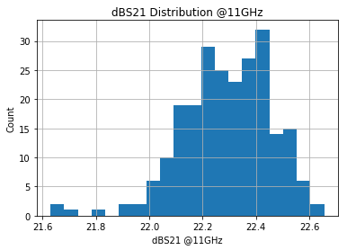
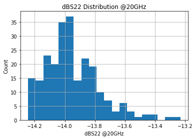

# Plotting S-parameter Distributions with Matplotlib


```python
import csv
import string
import numpy
import pandas as pd
import matplotlib.pyplot as plt
```

# 1804A Data


```python
df = pd.read_csv('docs/F123019_1_B18U01_BST1804A_S_full.csv', delimiter='\;')
df = df.drop(['XAdress', 'YAdress', 'PhS11', 'dBS12', 'PhS12', 'PhS21', 'PhS22', 'Unnamed: 11'], axis=1).dropna()
df.head()
```

    /Users/rakeshbhatia/anaconda/lib/python3.6/site-packages/ipykernel_launcher.py:1: ParserWarning: Falling back to the 'python' engine because the 'c' engine does not support regex separators (separators > 1 char and different from '\s+' are interpreted as regex); you can avoid this warning by specifying engine='python'.
      """Entry point for launching an IPython kernel.


<div>
<style scoped>
    .dataframe tbody tr th:only-of-type {
        vertical-align: middle;
    }

    .dataframe tbody tr th {
        vertical-align: top;
    }

    .dataframe thead th {
        text-align: right;
    }
</style>
<table border="1" class="dataframe">
  <thead>
    <tr style="text-align: right;">
      <th></th>
      <th>Freq</th>
      <th>dBS11</th>
      <th>dBS21</th>
      <th>dBS22</th>
    </tr>
  </thead>
  <tbody>
    <tr>
      <th>0</th>
      <td>0.1</td>
      <td>-5.376231</td>
      <td>8.581573</td>
      <td>-1.337611</td>
    </tr>
    <tr>
      <th>1</th>
      <td>0.2</td>
      <td>-9.890681</td>
      <td>13.300380</td>
      <td>-4.357149</td>
    </tr>
    <tr>
      <th>2</th>
      <td>0.3</td>
      <td>-11.544020</td>
      <td>15.064870</td>
      <td>-7.260980</td>
    </tr>
    <tr>
      <th>3</th>
      <td>0.4</td>
      <td>-13.141930</td>
      <td>16.082660</td>
      <td>-9.876349</td>
    </tr>
    <tr>
      <th>4</th>
      <td>0.5</td>
      <td>-14.926210</td>
      <td>16.647800</td>
      <td>-11.990410</td>
    </tr>
  </tbody>
</table>
</div>


```python
print(df.dtypes)
```

    Freq     float64
    dBS11    float64
    dBS21    float64
    dBS22    float64
    dtype: object


## Extract 0.5GHz Data


```python
# Extract only the data for Freq = 0.5
df1 = df.loc[df['Freq'] == 0.5]
df1.head()
```


<div>
<style scoped>
    .dataframe tbody tr th:only-of-type {
        vertical-align: middle;
    }

    .dataframe tbody tr th {
        vertical-align: top;
    }

    .dataframe thead th {
        text-align: right;
    }
</style>
<table border="1" class="dataframe">
  <thead>
    <tr style="text-align: right;">
      <th></th>
      <th>Freq</th>
      <th>dBS11</th>
      <th>dBS21</th>
      <th>dBS22</th>
    </tr>
  </thead>
  <tbody>
    <tr>
      <th>4</th>
      <td>0.5</td>
      <td>-14.92621</td>
      <td>16.64780</td>
      <td>-11.99041</td>
    </tr>
    <tr>
      <th>404</th>
      <td>0.5</td>
      <td>-14.97190</td>
      <td>16.74654</td>
      <td>-11.86176</td>
    </tr>
    <tr>
      <th>804</th>
      <td>0.5</td>
      <td>-14.95612</td>
      <td>16.69878</td>
      <td>-11.91722</td>
    </tr>
    <tr>
      <th>1204</th>
      <td>0.5</td>
      <td>-14.22709</td>
      <td>16.38852</td>
      <td>-11.07036</td>
    </tr>
    <tr>
      <th>1604</th>
      <td>0.5</td>
      <td>-14.96282</td>
      <td>16.70663</td>
      <td>-11.84028</td>
    </tr>
  </tbody>
</table>
</div>


## dBS11 Distribution (0.5GHz)


```python
# Plot dBS11 distribution at 0.5GHz
df1.dBS11.hist(bins=20)
plt.title('dBS11 Distribution @0.5GHz')
plt.xlabel('dBS11 @0.5GHz')
plt.ylabel('Count')
plt.show()
```


    

    


## dBS21 Distribution (0.5GHz)


```python
# Plot dBS21 distribution at 0.5GHz
df1.dBS21.hist(bins=20)
plt.title('dBS11 Distribution @0.5GHz')
plt.xlabel('dBS11 @0.5GHz')
plt.ylabel('Count')
plt.show()
```


    

    


## dBS22 Distribution (0.5GHz)


```python
# Plot dBS22 distribution at 0.5GHz
df1.dBS22.hist(bins=20)
plt.title('dBS11 Distribution @0.5GHz')
plt.xlabel('dBS11 @0.5GHz')
plt.ylabel('Count')
plt.show()
```


    

    


## Key Statistics (Freq=0.5GHz)


```python
df1.describe()
```


<div>
<style scoped>
    .dataframe tbody tr th:only-of-type {
        vertical-align: middle;
    }

    .dataframe tbody tr th {
        vertical-align: top;
    }

    .dataframe thead th {
        text-align: right;
    }
</style>
<table border="1" class="dataframe">
  <thead>
    <tr style="text-align: right;">
      <th></th>
      <th>Freq</th>
      <th>dBS11</th>
      <th>dBS21</th>
      <th>dBS22</th>
    </tr>
  </thead>
  <tbody>
    <tr>
      <th>count</th>
      <td>199.0</td>
      <td>199.000000</td>
      <td>199.000000</td>
      <td>199.000000</td>
    </tr>
    <tr>
      <th>mean</th>
      <td>0.5</td>
      <td>-14.903008</td>
      <td>16.537706</td>
      <td>-11.794446</td>
    </tr>
    <tr>
      <th>std</th>
      <td>0.0</td>
      <td>0.205054</td>
      <td>0.095247</td>
      <td>0.186803</td>
    </tr>
    <tr>
      <th>min</th>
      <td>0.5</td>
      <td>-15.368250</td>
      <td>16.360120</td>
      <td>-12.204510</td>
    </tr>
    <tr>
      <th>25%</th>
      <td>0.5</td>
      <td>-15.068910</td>
      <td>16.469755</td>
      <td>-11.950350</td>
    </tr>
    <tr>
      <th>50%</th>
      <td>0.5</td>
      <td>-14.903110</td>
      <td>16.532240</td>
      <td>-11.787360</td>
    </tr>
    <tr>
      <th>75%</th>
      <td>0.5</td>
      <td>-14.750420</td>
      <td>16.607040</td>
      <td>-11.627005</td>
    </tr>
    <tr>
      <th>max</th>
      <td>0.5</td>
      <td>-14.227090</td>
      <td>16.750850</td>
      <td>-11.070360</td>
    </tr>
  </tbody>
</table>
</div>


## Extract 6GHz Data


```python
# Extract only the data for Freq = 6
df2 = df.loc[df['Freq'] == 6]
df2.head()
```


<div>
<style scoped>
    .dataframe tbody tr th:only-of-type {
        vertical-align: middle;
    }

    .dataframe tbody tr th {
        vertical-align: top;
    }

    .dataframe thead th {
        text-align: right;
    }
</style>
<table border="1" class="dataframe">
  <thead>
    <tr style="text-align: right;">
      <th></th>
      <th>Freq</th>
      <th>dBS11</th>
      <th>dBS21</th>
      <th>dBS22</th>
    </tr>
  </thead>
  <tbody>
    <tr>
      <th>59</th>
      <td>6.0</td>
      <td>-10.028930</td>
      <td>16.62984</td>
      <td>-12.40061</td>
    </tr>
    <tr>
      <th>459</th>
      <td>6.0</td>
      <td>-10.172090</td>
      <td>16.72707</td>
      <td>-12.06172</td>
    </tr>
    <tr>
      <th>859</th>
      <td>6.0</td>
      <td>-10.108140</td>
      <td>16.67642</td>
      <td>-12.20471</td>
    </tr>
    <tr>
      <th>1259</th>
      <td>6.0</td>
      <td>-8.866876</td>
      <td>15.76777</td>
      <td>-15.91539</td>
    </tr>
    <tr>
      <th>1659</th>
      <td>6.0</td>
      <td>-10.150780</td>
      <td>16.67780</td>
      <td>-12.19041</td>
    </tr>
  </tbody>
</table>
</div>


## dBS11 Distribution (6GHz)


```python
# Plot dBS11 distribution at 6GHz
df2.dBS11.hist(bins=20)
plt.title('dBS11 Distribution @6GHz')
plt.xlabel('dBS11 @6GHz')
plt.ylabel('Count')
plt.show()
```


    

    


## dBS21 Distribution (6GHz)


```python
# Plot dBS21 distribution at 6GHz
df2.dBS21.hist(bins=20)
plt.title('dBS21 Distribution @6GHz')
plt.xlabel('dBS21 @6GHz')
plt.ylabel('Count')
plt.show()
```


    

    


## dBS22 Distribution (6GHz)


```python
# Plot dBS22 distribution at 6GHz
df2.dBS22.hist(bins=20)
plt.title('dBS22 Distribution @6GHz')
plt.xlabel('dBS22 @6GHz')
plt.ylabel('Count')
plt.show()
```


    

    


## Key Statistics (Freq=6GHz)


```python
df2.describe()
```


<div>
<style scoped>
    .dataframe tbody tr th:only-of-type {
        vertical-align: middle;
    }

    .dataframe tbody tr th {
        vertical-align: top;
    }

    .dataframe thead th {
        text-align: right;
    }
</style>
<table border="1" class="dataframe">
  <thead>
    <tr style="text-align: right;">
      <th></th>
      <th>Freq</th>
      <th>dBS11</th>
      <th>dBS21</th>
      <th>dBS22</th>
    </tr>
  </thead>
  <tbody>
    <tr>
      <th>count</th>
      <td>199.0</td>
      <td>199.000000</td>
      <td>199.000000</td>
      <td>199.000000</td>
    </tr>
    <tr>
      <th>mean</th>
      <td>6.0</td>
      <td>-10.223419</td>
      <td>16.565023</td>
      <td>-12.234007</td>
    </tr>
    <tr>
      <th>std</th>
      <td>0.0</td>
      <td>0.160035</td>
      <td>0.092270</td>
      <td>0.308394</td>
    </tr>
    <tr>
      <th>min</th>
      <td>6.0</td>
      <td>-10.489480</td>
      <td>15.767770</td>
      <td>-15.915390</td>
    </tr>
    <tr>
      <th>25%</th>
      <td>6.0</td>
      <td>-10.330915</td>
      <td>16.503145</td>
      <td>-12.325785</td>
    </tr>
    <tr>
      <th>50%</th>
      <td>6.0</td>
      <td>-10.217370</td>
      <td>16.563700</td>
      <td>-12.212220</td>
    </tr>
    <tr>
      <th>75%</th>
      <td>6.0</td>
      <td>-10.139460</td>
      <td>16.633205</td>
      <td>-12.093165</td>
    </tr>
    <tr>
      <th>max</th>
      <td>6.0</td>
      <td>-8.866876</td>
      <td>16.727920</td>
      <td>-11.880080</td>
    </tr>
  </tbody>
</table>
</div>


## Extract 9GHz Data


```python
# Extract only the data for Freq = 9
df3 = df.loc[df['Freq'] == 8.999999]
df3.head()
```


<div>
<style scoped>
    .dataframe tbody tr th:only-of-type {
        vertical-align: middle;
    }

    .dataframe tbody tr th {
        vertical-align: top;
    }

    .dataframe thead th {
        text-align: right;
    }
</style>
<table border="1" class="dataframe">
  <thead>
    <tr style="text-align: right;">
      <th></th>
      <th>Freq</th>
      <th>dBS11</th>
      <th>dBS21</th>
      <th>dBS22</th>
    </tr>
  </thead>
  <tbody>
    <tr>
      <th>89</th>
      <td>8.999999</td>
      <td>-12.405270</td>
      <td>17.76468</td>
      <td>-10.140230</td>
    </tr>
    <tr>
      <th>489</th>
      <td>8.999999</td>
      <td>-12.667990</td>
      <td>17.85854</td>
      <td>-9.749912</td>
    </tr>
    <tr>
      <th>889</th>
      <td>8.999999</td>
      <td>-12.583610</td>
      <td>17.79932</td>
      <td>-9.957961</td>
    </tr>
    <tr>
      <th>1289</th>
      <td>8.999999</td>
      <td>-9.918789</td>
      <td>15.61766</td>
      <td>-9.632690</td>
    </tr>
    <tr>
      <th>1689</th>
      <td>8.999999</td>
      <td>-12.679570</td>
      <td>17.79396</td>
      <td>-9.940454</td>
    </tr>
  </tbody>
</table>
</div>


## dBS11 Distribution (9GHz)


```python
# Plot dBS11 distribution at 9GHz
df3.dBS11.hist(bins=20)
plt.title('dBS11 Distribution @9GHz')
plt.xlabel('dBS11 @9GHz')
plt.ylabel('Count')
plt.show()
```


    

    


## dBS21 Distribution (9GHz)


```python
# Plot dBS21 distribution at 9GHz
df3.dBS21.hist(bins=20)
plt.title('dBS21 Distribution @9GHz')
plt.xlabel('dBS21 @9GHz')
plt.ylabel('Count')
plt.show()
```


    

    


## dBS22 Distribution (9GHz)


```python
# Plot dBS22 distribution at 9GHz
df3.dBS22.hist(bins=20)
plt.title('dBS22 Distribution @9GHz')
plt.xlabel('dBS22 @9GHz')
plt.ylabel('Count')
plt.show()
```


    

    


## Key Statistics (Freq=9GHz)


```python
df3.describe()
```


<div>
<style scoped>
    .dataframe tbody tr th:only-of-type {
        vertical-align: middle;
    }

    .dataframe tbody tr th {
        vertical-align: top;
    }

    .dataframe thead th {
        text-align: right;
    }
</style>
<table border="1" class="dataframe">
  <thead>
    <tr style="text-align: right;">
      <th></th>
      <th>Freq</th>
      <th>dBS11</th>
      <th>dBS21</th>
      <th>dBS22</th>
    </tr>
  </thead>
  <tbody>
    <tr>
      <th>count</th>
      <td>1.990000e+02</td>
      <td>199.000000</td>
      <td>199.000000</td>
      <td>199.000000</td>
    </tr>
    <tr>
      <th>mean</th>
      <td>8.999999e+00</td>
      <td>-12.843033</td>
      <td>17.688722</td>
      <td>-9.964045</td>
    </tr>
    <tr>
      <th>std</th>
      <td>4.808260e-14</td>
      <td>0.313067</td>
      <td>0.167220</td>
      <td>0.174764</td>
    </tr>
    <tr>
      <th>min</th>
      <td>8.999999e+00</td>
      <td>-13.395430</td>
      <td>15.617660</td>
      <td>-10.550280</td>
    </tr>
    <tr>
      <th>25%</th>
      <td>8.999999e+00</td>
      <td>-13.033625</td>
      <td>17.626765</td>
      <td>-10.073505</td>
    </tr>
    <tr>
      <th>50%</th>
      <td>8.999999e+00</td>
      <td>-12.859720</td>
      <td>17.689670</td>
      <td>-9.957961</td>
    </tr>
    <tr>
      <th>75%</th>
      <td>8.999999e+00</td>
      <td>-12.677935</td>
      <td>17.766700</td>
      <td>-9.832948</td>
    </tr>
    <tr>
      <th>max</th>
      <td>8.999999e+00</td>
      <td>-9.918789</td>
      <td>17.893070</td>
      <td>-9.560314</td>
    </tr>
  </tbody>
</table>
</div>


## Extract 12GHz Data


```python
# Extract only the data for Freq = 12
df4 = df.loc[df['Freq'] == 12]
df4.head()
```


<div>
<style scoped>
    .dataframe tbody tr th:only-of-type {
        vertical-align: middle;
    }

    .dataframe tbody tr th {
        vertical-align: top;
    }

    .dataframe thead th {
        text-align: right;
    }
</style>
<table border="1" class="dataframe">
  <thead>
    <tr style="text-align: right;">
      <th></th>
      <th>Freq</th>
      <th>dBS11</th>
      <th>dBS21</th>
      <th>dBS22</th>
    </tr>
  </thead>
  <tbody>
    <tr>
      <th>119</th>
      <td>12.0</td>
      <td>-15.55967</td>
      <td>18.76574</td>
      <td>-12.81076</td>
    </tr>
    <tr>
      <th>519</th>
      <td>12.0</td>
      <td>-15.74340</td>
      <td>18.89939</td>
      <td>-12.07408</td>
    </tr>
    <tr>
      <th>919</th>
      <td>12.0</td>
      <td>-15.66154</td>
      <td>18.80135</td>
      <td>-12.53445</td>
    </tr>
    <tr>
      <th>1319</th>
      <td>12.0</td>
      <td>-11.50371</td>
      <td>16.58876</td>
      <td>-11.76039</td>
    </tr>
    <tr>
      <th>1719</th>
      <td>12.0</td>
      <td>-15.93970</td>
      <td>18.79905</td>
      <td>-12.49742</td>
    </tr>
  </tbody>
</table>
</div>


## dBS11 Distribution (12GHz)


```python
# Plot dBS11 distribution at 12GHz
df4.dBS11.hist(bins=20)
plt.title('dBS11 Distribution @12GHz')
plt.xlabel('dBS11 @12GHz')
plt.ylabel('Count')
plt.show()
```


    

    


## dBS21 Distribution (12GHz)


```python
# Plot dBS21 distribution at 12GHz
df4.dBS21.hist(bins=20)
plt.title('dBS21 Distribution @12GHz')
plt.xlabel('dBS21 @12GHz')
plt.ylabel('Count')
plt.show()
```


    

    


## dBS22 Distribution (12GHz)


```python
# Plot dBS22 distribution at 12GHz
df4.dBS22.hist(bins=20)
plt.title('dBS22 Distribution @12GHz')
plt.xlabel('dBS22 @12GHz')
plt.ylabel('Count')
plt.show()
```


    

    


## Key Statistics (Freq=12GHz)


```python
df4.describe()
```


<div>
<style scoped>
    .dataframe tbody tr th:only-of-type {
        vertical-align: middle;
    }

    .dataframe tbody tr th {
        vertical-align: top;
    }

    .dataframe thead th {
        text-align: right;
    }
</style>
<table border="1" class="dataframe">
  <thead>
    <tr style="text-align: right;">
      <th></th>
      <th>Freq</th>
      <th>dBS11</th>
      <th>dBS21</th>
      <th>dBS22</th>
    </tr>
  </thead>
  <tbody>
    <tr>
      <th>count</th>
      <td>199.0</td>
      <td>199.000000</td>
      <td>199.000000</td>
      <td>199.000000</td>
    </tr>
    <tr>
      <th>mean</th>
      <td>12.0</td>
      <td>-16.930138</td>
      <td>18.736482</td>
      <td>-12.274029</td>
    </tr>
    <tr>
      <th>std</th>
      <td>0.0</td>
      <td>0.875090</td>
      <td>0.176905</td>
      <td>0.383991</td>
    </tr>
    <tr>
      <th>min</th>
      <td>12.0</td>
      <td>-18.389850</td>
      <td>16.588760</td>
      <td>-13.476270</td>
    </tr>
    <tr>
      <th>25%</th>
      <td>12.0</td>
      <td>-17.531805</td>
      <td>18.674630</td>
      <td>-12.534845</td>
    </tr>
    <tr>
      <th>50%</th>
      <td>12.0</td>
      <td>-17.092180</td>
      <td>18.735490</td>
      <td>-12.263640</td>
    </tr>
    <tr>
      <th>75%</th>
      <td>12.0</td>
      <td>-16.350115</td>
      <td>18.809190</td>
      <td>-11.972370</td>
    </tr>
    <tr>
      <th>max</th>
      <td>12.0</td>
      <td>-11.503710</td>
      <td>19.004470</td>
      <td>-11.433090</td>
    </tr>
  </tbody>
</table>
</div>


## Extract 14GHz Data


```python
# Extract only the data for Freq = 14
df5 = df.loc[df['Freq'] == 14]
df5.head()
```


<div>
<style scoped>
    .dataframe tbody tr th:only-of-type {
        vertical-align: middle;
    }

    .dataframe tbody tr th {
        vertical-align: top;
    }

    .dataframe thead th {
        text-align: right;
    }
</style>
<table border="1" class="dataframe">
  <thead>
    <tr style="text-align: right;">
      <th></th>
      <th>Freq</th>
      <th>dBS11</th>
      <th>dBS21</th>
      <th>dBS22</th>
    </tr>
  </thead>
  <tbody>
    <tr>
      <th>139</th>
      <td>14.0</td>
      <td>-8.474581</td>
      <td>18.28153</td>
      <td>-13.63084</td>
    </tr>
    <tr>
      <th>539</th>
      <td>14.0</td>
      <td>-8.510300</td>
      <td>18.44825</td>
      <td>-12.29914</td>
    </tr>
    <tr>
      <th>939</th>
      <td>14.0</td>
      <td>-8.452004</td>
      <td>18.27976</td>
      <td>-12.87179</td>
    </tr>
    <tr>
      <th>1339</th>
      <td>14.0</td>
      <td>-10.108590</td>
      <td>17.75542</td>
      <td>-17.95431</td>
    </tr>
    <tr>
      <th>1739</th>
      <td>14.0</td>
      <td>-8.592101</td>
      <td>18.28519</td>
      <td>-12.85863</td>
    </tr>
  </tbody>
</table>
</div>


## dBS11 Distribution (14GHz)


```python
# Plot dBS11 distribution at 14GHz
df5.dBS11.hist(bins=20)
plt.title('dBS11 Distribution @14GHz')
plt.xlabel('dBS11 @14GHz')
plt.ylabel('Count')
plt.show()
```


    

    


## dBS21 Distribution (14GHz)


```python
# Plot dBS21 distribution at 14GHz
df5.dBS21.hist(bins=20)
plt.title('dBS21 Distribution @14GHz')
plt.xlabel('dBS21 @14GHz')
plt.ylabel('Count')
plt.show()
```


    

    


## dBS22 Distribution (14GHz)


```python
# Plot dBS22 distribution at 14GHz
df5.dBS22.hist(bins=20)
plt.title('dBS22 Distribution @14GHz')
plt.xlabel('dBS22 @14GHz')
plt.ylabel('Count')
plt.show()
```


    

    


## Key Statistics (Freq=14GHz)


```python
df5.describe()
```


<div>
<style scoped>
    .dataframe tbody tr th:only-of-type {
        vertical-align: middle;
    }

    .dataframe tbody tr th {
        vertical-align: top;
    }

    .dataframe thead th {
        text-align: right;
    }
</style>
<table border="1" class="dataframe">
  <thead>
    <tr style="text-align: right;">
      <th></th>
      <th>Freq</th>
      <th>dBS11</th>
      <th>dBS21</th>
      <th>dBS22</th>
    </tr>
  </thead>
  <tbody>
    <tr>
      <th>count</th>
      <td>199.0</td>
      <td>199.000000</td>
      <td>199.000000</td>
      <td>199.000000</td>
    </tr>
    <tr>
      <th>mean</th>
      <td>14.0</td>
      <td>-9.159178</td>
      <td>18.410712</td>
      <td>-13.184445</td>
    </tr>
    <tr>
      <th>std</th>
      <td>0.0</td>
      <td>0.493677</td>
      <td>0.144272</td>
      <td>0.662660</td>
    </tr>
    <tr>
      <th>min</th>
      <td>14.0</td>
      <td>-10.144590</td>
      <td>17.755420</td>
      <td>-17.954310</td>
    </tr>
    <tr>
      <th>25%</th>
      <td>14.0</td>
      <td>-9.534648</td>
      <td>18.323560</td>
      <td>-13.401830</td>
    </tr>
    <tr>
      <th>50%</th>
      <td>14.0</td>
      <td>-9.264850</td>
      <td>18.414970</td>
      <td>-13.055440</td>
    </tr>
    <tr>
      <th>75%</th>
      <td>14.0</td>
      <td>-8.805143</td>
      <td>18.504870</td>
      <td>-12.863730</td>
    </tr>
    <tr>
      <th>max</th>
      <td>14.0</td>
      <td>-7.844082</td>
      <td>18.755250</td>
      <td>-11.882130</td>
    </tr>
  </tbody>
</table>
</div>


# 1805A Data


```python
df = pd.read_csv('docs/F123019_1_B18U01_BST1805A_S_full.csv', delimiter='\;')
df = df.drop(['XAdress', 'YAdress', 'PhS11', 'dBS12', 'PhS12', 'PhS21', 'PhS22', 'Unnamed: 11'], axis=1).dropna()
df.head()
```

    /Users/rakeshbhatia/anaconda/lib/python3.6/site-packages/ipykernel_launcher.py:1: ParserWarning: Falling back to the 'python' engine because the 'c' engine does not support regex separators (separators > 1 char and different from '\s+' are interpreted as regex); you can avoid this warning by specifying engine='python'.
      """Entry point for launching an IPython kernel.


<div>
<style scoped>
    .dataframe tbody tr th:only-of-type {
        vertical-align: middle;
    }

    .dataframe tbody tr th {
        vertical-align: top;
    }

    .dataframe thead th {
        text-align: right;
    }
</style>
<table border="1" class="dataframe">
  <thead>
    <tr style="text-align: right;">
      <th></th>
      <th>Freq</th>
      <th>dBS11</th>
      <th>dBS21</th>
      <th>dBS22</th>
    </tr>
  </thead>
  <tbody>
    <tr>
      <th>0</th>
      <td>0.1</td>
      <td>0.010573</td>
      <td>-76.08674</td>
      <td>-0.013744</td>
    </tr>
    <tr>
      <th>1</th>
      <td>0.2</td>
      <td>-0.020535</td>
      <td>-69.14332</td>
      <td>-0.098646</td>
    </tr>
    <tr>
      <th>2</th>
      <td>0.3</td>
      <td>-0.009909</td>
      <td>-63.57820</td>
      <td>-0.185163</td>
    </tr>
    <tr>
      <th>3</th>
      <td>0.4</td>
      <td>-0.045886</td>
      <td>-58.17558</td>
      <td>-0.292580</td>
    </tr>
    <tr>
      <th>4</th>
      <td>0.5</td>
      <td>-0.071007</td>
      <td>-50.92647</td>
      <td>-0.416192</td>
    </tr>
  </tbody>
</table>
</div>


```python
print(df.dtypes)
```

    Freq     float64
    dBS11    float64
    dBS21    float64
    dBS22    float64
    dtype: object


## Extract 5GHz Data


```python
# Extract only the data for Freq = 5
df1 = df.loc[df['Freq'] == 5]
df1.head()
```


<div>
<style scoped>
    .dataframe tbody tr th:only-of-type {
        vertical-align: middle;
    }

    .dataframe tbody tr th {
        vertical-align: top;
    }

    .dataframe thead th {
        text-align: right;
    }
</style>
<table border="1" class="dataframe">
  <thead>
    <tr style="text-align: right;">
      <th></th>
      <th>Freq</th>
      <th>dBS11</th>
      <th>dBS21</th>
      <th>dBS22</th>
    </tr>
  </thead>
  <tbody>
    <tr>
      <th>49</th>
      <td>5.0</td>
      <td>-10.42336</td>
      <td>23.61511</td>
      <td>-11.95370</td>
    </tr>
    <tr>
      <th>449</th>
      <td>5.0</td>
      <td>-10.40914</td>
      <td>23.64648</td>
      <td>-12.07714</td>
    </tr>
    <tr>
      <th>849</th>
      <td>5.0</td>
      <td>-10.18221</td>
      <td>23.56678</td>
      <td>-11.93713</td>
    </tr>
    <tr>
      <th>1249</th>
      <td>5.0</td>
      <td>-10.78723</td>
      <td>23.70150</td>
      <td>-12.13950</td>
    </tr>
    <tr>
      <th>1649</th>
      <td>5.0</td>
      <td>-10.49322</td>
      <td>23.59074</td>
      <td>-11.91809</td>
    </tr>
  </tbody>
</table>
</div>


## dBS11 Distribution (5GHz)


```python
# Plot dBS11 distribution at 5GHz
df1.dBS11.hist(bins=20)
plt.title('dBS11 Distribution @5GHz')
plt.xlabel('dBS11 @5GHz')
plt.ylabel('Count')
plt.show()
```


    

    


## dBS21 Distribution (5GHz)


```python
# Plot dBS21 distribution at 5GHz
df1.dBS21.hist(bins=20)
plt.title('dBS21 Distribution @5GHz')
plt.xlabel('dBS21 @5GHz')
plt.ylabel('Count')
plt.show()
```


    

    


## dBS22 Distribution (5GHz)


```python
# Plot dBS22 distribution at 5GHz
df1.dBS22.hist(bins=20)
plt.title('dBS22 Distribution @5GHz')
plt.xlabel('dBS22 @5GHz')
plt.ylabel('Count')
plt.show()
```


    

    


## Key Statistics (Freq=5GHz)


```python
df1.describe()
```


<div>
<style scoped>
    .dataframe tbody tr th:only-of-type {
        vertical-align: middle;
    }

    .dataframe tbody tr th {
        vertical-align: top;
    }

    .dataframe thead th {
        text-align: right;
    }
</style>
<table border="1" class="dataframe">
  <thead>
    <tr style="text-align: right;">
      <th></th>
      <th>Freq</th>
      <th>dBS11</th>
      <th>dBS21</th>
      <th>dBS22</th>
    </tr>
  </thead>
  <tbody>
    <tr>
      <th>count</th>
      <td>235.0</td>
      <td>235.000000</td>
      <td>235.000000</td>
      <td>235.000000</td>
    </tr>
    <tr>
      <th>mean</th>
      <td>5.0</td>
      <td>-10.551063</td>
      <td>23.669021</td>
      <td>-12.054247</td>
    </tr>
    <tr>
      <th>std</th>
      <td>0.0</td>
      <td>0.629894</td>
      <td>0.277857</td>
      <td>0.123789</td>
    </tr>
    <tr>
      <th>min</th>
      <td>5.0</td>
      <td>-11.601430</td>
      <td>20.659760</td>
      <td>-12.329980</td>
    </tr>
    <tr>
      <th>25%</th>
      <td>5.0</td>
      <td>-10.904755</td>
      <td>23.561080</td>
      <td>-12.147175</td>
    </tr>
    <tr>
      <th>50%</th>
      <td>5.0</td>
      <td>-10.595160</td>
      <td>23.680400</td>
      <td>-12.057860</td>
    </tr>
    <tr>
      <th>75%</th>
      <td>5.0</td>
      <td>-10.372880</td>
      <td>23.812605</td>
      <td>-11.973135</td>
    </tr>
    <tr>
      <th>max</th>
      <td>5.0</td>
      <td>-4.644823</td>
      <td>24.090790</td>
      <td>-11.702950</td>
    </tr>
  </tbody>
</table>
</div>


## Extract 7GHz Data


```python
# Extract only the data for Freq = 7
df2 = df.loc[df['Freq'] == 7]
df2.head()
```


<div>
<style scoped>
    .dataframe tbody tr th:only-of-type {
        vertical-align: middle;
    }

    .dataframe tbody tr th {
        vertical-align: top;
    }

    .dataframe thead th {
        text-align: right;
    }
</style>
<table border="1" class="dataframe">
  <thead>
    <tr style="text-align: right;">
      <th></th>
      <th>Freq</th>
      <th>dBS11</th>
      <th>dBS21</th>
      <th>dBS22</th>
    </tr>
  </thead>
  <tbody>
    <tr>
      <th>69</th>
      <td>7.0</td>
      <td>-16.60513</td>
      <td>22.61904</td>
      <td>-13.15295</td>
    </tr>
    <tr>
      <th>469</th>
      <td>7.0</td>
      <td>-16.45434</td>
      <td>22.66301</td>
      <td>-13.46626</td>
    </tr>
    <tr>
      <th>869</th>
      <td>7.0</td>
      <td>-17.16176</td>
      <td>22.70254</td>
      <td>-13.10398</td>
    </tr>
    <tr>
      <th>1269</th>
      <td>7.0</td>
      <td>-16.35508</td>
      <td>22.68294</td>
      <td>-13.74697</td>
    </tr>
    <tr>
      <th>1669</th>
      <td>7.0</td>
      <td>-16.81986</td>
      <td>22.69728</td>
      <td>-13.09944</td>
    </tr>
  </tbody>
</table>
</div>


## dBS11 Distribution (7GHz)


```python
# Plot dBS11 distribution at 7GHz
df2.dBS11.hist(bins=20)
plt.title('dBS11 Distribution @7GHz')
plt.xlabel('dBS11 @7GHz')
plt.ylabel('Count')
plt.show()
```


    

    


## dBS21 Distribution (7GHz)


```python
# Plot dBS21 distribution at 7GHz
df2.dBS21.hist(bins=20)
plt.title('dBS21 Distribution @7GHz')
plt.xlabel('dBS21 @7GHz')
plt.ylabel('Count')
plt.show()
```


    

    


## dBS22 Distribution (7GHz)


```python
# Plot dBS22 distribution at 7GHz
df2.dBS22.hist(bins=20)
plt.title('dBS22 Distribution @7GHz')
plt.xlabel('dBS22 @7GHz')
plt.ylabel('Count')
plt.show()
```


    

    


## Key Statistics (Freq=7GHz)


```python
df2.describe()
```


<div>
<style scoped>
    .dataframe tbody tr th:only-of-type {
        vertical-align: middle;
    }

    .dataframe tbody tr th {
        vertical-align: top;
    }

    .dataframe thead th {
        text-align: right;
    }
</style>
<table border="1" class="dataframe">
  <thead>
    <tr style="text-align: right;">
      <th></th>
      <th>Freq</th>
      <th>dBS11</th>
      <th>dBS21</th>
      <th>dBS22</th>
    </tr>
  </thead>
  <tbody>
    <tr>
      <th>count</th>
      <td>235.0</td>
      <td>235.000000</td>
      <td>235.000000</td>
      <td>235.000000</td>
    </tr>
    <tr>
      <th>mean</th>
      <td>7.0</td>
      <td>-17.309036</td>
      <td>22.761961</td>
      <td>-13.644450</td>
    </tr>
    <tr>
      <th>std</th>
      <td>0.0</td>
      <td>0.622652</td>
      <td>0.178806</td>
      <td>0.471827</td>
    </tr>
    <tr>
      <th>min</th>
      <td>7.0</td>
      <td>-19.906880</td>
      <td>21.828900</td>
      <td>-15.133200</td>
    </tr>
    <tr>
      <th>25%</th>
      <td>7.0</td>
      <td>-17.653740</td>
      <td>22.656650</td>
      <td>-13.949530</td>
    </tr>
    <tr>
      <th>50%</th>
      <td>7.0</td>
      <td>-17.303050</td>
      <td>22.771070</td>
      <td>-13.648070</td>
    </tr>
    <tr>
      <th>75%</th>
      <td>7.0</td>
      <td>-16.892930</td>
      <td>22.891935</td>
      <td>-13.379725</td>
    </tr>
    <tr>
      <th>max</th>
      <td>7.0</td>
      <td>-15.784470</td>
      <td>23.117140</td>
      <td>-12.296640</td>
    </tr>
  </tbody>
</table>
</div>


## Extract 11GHz Data


```python
# Extract only the data for Freq = 11
df3 = df.loc[df['Freq'] == 11]
df3.head()
```


<div>
<style scoped>
    .dataframe tbody tr th:only-of-type {
        vertical-align: middle;
    }

    .dataframe tbody tr th {
        vertical-align: top;
    }

    .dataframe thead th {
        text-align: right;
    }
</style>
<table border="1" class="dataframe">
  <thead>
    <tr style="text-align: right;">
      <th></th>
      <th>Freq</th>
      <th>dBS11</th>
      <th>dBS21</th>
      <th>dBS22</th>
    </tr>
  </thead>
  <tbody>
    <tr>
      <th>109</th>
      <td>11.0</td>
      <td>-12.33532</td>
      <td>22.11853</td>
      <td>-16.49619</td>
    </tr>
    <tr>
      <th>509</th>
      <td>11.0</td>
      <td>-12.26973</td>
      <td>22.16444</td>
      <td>-17.07395</td>
    </tr>
    <tr>
      <th>909</th>
      <td>11.0</td>
      <td>-12.22223</td>
      <td>22.26095</td>
      <td>-16.53758</td>
    </tr>
    <tr>
      <th>1309</th>
      <td>11.0</td>
      <td>-12.50065</td>
      <td>22.19628</td>
      <td>-17.62481</td>
    </tr>
    <tr>
      <th>1709</th>
      <td>11.0</td>
      <td>-12.31606</td>
      <td>22.28214</td>
      <td>-16.54425</td>
    </tr>
  </tbody>
</table>
</div>


## dBS11 Distribution (11GHz)


```python
# Plot dBS11 distribution at 11GHz
df3.dBS11.hist(bins=20)
plt.title('dBS11 Distribution @11GHz')
plt.xlabel('dBS11 @11GHz')
plt.ylabel('Count')
plt.show()
```


    

    


## dBS21 Distribution (11GHz)


```python
# Plot dBS21 distribution at 11GHz
df3.dBS21.hist(bins=20)
plt.title('dBS21 Distribution @11GHz')
plt.xlabel('dBS21 @11GHz')
plt.ylabel('Count')
plt.show()
```


    

    


## dBS22 Distribution (11GHz)


```python
# Plot dBS22 distribution at 11GHz
df3.dBS22.hist(bins=20)
plt.title('dBS22 Distribution @11GHz')
plt.xlabel('dBS22 @11GHz')
plt.ylabel('Count')
plt.show()
```


    

    


## Key Statistics (Freq=11GHz)


```python
df3.describe()
```


<div>
<style scoped>
    .dataframe tbody tr th:only-of-type {
        vertical-align: middle;
    }

    .dataframe tbody tr th {
        vertical-align: top;
    }

    .dataframe thead th {
        text-align: right;
    }
</style>
<table border="1" class="dataframe">
  <thead>
    <tr style="text-align: right;">
      <th></th>
      <th>Freq</th>
      <th>dBS11</th>
      <th>dBS21</th>
      <th>dBS22</th>
    </tr>
  </thead>
  <tbody>
    <tr>
      <th>count</th>
      <td>235.0</td>
      <td>235.000000</td>
      <td>235.000000</td>
      <td>235.000000</td>
    </tr>
    <tr>
      <th>mean</th>
      <td>11.0</td>
      <td>-12.532657</td>
      <td>22.291133</td>
      <td>-17.561227</td>
    </tr>
    <tr>
      <th>std</th>
      <td>0.0</td>
      <td>0.244757</td>
      <td>0.170289</td>
      <td>0.886189</td>
    </tr>
    <tr>
      <th>min</th>
      <td>11.0</td>
      <td>-13.881930</td>
      <td>21.629940</td>
      <td>-20.829990</td>
    </tr>
    <tr>
      <th>25%</th>
      <td>11.0</td>
      <td>-12.660305</td>
      <td>22.190090</td>
      <td>-18.128210</td>
    </tr>
    <tr>
      <th>50%</th>
      <td>11.0</td>
      <td>-12.552040</td>
      <td>22.297950</td>
      <td>-17.544260</td>
    </tr>
    <tr>
      <th>75%</th>
      <td>11.0</td>
      <td>-12.412675</td>
      <td>22.414160</td>
      <td>-17.048630</td>
    </tr>
    <tr>
      <th>max</th>
      <td>11.0</td>
      <td>-11.774760</td>
      <td>22.655760</td>
      <td>-15.258520</td>
    </tr>
  </tbody>
</table>
</div>


## Extract 18GHz Data


```python
# Extract only the data for Freq = 18
df4 = df.loc[df['Freq'] == 18]
df4.head()
```


<div>
<style scoped>
    .dataframe tbody tr th:only-of-type {
        vertical-align: middle;
    }

    .dataframe tbody tr th {
        vertical-align: top;
    }

    .dataframe thead th {
        text-align: right;
    }
</style>
<table border="1" class="dataframe">
  <thead>
    <tr style="text-align: right;">
      <th></th>
      <th>Freq</th>
      <th>dBS11</th>
      <th>dBS21</th>
      <th>dBS22</th>
    </tr>
  </thead>
  <tbody>
    <tr>
      <th>179</th>
      <td>18.0</td>
      <td>-32.53231</td>
      <td>20.43977</td>
      <td>-15.92729</td>
    </tr>
    <tr>
      <th>579</th>
      <td>18.0</td>
      <td>-32.15328</td>
      <td>20.41885</td>
      <td>-16.01540</td>
    </tr>
    <tr>
      <th>979</th>
      <td>18.0</td>
      <td>-29.55933</td>
      <td>20.46294</td>
      <td>-16.28956</td>
    </tr>
    <tr>
      <th>1379</th>
      <td>18.0</td>
      <td>-33.73080</td>
      <td>20.32515</td>
      <td>-16.01700</td>
    </tr>
    <tr>
      <th>1779</th>
      <td>18.0</td>
      <td>-29.81385</td>
      <td>20.41036</td>
      <td>-16.23384</td>
    </tr>
  </tbody>
</table>
</div>


## dBS11 Distribution (18GHz)


```python
# Plot dBS11 distribution at 18GHz
df4.dBS11.hist(bins=20)
plt.title('dBS11 Distribution @18GHz')
plt.xlabel('dBS11 @18GHz')
plt.ylabel('Count')
plt.show()
```


    

    


## dBS21 Distribution (18GHz)


```python
# Plot dBS21 distribution at 18GHz
df4.dBS21.hist(bins=20)
plt.title('dBS21 Distribution @18GHz')
plt.xlabel('dBS21 @6GHz')
plt.ylabel('Count')
plt.show()
```


    

    


## dBS22 Distribution (18GHz)


```python
# Plot dBS22 distribution at 18GHz
df4.dBS22.hist(bins=20)
plt.title('dBS22 Distribution @18GHz')
plt.xlabel('dBS22 @6GHz')
plt.ylabel('Count')
plt.show()
```


    

    


## Key Statistics (Freq=18GHz)


```python
df4.describe()
```


<div>
<style scoped>
    .dataframe tbody tr th:only-of-type {
        vertical-align: middle;
    }

    .dataframe tbody tr th {
        vertical-align: top;
    }

    .dataframe thead th {
        text-align: right;
    }
</style>
<table border="1" class="dataframe">
  <thead>
    <tr style="text-align: right;">
      <th></th>
      <th>Freq</th>
      <th>dBS11</th>
      <th>dBS21</th>
      <th>dBS22</th>
    </tr>
  </thead>
  <tbody>
    <tr>
      <th>count</th>
      <td>235.0</td>
      <td>235.000000</td>
      <td>235.000000</td>
      <td>235.000000</td>
    </tr>
    <tr>
      <th>mean</th>
      <td>18.0</td>
      <td>-30.599641</td>
      <td>20.412133</td>
      <td>-16.137362</td>
    </tr>
    <tr>
      <th>std</th>
      <td>0.0</td>
      <td>2.402802</td>
      <td>0.118059</td>
      <td>0.244860</td>
    </tr>
    <tr>
      <th>min</th>
      <td>18.0</td>
      <td>-38.203290</td>
      <td>20.189260</td>
      <td>-16.695290</td>
    </tr>
    <tr>
      <th>25%</th>
      <td>18.0</td>
      <td>-31.991915</td>
      <td>20.330560</td>
      <td>-16.299205</td>
    </tr>
    <tr>
      <th>50%</th>
      <td>18.0</td>
      <td>-30.235330</td>
      <td>20.407730</td>
      <td>-16.158040</td>
    </tr>
    <tr>
      <th>75%</th>
      <td>18.0</td>
      <td>-28.964435</td>
      <td>20.465155</td>
      <td>-16.006095</td>
    </tr>
    <tr>
      <th>max</th>
      <td>18.0</td>
      <td>-20.403410</td>
      <td>20.973560</td>
      <td>-15.344100</td>
    </tr>
  </tbody>
</table>
</div>


## Extract 20GHz Data


```python
# Extract only the data for Freq = 20
df5 = df.loc[df['Freq'] == 20]
df5.head()
```


<div>
<style scoped>
    .dataframe tbody tr th:only-of-type {
        vertical-align: middle;
    }

    .dataframe tbody tr th {
        vertical-align: top;
    }

    .dataframe thead th {
        text-align: right;
    }
</style>
<table border="1" class="dataframe">
  <thead>
    <tr style="text-align: right;">
      <th></th>
      <th>Freq</th>
      <th>dBS11</th>
      <th>dBS21</th>
      <th>dBS22</th>
    </tr>
  </thead>
  <tbody>
    <tr>
      <th>199</th>
      <td>20.0</td>
      <td>-16.92885</td>
      <td>18.76583</td>
      <td>-13.90444</td>
    </tr>
    <tr>
      <th>599</th>
      <td>20.0</td>
      <td>-16.80726</td>
      <td>18.73182</td>
      <td>-13.84491</td>
    </tr>
    <tr>
      <th>999</th>
      <td>20.0</td>
      <td>-16.57510</td>
      <td>18.77656</td>
      <td>-14.09999</td>
    </tr>
    <tr>
      <th>1399</th>
      <td>20.0</td>
      <td>-16.60360</td>
      <td>18.64695</td>
      <td>-13.88561</td>
    </tr>
    <tr>
      <th>1799</th>
      <td>20.0</td>
      <td>-16.17047</td>
      <td>18.70738</td>
      <td>-13.94949</td>
    </tr>
  </tbody>
</table>
</div>


## dBS11 Distribution (20GHz)


```python
# Plot dBS11 distribution at 20GHz
df5.dBS11.hist(bins=20)
plt.title('dBS11 Distribution @20GHz')
plt.xlabel('dBS11 @20GHz')
plt.ylabel('Count')
plt.show()
```


    

    


## dBS21 Distribution (20GHz)


```python
# Plot dBS21 distribution at 20GHz
df5.dBS21.hist(bins=20)
plt.title('dBS21 Distribution @20GHz')
plt.xlabel('dBS21 @20GHz')
plt.ylabel('Count')
plt.show()
```


    

    


## dBS22 Distribution (20GHz)


```python
# Plot dBS22 distribution at 20GHz
df5.dBS22.hist(bins=20)
plt.title('dBS22 Distribution @20GHz')
plt.xlabel('dBS22 @20GHz')
plt.ylabel('Count')
plt.show()
```


    

    


## Key Statistics (Freq=20GHz)


```python
df5.describe()
```


<div>
<style scoped>
    .dataframe tbody tr th:only-of-type {
        vertical-align: middle;
    }

    .dataframe tbody tr th {
        vertical-align: top;
    }

    .dataframe thead th {
        text-align: right;
    }
</style>
<table border="1" class="dataframe">
  <thead>
    <tr style="text-align: right;">
      <th></th>
      <th>Freq</th>
      <th>dBS11</th>
      <th>dBS21</th>
      <th>dBS22</th>
    </tr>
  </thead>
  <tbody>
    <tr>
      <th>count</th>
      <td>235.0</td>
      <td>235.000000</td>
      <td>235.000000</td>
      <td>235.000000</td>
    </tr>
    <tr>
      <th>mean</th>
      <td>20.0</td>
      <td>-16.906550</td>
      <td>18.746694</td>
      <td>-13.947362</td>
    </tr>
    <tr>
      <th>std</th>
      <td>0.0</td>
      <td>0.472049</td>
      <td>0.119102</td>
      <td>0.179936</td>
    </tr>
    <tr>
      <th>min</th>
      <td>20.0</td>
      <td>-18.841970</td>
      <td>18.515630</td>
      <td>-14.244200</td>
    </tr>
    <tr>
      <th>25%</th>
      <td>20.0</td>
      <td>-17.172030</td>
      <td>18.665670</td>
      <td>-14.075910</td>
    </tr>
    <tr>
      <th>50%</th>
      <td>20.0</td>
      <td>-16.889640</td>
      <td>18.735730</td>
      <td>-13.966830</td>
    </tr>
    <tr>
      <th>75%</th>
      <td>20.0</td>
      <td>-16.603455</td>
      <td>18.798750</td>
      <td>-13.843645</td>
    </tr>
    <tr>
      <th>max</th>
      <td>20.0</td>
      <td>-15.846820</td>
      <td>19.333830</td>
      <td>-13.231020</td>
    </tr>
  </tbody>
</table>
</div>


# 1805B Data


```python
df = pd.read_csv('docs/F123019_1_B18U01_BST1805B_S_full.csv', delimiter='\;')
df = df.drop(['XAdress', 'YAdress', 'PhS11', 'dBS12', 'PhS12', 'PhS21', 'PhS22', 'Unnamed: 11'], axis=1).dropna()
df.head()
```

    /Users/rakeshbhatia/anaconda/lib/python3.6/site-packages/ipykernel_launcher.py:1: ParserWarning: Falling back to the 'python' engine because the 'c' engine does not support regex separators (separators > 1 char and different from '\s+' are interpreted as regex); you can avoid this warning by specifying engine='python'.
      """Entry point for launching an IPython kernel.


<div>
<style scoped>
    .dataframe tbody tr th:only-of-type {
        vertical-align: middle;
    }

    .dataframe tbody tr th {
        vertical-align: top;
    }

    .dataframe thead th {
        text-align: right;
    }
</style>
<table border="1" class="dataframe">
  <thead>
    <tr style="text-align: right;">
      <th></th>
      <th>Freq</th>
      <th>dBS11</th>
      <th>dBS21</th>
      <th>dBS22</th>
    </tr>
  </thead>
  <tbody>
    <tr>
      <th>0</th>
      <td>0.1</td>
      <td>-0.010521</td>
      <td>-62.68544</td>
      <td>0.001049</td>
    </tr>
    <tr>
      <th>1</th>
      <td>0.2</td>
      <td>-0.021072</td>
      <td>-70.72228</td>
      <td>-0.084547</td>
    </tr>
    <tr>
      <th>2</th>
      <td>0.3</td>
      <td>-0.015438</td>
      <td>-64.09773</td>
      <td>-0.185811</td>
    </tr>
    <tr>
      <th>3</th>
      <td>0.4</td>
      <td>-0.030365</td>
      <td>-57.71990</td>
      <td>-0.295006</td>
    </tr>
    <tr>
      <th>4</th>
      <td>0.5</td>
      <td>-0.064610</td>
      <td>-50.78907</td>
      <td>-0.420105</td>
    </tr>
  </tbody>
</table>
</div>


```python
print(df.dtypes)
```

    Freq     float64
    dBS11    float64
    dBS21    float64
    dBS22    float64
    dtype: object


## Extract 5GHz Data


```python
# Extract only the data for Freq = 5
df1 = df.loc[df['Freq'] == 5]
df1.head()
```


<div>
<style scoped>
    .dataframe tbody tr th:only-of-type {
        vertical-align: middle;
    }

    .dataframe tbody tr th {
        vertical-align: top;
    }

    .dataframe thead th {
        text-align: right;
    }
</style>
<table border="1" class="dataframe">
  <thead>
    <tr style="text-align: right;">
      <th></th>
      <th>Freq</th>
      <th>dBS11</th>
      <th>dBS21</th>
      <th>dBS22</th>
    </tr>
  </thead>
  <tbody>
    <tr>
      <th>49</th>
      <td>5.0</td>
      <td>-11.07842</td>
      <td>23.67603</td>
      <td>-11.74675</td>
    </tr>
    <tr>
      <th>449</th>
      <td>5.0</td>
      <td>-10.92548</td>
      <td>23.73322</td>
      <td>-11.72783</td>
    </tr>
    <tr>
      <th>849</th>
      <td>5.0</td>
      <td>-11.16697</td>
      <td>23.71796</td>
      <td>-11.73677</td>
    </tr>
    <tr>
      <th>1249</th>
      <td>5.0</td>
      <td>-11.07818</td>
      <td>23.79352</td>
      <td>-11.70459</td>
    </tr>
    <tr>
      <th>1649</th>
      <td>5.0</td>
      <td>-11.19607</td>
      <td>23.74428</td>
      <td>-11.68492</td>
    </tr>
  </tbody>
</table>
</div>


## dBS11 Distribution (5GHz)


```python
# Plot dBS11 distribution at 5GHz
df1.dBS11.hist(bins=20)
plt.title('dBS11 Distribution @5GHz')
plt.xlabel('dBS11 @5GHz')
plt.ylabel('Count')
plt.show()
```


    

    


## dBS21 Distribution (5GHz)


```python
# Plot dBS21 distribution at 5GHz
df1.dBS21.hist(bins=20)
plt.title('dBS11 Distribution @5GHz')
plt.xlabel('dBS11 @5GHz')
plt.ylabel('Count')
plt.show()
```


    

    


## dBS22 Distribution (5GHz)


```python
# Plot dBS22 distribution at 5GHz
df1.dBS22.hist(bins=20)
plt.title('dBS11 Distribution @5GHz')
plt.xlabel('dBS11 @5GHz')
plt.ylabel('Count')
plt.show()
```


    

    


## Key Statistics (Freq=5GHz)


```python
df1.describe()
```


<div>
<style scoped>
    .dataframe tbody tr th:only-of-type {
        vertical-align: middle;
    }

    .dataframe tbody tr th {
        vertical-align: top;
    }

    .dataframe thead th {
        text-align: right;
    }
</style>
<table border="1" class="dataframe">
  <thead>
    <tr style="text-align: right;">
      <th></th>
      <th>Freq</th>
      <th>dBS11</th>
      <th>dBS21</th>
      <th>dBS22</th>
    </tr>
  </thead>
  <tbody>
    <tr>
      <th>count</th>
      <td>295.0</td>
      <td>295.000000</td>
      <td>295.000000</td>
      <td>295.000000</td>
    </tr>
    <tr>
      <th>mean</th>
      <td>5.0</td>
      <td>-11.518385</td>
      <td>23.779997</td>
      <td>-11.597490</td>
    </tr>
    <tr>
      <th>std</th>
      <td>0.0</td>
      <td>0.239181</td>
      <td>0.151274</td>
      <td>0.110049</td>
    </tr>
    <tr>
      <th>min</th>
      <td>5.0</td>
      <td>-12.009660</td>
      <td>23.062440</td>
      <td>-12.042890</td>
    </tr>
    <tr>
      <th>25%</th>
      <td>5.0</td>
      <td>-11.695270</td>
      <td>23.676410</td>
      <td>-11.659265</td>
    </tr>
    <tr>
      <th>50%</th>
      <td>5.0</td>
      <td>-11.550750</td>
      <td>23.793520</td>
      <td>-11.578470</td>
    </tr>
    <tr>
      <th>75%</th>
      <td>5.0</td>
      <td>-11.383740</td>
      <td>23.889265</td>
      <td>-11.516745</td>
    </tr>
    <tr>
      <th>max</th>
      <td>5.0</td>
      <td>-10.802340</td>
      <td>24.152850</td>
      <td>-11.356200</td>
    </tr>
  </tbody>
</table>
</div>


## Extract 7GHz Data


```python
# Extract only the data for Freq = 7
df2 = df.loc[df['Freq'] == 7]
df2.head()
```


<div>
<style scoped>
    .dataframe tbody tr th:only-of-type {
        vertical-align: middle;
    }

    .dataframe tbody tr th {
        vertical-align: top;
    }

    .dataframe thead th {
        text-align: right;
    }
</style>
<table border="1" class="dataframe">
  <thead>
    <tr style="text-align: right;">
      <th></th>
      <th>Freq</th>
      <th>dBS11</th>
      <th>dBS21</th>
      <th>dBS22</th>
    </tr>
  </thead>
  <tbody>
    <tr>
      <th>69</th>
      <td>7.0</td>
      <td>-10.72236</td>
      <td>22.96420</td>
      <td>-16.36640</td>
    </tr>
    <tr>
      <th>469</th>
      <td>7.0</td>
      <td>-10.53478</td>
      <td>23.01464</td>
      <td>-16.51727</td>
    </tr>
    <tr>
      <th>869</th>
      <td>7.0</td>
      <td>-10.73799</td>
      <td>23.04493</td>
      <td>-16.29637</td>
    </tr>
    <tr>
      <th>1269</th>
      <td>7.0</td>
      <td>-10.63710</td>
      <td>23.07998</td>
      <td>-16.64480</td>
    </tr>
    <tr>
      <th>1669</th>
      <td>7.0</td>
      <td>-10.70496</td>
      <td>23.10423</td>
      <td>-16.62696</td>
    </tr>
  </tbody>
</table>
</div>


## dBS11 Distribution (7GHz)


```python
# Plot dBS11 distribution at 7GHz
df2.dBS11.hist(bins=20)
plt.title('dBS11 Distribution @7GHz')
plt.xlabel('dBS11 @7GHz')
plt.ylabel('Count')
plt.show()
```


    

    


## dBS21 Distribution (7GHz)


```python
# Plot dBS21 distribution at 7GHz
df2.dBS21.hist(bins=20)
plt.title('dBS21 Distribution @7GHz')
plt.xlabel('dBS21 @7GHz')
plt.ylabel('Count')
plt.show()
```


    

    


## dBS22 Distribution (7GHz)


```python
# Plot dBS22 distribution at 7GHz
df2.dBS22.hist(bins=20)
plt.title('dBS22 Distribution @7GHz')
plt.xlabel('dBS22 @7GHz')
plt.ylabel('Count')
plt.show()
```


    

    


## Key Statistics (Freq=7GHz)


```python
df2.describe()
```


<div>
<style scoped>
    .dataframe tbody tr th:only-of-type {
        vertical-align: middle;
    }

    .dataframe tbody tr th {
        vertical-align: top;
    }

    .dataframe thead th {
        text-align: right;
    }
</style>
<table border="1" class="dataframe">
  <thead>
    <tr style="text-align: right;">
      <th></th>
      <th>Freq</th>
      <th>dBS11</th>
      <th>dBS21</th>
      <th>dBS22</th>
    </tr>
  </thead>
  <tbody>
    <tr>
      <th>count</th>
      <td>295.0</td>
      <td>295.000000</td>
      <td>295.000000</td>
      <td>295.000000</td>
    </tr>
    <tr>
      <th>mean</th>
      <td>7.0</td>
      <td>-11.005048</td>
      <td>23.111815</td>
      <td>-16.542979</td>
    </tr>
    <tr>
      <th>std</th>
      <td>0.0</td>
      <td>0.219449</td>
      <td>0.152174</td>
      <td>0.301244</td>
    </tr>
    <tr>
      <th>min</th>
      <td>7.0</td>
      <td>-11.692570</td>
      <td>22.442400</td>
      <td>-17.136980</td>
    </tr>
    <tr>
      <th>25%</th>
      <td>7.0</td>
      <td>-11.138315</td>
      <td>23.001080</td>
      <td>-16.786150</td>
    </tr>
    <tr>
      <th>50%</th>
      <td>7.0</td>
      <td>-11.032210</td>
      <td>23.126220</td>
      <td>-16.561240</td>
    </tr>
    <tr>
      <th>75%</th>
      <td>7.0</td>
      <td>-10.883580</td>
      <td>23.224445</td>
      <td>-16.358780</td>
    </tr>
    <tr>
      <th>max</th>
      <td>7.0</td>
      <td>-10.354600</td>
      <td>23.483890</td>
      <td>-15.609760</td>
    </tr>
  </tbody>
</table>
</div>


## Extract 11GHz Data


```python
# Extract only the data for Freq = 6
df3 = df.loc[df['Freq'] == 11]
df3.head()
```


<div>
<style scoped>
    .dataframe tbody tr th:only-of-type {
        vertical-align: middle;
    }

    .dataframe tbody tr th {
        vertical-align: top;
    }

    .dataframe thead th {
        text-align: right;
    }
</style>
<table border="1" class="dataframe">
  <thead>
    <tr style="text-align: right;">
      <th></th>
      <th>Freq</th>
      <th>dBS11</th>
      <th>dBS21</th>
      <th>dBS22</th>
    </tr>
  </thead>
  <tbody>
    <tr>
      <th>109</th>
      <td>11.0</td>
      <td>-17.81669</td>
      <td>23.62515</td>
      <td>-28.44229</td>
    </tr>
    <tr>
      <th>509</th>
      <td>11.0</td>
      <td>-17.75754</td>
      <td>23.68512</td>
      <td>-29.67550</td>
    </tr>
    <tr>
      <th>909</th>
      <td>11.0</td>
      <td>-17.86480</td>
      <td>23.74452</td>
      <td>-28.42763</td>
    </tr>
    <tr>
      <th>1309</th>
      <td>11.0</td>
      <td>-18.14783</td>
      <td>23.73582</td>
      <td>-31.09664</td>
    </tr>
    <tr>
      <th>1709</th>
      <td>11.0</td>
      <td>-18.10816</td>
      <td>23.82677</td>
      <td>-31.44076</td>
    </tr>
  </tbody>
</table>
</div>


## dBS11 Distribution (11GHz)


```python
# Plot dBS11 distribution at 11GHz
df3.dBS11.hist(bins=20)
plt.title('dBS11 Distribution @11GHz')
plt.xlabel('dBS11 @11GHz')
plt.ylabel('Count')
plt.show()
```


    

    


## dBS21 Distribution (11GHz)


```python
# Plot dBS21 distribution at 11GHz
df3.dBS21.hist(bins=20)
plt.title('dBS21 Distribution @11GHz')
plt.xlabel('dBS21 @11GHz')
plt.ylabel('Count')
plt.show()
```


    

    


## dBS22 Distribution (11GHz)


```python
# Plot dBS22 distribution at 11GHz
df3.dBS22.hist(bins=20)
plt.title('dBS22 Distribution @11GHz')
plt.xlabel('dBS22 @11GHz')
plt.ylabel('Count')
plt.show()
```


    

    


## Key Statistics (Freq=11GHz)


```python
df3.describe()
```


<div>
<style scoped>
    .dataframe tbody tr th:only-of-type {
        vertical-align: middle;
    }

    .dataframe tbody tr th {
        vertical-align: top;
    }

    .dataframe thead th {
        text-align: right;
    }
</style>
<table border="1" class="dataframe">
  <thead>
    <tr style="text-align: right;">
      <th></th>
      <th>Freq</th>
      <th>dBS11</th>
      <th>dBS21</th>
      <th>dBS22</th>
    </tr>
  </thead>
  <tbody>
    <tr>
      <th>count</th>
      <td>295.0</td>
      <td>295.000000</td>
      <td>295.000000</td>
      <td>295.000000</td>
    </tr>
    <tr>
      <th>mean</th>
      <td>11.0</td>
      <td>-18.575991</td>
      <td>23.775733</td>
      <td>-32.004279</td>
    </tr>
    <tr>
      <th>std</th>
      <td>0.0</td>
      <td>0.521307</td>
      <td>0.144373</td>
      <td>3.225291</td>
    </tr>
    <tr>
      <th>min</th>
      <td>11.0</td>
      <td>-19.592070</td>
      <td>23.076620</td>
      <td>-38.388420</td>
    </tr>
    <tr>
      <th>25%</th>
      <td>11.0</td>
      <td>-18.943620</td>
      <td>23.673485</td>
      <td>-34.711460</td>
    </tr>
    <tr>
      <th>50%</th>
      <td>11.0</td>
      <td>-18.629620</td>
      <td>23.782870</td>
      <td>-31.811210</td>
    </tr>
    <tr>
      <th>75%</th>
      <td>11.0</td>
      <td>-18.322280</td>
      <td>23.884140</td>
      <td>-29.778345</td>
    </tr>
    <tr>
      <th>max</th>
      <td>11.0</td>
      <td>-16.785870</td>
      <td>24.104350</td>
      <td>-24.049370</td>
    </tr>
  </tbody>
</table>
</div>


## Extract 18GHz Data


```python
# Extract only the data for Freq = 18
df4 = df.loc[df['Freq'] == 18]
df4.head()
```


<div>
<style scoped>
    .dataframe tbody tr th:only-of-type {
        vertical-align: middle;
    }

    .dataframe tbody tr th {
        vertical-align: top;
    }

    .dataframe thead th {
        text-align: right;
    }
</style>
<table border="1" class="dataframe">
  <thead>
    <tr style="text-align: right;">
      <th></th>
      <th>Freq</th>
      <th>dBS11</th>
      <th>dBS21</th>
      <th>dBS22</th>
    </tr>
  </thead>
  <tbody>
    <tr>
      <th>179</th>
      <td>18.0</td>
      <td>-19.81520</td>
      <td>20.80170</td>
      <td>-17.44869</td>
    </tr>
    <tr>
      <th>579</th>
      <td>18.0</td>
      <td>-19.67049</td>
      <td>20.79345</td>
      <td>-17.27973</td>
    </tr>
    <tr>
      <th>979</th>
      <td>18.0</td>
      <td>-19.34783</td>
      <td>20.79048</td>
      <td>-17.65238</td>
    </tr>
    <tr>
      <th>1379</th>
      <td>18.0</td>
      <td>-19.58426</td>
      <td>20.73212</td>
      <td>-17.29170</td>
    </tr>
    <tr>
      <th>1779</th>
      <td>18.0</td>
      <td>-19.29255</td>
      <td>20.76008</td>
      <td>-17.31918</td>
    </tr>
  </tbody>
</table>
</div>


## dBS11 Distribution (18GHz)


```python
# Plot dBS11 distribution at 18GHz
df4.dBS11.hist(bins=20)
plt.title('dBS11 Distribution @18GHz')
plt.xlabel('dBS11 @18GHz')
plt.ylabel('Count')
plt.show()
```


    

    


## dBS21 Distribution (18GHz)


```python
# Plot dBS21 distribution at 18GHz
df4.dBS21.hist(bins=20)
plt.title('dBS21 Distribution @18GHz')
plt.xlabel('dBS21 @6GHz')
plt.ylabel('Count')
plt.show()
```


    

    


## dBS22 Distribution (18GHz)


```python
# Plot dBS22 distribution at 18GHz
df4.dBS22.hist(bins=20)
plt.title('dBS22 Distribution @18GHz')
plt.xlabel('dBS22 @6GHz')
plt.ylabel('Count')
plt.show()
```


    

    


## Key Statistics (Freq=18GHz)


```python
df4.describe()
```


<div>
<style scoped>
    .dataframe tbody tr th:only-of-type {
        vertical-align: middle;
    }

    .dataframe tbody tr th {
        vertical-align: top;
    }

    .dataframe thead th {
        text-align: right;
    }
</style>
<table border="1" class="dataframe">
  <thead>
    <tr style="text-align: right;">
      <th></th>
      <th>Freq</th>
      <th>dBS11</th>
      <th>dBS21</th>
      <th>dBS22</th>
    </tr>
  </thead>
  <tbody>
    <tr>
      <th>count</th>
      <td>295.0</td>
      <td>295.000000</td>
      <td>295.000000</td>
      <td>295.000000</td>
    </tr>
    <tr>
      <th>mean</th>
      <td>18.0</td>
      <td>-19.519634</td>
      <td>20.729409</td>
      <td>-17.237495</td>
    </tr>
    <tr>
      <th>std</th>
      <td>0.0</td>
      <td>0.293053</td>
      <td>0.114558</td>
      <td>0.323519</td>
    </tr>
    <tr>
      <th>min</th>
      <td>18.0</td>
      <td>-20.573310</td>
      <td>20.494880</td>
      <td>-18.029100</td>
    </tr>
    <tr>
      <th>25%</th>
      <td>18.0</td>
      <td>-19.680075</td>
      <td>20.642035</td>
      <td>-17.427095</td>
    </tr>
    <tr>
      <th>50%</th>
      <td>18.0</td>
      <td>-19.503310</td>
      <td>20.712400</td>
      <td>-17.254220</td>
    </tr>
    <tr>
      <th>75%</th>
      <td>18.0</td>
      <td>-19.326670</td>
      <td>20.783380</td>
      <td>-17.038840</td>
    </tr>
    <tr>
      <th>max</th>
      <td>18.0</td>
      <td>-18.908340</td>
      <td>21.189640</td>
      <td>-16.251380</td>
    </tr>
  </tbody>
</table>
</div>


## Extract 20GHz Data


```python
# Extract only the data for Freq = 20
df5 = df.loc[df['Freq'] == 20]
df5.head()
```


<div>
<style scoped>
    .dataframe tbody tr th:only-of-type {
        vertical-align: middle;
    }

    .dataframe tbody tr th {
        vertical-align: top;
    }

    .dataframe thead th {
        text-align: right;
    }
</style>
<table border="1" class="dataframe">
  <thead>
    <tr style="text-align: right;">
      <th></th>
      <th>Freq</th>
      <th>dBS11</th>
      <th>dBS21</th>
      <th>dBS22</th>
    </tr>
  </thead>
  <tbody>
    <tr>
      <th>199</th>
      <td>20.0</td>
      <td>-15.30288</td>
      <td>18.91892</td>
      <td>-12.61518</td>
    </tr>
    <tr>
      <th>599</th>
      <td>20.0</td>
      <td>-15.11921</td>
      <td>18.89940</td>
      <td>-12.51443</td>
    </tr>
    <tr>
      <th>999</th>
      <td>20.0</td>
      <td>-15.01253</td>
      <td>18.89355</td>
      <td>-12.63902</td>
    </tr>
    <tr>
      <th>1399</th>
      <td>20.0</td>
      <td>-15.08008</td>
      <td>18.85737</td>
      <td>-12.51217</td>
    </tr>
    <tr>
      <th>1799</th>
      <td>20.0</td>
      <td>-14.96330</td>
      <td>18.86747</td>
      <td>-12.47076</td>
    </tr>
  </tbody>
</table>
</div>


## dBS11 Distribution (20GHz)


```python
# Plot dBS11 distribution at 20GHz
df5.dBS11.hist(bins=20)
plt.title('dBS11 Distribution @20GHz')
plt.xlabel('dBS11 @20GHz')
plt.ylabel('Count')
plt.show()
```


    

    


## dBS21 Distribution (20GHz)


```python
# Plot dBS21 distribution at 20GHz
df5.dBS21.hist(bins=20)
plt.title('dBS21 Distribution @20GHz')
plt.xlabel('dBS21 @20GHz')
plt.ylabel('Count')
plt.show()
```


    

    


## dBS22 Distribution (20GHz)


```python
# Plot dBS22 distribution at 20GHz
df5.dBS22.hist(bins=20)
plt.title('dBS22 Distribution @20GHz')
plt.xlabel('dBS22 @20GHz')
plt.ylabel('Count')
plt.show()
```


    

    


## Key Statistics (Freq=20GHz)


```python
df5.describe()
```


<div>
<style scoped>
    .dataframe tbody tr th:only-of-type {
        vertical-align: middle;
    }

    .dataframe tbody tr th {
        vertical-align: top;
    }

    .dataframe thead th {
        text-align: right;
    }
</style>
<table border="1" class="dataframe">
  <thead>
    <tr style="text-align: right;">
      <th></th>
      <th>Freq</th>
      <th>dBS11</th>
      <th>dBS21</th>
      <th>dBS22</th>
    </tr>
  </thead>
  <tbody>
    <tr>
      <th>count</th>
      <td>295.0</td>
      <td>295.000000</td>
      <td>295.000000</td>
      <td>295.000000</td>
    </tr>
    <tr>
      <th>mean</th>
      <td>20.0</td>
      <td>-15.250557</td>
      <td>18.854922</td>
      <td>-12.482376</td>
    </tr>
    <tr>
      <th>std</th>
      <td>0.0</td>
      <td>0.315852</td>
      <td>0.109637</td>
      <td>0.212733</td>
    </tr>
    <tr>
      <th>min</th>
      <td>20.0</td>
      <td>-16.296750</td>
      <td>18.624680</td>
      <td>-13.008910</td>
    </tr>
    <tr>
      <th>25%</th>
      <td>20.0</td>
      <td>-15.460500</td>
      <td>18.777085</td>
      <td>-12.621625</td>
    </tr>
    <tr>
      <th>50%</th>
      <td>20.0</td>
      <td>-15.261350</td>
      <td>18.839660</td>
      <td>-12.489760</td>
    </tr>
    <tr>
      <th>75%</th>
      <td>20.0</td>
      <td>-15.025800</td>
      <td>18.908925</td>
      <td>-12.347590</td>
    </tr>
    <tr>
      <th>max</th>
      <td>20.0</td>
      <td>-14.518400</td>
      <td>19.304680</td>
      <td>-11.860950</td>
    </tr>
  </tbody>
</table>
</div>


