# **Analysis of Boston House Prices**

For this drill, we will analyze Boston house-price data from 1978.


```python
from sklearn.model_selection import train_test_split
from sklearn.datasets import load_boston
import numpy as np
import pandas as pd
import scipy
import seaborn as sns
from collections import Counter
from scipy.stats import ttest_ind
import matplotlib.pyplot as plt
import matplotlib.ticker as mtick
%matplotlib inline

boston = load_boston()
data = boston.data
target = boston.target

```


```python
df = pd.DataFrame(boston.data, columns=boston.feature_names)
df['MEDV'] = boston.target
print(df)
```

             CRIM    ZN  INDUS  CHAS    NOX     RM    AGE     DIS   RAD    TAX  \
    0     0.00632  18.0   2.31   0.0  0.538  6.575   65.2  4.0900   1.0  296.0   
    1     0.02731   0.0   7.07   0.0  0.469  6.421   78.9  4.9671   2.0  242.0   
    2     0.02729   0.0   7.07   0.0  0.469  7.185   61.1  4.9671   2.0  242.0   
    3     0.03237   0.0   2.18   0.0  0.458  6.998   45.8  6.0622   3.0  222.0   
    4     0.06905   0.0   2.18   0.0  0.458  7.147   54.2  6.0622   3.0  222.0   
    5     0.02985   0.0   2.18   0.0  0.458  6.430   58.7  6.0622   3.0  222.0   
    6     0.08829  12.5   7.87   0.0  0.524  6.012   66.6  5.5605   5.0  311.0   
    7     0.14455  12.5   7.87   0.0  0.524  6.172   96.1  5.9505   5.0  311.0   
    8     0.21124  12.5   7.87   0.0  0.524  5.631  100.0  6.0821   5.0  311.0   
    9     0.17004  12.5   7.87   0.0  0.524  6.004   85.9  6.5921   5.0  311.0   
    10    0.22489  12.5   7.87   0.0  0.524  6.377   94.3  6.3467   5.0  311.0   
    11    0.11747  12.5   7.87   0.0  0.524  6.009   82.9  6.2267   5.0  311.0   
    12    0.09378  12.5   7.87   0.0  0.524  5.889   39.0  5.4509   5.0  311.0   
    13    0.62976   0.0   8.14   0.0  0.538  5.949   61.8  4.7075   4.0  307.0   
    14    0.63796   0.0   8.14   0.0  0.538  6.096   84.5  4.4619   4.0  307.0   
    15    0.62739   0.0   8.14   0.0  0.538  5.834   56.5  4.4986   4.0  307.0   
    16    1.05393   0.0   8.14   0.0  0.538  5.935   29.3  4.4986   4.0  307.0   
    17    0.78420   0.0   8.14   0.0  0.538  5.990   81.7  4.2579   4.0  307.0   
    18    0.80271   0.0   8.14   0.0  0.538  5.456   36.6  3.7965   4.0  307.0   
    19    0.72580   0.0   8.14   0.0  0.538  5.727   69.5  3.7965   4.0  307.0   
    20    1.25179   0.0   8.14   0.0  0.538  5.570   98.1  3.7979   4.0  307.0   
    21    0.85204   0.0   8.14   0.0  0.538  5.965   89.2  4.0123   4.0  307.0   
    22    1.23247   0.0   8.14   0.0  0.538  6.142   91.7  3.9769   4.0  307.0   
    23    0.98843   0.0   8.14   0.0  0.538  5.813  100.0  4.0952   4.0  307.0   
    24    0.75026   0.0   8.14   0.0  0.538  5.924   94.1  4.3996   4.0  307.0   
    25    0.84054   0.0   8.14   0.0  0.538  5.599   85.7  4.4546   4.0  307.0   
    26    0.67191   0.0   8.14   0.0  0.538  5.813   90.3  4.6820   4.0  307.0   
    27    0.95577   0.0   8.14   0.0  0.538  6.047   88.8  4.4534   4.0  307.0   
    28    0.77299   0.0   8.14   0.0  0.538  6.495   94.4  4.4547   4.0  307.0   
    29    1.00245   0.0   8.14   0.0  0.538  6.674   87.3  4.2390   4.0  307.0   
    ..        ...   ...    ...   ...    ...    ...    ...     ...   ...    ...   
    476   4.87141   0.0  18.10   0.0  0.614  6.484   93.6  2.3053  24.0  666.0   
    477  15.02340   0.0  18.10   0.0  0.614  5.304   97.3  2.1007  24.0  666.0   
    478  10.23300   0.0  18.10   0.0  0.614  6.185   96.7  2.1705  24.0  666.0   
    479  14.33370   0.0  18.10   0.0  0.614  6.229   88.0  1.9512  24.0  666.0   
    480   5.82401   0.0  18.10   0.0  0.532  6.242   64.7  3.4242  24.0  666.0   
    481   5.70818   0.0  18.10   0.0  0.532  6.750   74.9  3.3317  24.0  666.0   
    482   5.73116   0.0  18.10   0.0  0.532  7.061   77.0  3.4106  24.0  666.0   
    483   2.81838   0.0  18.10   0.0  0.532  5.762   40.3  4.0983  24.0  666.0   
    484   2.37857   0.0  18.10   0.0  0.583  5.871   41.9  3.7240  24.0  666.0   
    485   3.67367   0.0  18.10   0.0  0.583  6.312   51.9  3.9917  24.0  666.0   
    486   5.69175   0.0  18.10   0.0  0.583  6.114   79.8  3.5459  24.0  666.0   
    487   4.83567   0.0  18.10   0.0  0.583  5.905   53.2  3.1523  24.0  666.0   
    488   0.15086   0.0  27.74   0.0  0.609  5.454   92.7  1.8209   4.0  711.0   
    489   0.18337   0.0  27.74   0.0  0.609  5.414   98.3  1.7554   4.0  711.0   
    490   0.20746   0.0  27.74   0.0  0.609  5.093   98.0  1.8226   4.0  711.0   
    491   0.10574   0.0  27.74   0.0  0.609  5.983   98.8  1.8681   4.0  711.0   
    492   0.11132   0.0  27.74   0.0  0.609  5.983   83.5  2.1099   4.0  711.0   
    493   0.17331   0.0   9.69   0.0  0.585  5.707   54.0  2.3817   6.0  391.0   
    494   0.27957   0.0   9.69   0.0  0.585  5.926   42.6  2.3817   6.0  391.0   
    495   0.17899   0.0   9.69   0.0  0.585  5.670   28.8  2.7986   6.0  391.0   
    496   0.28960   0.0   9.69   0.0  0.585  5.390   72.9  2.7986   6.0  391.0   
    497   0.26838   0.0   9.69   0.0  0.585  5.794   70.6  2.8927   6.0  391.0   
    498   0.23912   0.0   9.69   0.0  0.585  6.019   65.3  2.4091   6.0  391.0   
    499   0.17783   0.0   9.69   0.0  0.585  5.569   73.5  2.3999   6.0  391.0   
    500   0.22438   0.0   9.69   0.0  0.585  6.027   79.7  2.4982   6.0  391.0   
    501   0.06263   0.0  11.93   0.0  0.573  6.593   69.1  2.4786   1.0  273.0   
    502   0.04527   0.0  11.93   0.0  0.573  6.120   76.7  2.2875   1.0  273.0   
    503   0.06076   0.0  11.93   0.0  0.573  6.976   91.0  2.1675   1.0  273.0   
    504   0.10959   0.0  11.93   0.0  0.573  6.794   89.3  2.3889   1.0  273.0   
    505   0.04741   0.0  11.93   0.0  0.573  6.030   80.8  2.5050   1.0  273.0   
    
         PTRATIO       B  LSTAT  MEDV  
    0       15.3  396.90   4.98  24.0  
    1       17.8  396.90   9.14  21.6  
    2       17.8  392.83   4.03  34.7  
    3       18.7  394.63   2.94  33.4  
    4       18.7  396.90   5.33  36.2  
    5       18.7  394.12   5.21  28.7  
    6       15.2  395.60  12.43  22.9  
    7       15.2  396.90  19.15  27.1  
    8       15.2  386.63  29.93  16.5  
    9       15.2  386.71  17.10  18.9  
    10      15.2  392.52  20.45  15.0  
    11      15.2  396.90  13.27  18.9  
    12      15.2  390.50  15.71  21.7  
    13      21.0  396.90   8.26  20.4  
    14      21.0  380.02  10.26  18.2  
    15      21.0  395.62   8.47  19.9  
    16      21.0  386.85   6.58  23.1  
    17      21.0  386.75  14.67  17.5  
    18      21.0  288.99  11.69  20.2  
    19      21.0  390.95  11.28  18.2  
    20      21.0  376.57  21.02  13.6  
    21      21.0  392.53  13.83  19.6  
    22      21.0  396.90  18.72  15.2  
    23      21.0  394.54  19.88  14.5  
    24      21.0  394.33  16.30  15.6  
    25      21.0  303.42  16.51  13.9  
    26      21.0  376.88  14.81  16.6  
    27      21.0  306.38  17.28  14.8  
    28      21.0  387.94  12.80  18.4  
    29      21.0  380.23  11.98  21.0  
    ..       ...     ...    ...   ...  
    476     20.2  396.21  18.68  16.7  
    477     20.2  349.48  24.91  12.0  
    478     20.2  379.70  18.03  14.6  
    479     20.2  383.32  13.11  21.4  
    480     20.2  396.90  10.74  23.0  
    481     20.2  393.07   7.74  23.7  
    482     20.2  395.28   7.01  25.0  
    483     20.2  392.92  10.42  21.8  
    484     20.2  370.73  13.34  20.6  
    485     20.2  388.62  10.58  21.2  
    486     20.2  392.68  14.98  19.1  
    487     20.2  388.22  11.45  20.6  
    488     20.1  395.09  18.06  15.2  
    489     20.1  344.05  23.97   7.0  
    490     20.1  318.43  29.68   8.1  
    491     20.1  390.11  18.07  13.6  
    492     20.1  396.90  13.35  20.1  
    493     19.2  396.90  12.01  21.8  
    494     19.2  396.90  13.59  24.5  
    495     19.2  393.29  17.60  23.1  
    496     19.2  396.90  21.14  19.7  
    497     19.2  396.90  14.10  18.3  
    498     19.2  396.90  12.92  21.2  
    499     19.2  395.77  15.10  17.5  
    500     19.2  396.90  14.33  16.8  
    501     21.0  391.99   9.67  22.4  
    502     21.0  396.90   9.08  20.6  
    503     21.0  396.90   5.64  23.9  
    504     21.0  393.45   6.48  22.0  
    505     21.0  396.90   7.88  11.9  
    
    [506 rows x 14 columns]


```python
df.head()
```


<div>
<style scoped>
    .dataframe tbody tr th:only-of-type {
        vertical-align: middle;
    }

    .dataframe tbody tr th {
        vertical-align: top;
    }

    .dataframe thead th {
        text-align: right;
    }
</style>
<table border="1" class="dataframe">
  <thead>
    <tr style="text-align: right;">
      <th></th>
      <th>CRIM</th>
      <th>ZN</th>
      <th>INDUS</th>
      <th>CHAS</th>
      <th>NOX</th>
      <th>RM</th>
      <th>AGE</th>
      <th>DIS</th>
      <th>RAD</th>
      <th>TAX</th>
      <th>PTRATIO</th>
      <th>B</th>
      <th>LSTAT</th>
      <th>MEDV</th>
    </tr>
  </thead>
  <tbody>
    <tr>
      <th>0</th>
      <td>0.00632</td>
      <td>18.0</td>
      <td>2.31</td>
      <td>0.0</td>
      <td>0.538</td>
      <td>6.575</td>
      <td>65.2</td>
      <td>4.0900</td>
      <td>1.0</td>
      <td>296.0</td>
      <td>15.3</td>
      <td>396.90</td>
      <td>4.98</td>
      <td>24.0</td>
    </tr>
    <tr>
      <th>1</th>
      <td>0.02731</td>
      <td>0.0</td>
      <td>7.07</td>
      <td>0.0</td>
      <td>0.469</td>
      <td>6.421</td>
      <td>78.9</td>
      <td>4.9671</td>
      <td>2.0</td>
      <td>242.0</td>
      <td>17.8</td>
      <td>396.90</td>
      <td>9.14</td>
      <td>21.6</td>
    </tr>
    <tr>
      <th>2</th>
      <td>0.02729</td>
      <td>0.0</td>
      <td>7.07</td>
      <td>0.0</td>
      <td>0.469</td>
      <td>7.185</td>
      <td>61.1</td>
      <td>4.9671</td>
      <td>2.0</td>
      <td>242.0</td>
      <td>17.8</td>
      <td>392.83</td>
      <td>4.03</td>
      <td>34.7</td>
    </tr>
    <tr>
      <th>3</th>
      <td>0.03237</td>
      <td>0.0</td>
      <td>2.18</td>
      <td>0.0</td>
      <td>0.458</td>
      <td>6.998</td>
      <td>45.8</td>
      <td>6.0622</td>
      <td>3.0</td>
      <td>222.0</td>
      <td>18.7</td>
      <td>394.63</td>
      <td>2.94</td>
      <td>33.4</td>
    </tr>
    <tr>
      <th>4</th>
      <td>0.06905</td>
      <td>0.0</td>
      <td>2.18</td>
      <td>0.0</td>
      <td>0.458</td>
      <td>7.147</td>
      <td>54.2</td>
      <td>6.0622</td>
      <td>3.0</td>
      <td>222.0</td>
      <td>18.7</td>
      <td>396.90</td>
      <td>5.33</td>
      <td>36.2</td>
    </tr>
  </tbody>
</table>
</div>


```python
df.describe()
```


<div>
<style scoped>
    .dataframe tbody tr th:only-of-type {
        vertical-align: middle;
    }

    .dataframe tbody tr th {
        vertical-align: top;
    }

    .dataframe thead th {
        text-align: right;
    }
</style>
<table border="1" class="dataframe">
  <thead>
    <tr style="text-align: right;">
      <th></th>
      <th>CRIM</th>
      <th>ZN</th>
      <th>INDUS</th>
      <th>CHAS</th>
      <th>NOX</th>
      <th>RM</th>
      <th>AGE</th>
      <th>DIS</th>
      <th>RAD</th>
      <th>TAX</th>
      <th>PTRATIO</th>
      <th>B</th>
      <th>LSTAT</th>
      <th>MEDV</th>
    </tr>
  </thead>
  <tbody>
    <tr>
      <th>count</th>
      <td>506.000000</td>
      <td>506.000000</td>
      <td>506.000000</td>
      <td>506.000000</td>
      <td>506.000000</td>
      <td>506.000000</td>
      <td>506.000000</td>
      <td>506.000000</td>
      <td>506.000000</td>
      <td>506.000000</td>
      <td>506.000000</td>
      <td>506.000000</td>
      <td>506.000000</td>
      <td>506.000000</td>
    </tr>
    <tr>
      <th>mean</th>
      <td>3.593761</td>
      <td>11.363636</td>
      <td>11.136779</td>
      <td>0.069170</td>
      <td>0.554695</td>
      <td>6.284634</td>
      <td>68.574901</td>
      <td>3.795043</td>
      <td>9.549407</td>
      <td>408.237154</td>
      <td>18.455534</td>
      <td>356.674032</td>
      <td>12.653063</td>
      <td>22.532806</td>
    </tr>
    <tr>
      <th>std</th>
      <td>8.596783</td>
      <td>23.322453</td>
      <td>6.860353</td>
      <td>0.253994</td>
      <td>0.115878</td>
      <td>0.702617</td>
      <td>28.148861</td>
      <td>2.105710</td>
      <td>8.707259</td>
      <td>168.537116</td>
      <td>2.164946</td>
      <td>91.294864</td>
      <td>7.141062</td>
      <td>9.197104</td>
    </tr>
    <tr>
      <th>min</th>
      <td>0.006320</td>
      <td>0.000000</td>
      <td>0.460000</td>
      <td>0.000000</td>
      <td>0.385000</td>
      <td>3.561000</td>
      <td>2.900000</td>
      <td>1.129600</td>
      <td>1.000000</td>
      <td>187.000000</td>
      <td>12.600000</td>
      <td>0.320000</td>
      <td>1.730000</td>
      <td>5.000000</td>
    </tr>
    <tr>
      <th>25%</th>
      <td>0.082045</td>
      <td>0.000000</td>
      <td>5.190000</td>
      <td>0.000000</td>
      <td>0.449000</td>
      <td>5.885500</td>
      <td>45.025000</td>
      <td>2.100175</td>
      <td>4.000000</td>
      <td>279.000000</td>
      <td>17.400000</td>
      <td>375.377500</td>
      <td>6.950000</td>
      <td>17.025000</td>
    </tr>
    <tr>
      <th>50%</th>
      <td>0.256510</td>
      <td>0.000000</td>
      <td>9.690000</td>
      <td>0.000000</td>
      <td>0.538000</td>
      <td>6.208500</td>
      <td>77.500000</td>
      <td>3.207450</td>
      <td>5.000000</td>
      <td>330.000000</td>
      <td>19.050000</td>
      <td>391.440000</td>
      <td>11.360000</td>
      <td>21.200000</td>
    </tr>
    <tr>
      <th>75%</th>
      <td>3.647423</td>
      <td>12.500000</td>
      <td>18.100000</td>
      <td>0.000000</td>
      <td>0.624000</td>
      <td>6.623500</td>
      <td>94.075000</td>
      <td>5.188425</td>
      <td>24.000000</td>
      <td>666.000000</td>
      <td>20.200000</td>
      <td>396.225000</td>
      <td>16.955000</td>
      <td>25.000000</td>
    </tr>
    <tr>
      <th>max</th>
      <td>88.976200</td>
      <td>100.000000</td>
      <td>27.740000</td>
      <td>1.000000</td>
      <td>0.871000</td>
      <td>8.780000</td>
      <td>100.000000</td>
      <td>12.126500</td>
      <td>24.000000</td>
      <td>711.000000</td>
      <td>22.000000</td>
      <td>396.900000</td>
      <td>37.970000</td>
      <td>50.000000</td>
    </tr>
  </tbody>
</table>
</div>


```python
df.corr(method='pearson')
```


<div>
<style scoped>
    .dataframe tbody tr th:only-of-type {
        vertical-align: middle;
    }

    .dataframe tbody tr th {
        vertical-align: top;
    }

    .dataframe thead th {
        text-align: right;
    }
</style>
<table border="1" class="dataframe">
  <thead>
    <tr style="text-align: right;">
      <th></th>
      <th>CRIM</th>
      <th>ZN</th>
      <th>INDUS</th>
      <th>CHAS</th>
      <th>NOX</th>
      <th>RM</th>
      <th>AGE</th>
      <th>DIS</th>
      <th>RAD</th>
      <th>TAX</th>
      <th>PTRATIO</th>
      <th>B</th>
      <th>LSTAT</th>
      <th>MEDV</th>
    </tr>
  </thead>
  <tbody>
    <tr>
      <th>CRIM</th>
      <td>1.000000</td>
      <td>-0.199458</td>
      <td>0.404471</td>
      <td>-0.055295</td>
      <td>0.417521</td>
      <td>-0.219940</td>
      <td>0.350784</td>
      <td>-0.377904</td>
      <td>0.622029</td>
      <td>0.579564</td>
      <td>0.288250</td>
      <td>-0.377365</td>
      <td>0.452220</td>
      <td>-0.385832</td>
    </tr>
    <tr>
      <th>ZN</th>
      <td>-0.199458</td>
      <td>1.000000</td>
      <td>-0.533828</td>
      <td>-0.042697</td>
      <td>-0.516604</td>
      <td>0.311991</td>
      <td>-0.569537</td>
      <td>0.664408</td>
      <td>-0.311948</td>
      <td>-0.314563</td>
      <td>-0.391679</td>
      <td>0.175520</td>
      <td>-0.412995</td>
      <td>0.360445</td>
    </tr>
    <tr>
      <th>INDUS</th>
      <td>0.404471</td>
      <td>-0.533828</td>
      <td>1.000000</td>
      <td>0.062938</td>
      <td>0.763651</td>
      <td>-0.391676</td>
      <td>0.644779</td>
      <td>-0.708027</td>
      <td>0.595129</td>
      <td>0.720760</td>
      <td>0.383248</td>
      <td>-0.356977</td>
      <td>0.603800</td>
      <td>-0.483725</td>
    </tr>
    <tr>
      <th>CHAS</th>
      <td>-0.055295</td>
      <td>-0.042697</td>
      <td>0.062938</td>
      <td>1.000000</td>
      <td>0.091203</td>
      <td>0.091251</td>
      <td>0.086518</td>
      <td>-0.099176</td>
      <td>-0.007368</td>
      <td>-0.035587</td>
      <td>-0.121515</td>
      <td>0.048788</td>
      <td>-0.053929</td>
      <td>0.175260</td>
    </tr>
    <tr>
      <th>NOX</th>
      <td>0.417521</td>
      <td>-0.516604</td>
      <td>0.763651</td>
      <td>0.091203</td>
      <td>1.000000</td>
      <td>-0.302188</td>
      <td>0.731470</td>
      <td>-0.769230</td>
      <td>0.611441</td>
      <td>0.668023</td>
      <td>0.188933</td>
      <td>-0.380051</td>
      <td>0.590879</td>
      <td>-0.427321</td>
    </tr>
    <tr>
      <th>RM</th>
      <td>-0.219940</td>
      <td>0.311991</td>
      <td>-0.391676</td>
      <td>0.091251</td>
      <td>-0.302188</td>
      <td>1.000000</td>
      <td>-0.240265</td>
      <td>0.205246</td>
      <td>-0.209847</td>
      <td>-0.292048</td>
      <td>-0.355501</td>
      <td>0.128069</td>
      <td>-0.613808</td>
      <td>0.695360</td>
    </tr>
    <tr>
      <th>AGE</th>
      <td>0.350784</td>
      <td>-0.569537</td>
      <td>0.644779</td>
      <td>0.086518</td>
      <td>0.731470</td>
      <td>-0.240265</td>
      <td>1.000000</td>
      <td>-0.747881</td>
      <td>0.456022</td>
      <td>0.506456</td>
      <td>0.261515</td>
      <td>-0.273534</td>
      <td>0.602339</td>
      <td>-0.376955</td>
    </tr>
    <tr>
      <th>DIS</th>
      <td>-0.377904</td>
      <td>0.664408</td>
      <td>-0.708027</td>
      <td>-0.099176</td>
      <td>-0.769230</td>
      <td>0.205246</td>
      <td>-0.747881</td>
      <td>1.000000</td>
      <td>-0.494588</td>
      <td>-0.534432</td>
      <td>-0.232471</td>
      <td>0.291512</td>
      <td>-0.496996</td>
      <td>0.249929</td>
    </tr>
    <tr>
      <th>RAD</th>
      <td>0.622029</td>
      <td>-0.311948</td>
      <td>0.595129</td>
      <td>-0.007368</td>
      <td>0.611441</td>
      <td>-0.209847</td>
      <td>0.456022</td>
      <td>-0.494588</td>
      <td>1.000000</td>
      <td>0.910228</td>
      <td>0.464741</td>
      <td>-0.444413</td>
      <td>0.488676</td>
      <td>-0.381626</td>
    </tr>
    <tr>
      <th>TAX</th>
      <td>0.579564</td>
      <td>-0.314563</td>
      <td>0.720760</td>
      <td>-0.035587</td>
      <td>0.668023</td>
      <td>-0.292048</td>
      <td>0.506456</td>
      <td>-0.534432</td>
      <td>0.910228</td>
      <td>1.000000</td>
      <td>0.460853</td>
      <td>-0.441808</td>
      <td>0.543993</td>
      <td>-0.468536</td>
    </tr>
    <tr>
      <th>PTRATIO</th>
      <td>0.288250</td>
      <td>-0.391679</td>
      <td>0.383248</td>
      <td>-0.121515</td>
      <td>0.188933</td>
      <td>-0.355501</td>
      <td>0.261515</td>
      <td>-0.232471</td>
      <td>0.464741</td>
      <td>0.460853</td>
      <td>1.000000</td>
      <td>-0.177383</td>
      <td>0.374044</td>
      <td>-0.507787</td>
    </tr>
    <tr>
      <th>B</th>
      <td>-0.377365</td>
      <td>0.175520</td>
      <td>-0.356977</td>
      <td>0.048788</td>
      <td>-0.380051</td>
      <td>0.128069</td>
      <td>-0.273534</td>
      <td>0.291512</td>
      <td>-0.444413</td>
      <td>-0.441808</td>
      <td>-0.177383</td>
      <td>1.000000</td>
      <td>-0.366087</td>
      <td>0.333461</td>
    </tr>
    <tr>
      <th>LSTAT</th>
      <td>0.452220</td>
      <td>-0.412995</td>
      <td>0.603800</td>
      <td>-0.053929</td>
      <td>0.590879</td>
      <td>-0.613808</td>
      <td>0.602339</td>
      <td>-0.496996</td>
      <td>0.488676</td>
      <td>0.543993</td>
      <td>0.374044</td>
      <td>-0.366087</td>
      <td>1.000000</td>
      <td>-0.737663</td>
    </tr>
    <tr>
      <th>MEDV</th>
      <td>-0.385832</td>
      <td>0.360445</td>
      <td>-0.483725</td>
      <td>0.175260</td>
      <td>-0.427321</td>
      <td>0.695360</td>
      <td>-0.376955</td>
      <td>0.249929</td>
      <td>-0.381626</td>
      <td>-0.468536</td>
      <td>-0.507787</td>
      <td>0.333461</td>
      <td>-0.737663</td>
      <td>1.000000</td>
    </tr>
  </tbody>
</table>
</div>


```python
#We can plot the diagonal correlation matrix
#Variable pairs that have a strong positive correlation will be bright red
#Variable pairs that have a strong negative correlation will be greenish/blue
corr = df.corr(method='pearson')
mask = np.zeros_like(corr, dtype=np.bool)
mask[np.triu_indices_from(mask)] = True

fig, ax = plt.subplots(figsize=(10, 10))
cmap = sns.diverging_palette(220, 10, as_cmap=True)

sns.heatmap(corr, mask=mask, cmap=cmap, vmax=0.3, center=0,
            square=True, linewidths=0.5, cbar_kws={"shrink":0.5})
```


    <matplotlib.axes._subplots.AxesSubplot at 0x11a27ad30>


    
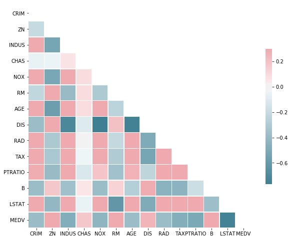
    


```python
correlation_matrix = df.corr().round(2)
sns.heatmap(data=correlation_matrix, annot=True)
```


    <matplotlib.axes._subplots.AxesSubplot at 0x11a1bbf28>


    
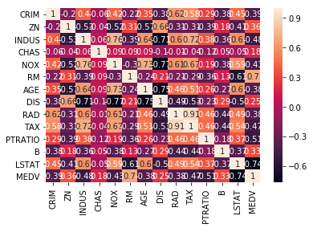
    


We can see that several of the variables above have strong correlations (dark red). Now let's plot the distribution of median home values.


```python
#plt.figure(figsize=(8,8))
g = sns.distplot(df['MEDV'])
g.set(xlabel='MEDV', ylabel='', title='Distribution of Median Home Values')
plt.show()
```


    
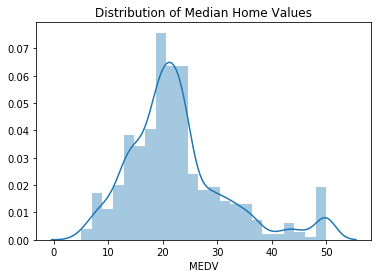
    


Now let's plot a scatter plot for each of the variables against the target variable (median home values).


```python
#plt.figure(figsize=(8,8))
g = sns.regplot(x=df['CRIM'], y=df['MEDV'], data=df)
g.set(xlabel='CRIM', ylabel='MEDV', title='')
plt.show()
```


    
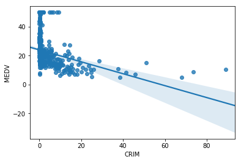
    


```python
plt.figure(figsize=(8,8))
g = sns.regplot(x=df['ZN'], y=df['MEDV'], data=df)
g.set(xlabel='ZN', ylabel='MEDV', title='')
plt.show()
```


    
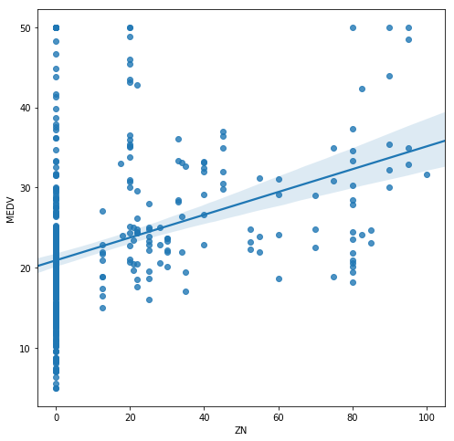
    


```python
plt.figure(figsize=(8,8))
g = sns.regplot(x=df['INDUS'], y=df['MEDV'], data=df)
g.set(xlabel='INDUS', ylabel='MEDV', title='')
plt.show()
```


    
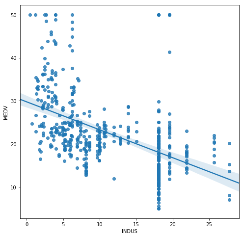
    


```python
plt.figure(figsize=(8,8))
g = sns.regplot(x=df['CHAS'], y=df['MEDV'], data=df)
g.set(xlabel='CHAS', ylabel='MEDV', title='')
plt.show()
```


    
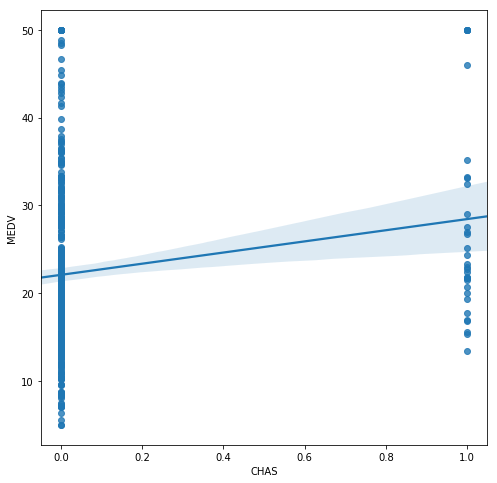
    


```python
plt.figure(figsize=(8,8))
g = sns.regplot(x=df['NOX'], y=df['MEDV'], data=df)
g.set(xlabel='NOX', ylabel='MEDV', title='')
plt.show()
```


    
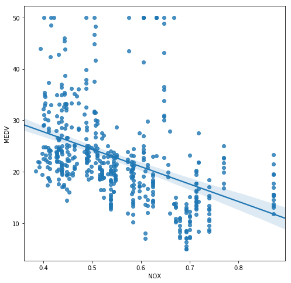
    


```python
#plt.figure(figsize=(8,8))
g = sns.regplot(x=df['RM'], y=df['MEDV'], data=df)
g.set(xlabel='RM', ylabel='MEDV', title='')
plt.show()
```


    
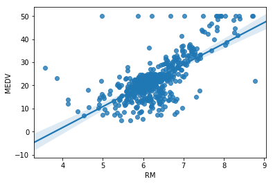
    


```python
plt.figure(figsize=(8,8))
g = sns.regplot(x=df['AGE'], y=df['MEDV'], data=df)
g.set(xlabel='AGE', ylabel='MEDV', title='')
plt.show()
```


    
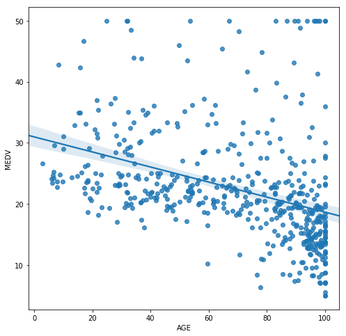
    


```python
plt.figure(figsize=(8,8))
g = sns.regplot(x=df['DIS'], y=df['MEDV'], data=df)
g.set(xlabel='DIS', ylabel='MEDV', title='')
plt.show()
```


    
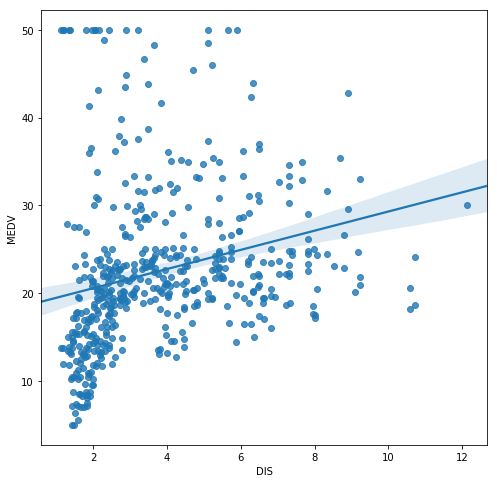
    


```python
plt.figure(figsize=(8,8))
g = sns.regplot(x=df['RAD'], y=df['MEDV'], data=df)
g.set(xlabel='RAD', ylabel='MEDV', title='')
plt.show()
```


    
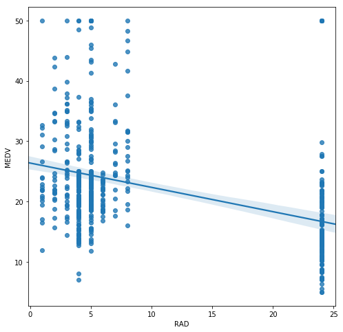
    


```python
plt.figure(figsize=(8,8))
g = sns.regplot(x=df['TAX'], y=df['MEDV'], data=df)
g.set(xlabel='TAX', ylabel='MEDV', title='')
plt.show()
```


    
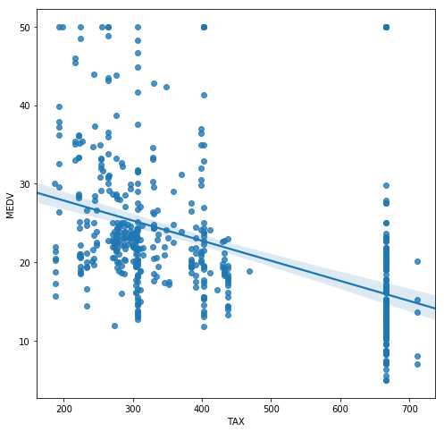
    


```python
plt.figure(figsize=(8,8))
g = sns.regplot(x=df['PTRATIO'], y=df['MEDV'], data=df)
g.set(xlabel='PTRATIO', ylabel='MEDV', title='')
plt.show()
```


    
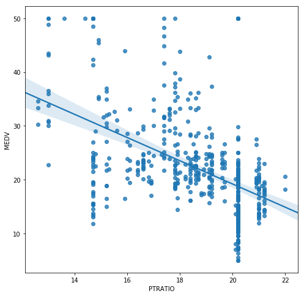
    


```python
plt.figure(figsize=(8,8))
g = sns.regplot(x=df['B'], y=df['MEDV'], data=df)
g.set(xlabel='B', ylabel='MEDV', title='')
plt.show()
```


    
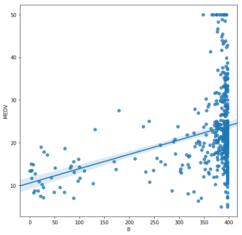
    


```python
#Now let's plot a scatter plot for each of the variables against the target variable (median home values)
plt.figure(figsize=(8,8))
g = sns.regplot(x=df['LSTAT'], y=df['MEDV'], data=df)
g.set(xlabel='LSTAT', ylabel='MEDV', title='')
plt.show()
```


    
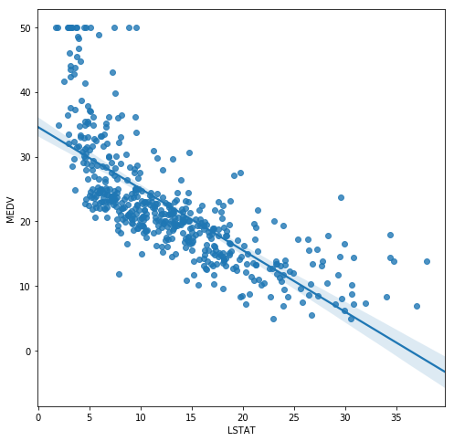
    


The above scatter plots reveal some key insights about this data, highlighted below:

-Lower crime rates are associated with higher median home value

-Higher proportions of non-retail business acres are associated with higher median home value

-More rooms are associated with higher median home value

-With some exceptions, lower pupil-teacher ratios are associated with higher median home value

-The strongest correlation appears to be between MEDV and LSTAT; in other words, a lower % lower
status of the population is strongly associated with higher median home value

My favorite plot is the one showing MEDV vs. PTRATIO. It indicates that lower-income neighborhoods have more students and less teachers. It could also indicate that there are less public schools in higher-income neighborhoods. 

I found the plot of MEDV vs. B interesting. I don't quite understand the formula 1000(Bk-0.63)^2, but from the plot it seems like many homes with high median home prices are associated with a higher proportion of blacks. A better explanation of this formula and how it is derived is probably one thing missing from this dataset's description.


```python
df['MEDV'].describe()
```


    count    506.000000
    mean      22.532806
    std        9.197104
    min        5.000000
    25%       17.025000
    50%       21.200000
    75%       25.000000
    max       50.000000
    Name: MEDV, dtype: float64


