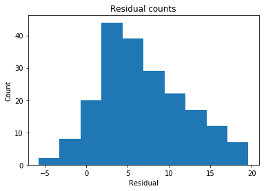
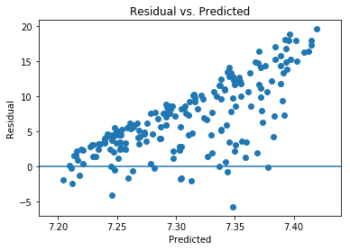
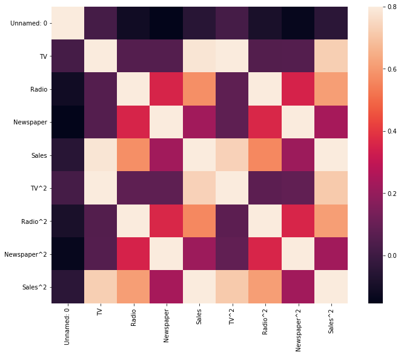
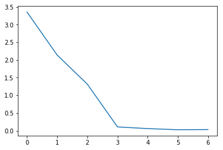

# **DRILL: fixing assumptions**


```python
import math
import warnings

from IPython.display import display
from matplotlib import pyplot as plt
import numpy as np
import pandas as pd
import seaborn as sns
from sklearn import linear_model
import statsmodels.formula.api as smf
from sklearn.preprocessing import StandardScaler
from sklearn.decomposition import PCA

# Display preferences.
%matplotlib inline
pd.options.display.float_format = '{:.3f}'.format

# Suppress annoying harmless error.
warnings.filterwarnings(
    action="ignore",
    module="scipy",
    message="^internal gelsd"
)
```

## **Assumption one: linear relationship**


```python
# Acquire, load, and preview the data.
data = pd.read_csv('https://tf-curricula-prod.s3.amazonaws.com/data-science/Advertising.csv')
display(data.head())

# Instantiate and fit our model.
regr = linear_model.LinearRegression()
Y = data['Sales'].values.reshape(-1, 1)
X1 = data[['TV','Radio','Newspaper']]

# Create new squared features
data['TV^2'] = data['TV']**2
data['Radio^2'] = data['Radio']**2
data['Newspaper^2'] = data['Newspaper']**2
data['Sales^2'] = data['Sales']**2

X2 = data[['TV^2', 'Radio^2', 'Newspaper^2']]

regr.fit(X2, Y)

# Inspect the results.
print('\nCoefficients: \n', regr.coef_)
print('\nIntercept: \n', regr.intercept_)
print('\nR-squared:')
print(regr.score(X2, Y))
```


<div>
<style scoped>
    .dataframe tbody tr th:only-of-type {
        vertical-align: middle;
    }

    .dataframe tbody tr th {
        vertical-align: top;
    }

    .dataframe thead th {
        text-align: right;
    }
</style>
<table border="1" class="dataframe">
  <thead>
    <tr style="text-align: right;">
      <th></th>
      <th>Unnamed: 0</th>
      <th>TV</th>
      <th>Radio</th>
      <th>Newspaper</th>
      <th>Sales</th>
    </tr>
  </thead>
  <tbody>
    <tr>
      <th>0</th>
      <td>1</td>
      <td>230.100</td>
      <td>37.800</td>
      <td>69.200</td>
      <td>22.100</td>
    </tr>
    <tr>
      <th>1</th>
      <td>2</td>
      <td>44.500</td>
      <td>39.300</td>
      <td>45.100</td>
      <td>10.400</td>
    </tr>
    <tr>
      <th>2</th>
      <td>3</td>
      <td>17.200</td>
      <td>45.900</td>
      <td>69.300</td>
      <td>9.300</td>
    </tr>
    <tr>
      <th>3</th>
      <td>4</td>
      <td>151.500</td>
      <td>41.300</td>
      <td>58.500</td>
      <td>18.500</td>
    </tr>
    <tr>
      <th>4</th>
      <td>5</td>
      <td>180.800</td>
      <td>10.800</td>
      <td>58.400</td>
      <td>12.900</td>
    </tr>
  </tbody>
</table>
</div>


    
    Coefficients: 
     [[  1.42707531e-04   3.68654872e-03  -8.28260101e-05]]
    
    Intercept: 
     [ 7.2029644]
    
    R-squared:
    0.799973684425


## **Assumption two: multivariate normality**


```python
Y = data['Sales'].values.reshape(-1, 1)
X = data[['TV', 'Radio', 'Newspaper']]

# Extract predicted values.
predicted = regr.predict(X).ravel()
actual = data['Sales']

# Calculate the error, also called the residual.
residual = actual - predicted

# This looks a bit concerning.
plt.hist(residual)
plt.title('Residual counts')
plt.xlabel('Residual')
plt.ylabel('Count')
plt.show()
```


    

    


## **Assumption three: homoscedasticity**


```python
plt.scatter(predicted, residual)
plt.xlabel('Predicted')
plt.ylabel('Residual')
plt.axhline(y=0)
plt.title('Residual vs. Predicted')
plt.show()
```


    

    


Based on the scatter plot, it appears as though squaring the features improved the homoscedasticity.

## **Assumption four: low multicollinearity**


```python
corrmat = data.corr()
f, ax = plt.subplots(figsize=(12, 9))
sns.heatmap(corrmat, vmax=.8, square=True)
plt.show()
display(data.corr())
```


    

    


<div>
<style scoped>
    .dataframe tbody tr th:only-of-type {
        vertical-align: middle;
    }

    .dataframe tbody tr th {
        vertical-align: top;
    }

    .dataframe thead th {
        text-align: right;
    }
</style>
<table border="1" class="dataframe">
  <thead>
    <tr style="text-align: right;">
      <th></th>
      <th>Unnamed: 0</th>
      <th>TV</th>
      <th>Radio</th>
      <th>Newspaper</th>
      <th>Sales</th>
      <th>TV^2</th>
      <th>Radio^2</th>
      <th>Newspaper^2</th>
      <th>Sales^2</th>
    </tr>
  </thead>
  <tbody>
    <tr>
      <th>Unnamed: 0</th>
      <td>1.000</td>
      <td>0.018</td>
      <td>-0.111</td>
      <td>-0.155</td>
      <td>-0.052</td>
      <td>0.018</td>
      <td>-0.091</td>
      <td>-0.137</td>
      <td>-0.043</td>
    </tr>
    <tr>
      <th>TV</th>
      <td>0.018</td>
      <td>1.000</td>
      <td>0.055</td>
      <td>0.057</td>
      <td>0.782</td>
      <td>0.968</td>
      <td>0.051</td>
      <td>0.056</td>
      <td>0.729</td>
    </tr>
    <tr>
      <th>Radio</th>
      <td>-0.111</td>
      <td>0.055</td>
      <td>1.000</td>
      <td>0.354</td>
      <td>0.576</td>
      <td>0.079</td>
      <td>0.967</td>
      <td>0.352</td>
      <td>0.610</td>
    </tr>
    <tr>
      <th>Newspaper</th>
      <td>-0.155</td>
      <td>0.057</td>
      <td>0.354</td>
      <td>1.000</td>
      <td>0.228</td>
      <td>0.076</td>
      <td>0.361</td>
      <td>0.940</td>
      <td>0.238</td>
    </tr>
    <tr>
      <th>Sales</th>
      <td>-0.052</td>
      <td>0.782</td>
      <td>0.576</td>
      <td>0.228</td>
      <td>1.000</td>
      <td>0.736</td>
      <td>0.562</td>
      <td>0.216</td>
      <td>0.980</td>
    </tr>
    <tr>
      <th>TV^2</th>
      <td>0.018</td>
      <td>0.968</td>
      <td>0.079</td>
      <td>0.076</td>
      <td>0.736</td>
      <td>1.000</td>
      <td>0.075</td>
      <td>0.085</td>
      <td>0.715</td>
    </tr>
    <tr>
      <th>Radio^2</th>
      <td>-0.091</td>
      <td>0.051</td>
      <td>0.967</td>
      <td>0.361</td>
      <td>0.562</td>
      <td>0.075</td>
      <td>1.000</td>
      <td>0.357</td>
      <td>0.611</td>
    </tr>
    <tr>
      <th>Newspaper^2</th>
      <td>-0.137</td>
      <td>0.056</td>
      <td>0.352</td>
      <td>0.940</td>
      <td>0.216</td>
      <td>0.085</td>
      <td>0.357</td>
      <td>1.000</td>
      <td>0.228</td>
    </tr>
    <tr>
      <th>Sales^2</th>
      <td>-0.043</td>
      <td>0.729</td>
      <td>0.610</td>
      <td>0.238</td>
      <td>0.980</td>
      <td>0.715</td>
      <td>0.611</td>
      <td>0.228</td>
      <td>1.000</td>
    </tr>
  </tbody>
</table>
</div>


It appears that some of our features are highly correlated, particularly Radio/Sales and Newspaper/Sales.


```python
correlation_matrix = data.corr()
display(correlation_matrix)
```


<div>
<style scoped>
    .dataframe tbody tr th:only-of-type {
        vertical-align: middle;
    }

    .dataframe tbody tr th {
        vertical-align: top;
    }

    .dataframe thead th {
        text-align: right;
    }
</style>
<table border="1" class="dataframe">
  <thead>
    <tr style="text-align: right;">
      <th></th>
      <th>Unnamed: 0</th>
      <th>TV</th>
      <th>Radio</th>
      <th>Newspaper</th>
      <th>Sales</th>
      <th>TV^2</th>
      <th>Radio^2</th>
      <th>Newspaper^2</th>
      <th>Sales^2</th>
    </tr>
  </thead>
  <tbody>
    <tr>
      <th>Unnamed: 0</th>
      <td>1.000</td>
      <td>0.018</td>
      <td>-0.111</td>
      <td>-0.155</td>
      <td>-0.052</td>
      <td>0.018</td>
      <td>-0.091</td>
      <td>-0.137</td>
      <td>-0.043</td>
    </tr>
    <tr>
      <th>TV</th>
      <td>0.018</td>
      <td>1.000</td>
      <td>0.055</td>
      <td>0.057</td>
      <td>0.782</td>
      <td>0.968</td>
      <td>0.051</td>
      <td>0.056</td>
      <td>0.729</td>
    </tr>
    <tr>
      <th>Radio</th>
      <td>-0.111</td>
      <td>0.055</td>
      <td>1.000</td>
      <td>0.354</td>
      <td>0.576</td>
      <td>0.079</td>
      <td>0.967</td>
      <td>0.352</td>
      <td>0.610</td>
    </tr>
    <tr>
      <th>Newspaper</th>
      <td>-0.155</td>
      <td>0.057</td>
      <td>0.354</td>
      <td>1.000</td>
      <td>0.228</td>
      <td>0.076</td>
      <td>0.361</td>
      <td>0.940</td>
      <td>0.238</td>
    </tr>
    <tr>
      <th>Sales</th>
      <td>-0.052</td>
      <td>0.782</td>
      <td>0.576</td>
      <td>0.228</td>
      <td>1.000</td>
      <td>0.736</td>
      <td>0.562</td>
      <td>0.216</td>
      <td>0.980</td>
    </tr>
    <tr>
      <th>TV^2</th>
      <td>0.018</td>
      <td>0.968</td>
      <td>0.079</td>
      <td>0.076</td>
      <td>0.736</td>
      <td>1.000</td>
      <td>0.075</td>
      <td>0.085</td>
      <td>0.715</td>
    </tr>
    <tr>
      <th>Radio^2</th>
      <td>-0.091</td>
      <td>0.051</td>
      <td>0.967</td>
      <td>0.361</td>
      <td>0.562</td>
      <td>0.075</td>
      <td>1.000</td>
      <td>0.357</td>
      <td>0.611</td>
    </tr>
    <tr>
      <th>Newspaper^2</th>
      <td>-0.137</td>
      <td>0.056</td>
      <td>0.352</td>
      <td>0.940</td>
      <td>0.216</td>
      <td>0.085</td>
      <td>0.357</td>
      <td>1.000</td>
      <td>0.228</td>
    </tr>
    <tr>
      <th>Sales^2</th>
      <td>-0.043</td>
      <td>0.729</td>
      <td>0.610</td>
      <td>0.238</td>
      <td>0.980</td>
      <td>0.715</td>
      <td>0.611</td>
      <td>0.228</td>
      <td>1.000</td>
    </tr>
  </tbody>
</table>
</div>


```python
features = ['TV', 'Radio', 'Newspaper', 'TV^2', 'Radio^2', 'Newspaper^2', 'Sales^2']

df_pca = data.loc[:, features].values
y = data.loc[:, ['Sales']].values

X = StandardScaler().fit_transform(df_pca)

Xt = X.T
Cx = np.cov(Xt)
print('Covariance Matrix:\n', Cx)
```

    Covariance Matrix:
     [[ 1.00502513  0.05508408  0.05693254  0.97252509  0.05109954  0.05590531
       0.73256521]
     [ 0.05508408  1.00502513  0.35588317  0.07903933  0.97160989  0.3541069
       0.6134916 ]
     [ 0.05693254  0.35588317  1.00502513  0.07682624  0.36322152  0.94439868
       0.23939276]
     [ 0.97252509  0.07903933  0.07682624  1.00502513  0.07509284  0.08590238
       0.7185557 ]
     [ 0.05109954  0.97160989  0.36322152  0.07509284  1.00502513  0.3583038
       0.61367703]
     [ 0.05590531  0.3541069   0.94439868  0.08590238  0.3583038   1.00502513
       0.22896125]
     [ 0.73256521  0.6134916   0.23939276  0.7185557   0.61367703  0.22896125
       1.00502513]]


```python
# Calculating eigenvalues and eigenvectors.
eig_val_cov, eig_vec_cov = np.linalg.eig(Cx)

# Inspecting the eigenvalues and eigenvectors.
for i in range(len(eig_val_cov)):
    eigvec_cov = eig_vec_cov[:, i].reshape(1, 7).T
    print('Eigenvector {}: \n{}'.format(i + 1, eigvec_cov))
    print('Eigenvalue {}: {}'.format(i + 1, eig_val_cov[i]))
    print(40 * '-')

print(
    'The percentage of total variance in the dataset explained by each',
    'component calculated by hand.\n',
    eig_val_cov / sum(eig_val_cov)
)
```

    Eigenvector 1: 
    [[-0.32192638]
     [-0.41441704]
     [-0.32480276]
     [-0.33074094]
     [-0.41479104]
     [-0.32324108]
     [-0.48290695]]
    Eigenvalue 1: 3.3533907440501256
    ----------------------------------------
    Eigenvector 2: 
    [[-0.53183042]
     [ 0.26803955]
     [ 0.35554971]
     [-0.51574108]
     [ 0.27193793]
     [ 0.35385085]
     [-0.23183203]]
    Eigenvalue 2: 2.138315141603013
    ----------------------------------------
    Eigenvector 3: 
    [[ 0.16157412]
     [-0.4372079 ]
     [ 0.51608197]
     [ 0.16734606]
     [-0.43358999]
     [ 0.52089634]
     [-0.17048307]]
    Eigenvalue 3: 1.3152329266320908
    ----------------------------------------
    Eigenvector 4: 
    [[ 0.13700407]
     [ 0.2664073 ]
     [-0.13288173]
     [ 0.44772813]
     [ 0.22523894]
     [ 0.09618972]
     [-0.7950811 ]]
    Eigenvalue 4: 0.10705708130779526
    ----------------------------------------
    Eigenvector 5: 
    [[ 0.10729353]
     [ 0.01308928]
     [ 0.69087275]
     [ 0.00494538]
     [ 0.07675588]
     [-0.69424467]
     [-0.15205271]]
    Eigenvalue 5: 0.05981778381043827
    ----------------------------------------
    Eigenvector 6: 
    [[-0.74294797]
     [ 0.01158729]
     [ 0.07664522]
     [ 0.62498504]
     [-0.12455246]
     [-0.08476171]
     [ 0.16945618]]
    Eigenvalue 6: 0.02803879045367865
    ----------------------------------------
    Eigenvector 7: 
    [[-0.07183251]
     [-0.70284004]
     [-0.03016256]
     [ 0.07433458]
     [ 0.7027521 ]
     [ 0.02364543]
     [ 0.00096626]]
    Eigenvalue 7: 0.033323411539842196
    ----------------------------------------
    The percentage of total variance in the dataset explained by each component calculated by hand.
     [ 0.47666054  0.30394622  0.18695097  0.0152174   0.00850267  0.00398551
      0.00473668]


```python
plt.plot(eig_val_cov)
plt.show()
```


    

    


It turns out that doing PCA indicates that we should get rid of the extra squared features. Only the first three features (TV, Radio, Newspaper) have eigenvalues greater than 1. Approximately 96% of the variance is captured in these three features.
