```python
import numpy as np
import pandas as pd
import scipy
import seaborn as sns
from scipy import stats
from collections import Counter
from scipy.stats import ttest_ind
import matplotlib.pyplot as plt
import matplotlib.ticker as mtick
from matplotlib.mlab import PCA as mlabPCA
from sklearn.preprocessing import StandardScaler
from sklearn.decomposition import PCA 
%matplotlib inline
```

# **Introduction**

For this exercise, we will use a dataset from the Home Credit default risk machine learning competition. This consists of historical loan application data provided by Home Credit, which provides lines of credit to the unbanked population.

# **Exploring the Data**


```python
sns.set_style("white")
```


```python
app_train = pd.read_csv('./input/application_train.csv')
print('Training data shape: ', app_train.shape)
app_train.head()
```

    Training data shape:  (307511, 122)


<div>
<style>
    .dataframe thead tr:only-child th {
        text-align: right;
    }

    .dataframe thead th {
        text-align: left;
    }

    .dataframe tbody tr th {
        vertical-align: top;
    }
</style>
<table border="1" class="dataframe">
  <thead>
    <tr style="text-align: right;">
      <th></th>
      <th>SK_ID_CURR</th>
      <th>TARGET</th>
      <th>NAME_CONTRACT_TYPE</th>
      <th>CODE_GENDER</th>
      <th>FLAG_OWN_CAR</th>
      <th>FLAG_OWN_REALTY</th>
      <th>CNT_CHILDREN</th>
      <th>AMT_INCOME_TOTAL</th>
      <th>AMT_CREDIT</th>
      <th>AMT_ANNUITY</th>
      <th>...</th>
      <th>FLAG_DOCUMENT_18</th>
      <th>FLAG_DOCUMENT_19</th>
      <th>FLAG_DOCUMENT_20</th>
      <th>FLAG_DOCUMENT_21</th>
      <th>AMT_REQ_CREDIT_BUREAU_HOUR</th>
      <th>AMT_REQ_CREDIT_BUREAU_DAY</th>
      <th>AMT_REQ_CREDIT_BUREAU_WEEK</th>
      <th>AMT_REQ_CREDIT_BUREAU_MON</th>
      <th>AMT_REQ_CREDIT_BUREAU_QRT</th>
      <th>AMT_REQ_CREDIT_BUREAU_YEAR</th>
    </tr>
  </thead>
  <tbody>
    <tr>
      <th>0</th>
      <td>100002</td>
      <td>1</td>
      <td>Cash loans</td>
      <td>M</td>
      <td>N</td>
      <td>Y</td>
      <td>0</td>
      <td>202500.0</td>
      <td>406597.5</td>
      <td>24700.5</td>
      <td>...</td>
      <td>0</td>
      <td>0</td>
      <td>0</td>
      <td>0</td>
      <td>0.0</td>
      <td>0.0</td>
      <td>0.0</td>
      <td>0.0</td>
      <td>0.0</td>
      <td>1.0</td>
    </tr>
    <tr>
      <th>1</th>
      <td>100003</td>
      <td>0</td>
      <td>Cash loans</td>
      <td>F</td>
      <td>N</td>
      <td>N</td>
      <td>0</td>
      <td>270000.0</td>
      <td>1293502.5</td>
      <td>35698.5</td>
      <td>...</td>
      <td>0</td>
      <td>0</td>
      <td>0</td>
      <td>0</td>
      <td>0.0</td>
      <td>0.0</td>
      <td>0.0</td>
      <td>0.0</td>
      <td>0.0</td>
      <td>0.0</td>
    </tr>
    <tr>
      <th>2</th>
      <td>100004</td>
      <td>0</td>
      <td>Revolving loans</td>
      <td>M</td>
      <td>Y</td>
      <td>Y</td>
      <td>0</td>
      <td>67500.0</td>
      <td>135000.0</td>
      <td>6750.0</td>
      <td>...</td>
      <td>0</td>
      <td>0</td>
      <td>0</td>
      <td>0</td>
      <td>0.0</td>
      <td>0.0</td>
      <td>0.0</td>
      <td>0.0</td>
      <td>0.0</td>
      <td>0.0</td>
    </tr>
    <tr>
      <th>3</th>
      <td>100006</td>
      <td>0</td>
      <td>Cash loans</td>
      <td>F</td>
      <td>N</td>
      <td>Y</td>
      <td>0</td>
      <td>135000.0</td>
      <td>312682.5</td>
      <td>29686.5</td>
      <td>...</td>
      <td>0</td>
      <td>0</td>
      <td>0</td>
      <td>0</td>
      <td>NaN</td>
      <td>NaN</td>
      <td>NaN</td>
      <td>NaN</td>
      <td>NaN</td>
      <td>NaN</td>
    </tr>
    <tr>
      <th>4</th>
      <td>100007</td>
      <td>0</td>
      <td>Cash loans</td>
      <td>M</td>
      <td>N</td>
      <td>Y</td>
      <td>0</td>
      <td>121500.0</td>
      <td>513000.0</td>
      <td>21865.5</td>
      <td>...</td>
      <td>0</td>
      <td>0</td>
      <td>0</td>
      <td>0</td>
      <td>0.0</td>
      <td>0.0</td>
      <td>0.0</td>
      <td>0.0</td>
      <td>0.0</td>
      <td>0.0</td>
    </tr>
  </tbody>
</table>
<p>5 rows × 122 columns</p>
</div>


```python
app_test = pd.read_csv('./input/application_test.csv')
print('Testing data shape: ', app_test.shape)
app_test.head()
```

    Testing data shape:  (48744, 121)


<div>
<style>
    .dataframe thead tr:only-child th {
        text-align: right;
    }

    .dataframe thead th {
        text-align: left;
    }

    .dataframe tbody tr th {
        vertical-align: top;
    }
</style>
<table border="1" class="dataframe">
  <thead>
    <tr style="text-align: right;">
      <th></th>
      <th>SK_ID_CURR</th>
      <th>NAME_CONTRACT_TYPE</th>
      <th>CODE_GENDER</th>
      <th>FLAG_OWN_CAR</th>
      <th>FLAG_OWN_REALTY</th>
      <th>CNT_CHILDREN</th>
      <th>AMT_INCOME_TOTAL</th>
      <th>AMT_CREDIT</th>
      <th>AMT_ANNUITY</th>
      <th>AMT_GOODS_PRICE</th>
      <th>...</th>
      <th>FLAG_DOCUMENT_18</th>
      <th>FLAG_DOCUMENT_19</th>
      <th>FLAG_DOCUMENT_20</th>
      <th>FLAG_DOCUMENT_21</th>
      <th>AMT_REQ_CREDIT_BUREAU_HOUR</th>
      <th>AMT_REQ_CREDIT_BUREAU_DAY</th>
      <th>AMT_REQ_CREDIT_BUREAU_WEEK</th>
      <th>AMT_REQ_CREDIT_BUREAU_MON</th>
      <th>AMT_REQ_CREDIT_BUREAU_QRT</th>
      <th>AMT_REQ_CREDIT_BUREAU_YEAR</th>
    </tr>
  </thead>
  <tbody>
    <tr>
      <th>0</th>
      <td>100001</td>
      <td>Cash loans</td>
      <td>F</td>
      <td>N</td>
      <td>Y</td>
      <td>0</td>
      <td>135000.0</td>
      <td>568800.0</td>
      <td>20560.5</td>
      <td>450000.0</td>
      <td>...</td>
      <td>0</td>
      <td>0</td>
      <td>0</td>
      <td>0</td>
      <td>0.0</td>
      <td>0.0</td>
      <td>0.0</td>
      <td>0.0</td>
      <td>0.0</td>
      <td>0.0</td>
    </tr>
    <tr>
      <th>1</th>
      <td>100005</td>
      <td>Cash loans</td>
      <td>M</td>
      <td>N</td>
      <td>Y</td>
      <td>0</td>
      <td>99000.0</td>
      <td>222768.0</td>
      <td>17370.0</td>
      <td>180000.0</td>
      <td>...</td>
      <td>0</td>
      <td>0</td>
      <td>0</td>
      <td>0</td>
      <td>0.0</td>
      <td>0.0</td>
      <td>0.0</td>
      <td>0.0</td>
      <td>0.0</td>
      <td>3.0</td>
    </tr>
    <tr>
      <th>2</th>
      <td>100013</td>
      <td>Cash loans</td>
      <td>M</td>
      <td>Y</td>
      <td>Y</td>
      <td>0</td>
      <td>202500.0</td>
      <td>663264.0</td>
      <td>69777.0</td>
      <td>630000.0</td>
      <td>...</td>
      <td>0</td>
      <td>0</td>
      <td>0</td>
      <td>0</td>
      <td>0.0</td>
      <td>0.0</td>
      <td>0.0</td>
      <td>0.0</td>
      <td>1.0</td>
      <td>4.0</td>
    </tr>
    <tr>
      <th>3</th>
      <td>100028</td>
      <td>Cash loans</td>
      <td>F</td>
      <td>N</td>
      <td>Y</td>
      <td>2</td>
      <td>315000.0</td>
      <td>1575000.0</td>
      <td>49018.5</td>
      <td>1575000.0</td>
      <td>...</td>
      <td>0</td>
      <td>0</td>
      <td>0</td>
      <td>0</td>
      <td>0.0</td>
      <td>0.0</td>
      <td>0.0</td>
      <td>0.0</td>
      <td>0.0</td>
      <td>3.0</td>
    </tr>
    <tr>
      <th>4</th>
      <td>100038</td>
      <td>Cash loans</td>
      <td>M</td>
      <td>Y</td>
      <td>N</td>
      <td>1</td>
      <td>180000.0</td>
      <td>625500.0</td>
      <td>32067.0</td>
      <td>625500.0</td>
      <td>...</td>
      <td>0</td>
      <td>0</td>
      <td>0</td>
      <td>0</td>
      <td>NaN</td>
      <td>NaN</td>
      <td>NaN</td>
      <td>NaN</td>
      <td>NaN</td>
      <td>NaN</td>
    </tr>
  </tbody>
</table>
<p>5 rows × 121 columns</p>
</div>


Number of datapoints: 307511

Number of variables: 122

Since this dataset is extremely large, we will only select the following variables for this exercise.

**Continuous Variables**

AMT_INCOME_TOTAL

AMT_CREDIT

AMT_ANNUITY

AMT_GOODS_PRICE

DAYS_EMPLOYED

DAYS_BIRTH

CNT_FAM_MEMBERS

**Categorical Variables**

NAME_CONTRACT_TYPE

CODE_GENDER

**Target Variable**

TARGET

0 - if loan was repaid on time

1 - if client had payment difficulties


```python
df = app_train[['TARGET', 'NAME_CONTRACT_TYPE', 'CODE_GENDER', 'AMT_INCOME_TOTAL', 'AMT_CREDIT', 'AMT_ANNUITY', 'AMT_GOODS_PRICE', 'DAYS_EMPLOYED', 'DAYS_BIRTH', 'CNT_FAM_MEMBERS']]

df.columns = ['TARGET',
              'NAME_CONTRACT_TYPE',
              'CODE_GENDER',
              'AMT_INCOME_TOTAL',
              'AMT_CREDIT',
              'AMT_ANNUITY',
              'AMT_GOODS_PRICE',
              'DAYS_EMPLOYED',
              'DAYS_BIRTH',
              'CNT_FAM_MEMBERS']

df.head()
```


<div>
<style>
    .dataframe thead tr:only-child th {
        text-align: right;
    }

    .dataframe thead th {
        text-align: left;
    }

    .dataframe tbody tr th {
        vertical-align: top;
    }
</style>
<table border="1" class="dataframe">
  <thead>
    <tr style="text-align: right;">
      <th></th>
      <th>TARGET</th>
      <th>NAME_CONTRACT_TYPE</th>
      <th>CODE_GENDER</th>
      <th>AMT_INCOME_TOTAL</th>
      <th>AMT_CREDIT</th>
      <th>AMT_ANNUITY</th>
      <th>AMT_GOODS_PRICE</th>
      <th>DAYS_EMPLOYED</th>
      <th>DAYS_BIRTH</th>
      <th>CNT_FAM_MEMBERS</th>
    </tr>
  </thead>
  <tbody>
    <tr>
      <th>0</th>
      <td>1</td>
      <td>Cash loans</td>
      <td>M</td>
      <td>202500.0</td>
      <td>406597.5</td>
      <td>24700.5</td>
      <td>351000.0</td>
      <td>-637</td>
      <td>-9461</td>
      <td>1.0</td>
    </tr>
    <tr>
      <th>1</th>
      <td>0</td>
      <td>Cash loans</td>
      <td>F</td>
      <td>270000.0</td>
      <td>1293502.5</td>
      <td>35698.5</td>
      <td>1129500.0</td>
      <td>-1188</td>
      <td>-16765</td>
      <td>2.0</td>
    </tr>
    <tr>
      <th>2</th>
      <td>0</td>
      <td>Revolving loans</td>
      <td>M</td>
      <td>67500.0</td>
      <td>135000.0</td>
      <td>6750.0</td>
      <td>135000.0</td>
      <td>-225</td>
      <td>-19046</td>
      <td>1.0</td>
    </tr>
    <tr>
      <th>3</th>
      <td>0</td>
      <td>Cash loans</td>
      <td>F</td>
      <td>135000.0</td>
      <td>312682.5</td>
      <td>29686.5</td>
      <td>297000.0</td>
      <td>-3039</td>
      <td>-19005</td>
      <td>2.0</td>
    </tr>
    <tr>
      <th>4</th>
      <td>0</td>
      <td>Cash loans</td>
      <td>M</td>
      <td>121500.0</td>
      <td>513000.0</td>
      <td>21865.5</td>
      <td>513000.0</td>
      <td>-3038</td>
      <td>-19932</td>
      <td>1.0</td>
    </tr>
  </tbody>
</table>
</div>


```python
df.dtypes
```


    TARGET                  int64
    NAME_CONTRACT_TYPE     object
    CODE_GENDER            object
    AMT_INCOME_TOTAL      float64
    AMT_CREDIT            float64
    AMT_ANNUITY           float64
    AMT_GOODS_PRICE       float64
    DAYS_EMPLOYED           int64
    DAYS_BIRTH              int64
    CNT_FAM_MEMBERS       float64
    dtype: object


```python
df.describe()
```


<div>
<style>
    .dataframe thead tr:only-child th {
        text-align: right;
    }

    .dataframe thead th {
        text-align: left;
    }

    .dataframe tbody tr th {
        vertical-align: top;
    }
</style>
<table border="1" class="dataframe">
  <thead>
    <tr style="text-align: right;">
      <th></th>
      <th>TARGET</th>
      <th>AMT_INCOME_TOTAL</th>
      <th>AMT_CREDIT</th>
      <th>AMT_ANNUITY</th>
      <th>AMT_GOODS_PRICE</th>
      <th>DAYS_EMPLOYED</th>
      <th>DAYS_BIRTH</th>
      <th>CNT_FAM_MEMBERS</th>
    </tr>
  </thead>
  <tbody>
    <tr>
      <th>count</th>
      <td>307511.000000</td>
      <td>3.075110e+05</td>
      <td>3.075110e+05</td>
      <td>307499.000000</td>
      <td>3.072330e+05</td>
      <td>307511.000000</td>
      <td>307511.000000</td>
      <td>307509.000000</td>
    </tr>
    <tr>
      <th>mean</th>
      <td>0.080729</td>
      <td>1.687979e+05</td>
      <td>5.990260e+05</td>
      <td>27108.573909</td>
      <td>5.383962e+05</td>
      <td>63815.045904</td>
      <td>-16036.995067</td>
      <td>2.152665</td>
    </tr>
    <tr>
      <th>std</th>
      <td>0.272419</td>
      <td>2.371231e+05</td>
      <td>4.024908e+05</td>
      <td>14493.737315</td>
      <td>3.694465e+05</td>
      <td>141275.766519</td>
      <td>4363.988632</td>
      <td>0.910682</td>
    </tr>
    <tr>
      <th>min</th>
      <td>0.000000</td>
      <td>2.565000e+04</td>
      <td>4.500000e+04</td>
      <td>1615.500000</td>
      <td>4.050000e+04</td>
      <td>-17912.000000</td>
      <td>-25229.000000</td>
      <td>1.000000</td>
    </tr>
    <tr>
      <th>25%</th>
      <td>0.000000</td>
      <td>1.125000e+05</td>
      <td>2.700000e+05</td>
      <td>16524.000000</td>
      <td>2.385000e+05</td>
      <td>-2760.000000</td>
      <td>-19682.000000</td>
      <td>2.000000</td>
    </tr>
    <tr>
      <th>50%</th>
      <td>0.000000</td>
      <td>1.471500e+05</td>
      <td>5.135310e+05</td>
      <td>24903.000000</td>
      <td>4.500000e+05</td>
      <td>-1213.000000</td>
      <td>-15750.000000</td>
      <td>2.000000</td>
    </tr>
    <tr>
      <th>75%</th>
      <td>0.000000</td>
      <td>2.025000e+05</td>
      <td>8.086500e+05</td>
      <td>34596.000000</td>
      <td>6.795000e+05</td>
      <td>-289.000000</td>
      <td>-12413.000000</td>
      <td>3.000000</td>
    </tr>
    <tr>
      <th>max</th>
      <td>1.000000</td>
      <td>1.170000e+08</td>
      <td>4.050000e+06</td>
      <td>258025.500000</td>
      <td>4.050000e+06</td>
      <td>365243.000000</td>
      <td>-7489.000000</td>
      <td>20.000000</td>
    </tr>
  </tbody>
</table>
</div>


```python
df['TARGET'].value_counts()
```


    0    282686
    1     24825
    Name: TARGET, dtype: int64


**Missing Values**


```python
df.isnull().sum()
```


    TARGET                  0
    NAME_CONTRACT_TYPE      0
    CODE_GENDER             0
    AMT_INCOME_TOTAL        0
    AMT_CREDIT              0
    AMT_ANNUITY            12
    AMT_GOODS_PRICE       278
    DAYS_EMPLOYED           0
    DAYS_BIRTH              0
    CNT_FAM_MEMBERS         2
    dtype: int64


AMT_ANNUITY has 12 missing values, AMT_GOODS_PRICE has 278 missing values, and CNT_FAM_MEMBERS has 2 missing values. Let's try to drop these and check again.


```python
df = df.dropna()
print(df)
```

            TARGET NAME_CONTRACT_TYPE CODE_GENDER  AMT_INCOME_TOTAL  AMT_CREDIT  \
    0            1         Cash loans           M        202500.000    406597.5   
    1            0         Cash loans           F        270000.000   1293502.5   
    2            0    Revolving loans           M         67500.000    135000.0   
    3            0         Cash loans           F        135000.000    312682.5   
    4            0         Cash loans           M        121500.000    513000.0   
    5            0         Cash loans           M         99000.000    490495.5   
    6            0         Cash loans           F        171000.000   1560726.0   
    7            0         Cash loans           M        360000.000   1530000.0   
    8            0         Cash loans           F        112500.000   1019610.0   
    9            0    Revolving loans           M        135000.000    405000.0   
    10           0         Cash loans           F        112500.000    652500.0   
    11           0         Cash loans           F         38419.155    148365.0   
    12           0         Cash loans           F         67500.000     80865.0   
    13           0         Cash loans           M        225000.000    918468.0   
    14           0         Cash loans           F        189000.000    773680.5   
    15           0         Cash loans           M        157500.000    299772.0   
    16           0         Cash loans           M        108000.000    509602.5   
    17           0    Revolving loans           F         81000.000    270000.0   
    18           0    Revolving loans           F        112500.000    157500.0   
    19           0         Cash loans           F         90000.000    544491.0   
    20           0    Revolving loans           M        135000.000    427500.0   
    21           0         Cash loans           F        202500.000   1132573.5   
    22           0         Cash loans           F        450000.000    497520.0   
    23           0         Cash loans           F         83250.000    239850.0   
    24           0         Cash loans           M        135000.000    247500.0   
    25           0         Cash loans           F         90000.000    225000.0   
    26           1         Cash loans           F        112500.000    979992.0   
    27           0         Cash loans           M        112500.000    327024.0   
    28           0         Cash loans           M        270000.000    790830.0   
    29           0    Revolving loans           M         90000.000    180000.0   
    ...        ...                ...         ...               ...         ...   
    307481       1         Cash loans           M        225000.000    297000.0   
    307482       0         Cash loans           F        225000.000    500566.5   
    307483       0         Cash loans           F         99000.000    247275.0   
    307484       0         Cash loans           F        540000.000    545040.0   
    307485       0    Revolving loans           F        270000.000    180000.0   
    307486       0         Cash loans           F        292500.000    355536.0   
    307487       0         Cash loans           M        117000.000   1071909.0   
    307488       0         Cash loans           F        157500.000    135000.0   
    307489       1         Cash loans           F        225000.000    521280.0   
    307490       0         Cash loans           M         81000.000    135000.0   
    307491       0         Cash loans           M         90000.000   1078200.0   
    307492       0         Cash loans           M        585000.000   1575000.0   
    307493       0         Cash loans           F        135000.000    946764.0   
    307494       0         Cash loans           M        270000.000    479700.0   
    307495       0         Cash loans           M        180000.000    808650.0   
    307496       0    Revolving loans           F        360000.000    337500.0   
    307497       0         Cash loans           F        180000.000    270126.0   
    307498       0         Cash loans           M        198000.000   1312110.0   
    307499       0         Cash loans           F         81000.000    225000.0   
    307500       0         Cash loans           F        261000.000   1303812.0   
    307501       0         Cash loans           F         81000.000    269550.0   
    307502       0         Cash loans           F         94500.000    225000.0   
    307503       0         Cash loans           F        112500.000    345510.0   
    307504       0         Cash loans           F        153000.000    331920.0   
    307505       0         Cash loans           F        112500.000    225000.0   
    307506       0         Cash loans           M        157500.000    254700.0   
    307507       0         Cash loans           F         72000.000    269550.0   
    307508       0         Cash loans           F        153000.000    677664.0   
    307509       1         Cash loans           F        171000.000    370107.0   
    307510       0         Cash loans           F        157500.000    675000.0   
    
            AMT_ANNUITY  AMT_GOODS_PRICE  DAYS_EMPLOYED  DAYS_BIRTH  \
    0           24700.5         351000.0           -637       -9461   
    1           35698.5        1129500.0          -1188      -16765   
    2            6750.0         135000.0           -225      -19046   
    3           29686.5         297000.0          -3039      -19005   
    4           21865.5         513000.0          -3038      -19932   
    5           27517.5         454500.0          -1588      -16941   
    6           41301.0        1395000.0          -3130      -13778   
    7           42075.0        1530000.0           -449      -18850   
    8           33826.5         913500.0         365243      -20099   
    9           20250.0         405000.0          -2019      -14469   
    10          21177.0         652500.0           -679      -10197   
    11          10678.5         135000.0         365243      -20417   
    12           5881.5          67500.0          -2717      -13439   
    13          28966.5         697500.0          -3028      -14086   
    14          32778.0         679500.0           -203      -14583   
    15          20160.0         247500.0          -1157       -8728   
    16          26149.5         387000.0          -1317      -12931   
    17          13500.0         270000.0           -191       -9776   
    18           7875.0         157500.0          -7804      -17718   
    19          17563.5         454500.0          -2038      -11348   
    20          21375.0         427500.0          -4286      -18252   
    21          37561.5         927000.0          -1652      -14815   
    22          32521.5         450000.0          -4306      -11146   
    23          23850.0         225000.0         365243      -24827   
    24          12703.5         247500.0           -746      -11286   
    25          11074.5         225000.0          -3494      -19334   
    26          27076.5         702000.0          -2628      -18724   
    27          23827.5         270000.0          -1234      -15948   
    28          57676.5         675000.0          -1796       -9994   
    29           9000.0         180000.0          -1010      -10341   
    ...             ...              ...            ...         ...   
    307481      19975.5         297000.0          -3147      -20644   
    307482      34969.5         472500.0           -226      -14106   
    307483      16479.0         225000.0         365243      -24911   
    307484      35617.5         450000.0           -328      -12847   
    307485       9000.0         180000.0           -670      -11973   
    307486      18283.5         270000.0          -1185      -16010   
    307487      31473.0         936000.0         365243      -23125   
    307488      13351.5         135000.0          -1218      -10092   
    307489      23089.5         450000.0           -286      -16471   
    307490       9148.5         135000.0          -1928       -9874   
    307491      31522.5         900000.0          -1953      -10976   
    307492      43443.0        1575000.0          -1618      -20965   
    307493      37678.5         765000.0          -2306      -17533   
    307494      46858.5         450000.0          -6573      -14958   
    307495      23773.5         675000.0          -7438      -20922   
    307496      16875.0         337500.0          -2178      -17345   
    307497      12028.5         193500.0          -1222      -16679   
    307498      52168.5        1125000.0          -3689      -19102   
    307499      12694.5         225000.0          -8694      -16988   
    307500      35982.0        1138500.0          -5326      -20390   
    307501      11871.0         225000.0          -1046      -12961   
    307502      10620.0         225000.0          -8736      -16063   
    307503      17770.5         247500.0           -399      -11870   
    307504      16096.5         225000.0          -7258      -16705   
    307505      22050.0         225000.0         365243      -24384   
    307506      27558.0         225000.0           -236       -9327   
    307507      12001.5         225000.0         365243      -20775   
    307508      29979.0         585000.0          -7921      -14966   
    307509      20205.0         319500.0          -4786      -11961   
    307510      49117.5         675000.0          -1262      -16856   
    
            CNT_FAM_MEMBERS  
    0                   1.0  
    1                   2.0  
    2                   1.0  
    3                   2.0  
    4                   1.0  
    5                   2.0  
    6                   3.0  
    7                   2.0  
    8                   2.0  
    9                   1.0  
    10                  3.0  
    11                  2.0  
    12                  2.0  
    13                  3.0  
    14                  2.0  
    15                  1.0  
    16                  2.0  
    17                  3.0  
    18                  1.0  
    19                  2.0  
    20                  2.0  
    21                  3.0  
    22                  3.0  
    23                  2.0  
    24                  4.0  
    25                  2.0  
    26                  1.0  
    27                  3.0  
    28                  1.0  
    29                  1.0  
    ...                 ...  
    307481              2.0  
    307482              2.0  
    307483              1.0  
    307484              2.0  
    307485              2.0  
    307486              3.0  
    307487              2.0  
    307488              1.0  
    307489              2.0  
    307490              1.0  
    307491              4.0  
    307492              2.0  
    307493              2.0  
    307494              3.0  
    307495              2.0  
    307496              2.0  
    307497              2.0  
    307498              2.0  
    307499              2.0  
    307500              2.0  
    307501              5.0  
    307502              3.0  
    307503              1.0  
    307504              1.0  
    307505              1.0  
    307506              1.0  
    307507              1.0  
    307508              1.0  
    307509              2.0  
    307510              2.0  
    
    [307221 rows x 10 columns]


```python
df['TARGET'].value_counts()
```


    0    282417
    1     24804
    Name: TARGET, dtype: int64


```python
df.describe()
```


<div>
<style>
    .dataframe thead tr:only-child th {
        text-align: right;
    }

    .dataframe thead th {
        text-align: left;
    }

    .dataframe tbody tr th {
        vertical-align: top;
    }
</style>
<table border="1" class="dataframe">
  <thead>
    <tr style="text-align: right;">
      <th></th>
      <th>TARGET</th>
      <th>AMT_INCOME_TOTAL</th>
      <th>AMT_CREDIT</th>
      <th>AMT_ANNUITY</th>
      <th>AMT_GOODS_PRICE</th>
      <th>DAYS_EMPLOYED</th>
      <th>DAYS_BIRTH</th>
      <th>CNT_FAM_MEMBERS</th>
    </tr>
  </thead>
  <tbody>
    <tr>
      <th>count</th>
      <td>307221.000000</td>
      <td>3.072210e+05</td>
      <td>3.072210e+05</td>
      <td>307221.000000</td>
      <td>3.072210e+05</td>
      <td>307221.000000</td>
      <td>307221.000000</td>
      <td>307221.000000</td>
    </tr>
    <tr>
      <th>mean</th>
      <td>0.080737</td>
      <td>1.688326e+05</td>
      <td>5.993163e+05</td>
      <td>27120.452357</td>
      <td>5.383973e+05</td>
      <td>63851.095221</td>
      <td>-16038.787130</td>
      <td>2.152626</td>
    </tr>
    <tr>
      <th>std</th>
      <td>0.272431</td>
      <td>2.372199e+05</td>
      <td>4.025196e+05</td>
      <td>14492.106811</td>
      <td>3.694484e+05</td>
      <td>141305.918999</td>
      <td>4363.852714</td>
      <td>0.910623</td>
    </tr>
    <tr>
      <th>min</th>
      <td>0.000000</td>
      <td>2.565000e+04</td>
      <td>4.500000e+04</td>
      <td>1615.500000</td>
      <td>4.050000e+04</td>
      <td>-17912.000000</td>
      <td>-25229.000000</td>
      <td>1.000000</td>
    </tr>
    <tr>
      <th>25%</th>
      <td>0.000000</td>
      <td>1.125000e+05</td>
      <td>2.700000e+05</td>
      <td>16551.000000</td>
      <td>2.385000e+05</td>
      <td>-2760.000000</td>
      <td>-19684.000000</td>
      <td>2.000000</td>
    </tr>
    <tr>
      <th>50%</th>
      <td>0.000000</td>
      <td>1.485000e+05</td>
      <td>5.146020e+05</td>
      <td>24916.500000</td>
      <td>4.500000e+05</td>
      <td>-1213.000000</td>
      <td>-15753.000000</td>
      <td>2.000000</td>
    </tr>
    <tr>
      <th>75%</th>
      <td>0.000000</td>
      <td>2.025000e+05</td>
      <td>8.086500e+05</td>
      <td>34596.000000</td>
      <td>6.795000e+05</td>
      <td>-289.000000</td>
      <td>-12415.000000</td>
      <td>3.000000</td>
    </tr>
    <tr>
      <th>max</th>
      <td>1.000000</td>
      <td>1.170000e+08</td>
      <td>4.050000e+06</td>
      <td>258025.500000</td>
      <td>4.050000e+06</td>
      <td>365243.000000</td>
      <td>-7489.000000</td>
      <td>20.000000</td>
    </tr>
  </tbody>
</table>
</div>


```python
f, ax = plt.subplots(figsize=(10,30))
norm = sorted(np.random.normal(0,1,307221))

plt.subplot(7,2,1)
plt.hist(df['AMT_INCOME_TOTAL'])
plt.title('AMT_INCOME_TOTAL')

plt.subplot(7,2,2)
plt.scatter(norm, sorted(df.AMT_INCOME_TOTAL))
plt.title('AMT_INCOME_TOTAL QQ')

plt.subplot(7,2,3)
plt.hist(df['AMT_CREDIT'])
plt.title('AMT_CREDIT')

plt.subplot(7,2,4)
plt.scatter(norm, sorted(df.AMT_INCOME_TOTAL))
plt.title('AMT_CREDIT QQ')

plt.subplot(7,2,5)
plt.hist(df['AMT_ANNUITY'])
plt.title('AMT_ANNUITY')

plt.subplot(7,2,6)
plt.scatter(norm, sorted(df.AMT_ANNUITY))
plt.title('AMT_ANNUITY QQ')

plt.subplot(7,2,7)
plt.hist(df['AMT_GOODS_PRICE'])
plt.title('AMT_GOODS_PRICE')

plt.subplot(7,2,8)
plt.scatter(norm, sorted(df.AMT_GOODS_PRICE))
plt.title('AMT_GOODS_PRICE QQ')

plt.subplot(7,2,9)
plt.hist(df['DAYS_EMPLOYED'])
plt.title('DAYS_EMPLOYED')

plt.subplot(7,2,10)
plt.scatter(norm, sorted(df.DAYS_EMPLOYED))
plt.title('DAYS_EMPLOYED QQ')

plt.subplot(7,2,11)
plt.hist(df['DAYS_BIRTH'])
plt.title('DAYS_BIRTH')

plt.subplot(7,2,12)
plt.scatter(norm, sorted(df.DAYS_BIRTH))
plt.title('DAYS_BIRTH QQ')

plt.subplot(7,2,13)
plt.hist(df['CNT_FAM_MEMBERS'])
plt.title('CNT_FAM_MEMBERS')

plt.subplot(7,2,14)
plt.scatter(norm, sorted(df.CNT_FAM_MEMBERS))
plt.title('CNT_FAM_MEMBERS QQ')

plt.show()
```


    
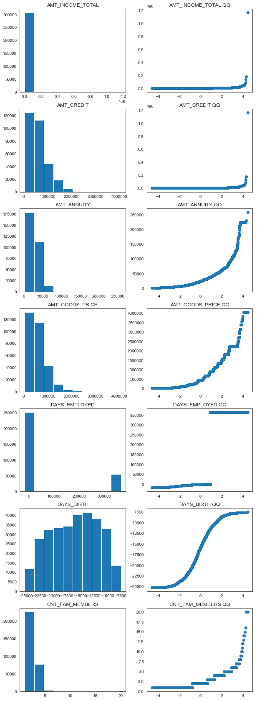
    


The QQ plots reveal that none of the distributions are normal. AMT_INCOME_TOTAL and AMT_CREDIT appear to have heavy-tailed distributions, while AMT_ANNUITY and AMT_GOODS_PRICE are right-skewed.


```python
df_jittered = df.loc[:, ['AMT_INCOME_TOTAL', 'AMT_CREDIT', 'AMT_ANNUITY', 'AMT_GOODS_PRICE', 'DAYS_EMPLOYED', 'DAYS_BIRTH', 'CNT_FAM_MEMBERS']].dropna()
df_jittered.head()
```


<div>
<style>
    .dataframe thead tr:only-child th {
        text-align: right;
    }

    .dataframe thead th {
        text-align: left;
    }

    .dataframe tbody tr th {
        vertical-align: top;
    }
</style>
<table border="1" class="dataframe">
  <thead>
    <tr style="text-align: right;">
      <th></th>
      <th>AMT_INCOME_TOTAL</th>
      <th>AMT_CREDIT</th>
      <th>AMT_ANNUITY</th>
      <th>AMT_GOODS_PRICE</th>
      <th>DAYS_EMPLOYED</th>
      <th>DAYS_BIRTH</th>
      <th>CNT_FAM_MEMBERS</th>
    </tr>
  </thead>
  <tbody>
    <tr>
      <th>0</th>
      <td>202500.0</td>
      <td>406597.5</td>
      <td>24700.5</td>
      <td>351000.0</td>
      <td>-637</td>
      <td>-9461</td>
      <td>1.0</td>
    </tr>
    <tr>
      <th>1</th>
      <td>270000.0</td>
      <td>1293502.5</td>
      <td>35698.5</td>
      <td>1129500.0</td>
      <td>-1188</td>
      <td>-16765</td>
      <td>2.0</td>
    </tr>
    <tr>
      <th>2</th>
      <td>67500.0</td>
      <td>135000.0</td>
      <td>6750.0</td>
      <td>135000.0</td>
      <td>-225</td>
      <td>-19046</td>
      <td>1.0</td>
    </tr>
    <tr>
      <th>3</th>
      <td>135000.0</td>
      <td>312682.5</td>
      <td>29686.5</td>
      <td>297000.0</td>
      <td>-3039</td>
      <td>-19005</td>
      <td>2.0</td>
    </tr>
    <tr>
      <th>4</th>
      <td>121500.0</td>
      <td>513000.0</td>
      <td>21865.5</td>
      <td>513000.0</td>
      <td>-3038</td>
      <td>-19932</td>
      <td>1.0</td>
    </tr>
  </tbody>
</table>
</div>


```python
jitter = pd.DataFrame(
    np.random.uniform(-.3, .3, size=(df_jittered.shape)),
    columns=df_jittered.columns
)

df_jittered = df_jittered.add(jitter)

g = sns.PairGrid(df_jittered.dropna(), diag_sharey=False)
g.map_upper(plt.scatter, alpha=.5)
g.map_lower(sns.regplot, scatter_kws=dict(alpha=0))
g.map_diag(sns.kdeplot, lw=3)

plt.show()
```


    
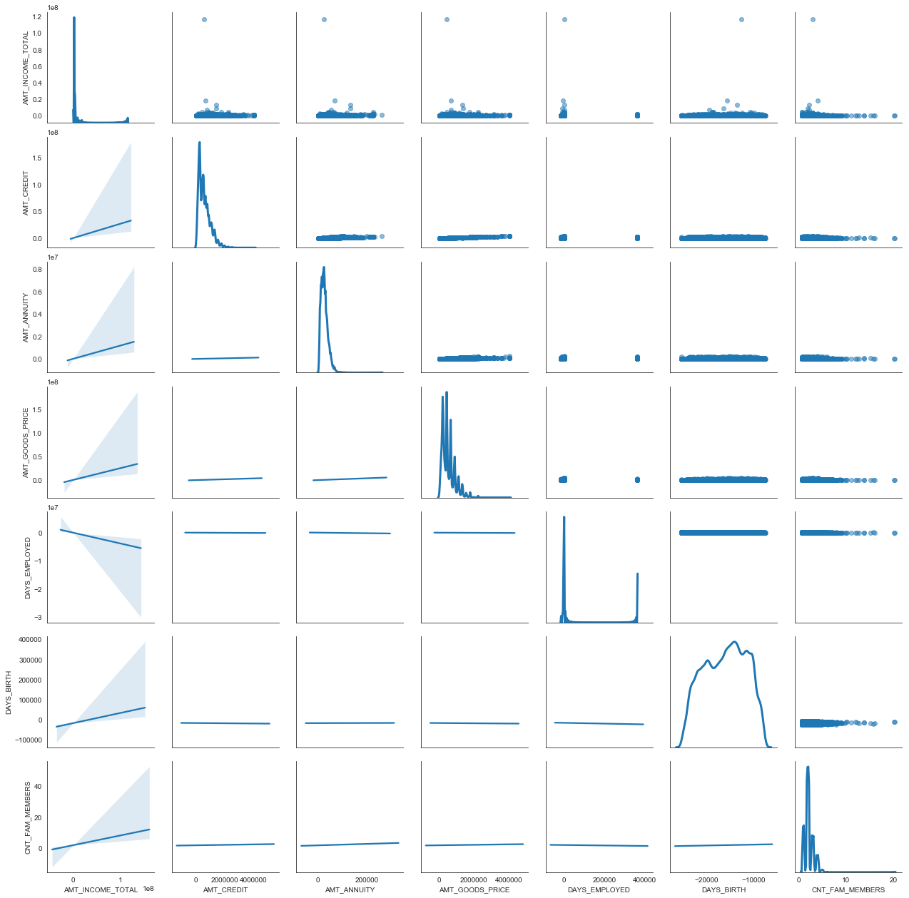
    


```python
corrmat = df.corr()
print(corrmat)
```

                        TARGET  AMT_INCOME_TOTAL  AMT_CREDIT  AMT_ANNUITY  \
    TARGET            1.000000         -0.003963   -0.030390    -0.012819   
    AMT_INCOME_TOTAL -0.003963          1.000000    0.156725     0.191512   
    AMT_CREDIT       -0.030390          0.156725    1.000000     0.769940   
    AMT_ANNUITY      -0.012819          0.191512    0.769940     1.000000   
    AMT_GOODS_PRICE  -0.039647          0.159607    0.986968     0.775109   
    DAYS_EMPLOYED    -0.044983         -0.064258   -0.067055    -0.104608   
    DAYS_BIRTH        0.078384          0.027342   -0.055112     0.009892   
    CNT_FAM_MEMBERS   0.009306          0.016371    0.063283     0.075709   
    
                      AMT_GOODS_PRICE  DAYS_EMPLOYED  DAYS_BIRTH  CNT_FAM_MEMBERS  
    TARGET                  -0.039647      -0.044983    0.078384         0.009306  
    AMT_INCOME_TOTAL         0.159607      -0.064258    0.027342         0.016371  
    AMT_CREDIT               0.986968      -0.067055   -0.055112         0.063283  
    AMT_ANNUITY              0.775109      -0.104608    0.009892         0.075709  
    AMT_GOODS_PRICE          1.000000      -0.064845   -0.053442         0.061180  
    DAYS_EMPLOYED           -0.064845       1.000000   -0.615906        -0.233637  
    DAYS_BIRTH              -0.053442      -0.615906    1.000000         0.279053  
    CNT_FAM_MEMBERS          0.061180      -0.233637    0.279053         1.000000  


```python
f, ax = plt.subplots(figsize=(12, 9))
sns.heatmap(corrmat, vmax=.8, square=True)
plt.show()
```


    
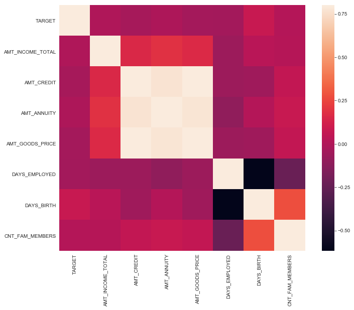
    


```python
df_long = df[['NAME_CONTRACT_TYPE', 'AMT_INCOME_TOTAL', 'AMT_CREDIT', 'AMT_ANNUITY', 'AMT_GOODS_PRICE', 'DAYS_EMPLOYED', 'DAYS_BIRTH', 'CNT_FAM_MEMBERS']]

df_long.head()
```


<div>
<style>
    .dataframe thead tr:only-child th {
        text-align: right;
    }

    .dataframe thead th {
        text-align: left;
    }

    .dataframe tbody tr th {
        vertical-align: top;
    }
</style>
<table border="1" class="dataframe">
  <thead>
    <tr style="text-align: right;">
      <th></th>
      <th>NAME_CONTRACT_TYPE</th>
      <th>AMT_INCOME_TOTAL</th>
      <th>AMT_CREDIT</th>
      <th>AMT_ANNUITY</th>
      <th>AMT_GOODS_PRICE</th>
      <th>DAYS_EMPLOYED</th>
      <th>DAYS_BIRTH</th>
      <th>CNT_FAM_MEMBERS</th>
    </tr>
  </thead>
  <tbody>
    <tr>
      <th>0</th>
      <td>Cash loans</td>
      <td>202500.0</td>
      <td>406597.5</td>
      <td>24700.5</td>
      <td>351000.0</td>
      <td>-637</td>
      <td>-9461</td>
      <td>1.0</td>
    </tr>
    <tr>
      <th>1</th>
      <td>Cash loans</td>
      <td>270000.0</td>
      <td>1293502.5</td>
      <td>35698.5</td>
      <td>1129500.0</td>
      <td>-1188</td>
      <td>-16765</td>
      <td>2.0</td>
    </tr>
    <tr>
      <th>2</th>
      <td>Revolving loans</td>
      <td>67500.0</td>
      <td>135000.0</td>
      <td>6750.0</td>
      <td>135000.0</td>
      <td>-225</td>
      <td>-19046</td>
      <td>1.0</td>
    </tr>
    <tr>
      <th>3</th>
      <td>Cash loans</td>
      <td>135000.0</td>
      <td>312682.5</td>
      <td>29686.5</td>
      <td>297000.0</td>
      <td>-3039</td>
      <td>-19005</td>
      <td>2.0</td>
    </tr>
    <tr>
      <th>4</th>
      <td>Cash loans</td>
      <td>121500.0</td>
      <td>513000.0</td>
      <td>21865.5</td>
      <td>513000.0</td>
      <td>-3038</td>
      <td>-19932</td>
      <td>1.0</td>
    </tr>
  </tbody>
</table>
</div>


```python
df_long = pd.melt(df_long, id_vars=['NAME_CONTRACT_TYPE'])

g = sns.FacetGrid(df_long, col="variable", size=8, aspect=.5)
g = g.map(sns.boxplot, "NAME_CONTRACT_TYPE", "value")
plt.show()

print(df.groupby('NAME_CONTRACT_TYPE').describe())

for col in df.loc[:,'AMT_INCOME_TOTAL':'AMT_GOODS_PRICE'].columns:
    print(col)
    print(stats.ttest_ind(
        df[df['NAME_CONTRACT_TYPE'] == 'Cash loans'][col].dropna(),
        df[df['NAME_CONTRACT_TYPE'] == 'Revolving loans'][col].dropna()
    ))
```

    /Users/rakeshbhatia/anaconda/lib/python3.6/site-packages/seaborn/axisgrid.py:230: UserWarning: The `size` paramter has been renamed to `height`; please update your code.
      warnings.warn(msg, UserWarning)
    /Users/rakeshbhatia/anaconda/lib/python3.6/site-packages/seaborn/axisgrid.py:715: UserWarning: Using the boxplot function without specifying `order` is likely to produce an incorrect plot.
      warnings.warn(warning)


    
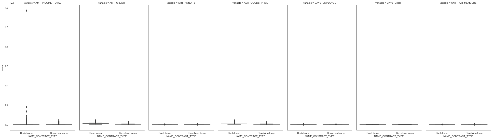
    


                       AMT_ANNUITY                                               \
                             count          mean           std     min      25%   
    NAME_CONTRACT_TYPE                                                            
    Cash loans            278220.0  28244.263958  14167.189802  1615.5  18103.5   
    Revolving loans        29001.0  16339.208131  13077.030037  6750.0   9000.0   
    
                                                   AMT_CREDIT                ...   \
                            50%      75%       max      count           mean ...    
    NAME_CONTRACT_TYPE                                                       ...    
    Cash loans          26086.5  35694.0  258025.5   278220.0  627968.410529 ...    
    Revolving loans     13500.0  18000.0  225000.0    29001.0  324443.467467 ...    
    
                       DAYS_EMPLOYED              TARGET                           \
                                 75%       max     count      mean       std  min   
    NAME_CONTRACT_TYPE                                                              
    Cash loans                -271.0  365243.0  278220.0  0.083463  0.276581  0.0   
    Revolving loans           -413.0  365243.0   29001.0  0.054584  0.227171  0.0   
    
                                            
                        25%  50%  75%  max  
    NAME_CONTRACT_TYPE                      
    Cash loans          0.0  0.0  0.0  1.0  
    Revolving loans     0.0  0.0  0.0  1.0  
    
    [2 rows x 64 columns]
    AMT_INCOME_TOTAL
    Ttest_indResult(statistic=1.7094611225127316, pvalue=0.087366577134200166)
    AMT_CREDIT
    Ttest_indResult(statistic=125.28593322379517, pvalue=0.0)
    AMT_ANNUITY
    Ttest_indResult(statistic=137.14422369947687, pvalue=0.0)
    AMT_GOODS_PRICE
    Ttest_indResult(statistic=104.84044017711973, pvalue=0.0)


# **Feature Engineering**

**Feature 1**

Differentiate rows by the type of loan, either cash loans or revolving loans.


```python
features = pd.get_dummies(df['NAME_CONTRACT_TYPE'])

features['contract_type'] = np.where((df['NAME_CONTRACT_TYPE'].isin(['Cash loans'])), 1, 0)

print(pd.crosstab(features['contract_type'], df['NAME_CONTRACT_TYPE']))
```

    NAME_CONTRACT_TYPE  Cash loans  Revolving loans
    contract_type                                  
    0                            0            29001
    1                       278220                0


**Feature 2**

Differentiate rows by gender, either male or female.


```python
features['gender'] = np.where((df['CODE_GENDER'].isin(['M'])), 1, 0)

print(pd.crosstab(features['gender'], df['CODE_GENDER']))
```

    CODE_GENDER       F       M  XNA
    gender                          
    0            202251       0    4
    1                 0  104966    0


**Features 3-6**

Ratio features based upon our continuous variables.


```python
features['DAYS_EMPLOYED_PERCENTAGE'] = df['DAYS_EMPLOYED']/df['DAYS_BIRTH']
features['INCOME_CREDIT_PERC'] = df['AMT_INCOME_TOTAL'] / df['AMT_CREDIT']
features['INCOME_PER_PERSON'] = df['AMT_INCOME_TOTAL'] / df['CNT_FAM_MEMBERS']
features['ANNUITY_INCOME_PERC'] = df['AMT_ANNUITY'] / df['AMT_INCOME_TOTAL']
features['PAYMENT_RATE'] = df['AMT_ANNUITY'] / df['AMT_CREDIT']

features.head()
```


<div>
<style>
    .dataframe thead tr:only-child th {
        text-align: right;
    }

    .dataframe thead th {
        text-align: left;
    }

    .dataframe tbody tr th {
        vertical-align: top;
    }
</style>
<table border="1" class="dataframe">
  <thead>
    <tr style="text-align: right;">
      <th></th>
      <th>Cash loans</th>
      <th>Revolving loans</th>
      <th>contract_type</th>
      <th>gender</th>
      <th>DAYS_EMPLOYED_PERCENTAGE</th>
      <th>INCOME_CREDIT_PERC</th>
      <th>INCOME_PER_PERSON</th>
      <th>ANNUITY_INCOME_PERC</th>
      <th>PAYMENT_RATE</th>
    </tr>
  </thead>
  <tbody>
    <tr>
      <th>0</th>
      <td>1</td>
      <td>0</td>
      <td>1</td>
      <td>1</td>
      <td>0.067329</td>
      <td>0.498036</td>
      <td>202500.0</td>
      <td>0.121978</td>
      <td>0.060749</td>
    </tr>
    <tr>
      <th>1</th>
      <td>1</td>
      <td>0</td>
      <td>1</td>
      <td>0</td>
      <td>0.070862</td>
      <td>0.208736</td>
      <td>135000.0</td>
      <td>0.132217</td>
      <td>0.027598</td>
    </tr>
    <tr>
      <th>2</th>
      <td>0</td>
      <td>1</td>
      <td>0</td>
      <td>1</td>
      <td>0.011814</td>
      <td>0.500000</td>
      <td>67500.0</td>
      <td>0.100000</td>
      <td>0.050000</td>
    </tr>
    <tr>
      <th>3</th>
      <td>1</td>
      <td>0</td>
      <td>1</td>
      <td>0</td>
      <td>0.159905</td>
      <td>0.431748</td>
      <td>67500.0</td>
      <td>0.219900</td>
      <td>0.094941</td>
    </tr>
    <tr>
      <th>4</th>
      <td>1</td>
      <td>0</td>
      <td>1</td>
      <td>1</td>
      <td>0.152418</td>
      <td>0.236842</td>
      <td>121500.0</td>
      <td>0.179963</td>
      <td>0.042623</td>
    </tr>
  </tbody>
</table>
</div>


**Features 7-10**

Transform non-normal variables into normal distributions using various transformations.


```python
fig = plt.figure(figsize=(10,10))

fig.add_subplot(221)
plt.hist(df['AMT_INCOME_TOTAL'].dropna())
plt.title('Raw')

fig.add_subplot(222)
plt.hist(np.log(df['AMT_INCOME_TOTAL'].dropna()))
plt.title('Log')

fig.add_subplot(223)
plt.hist(np.sqrt(df['AMT_INCOME_TOTAL'].dropna()))
plt.title('Square root')

ax3=fig.add_subplot(224)
plt.hist(1/df['AMT_INCOME_TOTAL'].dropna())
plt.title('Inverse')
plt.show()
```


    
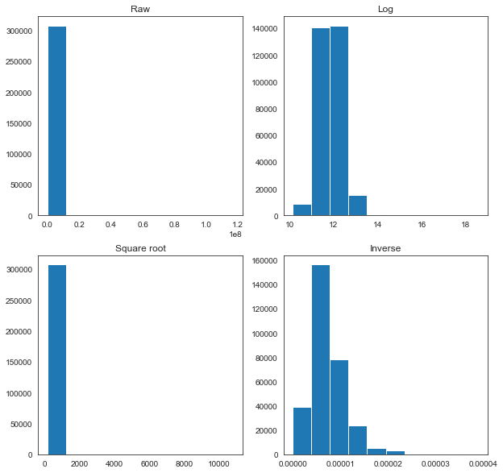
    


```python
fig = plt.figure(figsize=(10,10))

fig.add_subplot(221)
plt.hist(df['AMT_CREDIT'].dropna())
plt.title('Raw')

fig.add_subplot(222)
plt.hist(np.log(df['AMT_CREDIT'].dropna()))
plt.title('Log')

fig.add_subplot(223)
plt.hist(np.sqrt(df['AMT_CREDIT'].dropna()))
plt.title('Square root')

ax3=fig.add_subplot(224)
plt.hist(1/df['AMT_CREDIT'].dropna())
plt.title('Inverse')
plt.show()
```


    
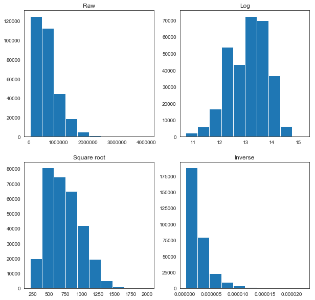
    


```python
fig = plt.figure(figsize=(10,10))

fig.add_subplot(221)
plt.hist(df['AMT_ANNUITY'].dropna())
plt.title('Raw')

fig.add_subplot(222)
plt.hist(np.log(df['AMT_ANNUITY'].dropna()))
plt.title('Log')

fig.add_subplot(223)
plt.hist(np.sqrt(df['AMT_ANNUITY'].dropna()))
plt.title('Square root')

ax3=fig.add_subplot(224)
plt.hist(1/df['AMT_ANNUITY'].dropna())
plt.title('Inverse')
plt.show()
```


    
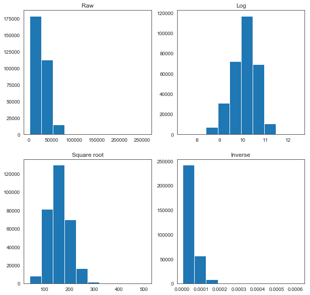
    


```python
fig = plt.figure(figsize=(10,10))

fig.add_subplot(221)
plt.hist(df['AMT_GOODS_PRICE'].dropna())
plt.title('Raw')

fig.add_subplot(222)
plt.hist(np.log(df['AMT_GOODS_PRICE'].dropna()))
plt.title('Log')

fig.add_subplot(223)
plt.hist(np.sqrt(df['AMT_GOODS_PRICE'].dropna()))
plt.title('Square root')

ax3=fig.add_subplot(224)
plt.hist(1/df['AMT_GOODS_PRICE'].dropna())
plt.title('Inverse')
plt.show()
```


    
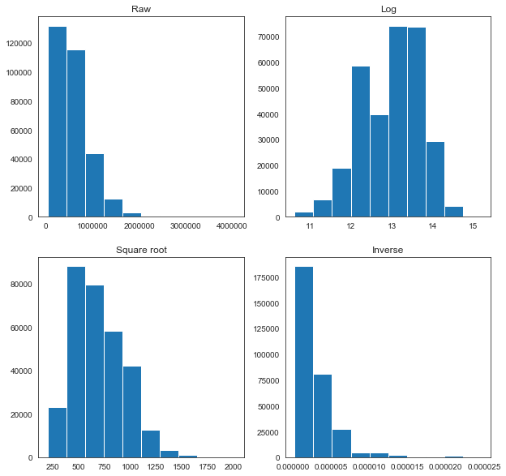
    


None of the transformations look optimal, but for the sake of simplicity, we will use the log transformation for each of these variables, as it appears closest to a normal distribution in each case.


```python
features['log_AMT_INCOME_TOTAL'] = np.log(df['AMT_INCOME_TOTAL'])
features['log_AMT_CREDIT'] = np.log(df['AMT_CREDIT'])
features['log_AMT_ANNUITY'] = np.log(df['AMT_ANNUITY'])
features['log_AMT_GOODS_PRICE'] = np.log(df['AMT_GOODS_PRICE'])

features.head()
```


<div>
<style>
    .dataframe thead tr:only-child th {
        text-align: right;
    }

    .dataframe thead th {
        text-align: left;
    }

    .dataframe tbody tr th {
        vertical-align: top;
    }
</style>
<table border="1" class="dataframe">
  <thead>
    <tr style="text-align: right;">
      <th></th>
      <th>Cash loans</th>
      <th>Revolving loans</th>
      <th>contract_type</th>
      <th>gender</th>
      <th>DAYS_EMPLOYED_PERCENTAGE</th>
      <th>INCOME_CREDIT_PERC</th>
      <th>INCOME_PER_PERSON</th>
      <th>ANNUITY_INCOME_PERC</th>
      <th>PAYMENT_RATE</th>
      <th>log_AMT_INCOME_TOTAL</th>
      <th>log_AMT_CREDIT</th>
      <th>log_AMT_ANNUITY</th>
      <th>log_AMT_GOODS_PRICE</th>
    </tr>
  </thead>
  <tbody>
    <tr>
      <th>0</th>
      <td>1</td>
      <td>0</td>
      <td>1</td>
      <td>1</td>
      <td>0.067329</td>
      <td>0.498036</td>
      <td>202500.0</td>
      <td>0.121978</td>
      <td>0.060749</td>
      <td>12.218495</td>
      <td>12.915579</td>
      <td>10.114579</td>
      <td>12.768542</td>
    </tr>
    <tr>
      <th>1</th>
      <td>1</td>
      <td>0</td>
      <td>1</td>
      <td>0</td>
      <td>0.070862</td>
      <td>0.208736</td>
      <td>135000.0</td>
      <td>0.132217</td>
      <td>0.027598</td>
      <td>12.506177</td>
      <td>14.072864</td>
      <td>10.482864</td>
      <td>13.937286</td>
    </tr>
    <tr>
      <th>2</th>
      <td>0</td>
      <td>1</td>
      <td>0</td>
      <td>1</td>
      <td>0.011814</td>
      <td>0.500000</td>
      <td>67500.0</td>
      <td>0.100000</td>
      <td>0.050000</td>
      <td>11.119883</td>
      <td>11.813030</td>
      <td>8.817298</td>
      <td>11.813030</td>
    </tr>
    <tr>
      <th>3</th>
      <td>1</td>
      <td>0</td>
      <td>1</td>
      <td>0</td>
      <td>0.159905</td>
      <td>0.431748</td>
      <td>67500.0</td>
      <td>0.219900</td>
      <td>0.094941</td>
      <td>11.813030</td>
      <td>12.652944</td>
      <td>10.298448</td>
      <td>12.601487</td>
    </tr>
    <tr>
      <th>4</th>
      <td>1</td>
      <td>0</td>
      <td>1</td>
      <td>1</td>
      <td>0.152418</td>
      <td>0.236842</td>
      <td>121500.0</td>
      <td>0.179963</td>
      <td>0.042623</td>
      <td>11.707670</td>
      <td>13.148031</td>
      <td>9.992665</td>
      <td>13.148031</td>
    </tr>
  </tbody>
</table>
</div>


# **Filtering Methods**

Now let's calculate the eigenvalues in order to filter our new features.


```python
# Take a subset of the data for PCA and drop missing values because PCA cannot
# handle them. We could also impute, but missingness is quite low so dropping
# missing rows is unlikely to create bias.
df_pca = df.loc[:, ['AMT_INCOME_TOTAL', 'AMT_CREDIT', 'AMT_ANNUITY', 'AMT_GOODS_PRICE', 'DAYS_EMPLOYED', 'DAYS_BIRTH', 'CNT_FAM_MEMBERS']].dropna()

# Normalize the data so that all variables have a mean of 0 and standard deviation
# of 1.
X = StandardScaler().fit_transform(df_pca)

# The NumPy covariance function assumes that variables are represented by rows,
# not columns, so we transpose X.
Xt = X.T
Cx = np.cov(Xt)
print('Covariance Matrix:\n', Cx)
```

    Covariance Matrix:
     [[ 1.00000325  0.15672504  0.19151286  0.1596074  -0.06425839  0.02734181
       0.01637096]
     [ 0.15672504  1.00000325  0.76994288  0.98697158 -0.06705522 -0.05511243
       0.06328275]
     [ 0.19151286  0.76994288  1.00000325  0.7751118  -0.10460866  0.00989235
       0.0757088 ]
     [ 0.1596074   0.98697158  0.7751118   1.00000325 -0.06484497 -0.05344208
       0.06118033]
     [-0.06425839 -0.06705522 -0.10460866 -0.06484497  1.00000325 -0.61590792
      -0.23363736]
     [ 0.02734181 -0.05511243  0.00989235 -0.05344208 -0.61590792  1.00000325
       0.27905365]
     [ 0.01637096  0.06328275  0.0757088   0.06118033 -0.23363736  0.27905365
       1.00000325]]


```python
# Calculating eigenvalues and eigenvectors.
eig_val_cov, eig_vec_cov = np.linalg.eig(Cx)

# Inspecting the eigenvalues and eigenvectors.
for i in range(len(eig_val_cov)):
    eigvec_cov = eig_vec_cov[:, i].reshape(1, 7).T
    print('Eigenvector {}: \n{}'.format(i + 1, eigvec_cov))
    print('Eigenvalue {}: {}'.format(i + 1, eig_val_cov[i]))
    print(40 * '-')

print(
    'The percentage of total variance in the dataset explained by each',
    'component calculated by hand.\n',
    eig_val_cov / sum(eig_val_cov)
)
```

    Eigenvector 1: 
    [[ 0.16641609]
     [ 0.57837723]
     [ 0.53449229]
     [ 0.57942582]
     [-0.09764964]
     [ 0.01685039]
     [ 0.08093076]]
    Eigenvalue 1: 2.763951825025901
    ----------------------------------------
    Eigenvector 2: 
    [[ 0.04228559]
     [-0.08442229]
     [-0.02596341]
     [-0.08507797]
     [-0.62499447]
     [ 0.65350783]
     [ 0.40679464]]
    Eigenvalue 2: 1.7781964580507592
    ----------------------------------------
    Eigenvector 3: 
    [[-0.96325971]
     [ 0.11191025]
     [ 0.03518478]
     [ 0.1087502 ]
     [ 0.03426714]
     [-0.00739369]
     [ 0.21286931]]
    Eigenvalue 3: 0.9556584341924335
    ----------------------------------------
    Eigenvector 4: 
    [[-0.19874613]
     [ 0.03744995]
     [ 0.04188913]
     [ 0.03884844]
     [-0.3460087 ]
     [ 0.24234247]
     [-0.88169251]]
    Eigenvalue 4: 0.8263242094268115
    ----------------------------------------
    Eigenvector 5: 
    [[ 0.00155355]
     [ 0.70352403]
     [ 0.0094712 ]
     [-0.71058203]
     [ 0.00412712]
     [ 0.0037848 ]
     [-0.00190643]]
    Eigenvalue 5: 0.012980129577330003
    ----------------------------------------
    Eigenvector 6: 
    [[-0.05572543]
     [-0.38647417]
     [ 0.83352149]
     [-0.37250993]
     [-0.04510817]
     [-0.10920935]
     [ 0.00701785]]
    Eigenvalue 6: 0.2888010326672988
    ----------------------------------------
    Eigenvector 7: 
    [[-0.00636989]
     [ 0.01085849]
     [-0.12571181]
     [ 0.00108283]
     [-0.69057833]
     [-0.70846174]
     [ 0.0722525 ]]
    Eigenvalue 7: 0.3741106960343986
    ----------------------------------------
    The percentage of total variance in the dataset explained by each component calculated by hand.
     [ 0.39484898  0.25402724  0.13652219  0.11804593  0.0018543   0.04125716
      0.05344421]


```python
plt.plot(eig_val_cov)
plt.show()
```


    
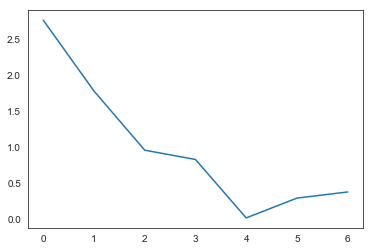
    


The scree plot and the eigenvalues > 1 rule indicate that we should keep only the first two components. Now we will create P, transform X into Y, and look at how well our new components correlate with our old variables.


```python
# Create P, which we will use to transform Cx into Cy to get Y, the
# dimensionally-reduced representation of X.
P = eig_vec_cov[:, 0]

# Transform X into Y.
Y = P.T.dot(Xt)

# Combine X and Y for plotting purposes.
data_to_plot = df_pca[['AMT_INCOME_TOTAL', 'AMT_CREDIT', 'AMT_ANNUITY', 'AMT_GOODS_PRICE','DAYS_EMPLOYED', 'DAYS_BIRTH', 'CNT_FAM_MEMBERS']]
data_to_plot['Component'] = Y
data_to_plot = pd.melt(data_to_plot, id_vars='Component')

g = sns.FacetGrid(data_to_plot, col="variable", size=4, aspect=.5)
g = g.map(
    sns.regplot,
    "Component",
    "value",
    x_jitter=.49,
    y_jitter=.49,
    fit_reg=False
)
plt.show()
```

    /Users/rakeshbhatia/anaconda/lib/python3.6/site-packages/seaborn/axisgrid.py:230: UserWarning: The `size` paramter has been renamed to `height`; please update your code.
      warnings.warn(msg, UserWarning)


    
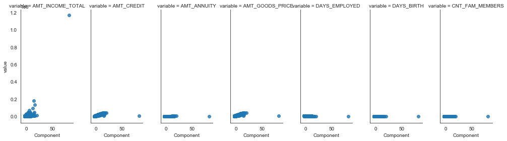
    


```python
sklearn_pca = PCA(n_components=7)
Y_sklearn = sklearn_pca.fit_transform(X)

print(
    'The percentage of total variance in the dataset explained by each',
    'component from Sklearn PCA.\n',
    sklearn_pca.explained_variance_ratio_
)

plt.plot(Y_sklearn[:, 0], Y, 'o')
plt.title('Comparing solutions')
plt.ylabel('Sklearn Component 1')
plt.xlabel('By-hand Component 1')
plt.show()
```

    The percentage of total variance in the dataset explained by each component from Sklearn PCA.
     [ 0.39484898  0.25402724  0.13652219  0.11804593  0.05344421  0.04125716
      0.0018543 ]


    
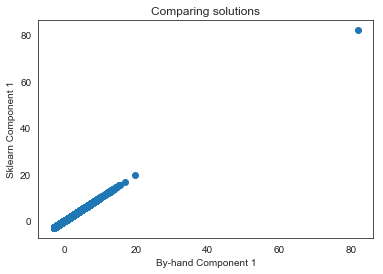
    


Ultimately we have a solution that encompasses over 64% of the variance in the data in just two components, rather than seven variables. Thus, we will only keep the following five features:

INCOME_CREDIT_PERC

INCOME_PER_PERSON

ANNUITY_INCOME_PERC

log_AMT_INCOME_TOTAL

log_AMT_CREDIT


```python

```
