# House Prices: Advanced Regression Techniques
# Introduction

This project is for the Kaggle competition House Prices: Advanced Regression Techniques. The dataset can be found on the competition page here:

https://www.kaggle.com/c/house-prices-advanced-regression-techniques/overview

The data consists of 81 total variables, many of which are redundant and/or unnecessary. Our target variable which we are trying to predict is SalePrice. 

We will first examine our features through visualizations, and then do feature engineering. Finally, we will do three iterations of model building:

    1) Simple feature selection based on manual inspection

    2) Feature importances from random forest regression
    
    3) Principal Components Analysis

# Preparing the Data
## Loading the Data


```python
import sys
import time
import numpy as np
import pandas as pd
import scipy
import matplotlib.pyplot as plt
import seaborn as sns
from sklearn.svm import SVC
from sklearn import ensemble
from sklearn import linear_model
from sklearn import neighbors
from sklearn.linear_model import LinearRegression
from sklearn.linear_model import Ridge
from sklearn.linear_model import Lasso
from sklearn.ensemble import RandomForestRegressor
from sklearn.ensemble import RandomForestClassifier
from sklearn.model_selection import cross_val_score
from sklearn.feature_selection import SelectKBest, f_classif
from matplotlib.mlab import PCA as mlabPCA
from sklearn.preprocessing import StandardScaler
from sklearn.preprocessing import LabelEncoder
from sklearn.decomposition import PCA
from sklearn.model_selection import train_test_split
from sklearn.metrics import precision_recall_curve
from sklearn.metrics import average_precision_score
from sklearn.metrics import classification_report
from sklearn.metrics import mean_squared_error
from sklearn.impute import SimpleImputer
from sklearn.model_selection import GridSearchCV
from sklearn.pipeline import Pipeline
import statsmodels.formula.api as smf
from scipy import stats
from scipy.stats import normaltest
from scipy.special import boxcox1p
from scipy.stats import norm
from scipy.stats import skew
%matplotlib inline
np.set_printoptions(threshold=sys.maxsize)
pd.set_option("display.max_rows", 100)
```


```python
df_train = pd.read_csv('train.csv')
df_train.head()
```


<div>
<style scoped>
    .dataframe tbody tr th:only-of-type {
        vertical-align: middle;
    }

    .dataframe tbody tr th {
        vertical-align: top;
    }

    .dataframe thead th {
        text-align: right;
    }
</style>
<table border="1" class="dataframe">
  <thead>
    <tr style="text-align: right;">
      <th></th>
      <th>Id</th>
      <th>MSSubClass</th>
      <th>MSZoning</th>
      <th>LotFrontage</th>
      <th>LotArea</th>
      <th>Street</th>
      <th>Alley</th>
      <th>LotShape</th>
      <th>LandContour</th>
      <th>Utilities</th>
      <th>...</th>
      <th>PoolArea</th>
      <th>PoolQC</th>
      <th>Fence</th>
      <th>MiscFeature</th>
      <th>MiscVal</th>
      <th>MoSold</th>
      <th>YrSold</th>
      <th>SaleType</th>
      <th>SaleCondition</th>
      <th>SalePrice</th>
    </tr>
  </thead>
  <tbody>
    <tr>
      <th>0</th>
      <td>1</td>
      <td>60</td>
      <td>RL</td>
      <td>65.0</td>
      <td>8450</td>
      <td>Pave</td>
      <td>NaN</td>
      <td>Reg</td>
      <td>Lvl</td>
      <td>AllPub</td>
      <td>...</td>
      <td>0</td>
      <td>NaN</td>
      <td>NaN</td>
      <td>NaN</td>
      <td>0</td>
      <td>2</td>
      <td>2008</td>
      <td>WD</td>
      <td>Normal</td>
      <td>208500</td>
    </tr>
    <tr>
      <th>1</th>
      <td>2</td>
      <td>20</td>
      <td>RL</td>
      <td>80.0</td>
      <td>9600</td>
      <td>Pave</td>
      <td>NaN</td>
      <td>Reg</td>
      <td>Lvl</td>
      <td>AllPub</td>
      <td>...</td>
      <td>0</td>
      <td>NaN</td>
      <td>NaN</td>
      <td>NaN</td>
      <td>0</td>
      <td>5</td>
      <td>2007</td>
      <td>WD</td>
      <td>Normal</td>
      <td>181500</td>
    </tr>
    <tr>
      <th>2</th>
      <td>3</td>
      <td>60</td>
      <td>RL</td>
      <td>68.0</td>
      <td>11250</td>
      <td>Pave</td>
      <td>NaN</td>
      <td>IR1</td>
      <td>Lvl</td>
      <td>AllPub</td>
      <td>...</td>
      <td>0</td>
      <td>NaN</td>
      <td>NaN</td>
      <td>NaN</td>
      <td>0</td>
      <td>9</td>
      <td>2008</td>
      <td>WD</td>
      <td>Normal</td>
      <td>223500</td>
    </tr>
    <tr>
      <th>3</th>
      <td>4</td>
      <td>70</td>
      <td>RL</td>
      <td>60.0</td>
      <td>9550</td>
      <td>Pave</td>
      <td>NaN</td>
      <td>IR1</td>
      <td>Lvl</td>
      <td>AllPub</td>
      <td>...</td>
      <td>0</td>
      <td>NaN</td>
      <td>NaN</td>
      <td>NaN</td>
      <td>0</td>
      <td>2</td>
      <td>2006</td>
      <td>WD</td>
      <td>Abnorml</td>
      <td>140000</td>
    </tr>
    <tr>
      <th>4</th>
      <td>5</td>
      <td>60</td>
      <td>RL</td>
      <td>84.0</td>
      <td>14260</td>
      <td>Pave</td>
      <td>NaN</td>
      <td>IR1</td>
      <td>Lvl</td>
      <td>AllPub</td>
      <td>...</td>
      <td>0</td>
      <td>NaN</td>
      <td>NaN</td>
      <td>NaN</td>
      <td>0</td>
      <td>12</td>
      <td>2008</td>
      <td>WD</td>
      <td>Normal</td>
      <td>250000</td>
    </tr>
  </tbody>
</table>
<p>5 rows × 81 columns</p>
</div>


```python
df_train.describe()
```


<div>
<style scoped>
    .dataframe tbody tr th:only-of-type {
        vertical-align: middle;
    }

    .dataframe tbody tr th {
        vertical-align: top;
    }

    .dataframe thead th {
        text-align: right;
    }
</style>
<table border="1" class="dataframe">
  <thead>
    <tr style="text-align: right;">
      <th></th>
      <th>Id</th>
      <th>MSSubClass</th>
      <th>LotFrontage</th>
      <th>LotArea</th>
      <th>OverallQual</th>
      <th>OverallCond</th>
      <th>YearBuilt</th>
      <th>YearRemodAdd</th>
      <th>MasVnrArea</th>
      <th>BsmtFinSF1</th>
      <th>...</th>
      <th>WoodDeckSF</th>
      <th>OpenPorchSF</th>
      <th>EnclosedPorch</th>
      <th>3SsnPorch</th>
      <th>ScreenPorch</th>
      <th>PoolArea</th>
      <th>MiscVal</th>
      <th>MoSold</th>
      <th>YrSold</th>
      <th>SalePrice</th>
    </tr>
  </thead>
  <tbody>
    <tr>
      <th>count</th>
      <td>1460.000000</td>
      <td>1460.000000</td>
      <td>1201.000000</td>
      <td>1460.000000</td>
      <td>1460.000000</td>
      <td>1460.000000</td>
      <td>1460.000000</td>
      <td>1460.000000</td>
      <td>1452.000000</td>
      <td>1460.000000</td>
      <td>...</td>
      <td>1460.000000</td>
      <td>1460.000000</td>
      <td>1460.000000</td>
      <td>1460.000000</td>
      <td>1460.000000</td>
      <td>1460.000000</td>
      <td>1460.000000</td>
      <td>1460.000000</td>
      <td>1460.000000</td>
      <td>1460.000000</td>
    </tr>
    <tr>
      <th>mean</th>
      <td>730.500000</td>
      <td>56.897260</td>
      <td>70.049958</td>
      <td>10516.828082</td>
      <td>6.099315</td>
      <td>5.575342</td>
      <td>1971.267808</td>
      <td>1984.865753</td>
      <td>103.685262</td>
      <td>443.639726</td>
      <td>...</td>
      <td>94.244521</td>
      <td>46.660274</td>
      <td>21.954110</td>
      <td>3.409589</td>
      <td>15.060959</td>
      <td>2.758904</td>
      <td>43.489041</td>
      <td>6.321918</td>
      <td>2007.815753</td>
      <td>180921.195890</td>
    </tr>
    <tr>
      <th>std</th>
      <td>421.610009</td>
      <td>42.300571</td>
      <td>24.284752</td>
      <td>9981.264932</td>
      <td>1.382997</td>
      <td>1.112799</td>
      <td>30.202904</td>
      <td>20.645407</td>
      <td>181.066207</td>
      <td>456.098091</td>
      <td>...</td>
      <td>125.338794</td>
      <td>66.256028</td>
      <td>61.119149</td>
      <td>29.317331</td>
      <td>55.757415</td>
      <td>40.177307</td>
      <td>496.123024</td>
      <td>2.703626</td>
      <td>1.328095</td>
      <td>79442.502883</td>
    </tr>
    <tr>
      <th>min</th>
      <td>1.000000</td>
      <td>20.000000</td>
      <td>21.000000</td>
      <td>1300.000000</td>
      <td>1.000000</td>
      <td>1.000000</td>
      <td>1872.000000</td>
      <td>1950.000000</td>
      <td>0.000000</td>
      <td>0.000000</td>
      <td>...</td>
      <td>0.000000</td>
      <td>0.000000</td>
      <td>0.000000</td>
      <td>0.000000</td>
      <td>0.000000</td>
      <td>0.000000</td>
      <td>0.000000</td>
      <td>1.000000</td>
      <td>2006.000000</td>
      <td>34900.000000</td>
    </tr>
    <tr>
      <th>25%</th>
      <td>365.750000</td>
      <td>20.000000</td>
      <td>59.000000</td>
      <td>7553.500000</td>
      <td>5.000000</td>
      <td>5.000000</td>
      <td>1954.000000</td>
      <td>1967.000000</td>
      <td>0.000000</td>
      <td>0.000000</td>
      <td>...</td>
      <td>0.000000</td>
      <td>0.000000</td>
      <td>0.000000</td>
      <td>0.000000</td>
      <td>0.000000</td>
      <td>0.000000</td>
      <td>0.000000</td>
      <td>5.000000</td>
      <td>2007.000000</td>
      <td>129975.000000</td>
    </tr>
    <tr>
      <th>50%</th>
      <td>730.500000</td>
      <td>50.000000</td>
      <td>69.000000</td>
      <td>9478.500000</td>
      <td>6.000000</td>
      <td>5.000000</td>
      <td>1973.000000</td>
      <td>1994.000000</td>
      <td>0.000000</td>
      <td>383.500000</td>
      <td>...</td>
      <td>0.000000</td>
      <td>25.000000</td>
      <td>0.000000</td>
      <td>0.000000</td>
      <td>0.000000</td>
      <td>0.000000</td>
      <td>0.000000</td>
      <td>6.000000</td>
      <td>2008.000000</td>
      <td>163000.000000</td>
    </tr>
    <tr>
      <th>75%</th>
      <td>1095.250000</td>
      <td>70.000000</td>
      <td>80.000000</td>
      <td>11601.500000</td>
      <td>7.000000</td>
      <td>6.000000</td>
      <td>2000.000000</td>
      <td>2004.000000</td>
      <td>166.000000</td>
      <td>712.250000</td>
      <td>...</td>
      <td>168.000000</td>
      <td>68.000000</td>
      <td>0.000000</td>
      <td>0.000000</td>
      <td>0.000000</td>
      <td>0.000000</td>
      <td>0.000000</td>
      <td>8.000000</td>
      <td>2009.000000</td>
      <td>214000.000000</td>
    </tr>
    <tr>
      <th>max</th>
      <td>1460.000000</td>
      <td>190.000000</td>
      <td>313.000000</td>
      <td>215245.000000</td>
      <td>10.000000</td>
      <td>9.000000</td>
      <td>2010.000000</td>
      <td>2010.000000</td>
      <td>1600.000000</td>
      <td>5644.000000</td>
      <td>...</td>
      <td>857.000000</td>
      <td>547.000000</td>
      <td>552.000000</td>
      <td>508.000000</td>
      <td>480.000000</td>
      <td>738.000000</td>
      <td>15500.000000</td>
      <td>12.000000</td>
      <td>2010.000000</td>
      <td>755000.000000</td>
    </tr>
  </tbody>
</table>
<p>8 rows × 38 columns</p>
</div>


```python
df_train.shape
```


    (1460, 81)


Before we start, let's drop `Id` since it is unnecessary for our analysis.


```python
df_train.drop('Id', axis=1, inplace=True)
df_train.describe()
```


<div>
<style scoped>
    .dataframe tbody tr th:only-of-type {
        vertical-align: middle;
    }

    .dataframe tbody tr th {
        vertical-align: top;
    }

    .dataframe thead th {
        text-align: right;
    }
</style>
<table border="1" class="dataframe">
  <thead>
    <tr style="text-align: right;">
      <th></th>
      <th>MSSubClass</th>
      <th>LotFrontage</th>
      <th>LotArea</th>
      <th>OverallQual</th>
      <th>OverallCond</th>
      <th>YearBuilt</th>
      <th>YearRemodAdd</th>
      <th>MasVnrArea</th>
      <th>BsmtFinSF1</th>
      <th>BsmtFinSF2</th>
      <th>...</th>
      <th>WoodDeckSF</th>
      <th>OpenPorchSF</th>
      <th>EnclosedPorch</th>
      <th>3SsnPorch</th>
      <th>ScreenPorch</th>
      <th>PoolArea</th>
      <th>MiscVal</th>
      <th>MoSold</th>
      <th>YrSold</th>
      <th>SalePrice</th>
    </tr>
  </thead>
  <tbody>
    <tr>
      <th>count</th>
      <td>1460.000000</td>
      <td>1201.000000</td>
      <td>1460.000000</td>
      <td>1460.000000</td>
      <td>1460.000000</td>
      <td>1460.000000</td>
      <td>1460.000000</td>
      <td>1452.000000</td>
      <td>1460.000000</td>
      <td>1460.000000</td>
      <td>...</td>
      <td>1460.000000</td>
      <td>1460.000000</td>
      <td>1460.000000</td>
      <td>1460.000000</td>
      <td>1460.000000</td>
      <td>1460.000000</td>
      <td>1460.000000</td>
      <td>1460.000000</td>
      <td>1460.000000</td>
      <td>1460.000000</td>
    </tr>
    <tr>
      <th>mean</th>
      <td>56.897260</td>
      <td>70.049958</td>
      <td>10516.828082</td>
      <td>6.099315</td>
      <td>5.575342</td>
      <td>1971.267808</td>
      <td>1984.865753</td>
      <td>103.685262</td>
      <td>443.639726</td>
      <td>46.549315</td>
      <td>...</td>
      <td>94.244521</td>
      <td>46.660274</td>
      <td>21.954110</td>
      <td>3.409589</td>
      <td>15.060959</td>
      <td>2.758904</td>
      <td>43.489041</td>
      <td>6.321918</td>
      <td>2007.815753</td>
      <td>180921.195890</td>
    </tr>
    <tr>
      <th>std</th>
      <td>42.300571</td>
      <td>24.284752</td>
      <td>9981.264932</td>
      <td>1.382997</td>
      <td>1.112799</td>
      <td>30.202904</td>
      <td>20.645407</td>
      <td>181.066207</td>
      <td>456.098091</td>
      <td>161.319273</td>
      <td>...</td>
      <td>125.338794</td>
      <td>66.256028</td>
      <td>61.119149</td>
      <td>29.317331</td>
      <td>55.757415</td>
      <td>40.177307</td>
      <td>496.123024</td>
      <td>2.703626</td>
      <td>1.328095</td>
      <td>79442.502883</td>
    </tr>
    <tr>
      <th>min</th>
      <td>20.000000</td>
      <td>21.000000</td>
      <td>1300.000000</td>
      <td>1.000000</td>
      <td>1.000000</td>
      <td>1872.000000</td>
      <td>1950.000000</td>
      <td>0.000000</td>
      <td>0.000000</td>
      <td>0.000000</td>
      <td>...</td>
      <td>0.000000</td>
      <td>0.000000</td>
      <td>0.000000</td>
      <td>0.000000</td>
      <td>0.000000</td>
      <td>0.000000</td>
      <td>0.000000</td>
      <td>1.000000</td>
      <td>2006.000000</td>
      <td>34900.000000</td>
    </tr>
    <tr>
      <th>25%</th>
      <td>20.000000</td>
      <td>59.000000</td>
      <td>7553.500000</td>
      <td>5.000000</td>
      <td>5.000000</td>
      <td>1954.000000</td>
      <td>1967.000000</td>
      <td>0.000000</td>
      <td>0.000000</td>
      <td>0.000000</td>
      <td>...</td>
      <td>0.000000</td>
      <td>0.000000</td>
      <td>0.000000</td>
      <td>0.000000</td>
      <td>0.000000</td>
      <td>0.000000</td>
      <td>0.000000</td>
      <td>5.000000</td>
      <td>2007.000000</td>
      <td>129975.000000</td>
    </tr>
    <tr>
      <th>50%</th>
      <td>50.000000</td>
      <td>69.000000</td>
      <td>9478.500000</td>
      <td>6.000000</td>
      <td>5.000000</td>
      <td>1973.000000</td>
      <td>1994.000000</td>
      <td>0.000000</td>
      <td>383.500000</td>
      <td>0.000000</td>
      <td>...</td>
      <td>0.000000</td>
      <td>25.000000</td>
      <td>0.000000</td>
      <td>0.000000</td>
      <td>0.000000</td>
      <td>0.000000</td>
      <td>0.000000</td>
      <td>6.000000</td>
      <td>2008.000000</td>
      <td>163000.000000</td>
    </tr>
    <tr>
      <th>75%</th>
      <td>70.000000</td>
      <td>80.000000</td>
      <td>11601.500000</td>
      <td>7.000000</td>
      <td>6.000000</td>
      <td>2000.000000</td>
      <td>2004.000000</td>
      <td>166.000000</td>
      <td>712.250000</td>
      <td>0.000000</td>
      <td>...</td>
      <td>168.000000</td>
      <td>68.000000</td>
      <td>0.000000</td>
      <td>0.000000</td>
      <td>0.000000</td>
      <td>0.000000</td>
      <td>0.000000</td>
      <td>8.000000</td>
      <td>2009.000000</td>
      <td>214000.000000</td>
    </tr>
    <tr>
      <th>max</th>
      <td>190.000000</td>
      <td>313.000000</td>
      <td>215245.000000</td>
      <td>10.000000</td>
      <td>9.000000</td>
      <td>2010.000000</td>
      <td>2010.000000</td>
      <td>1600.000000</td>
      <td>5644.000000</td>
      <td>1474.000000</td>
      <td>...</td>
      <td>857.000000</td>
      <td>547.000000</td>
      <td>552.000000</td>
      <td>508.000000</td>
      <td>480.000000</td>
      <td>738.000000</td>
      <td>15500.000000</td>
      <td>12.000000</td>
      <td>2010.000000</td>
      <td>755000.000000</td>
    </tr>
  </tbody>
</table>
<p>8 rows × 37 columns</p>
</div>


## Dropping Outliers

The dataset [documentation](http://jse.amstat.org/v19n3/decock.pdf) indicates that there are five outliers that should be removed prior to proceeding with the data (four in the training set). These outliers can be easily seen from the scatter plot of SalePrice vs. GrLivArea. Let's write a simple function that allows us to easily plot a single scatter plot.


```python
# Function to easily plot a single scatter plot
def scatter_plot_single(df, target, col):
    plt.scatter(x=df[col], y=df[target])
    plt.xlabel(col)
    plt.ylabel(target)
    plt.title(target + ' vs. ' + col)

scatter_plot_single(df_train, 'SalePrice', 'GrLivArea')
```


    
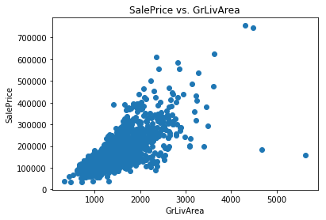
    


We can see the four outliers in question. Two of them are very low-priced houses with a high GrLivArea. The other three simply appear to be expensive houses that are still following the trend. The documentation recommends us to get rid of these outliers before processing the data further, so let's do that.


```python
# Check shape
df_train.shape
```


    (1460, 80)


```python
df_train = df_train.drop(df_train[(df_train['GrLivArea']>4000)].index)

# Check shape again
df_train.shape
```


    (1456, 80)


```python
# Plot again for visual check
scatter_plot_single(df_train, 'SalePrice', 'GrLivArea')
```


    
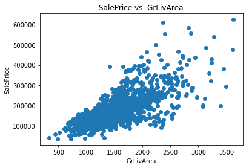
    


```python
# Check shape
df_train.shape
```


    (1456, 80)


# Exploring the Data

## Univariate Data

Let's plot the distributions for each of our continuous features. We can write a function to do this.


```python
cols = ['MSSubClass', 'LotFrontage', 'LotArea', 'OverallQual', 'OverallCond', 
        'YearBuilt', 'YearRemodAdd', 'MasVnrArea', 'BsmtFinSF1', 'BsmtFinSF2', 
        'BsmtUnfSF', 'TotalBsmtSF', '1stFlrSF', '2ndFlrSF', 'LowQualFinSF', 
        'GrLivArea', 'BsmtFullBath', 'BsmtHalfBath', 'FullBath', 'HalfBath',
        'BedroomAbvGr', 'KitchenAbvGr', 'TotRmsAbvGrd', 'Fireplaces', 'GarageYrBlt', 
        'GarageCars', 'GarageArea', 'WoodDeckSF', 'OpenPorchSF', 'EnclosedPorch', 
        '3SsnPorch', 'ScreenPorch', 'PoolArea', 'MiscVal', 'MoSold', 'YrSold']
```


```python
# Function to neatly plot multiple histograms
def histogram_multiple(df, cols, figsize_x, figsize_y, nrows, ncols):
    i = 1
    plt.figure(figsize=(figsize_x, figsize_y))
    
    for col in cols:
        plt.subplot(nrows,ncols,i)
        plt.hist(df[col], bins=20)
        plt.xlabel(col)
        plt.title(col + ' Distribution')
        i += 1
    
    plt.tight_layout()
    plt.show()

histogram_multiple(df_train, cols, 15, 50, 15, 4)
```


    
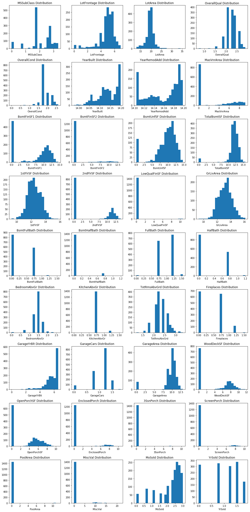
    


## Feature-Target Relationships

### Continuous Features

Now let's visualize the relationship between SalePrice and all of our continuous features. We can write a function to easily create a scatter plot for any given x and y with our desired parameters. First let's put all the column names for our continuous variables into a list.


```python
# Function to easily plot a single scatter plot
def scatter_plot_single(df, target, col):
    plt.scatter(x=df[col], y=df[target])
    plt.xlabel(col)
    plt.ylabel(target)
    plt.title(target + ' vs. ' + col)
     
# Function to neatly plot multiple scatter plots
def scatter_plot_multiple(df, target, cols, figsize_x, figsize_y, nrows, ncols):
    i = 1
    plt.figure(figsize=(figsize_x, figsize_y))
    
    for col in cols:
        if col != target:
            plt.subplot(nrows,ncols,i)
            scatter_plot_single(df, target, col)
            i += 1
    
    plt.tight_layout()
    plt.show()
```

Now we can use this to neatly visualize scatter plots of `SalePrice` with many different input features all in one place. For the amount of features we have, we can use nine rows and four columns.


```python
df_train.head()
```


<div>
<style scoped>
    .dataframe tbody tr th:only-of-type {
        vertical-align: middle;
    }

    .dataframe tbody tr th {
        vertical-align: top;
    }

    .dataframe thead th {
        text-align: right;
    }
</style>
<table border="1" class="dataframe">
  <thead>
    <tr style="text-align: right;">
      <th></th>
      <th>MSSubClass</th>
      <th>MSZoning</th>
      <th>LotFrontage</th>
      <th>LotArea</th>
      <th>Street</th>
      <th>Alley</th>
      <th>LotShape</th>
      <th>LandContour</th>
      <th>Utilities</th>
      <th>LotConfig</th>
      <th>...</th>
      <th>PoolArea</th>
      <th>PoolQC</th>
      <th>Fence</th>
      <th>MiscFeature</th>
      <th>MiscVal</th>
      <th>MoSold</th>
      <th>YrSold</th>
      <th>SaleType</th>
      <th>SaleCondition</th>
      <th>SalePrice</th>
    </tr>
  </thead>
  <tbody>
    <tr>
      <th>0</th>
      <td>60</td>
      <td>RL</td>
      <td>65.0</td>
      <td>8450</td>
      <td>Pave</td>
      <td>NaN</td>
      <td>Reg</td>
      <td>Lvl</td>
      <td>AllPub</td>
      <td>Inside</td>
      <td>...</td>
      <td>0</td>
      <td>NaN</td>
      <td>NaN</td>
      <td>NaN</td>
      <td>0</td>
      <td>2</td>
      <td>2008</td>
      <td>WD</td>
      <td>Normal</td>
      <td>208500</td>
    </tr>
    <tr>
      <th>1</th>
      <td>20</td>
      <td>RL</td>
      <td>80.0</td>
      <td>9600</td>
      <td>Pave</td>
      <td>NaN</td>
      <td>Reg</td>
      <td>Lvl</td>
      <td>AllPub</td>
      <td>FR2</td>
      <td>...</td>
      <td>0</td>
      <td>NaN</td>
      <td>NaN</td>
      <td>NaN</td>
      <td>0</td>
      <td>5</td>
      <td>2007</td>
      <td>WD</td>
      <td>Normal</td>
      <td>181500</td>
    </tr>
    <tr>
      <th>2</th>
      <td>60</td>
      <td>RL</td>
      <td>68.0</td>
      <td>11250</td>
      <td>Pave</td>
      <td>NaN</td>
      <td>IR1</td>
      <td>Lvl</td>
      <td>AllPub</td>
      <td>Inside</td>
      <td>...</td>
      <td>0</td>
      <td>NaN</td>
      <td>NaN</td>
      <td>NaN</td>
      <td>0</td>
      <td>9</td>
      <td>2008</td>
      <td>WD</td>
      <td>Normal</td>
      <td>223500</td>
    </tr>
    <tr>
      <th>3</th>
      <td>70</td>
      <td>RL</td>
      <td>60.0</td>
      <td>9550</td>
      <td>Pave</td>
      <td>NaN</td>
      <td>IR1</td>
      <td>Lvl</td>
      <td>AllPub</td>
      <td>Corner</td>
      <td>...</td>
      <td>0</td>
      <td>NaN</td>
      <td>NaN</td>
      <td>NaN</td>
      <td>0</td>
      <td>2</td>
      <td>2006</td>
      <td>WD</td>
      <td>Abnorml</td>
      <td>140000</td>
    </tr>
    <tr>
      <th>4</th>
      <td>60</td>
      <td>RL</td>
      <td>84.0</td>
      <td>14260</td>
      <td>Pave</td>
      <td>NaN</td>
      <td>IR1</td>
      <td>Lvl</td>
      <td>AllPub</td>
      <td>FR2</td>
      <td>...</td>
      <td>0</td>
      <td>NaN</td>
      <td>NaN</td>
      <td>NaN</td>
      <td>0</td>
      <td>12</td>
      <td>2008</td>
      <td>WD</td>
      <td>Normal</td>
      <td>250000</td>
    </tr>
  </tbody>
</table>
<p>5 rows × 80 columns</p>
</div>


```python
continuous_feature_names = df_train.select_dtypes(['float64','int64']).columns
scatter_plot_multiple(df_train, 'SalePrice', continuous_feature_names, 15, 50, 15, 4)
```


    
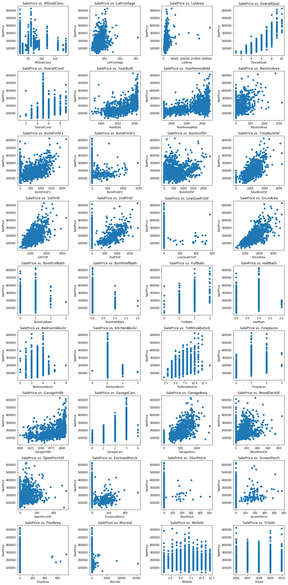
    


The following features exhibit a strong linear relationship with SalePrice:

* LotFrontage
* TotalBsmtSF
* 1stFlrSF
* GrLivArea
* GarageArea

The following features exhibit a weak linear relationship with SalePrice:

* LotArea
* MasVnrArea
* BsmtFinSF1
* BsmtUnfSF
* WoodDeckSF
* OpenPorchSF
* PoolArea

We will transform the nonlinear features in order to linearize them prior to modeling.

### Categorical Features

Now let's visualize some categorical variables to see how they relate to SalePrice. First let's plot a boxplot of SalePrice vs. OverallQual.


```python
var = 'OverallQual'
data = pd.concat([df_train['SalePrice'], df_train[var]], axis=1)
f, ax = plt.subplots(figsize=(8, 6))
fig = sns.boxplot(x=var, y="SalePrice", data=data)
fig.axis(ymin=0, ymax=800000);
```


    
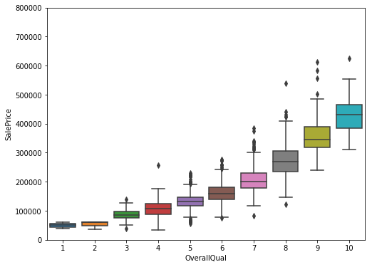
    


We can clearly see that as the owner-reported overall quality rating increases, the SalePrice increases as well, which makes sense. We would expect higher-priced homes to be of better quality. Now let's take a look at SalePrice vs. YearBuilt.


```python
var = 'YearBuilt'
data = pd.concat([df_train['SalePrice'], df_train[var]], axis=1)
f, ax = plt.subplots(figsize=(16, 8))
fig = sns.boxplot(x=var, y="SalePrice", data=data)
fig.axis(ymin=0, ymax=800000);
plt.xticks(rotation=90);
```


    
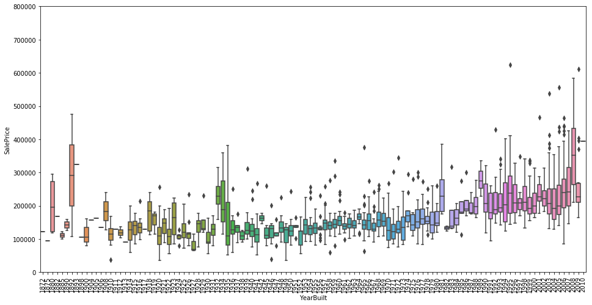
    


The home selling price does appear to increase slightly over time, aside from some odd outliers at the far left end of the scale (late 1800s).

Our target variable is `SalePrice`, so our objective will be to predict a home's selling price based on the given input features. We will place an emphasis on feature engineering to maximize model accuracy.

## Analysis of SalePrice

Let's take a closer look at our target variable.


```python
df_train['SalePrice'].describe()
```


    count      1456.000000
    mean     180151.233516
    std       76696.592530
    min       34900.000000
    25%      129900.000000
    50%      163000.000000
    75%      214000.000000
    max      625000.000000
    Name: SalePrice, dtype: float64


```python
df_train[df_train.SalePrice == df_train.SalePrice.max()]
```


<div>
<style scoped>
    .dataframe tbody tr th:only-of-type {
        vertical-align: middle;
    }

    .dataframe tbody tr th {
        vertical-align: top;
    }

    .dataframe thead th {
        text-align: right;
    }
</style>
<table border="1" class="dataframe">
  <thead>
    <tr style="text-align: right;">
      <th></th>
      <th>MSSubClass</th>
      <th>MSZoning</th>
      <th>LotFrontage</th>
      <th>LotArea</th>
      <th>Street</th>
      <th>Alley</th>
      <th>LotShape</th>
      <th>LandContour</th>
      <th>Utilities</th>
      <th>LotConfig</th>
      <th>...</th>
      <th>PoolArea</th>
      <th>PoolQC</th>
      <th>Fence</th>
      <th>MiscFeature</th>
      <th>MiscVal</th>
      <th>MoSold</th>
      <th>YrSold</th>
      <th>SaleType</th>
      <th>SaleCondition</th>
      <th>SalePrice</th>
    </tr>
  </thead>
  <tbody>
    <tr>
      <th>1169</th>
      <td>60</td>
      <td>RL</td>
      <td>118.0</td>
      <td>35760</td>
      <td>Pave</td>
      <td>NaN</td>
      <td>IR1</td>
      <td>Lvl</td>
      <td>AllPub</td>
      <td>CulDSac</td>
      <td>...</td>
      <td>0</td>
      <td>NaN</td>
      <td>NaN</td>
      <td>NaN</td>
      <td>0</td>
      <td>7</td>
      <td>2006</td>
      <td>WD</td>
      <td>Normal</td>
      <td>625000</td>
    </tr>
  </tbody>
</table>
<p>1 rows × 80 columns</p>
</div>


```python
sns.distplot(df_train['SalePrice']);
```


    
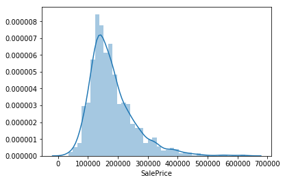
    


`SalePrice` deviates from a normal distribution and appears to be right-skewed. Linear models perform better with normally distributed data, so we should transform this variable. We can use the `numpy.log1p()` function to transform the data so that it is accurate for a wide range of floating point values. This is equivalent to ln(1+p), which allows us to include 0 values.


```python
df_train['SalePrice'] = np.log1p(df_train['SalePrice'])

# Check the distribution again
sns.distplot(df_train['SalePrice']);
```


    
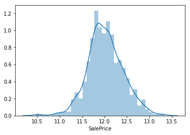
    


## Correlation Heatmap


```python
# Correlation map
corr = df_train.corr()
plt.subplots(figsize=(15,10))
sns.heatmap(corr, vmax=0.8, square=True)
```


    <matplotlib.axes._subplots.AxesSubplot at 0x11c64a1d0>


    
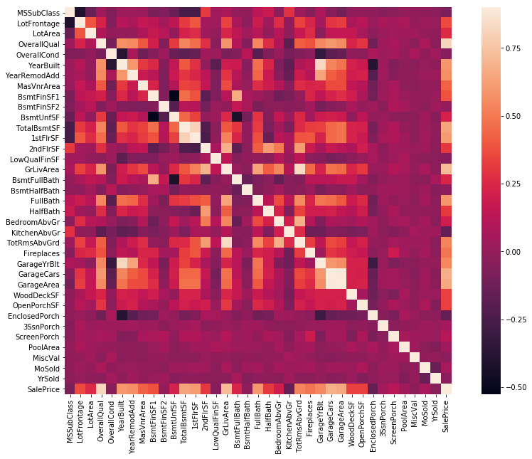
    


Most of the variables appear to be moderately correlated.

# Feature Engineering

## Handle Missing Values
We will impute the missing values for each feature. First, let's see how many missing values there are.


```python
# Missing data
total = df_train.isnull().sum().sort_values(ascending=False)
percent = (df_train.isnull().sum()/df_train.isnull().count()).sort_values(ascending=False)
missing_data = pd.concat([total, percent], axis=1, keys=['Total', 'Percent'])
missing_data.head(20)
```


<div>
<style scoped>
    .dataframe tbody tr th:only-of-type {
        vertical-align: middle;
    }

    .dataframe tbody tr th {
        vertical-align: top;
    }

    .dataframe thead th {
        text-align: right;
    }
</style>
<table border="1" class="dataframe">
  <thead>
    <tr style="text-align: right;">
      <th></th>
      <th>Total</th>
      <th>Percent</th>
    </tr>
  </thead>
  <tbody>
    <tr>
      <th>PoolQC</th>
      <td>1451</td>
      <td>0.996566</td>
    </tr>
    <tr>
      <th>MiscFeature</th>
      <td>1402</td>
      <td>0.962912</td>
    </tr>
    <tr>
      <th>Alley</th>
      <td>1365</td>
      <td>0.937500</td>
    </tr>
    <tr>
      <th>Fence</th>
      <td>1176</td>
      <td>0.807692</td>
    </tr>
    <tr>
      <th>FireplaceQu</th>
      <td>690</td>
      <td>0.473901</td>
    </tr>
    <tr>
      <th>LotFrontage</th>
      <td>259</td>
      <td>0.177885</td>
    </tr>
    <tr>
      <th>GarageType</th>
      <td>81</td>
      <td>0.055632</td>
    </tr>
    <tr>
      <th>GarageCond</th>
      <td>81</td>
      <td>0.055632</td>
    </tr>
    <tr>
      <th>GarageFinish</th>
      <td>81</td>
      <td>0.055632</td>
    </tr>
    <tr>
      <th>GarageQual</th>
      <td>81</td>
      <td>0.055632</td>
    </tr>
    <tr>
      <th>GarageYrBlt</th>
      <td>81</td>
      <td>0.055632</td>
    </tr>
    <tr>
      <th>BsmtFinType2</th>
      <td>38</td>
      <td>0.026099</td>
    </tr>
    <tr>
      <th>BsmtExposure</th>
      <td>38</td>
      <td>0.026099</td>
    </tr>
    <tr>
      <th>BsmtQual</th>
      <td>37</td>
      <td>0.025412</td>
    </tr>
    <tr>
      <th>BsmtCond</th>
      <td>37</td>
      <td>0.025412</td>
    </tr>
    <tr>
      <th>BsmtFinType1</th>
      <td>37</td>
      <td>0.025412</td>
    </tr>
    <tr>
      <th>MasVnrArea</th>
      <td>8</td>
      <td>0.005495</td>
    </tr>
    <tr>
      <th>MasVnrType</th>
      <td>8</td>
      <td>0.005495</td>
    </tr>
    <tr>
      <th>Electrical</th>
      <td>1</td>
      <td>0.000687</td>
    </tr>
    <tr>
      <th>RoofMatl</th>
      <td>0</td>
      <td>0.000000</td>
    </tr>
  </tbody>
</table>
</div>


### PoolQC, MiscFeature, Alley, Fence, FireplaceQu
Since these features have a significant percentage of null values (>40%), we can safely just drop them entirely.


```python
df_train = df_train.drop(['PoolQC', 'MiscFeature', 'Alley','Fence', 'FireplaceQu'], axis=1)
```

### LotFrontage
We can assume that homes in the same neighborhood will have similar values for the linear feet of street connected to their property. Thus, we can use `groupby` to group according to neighborhood and fill in the missing values with the median LotFrontage.


```python
df_train['LotFrontage'] = df_train.groupby('Neighborhood')['LotFrontage'].transform(lambda x: x.fillna(x.median()))
df_train['LotFrontage'].describe()
```


    count    1456.000000
    mean       69.895948
    std        21.331035
    min        21.000000
    25%        60.000000
    50%        70.000000
    75%        80.000000
    max       313.000000
    Name: LotFrontage, dtype: float64


### GarageType, GarageCond, GarageFinish, GarageQual, GarageYrBlt
For each of the categorical garage features, we can fill in the missing values with 'None', since it indicates no garage.


```python
for col in ['GarageType', 'GarageFinish', 'GarageQual', 'GarageCond', 'GarageYrBlt']:
    df_train[col] = df_train[col].fillna('None')
```

### BsmtQual, BsmtCond, BsmtFinType1
For these three basement features, we can fill in the missing values with 'None'.


```python
for col in ['BsmtQual', 'BsmtCond', 'BsmtFinType1']:
    df_train[col] = df_train[col].fillna('None')
```

###  BsmtFinType2, BsmtExposure
For these two basement features, we can fill in the missing values with 'None'.


```python
for col in ['BsmtFinType2', 'BsmtExposure']:
    df_train[col] = df_train[col].fillna('None')
```

### MasVnrArea
A value of NaN means no masonry veneer for the home, so we can fill in missing values with 0.


```python
df_train['MasVnrArea'] = df_train['MasVnrArea'].fillna(0)
```

### MsVnrType
A value of NaN means no masonry veneer for the home, so we can fill in missing values with 'None'.


```python
df_train['MasVnrType'] = df_train['MasVnrType'].fillna('None')
```

### Utilities
All of the values are 'AllPub' except for three of them. Therefore, this feature will not be useful for modeling, and we can safely drop it.


```python
df_train = df_train.drop(['Utilities'], axis=1)
```

### Functional
According to the data description, a value of NaN means typical. Thus, we can replace missing values with 'Typ'.


```python
df_train['Functional'] = df_train['Functional'].fillna('Typ')
```

### Electrical
There is only one NaN value, so we can replace it with the most frequently occurring value, 'SBrkr'.


```python
df_train['Electrical'] = df_train['Electrical'].fillna(df_train['Electrical'].mode()[0])
```


```python
# Check missing data
total = df_train.isnull().sum().sort_values(ascending=False)
percent = (df_train.isnull().sum()/df_train.isnull().count()).sort_values(ascending=False)
missing_data = pd.concat([total, percent], axis=1, keys=['Total', 'Percent'])
missing_data.head(19)
```


<div>
<style scoped>
    .dataframe tbody tr th:only-of-type {
        vertical-align: middle;
    }

    .dataframe tbody tr th {
        vertical-align: top;
    }

    .dataframe thead th {
        text-align: right;
    }
</style>
<table border="1" class="dataframe">
  <thead>
    <tr style="text-align: right;">
      <th></th>
      <th>Total</th>
      <th>Percent</th>
    </tr>
  </thead>
  <tbody>
    <tr>
      <th>SalePrice</th>
      <td>0</td>
      <td>0.0</td>
    </tr>
    <tr>
      <th>RoofStyle</th>
      <td>0</td>
      <td>0.0</td>
    </tr>
    <tr>
      <th>Exterior1st</th>
      <td>0</td>
      <td>0.0</td>
    </tr>
    <tr>
      <th>Exterior2nd</th>
      <td>0</td>
      <td>0.0</td>
    </tr>
    <tr>
      <th>MasVnrType</th>
      <td>0</td>
      <td>0.0</td>
    </tr>
    <tr>
      <th>MasVnrArea</th>
      <td>0</td>
      <td>0.0</td>
    </tr>
    <tr>
      <th>ExterQual</th>
      <td>0</td>
      <td>0.0</td>
    </tr>
    <tr>
      <th>ExterCond</th>
      <td>0</td>
      <td>0.0</td>
    </tr>
    <tr>
      <th>Foundation</th>
      <td>0</td>
      <td>0.0</td>
    </tr>
    <tr>
      <th>BsmtQual</th>
      <td>0</td>
      <td>0.0</td>
    </tr>
    <tr>
      <th>BsmtCond</th>
      <td>0</td>
      <td>0.0</td>
    </tr>
    <tr>
      <th>BsmtExposure</th>
      <td>0</td>
      <td>0.0</td>
    </tr>
    <tr>
      <th>BsmtFinType1</th>
      <td>0</td>
      <td>0.0</td>
    </tr>
    <tr>
      <th>BsmtFinSF1</th>
      <td>0</td>
      <td>0.0</td>
    </tr>
    <tr>
      <th>BsmtFinType2</th>
      <td>0</td>
      <td>0.0</td>
    </tr>
    <tr>
      <th>BsmtFinSF2</th>
      <td>0</td>
      <td>0.0</td>
    </tr>
    <tr>
      <th>BsmtUnfSF</th>
      <td>0</td>
      <td>0.0</td>
    </tr>
    <tr>
      <th>RoofMatl</th>
      <td>0</td>
      <td>0.0</td>
    </tr>
    <tr>
      <th>YearRemodAdd</th>
      <td>0</td>
      <td>0.0</td>
    </tr>
  </tbody>
</table>
</div>


```python
df_train.describe()
```


<div>
<style scoped>
    .dataframe tbody tr th:only-of-type {
        vertical-align: middle;
    }

    .dataframe tbody tr th {
        vertical-align: top;
    }

    .dataframe thead th {
        text-align: right;
    }
</style>
<table border="1" class="dataframe">
  <thead>
    <tr style="text-align: right;">
      <th></th>
      <th>MSSubClass</th>
      <th>LotFrontage</th>
      <th>LotArea</th>
      <th>OverallQual</th>
      <th>OverallCond</th>
      <th>YearBuilt</th>
      <th>YearRemodAdd</th>
      <th>MasVnrArea</th>
      <th>BsmtFinSF1</th>
      <th>BsmtFinSF2</th>
      <th>...</th>
      <th>WoodDeckSF</th>
      <th>OpenPorchSF</th>
      <th>EnclosedPorch</th>
      <th>3SsnPorch</th>
      <th>ScreenPorch</th>
      <th>PoolArea</th>
      <th>MiscVal</th>
      <th>MoSold</th>
      <th>YrSold</th>
      <th>SalePrice</th>
    </tr>
  </thead>
  <tbody>
    <tr>
      <th>count</th>
      <td>1456.000000</td>
      <td>1456.000000</td>
      <td>1456.000000</td>
      <td>1456.000000</td>
      <td>1456.000000</td>
      <td>1456.00000</td>
      <td>1456.000000</td>
      <td>1456.000000</td>
      <td>1456.000000</td>
      <td>1456.000000</td>
      <td>...</td>
      <td>1456.000000</td>
      <td>1456.000000</td>
      <td>1456.000000</td>
      <td>1456.000000</td>
      <td>1456.000000</td>
      <td>1456.000000</td>
      <td>1456.000000</td>
      <td>1456.000000</td>
      <td>1456.000000</td>
      <td>1456.000000</td>
    </tr>
    <tr>
      <th>mean</th>
      <td>56.888736</td>
      <td>69.895948</td>
      <td>10448.784341</td>
      <td>6.088599</td>
      <td>5.576236</td>
      <td>1971.18544</td>
      <td>1984.819368</td>
      <td>101.526786</td>
      <td>436.991071</td>
      <td>46.677198</td>
      <td>...</td>
      <td>93.833791</td>
      <td>46.221154</td>
      <td>22.014423</td>
      <td>3.418956</td>
      <td>15.102335</td>
      <td>2.055632</td>
      <td>43.608516</td>
      <td>6.326236</td>
      <td>2007.817308</td>
      <td>12.021950</td>
    </tr>
    <tr>
      <th>std</th>
      <td>42.358363</td>
      <td>21.331035</td>
      <td>9860.763449</td>
      <td>1.369669</td>
      <td>1.113966</td>
      <td>30.20159</td>
      <td>20.652143</td>
      <td>177.011773</td>
      <td>430.255052</td>
      <td>161.522376</td>
      <td>...</td>
      <td>125.192349</td>
      <td>65.352424</td>
      <td>61.192248</td>
      <td>29.357056</td>
      <td>55.828405</td>
      <td>35.383772</td>
      <td>496.799265</td>
      <td>2.698356</td>
      <td>1.329394</td>
      <td>0.396077</td>
    </tr>
    <tr>
      <th>min</th>
      <td>20.000000</td>
      <td>21.000000</td>
      <td>1300.000000</td>
      <td>1.000000</td>
      <td>1.000000</td>
      <td>1872.00000</td>
      <td>1950.000000</td>
      <td>0.000000</td>
      <td>0.000000</td>
      <td>0.000000</td>
      <td>...</td>
      <td>0.000000</td>
      <td>0.000000</td>
      <td>0.000000</td>
      <td>0.000000</td>
      <td>0.000000</td>
      <td>0.000000</td>
      <td>0.000000</td>
      <td>1.000000</td>
      <td>2006.000000</td>
      <td>10.460271</td>
    </tr>
    <tr>
      <th>25%</th>
      <td>20.000000</td>
      <td>60.000000</td>
      <td>7538.750000</td>
      <td>5.000000</td>
      <td>5.000000</td>
      <td>1954.00000</td>
      <td>1966.750000</td>
      <td>0.000000</td>
      <td>0.000000</td>
      <td>0.000000</td>
      <td>...</td>
      <td>0.000000</td>
      <td>0.000000</td>
      <td>0.000000</td>
      <td>0.000000</td>
      <td>0.000000</td>
      <td>0.000000</td>
      <td>0.000000</td>
      <td>5.000000</td>
      <td>2007.000000</td>
      <td>11.774528</td>
    </tr>
    <tr>
      <th>50%</th>
      <td>50.000000</td>
      <td>70.000000</td>
      <td>9468.500000</td>
      <td>6.000000</td>
      <td>5.000000</td>
      <td>1972.00000</td>
      <td>1993.500000</td>
      <td>0.000000</td>
      <td>381.000000</td>
      <td>0.000000</td>
      <td>...</td>
      <td>0.000000</td>
      <td>24.000000</td>
      <td>0.000000</td>
      <td>0.000000</td>
      <td>0.000000</td>
      <td>0.000000</td>
      <td>0.000000</td>
      <td>6.000000</td>
      <td>2008.000000</td>
      <td>12.001512</td>
    </tr>
    <tr>
      <th>75%</th>
      <td>70.000000</td>
      <td>80.000000</td>
      <td>11588.000000</td>
      <td>7.000000</td>
      <td>6.000000</td>
      <td>2000.00000</td>
      <td>2004.000000</td>
      <td>163.250000</td>
      <td>706.500000</td>
      <td>0.000000</td>
      <td>...</td>
      <td>168.000000</td>
      <td>68.000000</td>
      <td>0.000000</td>
      <td>0.000000</td>
      <td>0.000000</td>
      <td>0.000000</td>
      <td>0.000000</td>
      <td>8.000000</td>
      <td>2009.000000</td>
      <td>12.273736</td>
    </tr>
    <tr>
      <th>max</th>
      <td>190.000000</td>
      <td>313.000000</td>
      <td>215245.000000</td>
      <td>10.000000</td>
      <td>9.000000</td>
      <td>2010.00000</td>
      <td>2010.000000</td>
      <td>1600.000000</td>
      <td>2188.000000</td>
      <td>1474.000000</td>
      <td>...</td>
      <td>857.000000</td>
      <td>547.000000</td>
      <td>552.000000</td>
      <td>508.000000</td>
      <td>480.000000</td>
      <td>738.000000</td>
      <td>15500.000000</td>
      <td>12.000000</td>
      <td>2010.000000</td>
      <td>13.345509</td>
    </tr>
  </tbody>
</table>
<p>8 rows × 36 columns</p>
</div>


### Label Encoding Categorical Features
Since there are categorical features that depend on ordering (such as YrSold), we can encode all the categorical features using label encoding, which accounts for ordering.


```python
# Convert some numerical features to categorical
for col in ['MSSubClass', 'OverallCond', 'YrSold', 'MoSold']:
    df_train[col] = df_train[col].apply(str)
```


```python
print(df_train.dtypes)
```

    MSSubClass         int64
    MSZoning           int64
    LotFrontage      float64
    LotArea            int64
    Street             int64
    LotShape          object
    LandContour       object
    LotConfig         object
    LandSlope         object
    Neighborhood      object
    Condition1        object
    Condition2        object
    BldgType          object
    HouseStyle        object
    OverallQual        int64
    OverallCond       object
    YearBuilt          int64
    YearRemodAdd       int64
    RoofStyle         object
    RoofMatl          object
    Exterior1st       object
    Exterior2nd       object
    MasVnrType        object
    MasVnrArea       float64
    ExterQual         object
    ExterCond         object
    Foundation        object
    BsmtQual          object
    BsmtCond          object
    BsmtExposure      object
    BsmtFinType1      object
    BsmtFinSF1         int64
    BsmtFinType2      object
    BsmtFinSF2         int64
    BsmtUnfSF          int64
    TotalBsmtSF        int64
    Heating           object
    HeatingQC         object
    CentralAir        object
    Electrical        object
    1stFlrSF           int64
    2ndFlrSF           int64
    LowQualFinSF       int64
    GrLivArea          int64
    BsmtFullBath       int64
    BsmtHalfBath       int64
    FullBath           int64
    HalfBath           int64
    BedroomAbvGr       int64
    KitchenAbvGr       int64
    KitchenQual       object
    TotRmsAbvGrd       int64
    Functional        object
    Fireplaces         int64
    GarageType        object
    GarageYrBlt       object
    GarageFinish      object
    GarageCars         int64
    GarageArea         int64
    GarageQual        object
    GarageCond        object
    PavedDrive        object
    WoodDeckSF         int64
    OpenPorchSF        int64
    EnclosedPorch      int64
    3SsnPorch          int64
    ScreenPorch        int64
    PoolArea           int64
    MiscVal            int64
    MoSold            object
    YrSold            object
    SaleType          object
    SaleCondition     object
    SalePrice        float64
    dtype: object


```python
cols = ['MSSubClass', 'MSZoning', 'LotFrontage', 'Street', 'LotShape', 'LandContour', 'LotConfig',
        'LandSlope', 'Neighborhood', 'Condition1', 'Condition2', 'BldgType', 'HouseStyle', 'OverallCond', 'RoofStyle',
        'RoofMatl', 'Exterior1st', 'Exterior2nd', 'MasVnrType', 'MasVnrArea', 'ExterQual', 'ExterCond', 'Foundation',
        'BsmtQual', 'BsmtCond', 'BsmtExposure', 'BsmtFinType1', 'BsmtFinType2', 'Heating', 'HeatingQC', 'CentralAir',
        'Electrical', 'KitchenQual', 'Functional', 'GarageType', 'GarageYrBlt', 'GarageFinish', 'GarageQual',
        'GarageCond', 'PavedDrive', 'MoSold', 'YrSold', 'SaleType', 'SaleCondition']

# Apply LabelEncoder to categorical features
for col in cols:
    le = LabelEncoder() 
    le.fit(list(df_train[col].values)) 
    df_train[col] = le.transform(list(df_train[col].values))
```

### Add TotalSF Feature
Let's add a feature for the total square footage.


```python
# Add feature for total square footage
df_train['TotalSF'] = df_train['TotalBsmtSF'] + df_train['1stFlrSF'] + df_train['2ndFlrSF']
```

### Transform Skewed Features

In order to transform the features which deviate from a normal distribution, we must use a transformation. A log transformation is a possibility, but I decided to settle on the box-cox transformation, which is more flexible.


```python
# Create a DataFrame of numerical features
numeric_features = df_train.dtypes[df_train.dtypes != 'object'].index

# Check the skew of numerical features
skewed_features = df_train[numeric_features].apply(lambda x: skew(x)).sort_values(ascending=False)
skewness = pd.DataFrame({'Skew': skewed_features})
skewness.head(10)
```


<div>
<style scoped>
    .dataframe tbody tr th:only-of-type {
        vertical-align: middle;
    }

    .dataframe tbody tr th {
        vertical-align: top;
    }

    .dataframe thead th {
        text-align: right;
    }
</style>
<table border="1" class="dataframe">
  <thead>
    <tr style="text-align: right;">
      <th></th>
      <th>Skew</th>
    </tr>
  </thead>
  <tbody>
    <tr>
      <th>MiscVal</th>
      <td>24.418175</td>
    </tr>
    <tr>
      <th>PoolArea</th>
      <td>17.504556</td>
    </tr>
    <tr>
      <th>Condition2</th>
      <td>13.666839</td>
    </tr>
    <tr>
      <th>LotArea</th>
      <td>12.574590</td>
    </tr>
    <tr>
      <th>3SsnPorch</th>
      <td>10.279262</td>
    </tr>
    <tr>
      <th>Heating</th>
      <td>9.831083</td>
    </tr>
    <tr>
      <th>LowQualFinSF</th>
      <td>8.989291</td>
    </tr>
    <tr>
      <th>RoofMatl</th>
      <td>8.293646</td>
    </tr>
    <tr>
      <th>LandSlope</th>
      <td>4.801326</td>
    </tr>
    <tr>
      <th>KitchenAbvGr</th>
      <td>4.476748</td>
    </tr>
  </tbody>
</table>
</div>


```python
# Include features that have a skewness greater than 0.75
skewness = skewness[abs(skewness) > 0.75]
print('Total skewed features: {}'.format(skewness.shape[0]))

skewed_features = skewness.index
alpha = 0.15
for feature in skewed_features:
    df_train[feature] = boxcox1p(df_train[feature], alpha)
```

    Total skewed features: 75


```python
# Convert categorical variable into dummy
df_train = pd.get_dummies(df_train)
df_train.head()
```


<div>
<style scoped>
    .dataframe tbody tr th:only-of-type {
        vertical-align: middle;
    }

    .dataframe tbody tr th {
        vertical-align: top;
    }

    .dataframe thead th {
        text-align: right;
    }
</style>
<table border="1" class="dataframe">
  <thead>
    <tr style="text-align: right;">
      <th></th>
      <th>MSSubClass</th>
      <th>MSZoning</th>
      <th>LotFrontage</th>
      <th>LotArea</th>
      <th>Street</th>
      <th>LotShape</th>
      <th>LandContour</th>
      <th>LotConfig</th>
      <th>LandSlope</th>
      <th>Neighborhood</th>
      <th>...</th>
      <th>3SsnPorch</th>
      <th>ScreenPorch</th>
      <th>PoolArea</th>
      <th>MiscVal</th>
      <th>MoSold</th>
      <th>YrSold</th>
      <th>SaleType</th>
      <th>SaleCondition</th>
      <th>SalePrice</th>
      <th>TotalSF</th>
    </tr>
  </thead>
  <tbody>
    <tr>
      <th>0</th>
      <td>2.750250</td>
      <td>1.540963</td>
      <td>4.882973</td>
      <td>19.212182</td>
      <td>0.730463</td>
      <td>1.540963</td>
      <td>1.540963</td>
      <td>1.820334</td>
      <td>0.0</td>
      <td>2.055642</td>
      <td>...</td>
      <td>0.0</td>
      <td>0.0</td>
      <td>0.0</td>
      <td>0.0</td>
      <td>1.820334</td>
      <td>1.194318</td>
      <td>2.602594</td>
      <td>1.820334</td>
      <td>3.156009</td>
      <td>14.976591</td>
    </tr>
    <tr>
      <th>1</th>
      <td>1.820334</td>
      <td>1.540963</td>
      <td>5.527074</td>
      <td>19.712205</td>
      <td>0.730463</td>
      <td>1.540963</td>
      <td>1.540963</td>
      <td>1.194318</td>
      <td>0.0</td>
      <td>4.137711</td>
      <td>...</td>
      <td>0.0</td>
      <td>0.0</td>
      <td>0.0</td>
      <td>0.0</td>
      <td>2.440268</td>
      <td>0.730463</td>
      <td>2.602594</td>
      <td>1.820334</td>
      <td>3.140516</td>
      <td>14.923100</td>
    </tr>
    <tr>
      <th>2</th>
      <td>2.750250</td>
      <td>1.540963</td>
      <td>5.053371</td>
      <td>20.347241</td>
      <td>0.730463</td>
      <td>0.000000</td>
      <td>1.540963</td>
      <td>1.820334</td>
      <td>0.0</td>
      <td>2.055642</td>
      <td>...</td>
      <td>0.0</td>
      <td>0.0</td>
      <td>0.0</td>
      <td>0.0</td>
      <td>3.011340</td>
      <td>1.194318</td>
      <td>2.602594</td>
      <td>1.820334</td>
      <td>3.163719</td>
      <td>15.149678</td>
    </tr>
    <tr>
      <th>3</th>
      <td>2.885846</td>
      <td>1.540963</td>
      <td>4.545286</td>
      <td>19.691553</td>
      <td>0.730463</td>
      <td>0.000000</td>
      <td>1.540963</td>
      <td>0.000000</td>
      <td>0.0</td>
      <td>2.259674</td>
      <td>...</td>
      <td>0.0</td>
      <td>0.0</td>
      <td>0.0</td>
      <td>0.0</td>
      <td>1.820334</td>
      <td>0.000000</td>
      <td>2.602594</td>
      <td>0.000000</td>
      <td>3.111134</td>
      <td>14.857121</td>
    </tr>
    <tr>
      <th>4</th>
      <td>2.750250</td>
      <td>1.540963</td>
      <td>5.653921</td>
      <td>21.325160</td>
      <td>0.730463</td>
      <td>0.000000</td>
      <td>1.540963</td>
      <td>1.194318</td>
      <td>0.0</td>
      <td>3.438110</td>
      <td>...</td>
      <td>0.0</td>
      <td>0.0</td>
      <td>0.0</td>
      <td>0.0</td>
      <td>1.540963</td>
      <td>1.194318</td>
      <td>2.602594</td>
      <td>1.820334</td>
      <td>3.176081</td>
      <td>15.852312</td>
    </tr>
  </tbody>
</table>
<p>5 rows × 75 columns</p>
</div>


```python
df_train.describe()
```


<div>
<style scoped>
    .dataframe tbody tr th:only-of-type {
        vertical-align: middle;
    }

    .dataframe tbody tr th {
        vertical-align: top;
    }

    .dataframe thead th {
        text-align: right;
    }
</style>
<table border="1" class="dataframe">
  <thead>
    <tr style="text-align: right;">
      <th></th>
      <th>MSSubClass</th>
      <th>MSZoning</th>
      <th>LotFrontage</th>
      <th>LotArea</th>
      <th>Street</th>
      <th>LotShape</th>
      <th>LandContour</th>
      <th>LotConfig</th>
      <th>LandSlope</th>
      <th>Neighborhood</th>
      <th>...</th>
      <th>3SsnPorch</th>
      <th>ScreenPorch</th>
      <th>PoolArea</th>
      <th>MiscVal</th>
      <th>MoSold</th>
      <th>YrSold</th>
      <th>SaleType</th>
      <th>SaleCondition</th>
      <th>SalePrice</th>
      <th>TotalSF</th>
    </tr>
  </thead>
  <tbody>
    <tr>
      <th>count</th>
      <td>1456.000000</td>
      <td>1456.000000</td>
      <td>1456.000000</td>
      <td>1456.000000</td>
      <td>1456.000000</td>
      <td>1456.000000</td>
      <td>1456.000000</td>
      <td>1456.000000</td>
      <td>1456.000000</td>
      <td>1456.000000</td>
      <td>...</td>
      <td>1456.000000</td>
      <td>1456.000000</td>
      <td>1456.000000</td>
      <td>1456.000000</td>
      <td>1456.000000</td>
      <td>1456.000000</td>
      <td>1456.000000</td>
      <td>1456.000000</td>
      <td>1456.000000</td>
      <td>1456.000000</td>
    </tr>
    <tr>
      <th>mean</th>
      <td>2.120462</td>
      <td>1.532216</td>
      <td>4.838973</td>
      <td>19.545432</td>
      <td>0.727453</td>
      <td>1.006929</td>
      <td>1.439999</td>
      <td>1.403936</td>
      <td>0.043274</td>
      <td>2.993064</td>
      <td>...</td>
      <td>0.131088</td>
      <td>0.624309</td>
      <td>0.036790</td>
      <td>0.403946</td>
      <td>2.211254</td>
      <td>0.988608</td>
      <td>2.478930</td>
      <td>1.703198</td>
      <td>3.130140</td>
      <td>14.834646</td>
    </tr>
    <tr>
      <th>std</th>
      <td>0.804227</td>
      <td>0.242085</td>
      <td>1.198320</td>
      <td>2.025558</td>
      <td>0.046811</td>
      <td>0.720319</td>
      <td>0.338967</td>
      <td>0.712903</td>
      <td>0.186299</td>
      <td>0.799155</td>
      <td>...</td>
      <td>1.023859</td>
      <td>2.137374</td>
      <td>0.627302</td>
      <td>2.153524</td>
      <td>0.740955</td>
      <td>0.623489</td>
      <td>0.465932</td>
      <td>0.475669</td>
      <td>0.044712</td>
      <td>0.980603</td>
    </tr>
    <tr>
      <th>min</th>
      <td>0.000000</td>
      <td>0.000000</td>
      <td>0.000000</td>
      <td>12.878993</td>
      <td>0.000000</td>
      <td>0.000000</td>
      <td>0.000000</td>
      <td>0.000000</td>
      <td>0.000000</td>
      <td>0.000000</td>
      <td>...</td>
      <td>0.000000</td>
      <td>0.000000</td>
      <td>0.000000</td>
      <td>0.000000</td>
      <td>0.000000</td>
      <td>0.000000</td>
      <td>0.000000</td>
      <td>0.000000</td>
      <td>2.944763</td>
      <td>9.279836</td>
    </tr>
    <tr>
      <th>25%</th>
      <td>1.820334</td>
      <td>1.540963</td>
      <td>4.545286</td>
      <td>18.773051</td>
      <td>0.730463</td>
      <td>0.000000</td>
      <td>1.540963</td>
      <td>1.194318</td>
      <td>0.000000</td>
      <td>2.440268</td>
      <td>...</td>
      <td>0.000000</td>
      <td>0.000000</td>
      <td>0.000000</td>
      <td>0.000000</td>
      <td>2.055642</td>
      <td>0.730463</td>
      <td>2.602594</td>
      <td>1.820334</td>
      <td>3.102566</td>
      <td>14.195323</td>
    </tr>
    <tr>
      <th>50%</th>
      <td>2.055642</td>
      <td>1.540963</td>
      <td>5.133567</td>
      <td>19.657692</td>
      <td>0.730463</td>
      <td>1.540963</td>
      <td>1.540963</td>
      <td>1.820334</td>
      <td>0.000000</td>
      <td>3.128239</td>
      <td>...</td>
      <td>0.000000</td>
      <td>0.000000</td>
      <td>0.000000</td>
      <td>0.000000</td>
      <td>2.440268</td>
      <td>1.194318</td>
      <td>2.602594</td>
      <td>1.820334</td>
      <td>3.128410</td>
      <td>14.855815</td>
    </tr>
    <tr>
      <th>75%</th>
      <td>2.750250</td>
      <td>1.540963</td>
      <td>5.527074</td>
      <td>20.467446</td>
      <td>0.730463</td>
      <td>1.540963</td>
      <td>1.540963</td>
      <td>1.820334</td>
      <td>0.000000</td>
      <td>3.618223</td>
      <td>...</td>
      <td>0.000000</td>
      <td>0.000000</td>
      <td>0.000000</td>
      <td>0.000000</td>
      <td>2.750250</td>
      <td>1.540963</td>
      <td>2.602594</td>
      <td>1.820334</td>
      <td>3.158902</td>
      <td>15.488874</td>
    </tr>
    <tr>
      <th>max</th>
      <td>3.340760</td>
      <td>1.820334</td>
      <td>6.899104</td>
      <td>35.391371</td>
      <td>0.730463</td>
      <td>1.540963</td>
      <td>1.540963</td>
      <td>1.820334</td>
      <td>1.194318</td>
      <td>4.137711</td>
      <td>...</td>
      <td>10.312501</td>
      <td>10.169007</td>
      <td>11.289160</td>
      <td>21.677435</td>
      <td>3.011340</td>
      <td>1.820334</td>
      <td>2.602594</td>
      <td>2.055642</td>
      <td>3.274014</td>
      <td>18.172113</td>
    </tr>
  </tbody>
</table>
<p>8 rows × 75 columns</p>
</div>


# Modeling
For our modeling, we will do three iterations:
* Full feature set
* Reduced feature set
* PCA

In each iteration, we will create five models:

* Linear Regression
* KNN Regression
* Random Forest Regresion
* Ridge Regression
* Lasso Regression

We will generate an accuracy score for each of the models and determine which model most accurately predicts our target variable, SalePrice. For iterations 1 and 2, we will use `GridSearchCV` to determine the best set of parameters for our model, and for iteration 3, we will use `pipe` to chain together PCA with our regression model.


```python
X = df_train.drop(['SalePrice'], axis=1)
y = df_train.loc[:, ['SalePrice']]
```


```python
X.head()
```


<div>
<style scoped>
    .dataframe tbody tr th:only-of-type {
        vertical-align: middle;
    }

    .dataframe tbody tr th {
        vertical-align: top;
    }

    .dataframe thead th {
        text-align: right;
    }
</style>
<table border="1" class="dataframe">
  <thead>
    <tr style="text-align: right;">
      <th></th>
      <th>MSSubClass</th>
      <th>MSZoning</th>
      <th>LotFrontage</th>
      <th>LotArea</th>
      <th>Street</th>
      <th>LotShape</th>
      <th>LandContour</th>
      <th>LotConfig</th>
      <th>LandSlope</th>
      <th>Neighborhood</th>
      <th>...</th>
      <th>EnclosedPorch</th>
      <th>3SsnPorch</th>
      <th>ScreenPorch</th>
      <th>PoolArea</th>
      <th>MiscVal</th>
      <th>MoSold</th>
      <th>YrSold</th>
      <th>SaleType</th>
      <th>SaleCondition</th>
      <th>TotalSF</th>
    </tr>
  </thead>
  <tbody>
    <tr>
      <th>0</th>
      <td>2.750250</td>
      <td>1.540963</td>
      <td>4.882973</td>
      <td>19.212182</td>
      <td>0.730463</td>
      <td>1.540963</td>
      <td>1.540963</td>
      <td>1.820334</td>
      <td>0.0</td>
      <td>2.055642</td>
      <td>...</td>
      <td>0.000000</td>
      <td>0.0</td>
      <td>0.0</td>
      <td>0.0</td>
      <td>0.0</td>
      <td>1.820334</td>
      <td>1.194318</td>
      <td>2.602594</td>
      <td>1.820334</td>
      <td>14.976591</td>
    </tr>
    <tr>
      <th>1</th>
      <td>1.820334</td>
      <td>1.540963</td>
      <td>5.527074</td>
      <td>19.712205</td>
      <td>0.730463</td>
      <td>1.540963</td>
      <td>1.540963</td>
      <td>1.194318</td>
      <td>0.0</td>
      <td>4.137711</td>
      <td>...</td>
      <td>0.000000</td>
      <td>0.0</td>
      <td>0.0</td>
      <td>0.0</td>
      <td>0.0</td>
      <td>2.440268</td>
      <td>0.730463</td>
      <td>2.602594</td>
      <td>1.820334</td>
      <td>14.923100</td>
    </tr>
    <tr>
      <th>2</th>
      <td>2.750250</td>
      <td>1.540963</td>
      <td>5.053371</td>
      <td>20.347241</td>
      <td>0.730463</td>
      <td>0.000000</td>
      <td>1.540963</td>
      <td>1.820334</td>
      <td>0.0</td>
      <td>2.055642</td>
      <td>...</td>
      <td>0.000000</td>
      <td>0.0</td>
      <td>0.0</td>
      <td>0.0</td>
      <td>0.0</td>
      <td>3.011340</td>
      <td>1.194318</td>
      <td>2.602594</td>
      <td>1.820334</td>
      <td>15.149678</td>
    </tr>
    <tr>
      <th>3</th>
      <td>2.885846</td>
      <td>1.540963</td>
      <td>4.545286</td>
      <td>19.691553</td>
      <td>0.730463</td>
      <td>0.000000</td>
      <td>1.540963</td>
      <td>0.000000</td>
      <td>0.0</td>
      <td>2.259674</td>
      <td>...</td>
      <td>8.797736</td>
      <td>0.0</td>
      <td>0.0</td>
      <td>0.0</td>
      <td>0.0</td>
      <td>1.820334</td>
      <td>0.000000</td>
      <td>2.602594</td>
      <td>0.000000</td>
      <td>14.857121</td>
    </tr>
    <tr>
      <th>4</th>
      <td>2.750250</td>
      <td>1.540963</td>
      <td>5.653921</td>
      <td>21.325160</td>
      <td>0.730463</td>
      <td>0.000000</td>
      <td>1.540963</td>
      <td>1.194318</td>
      <td>0.0</td>
      <td>3.438110</td>
      <td>...</td>
      <td>0.000000</td>
      <td>0.0</td>
      <td>0.0</td>
      <td>0.0</td>
      <td>0.0</td>
      <td>1.540963</td>
      <td>1.194318</td>
      <td>2.602594</td>
      <td>1.820334</td>
      <td>15.852312</td>
    </tr>
  </tbody>
</table>
<p>5 rows × 74 columns</p>
</div>


```python
X.describe()
```


<div>
<style scoped>
    .dataframe tbody tr th:only-of-type {
        vertical-align: middle;
    }

    .dataframe tbody tr th {
        vertical-align: top;
    }

    .dataframe thead th {
        text-align: right;
    }
</style>
<table border="1" class="dataframe">
  <thead>
    <tr style="text-align: right;">
      <th></th>
      <th>MSSubClass</th>
      <th>MSZoning</th>
      <th>LotFrontage</th>
      <th>LotArea</th>
      <th>Street</th>
      <th>LotShape</th>
      <th>LandContour</th>
      <th>LotConfig</th>
      <th>LandSlope</th>
      <th>Neighborhood</th>
      <th>...</th>
      <th>EnclosedPorch</th>
      <th>3SsnPorch</th>
      <th>ScreenPorch</th>
      <th>PoolArea</th>
      <th>MiscVal</th>
      <th>MoSold</th>
      <th>YrSold</th>
      <th>SaleType</th>
      <th>SaleCondition</th>
      <th>TotalSF</th>
    </tr>
  </thead>
  <tbody>
    <tr>
      <th>count</th>
      <td>1456.000000</td>
      <td>1456.000000</td>
      <td>1456.000000</td>
      <td>1456.000000</td>
      <td>1456.000000</td>
      <td>1456.000000</td>
      <td>1456.000000</td>
      <td>1456.000000</td>
      <td>1456.000000</td>
      <td>1456.000000</td>
      <td>...</td>
      <td>1456.000000</td>
      <td>1456.000000</td>
      <td>1456.000000</td>
      <td>1456.000000</td>
      <td>1456.000000</td>
      <td>1456.000000</td>
      <td>1456.000000</td>
      <td>1456.000000</td>
      <td>1456.000000</td>
      <td>1456.000000</td>
    </tr>
    <tr>
      <th>mean</th>
      <td>2.120462</td>
      <td>1.532216</td>
      <td>4.838973</td>
      <td>19.545432</td>
      <td>0.727453</td>
      <td>1.006929</td>
      <td>1.439999</td>
      <td>1.403936</td>
      <td>0.043274</td>
      <td>2.993064</td>
      <td>...</td>
      <td>1.041125</td>
      <td>0.131088</td>
      <td>0.624309</td>
      <td>0.036790</td>
      <td>0.403946</td>
      <td>2.211254</td>
      <td>0.988608</td>
      <td>2.478930</td>
      <td>1.703198</td>
      <td>14.834646</td>
    </tr>
    <tr>
      <th>std</th>
      <td>0.804227</td>
      <td>0.242085</td>
      <td>1.198320</td>
      <td>2.025558</td>
      <td>0.046811</td>
      <td>0.720319</td>
      <td>0.338967</td>
      <td>0.712903</td>
      <td>0.186299</td>
      <td>0.799155</td>
      <td>...</td>
      <td>2.589720</td>
      <td>1.023859</td>
      <td>2.137374</td>
      <td>0.627302</td>
      <td>2.153524</td>
      <td>0.740955</td>
      <td>0.623489</td>
      <td>0.465932</td>
      <td>0.475669</td>
      <td>0.980603</td>
    </tr>
    <tr>
      <th>min</th>
      <td>0.000000</td>
      <td>0.000000</td>
      <td>0.000000</td>
      <td>12.878993</td>
      <td>0.000000</td>
      <td>0.000000</td>
      <td>0.000000</td>
      <td>0.000000</td>
      <td>0.000000</td>
      <td>0.000000</td>
      <td>...</td>
      <td>0.000000</td>
      <td>0.000000</td>
      <td>0.000000</td>
      <td>0.000000</td>
      <td>0.000000</td>
      <td>0.000000</td>
      <td>0.000000</td>
      <td>0.000000</td>
      <td>0.000000</td>
      <td>9.279836</td>
    </tr>
    <tr>
      <th>25%</th>
      <td>1.820334</td>
      <td>1.540963</td>
      <td>4.545286</td>
      <td>18.773051</td>
      <td>0.730463</td>
      <td>0.000000</td>
      <td>1.540963</td>
      <td>1.194318</td>
      <td>0.000000</td>
      <td>2.440268</td>
      <td>...</td>
      <td>0.000000</td>
      <td>0.000000</td>
      <td>0.000000</td>
      <td>0.000000</td>
      <td>0.000000</td>
      <td>2.055642</td>
      <td>0.730463</td>
      <td>2.602594</td>
      <td>1.820334</td>
      <td>14.195323</td>
    </tr>
    <tr>
      <th>50%</th>
      <td>2.055642</td>
      <td>1.540963</td>
      <td>5.133567</td>
      <td>19.657692</td>
      <td>0.730463</td>
      <td>1.540963</td>
      <td>1.540963</td>
      <td>1.820334</td>
      <td>0.000000</td>
      <td>3.128239</td>
      <td>...</td>
      <td>0.000000</td>
      <td>0.000000</td>
      <td>0.000000</td>
      <td>0.000000</td>
      <td>0.000000</td>
      <td>2.440268</td>
      <td>1.194318</td>
      <td>2.602594</td>
      <td>1.820334</td>
      <td>14.855815</td>
    </tr>
    <tr>
      <th>75%</th>
      <td>2.750250</td>
      <td>1.540963</td>
      <td>5.527074</td>
      <td>20.467446</td>
      <td>0.730463</td>
      <td>1.540963</td>
      <td>1.540963</td>
      <td>1.820334</td>
      <td>0.000000</td>
      <td>3.618223</td>
      <td>...</td>
      <td>0.000000</td>
      <td>0.000000</td>
      <td>0.000000</td>
      <td>0.000000</td>
      <td>0.000000</td>
      <td>2.750250</td>
      <td>1.540963</td>
      <td>2.602594</td>
      <td>1.820334</td>
      <td>15.488874</td>
    </tr>
    <tr>
      <th>max</th>
      <td>3.340760</td>
      <td>1.820334</td>
      <td>6.899104</td>
      <td>35.391371</td>
      <td>0.730463</td>
      <td>1.540963</td>
      <td>1.540963</td>
      <td>1.820334</td>
      <td>1.194318</td>
      <td>4.137711</td>
      <td>...</td>
      <td>10.524981</td>
      <td>10.312501</td>
      <td>10.169007</td>
      <td>11.289160</td>
      <td>21.677435</td>
      <td>3.011340</td>
      <td>1.820334</td>
      <td>2.602594</td>
      <td>2.055642</td>
      <td>18.172113</td>
    </tr>
  </tbody>
</table>
<p>8 rows × 74 columns</p>
</div>


```python
y.head()
```


<div>
<style scoped>
    .dataframe tbody tr th:only-of-type {
        vertical-align: middle;
    }

    .dataframe tbody tr th {
        vertical-align: top;
    }

    .dataframe thead th {
        text-align: right;
    }
</style>
<table border="1" class="dataframe">
  <thead>
    <tr style="text-align: right;">
      <th></th>
      <th>SalePrice</th>
    </tr>
  </thead>
  <tbody>
    <tr>
      <th>0</th>
      <td>3.156009</td>
    </tr>
    <tr>
      <th>1</th>
      <td>3.140516</td>
    </tr>
    <tr>
      <th>2</th>
      <td>3.163719</td>
    </tr>
    <tr>
      <th>3</th>
      <td>3.111134</td>
    </tr>
    <tr>
      <th>4</th>
      <td>3.176081</td>
    </tr>
  </tbody>
</table>
</div>


## Iteration 1 - All Original Features
In this iteration, we will run our models with the full feature set.


```python
# Split the data into train and test sets
X_train, X_test, y_train, y_test = train_test_split(X, y, test_size=0.2)
```

### Linear Regression


```python
# Instantiate model and create parameter grid
lr = linear_model.LinearRegression()
grid_params = {'fit_intercept': [True, False],
               'normalize': [True, False], 
               'copy_X' : [True, False]}
```


```python
# Instantiate new grid
grid = GridSearchCV(lr, grid_params, n_jobs=-1, cv=5)
```


```python
# Linear Regression
start = time.time()
grid.fit(X_train, y_train)
y_pred = grid.predict(X_test)
print('Runtime for grid search: {0:.3} s'.format((time.time() - start)))
print('Best Accuracy Score: \n{}'.format(grid.best_score_))
print('Best Parameters: \n{}'.format(grid.best_params_))
```

    Runtime for grid search: 11.0 s
    Best Accuracy Score: 
    0.9038859588435272
    Best Parameters: 
    {'copy_X': True, 'fit_intercept': False, 'normalize': True}


```python
# Instantiate and fit model with best parameters
lr = LinearRegression(fit_intercept=False, normalize=True, copy_X=True)
lr.fit(X_train, y_train)
y_pred = lr.predict(X_test)

# Run cross validation and calculate RMSE
scores = cross_val_score(lr, X_train, y_train, cv=5)

# Print results
print('Score With 20% Holdout:\n{0:.2%}'.format(lr.score(X_test, y_test)))
print('Cross Validation Scores:\n', scores)
print('Average Cross Validation Score:\n{0:.2%}'.format(scores.mean()))

# Calculate root mean squared error
rmse = mean_squared_error(np.expm1(y_test), np.expm1(y_pred))**0.5

# Print result
print('Root Mean Squared Error:\n{}'.format(rmse))
```

    Score With 20% Holdout:
    90.03%
    Cross Validation Scores:
     [0.88870071 0.90088601 0.91468823 0.92236951 0.89273748]
    Average Cross Validation Score:
    90.39%
    Root Mean Squared Error:
    0.30628900378557106


### KNN Regression


```python
# Instantiate model and create parameter grid
knn = neighbors.KNeighborsRegressor()
grid_params = {'n_neighbors': list(range(1, 10)),
               'weights': ['uniform', 'distance'], 
               'algorithm' : ['auto', 'ball_tree', 'kd_tree', 'brute']}
```


```python
# Instantiate new grid
grid = GridSearchCV(knn, grid_params, n_jobs=-1, cv=5)
```


```python
# KNN Regression
start = time.time()
grid.fit(X_train, y_train)
y_pred = grid.predict(X_test)

# Print results
print('Runtime for grid search: {0:.3} s'.format((time.time() - start)))
print('Best Accuracy Score: \n{}'.format(grid.best_score_))
print('Best Parameters: \n{}'.format(grid.best_params_))
```

    Runtime for grid search: 12.2 s
    Best Accuracy Score: 
    0.6595538969910677
    Best Parameters: 
    {'algorithm': 'brute', 'n_neighbors': 6, 'weights': 'distance'}


```python
# Instantiate and fit model with best parameters
knn = neighbors.KNeighborsRegressor(n_neighbors=5, weights='distance', algorithm='auto')
knn.fit(X_train, y_train)
y_pred = knn.predict(X_test)

# Run cross validation and calculate RMSE
scores = cross_val_score(knn, X_train, y_train, cv=5)

# Print results
print('Score With 20% Holdout:\n{0:.2%}'.format(knn.score(X_test, y_test)))
print('Cross Validation Scores:\n', scores)
print('Average Cross Validation Score:\n{0:.2%}'.format(scores.mean()))

# Calculate root mean squared error
rmse = mean_squared_error(np.expm1(y_test), np.expm1(y_pred))**0.5

# Print result
print('Root Mean Squared Error:\n{}'.format(rmse))
```

    Score With 20% Holdout:
    62.46%
    Cross Validation Scores:
     [0.64736072 0.64168616 0.65754486 0.67426629 0.65346698]
    Average Cross Validation Score:
    65.49%
    Root Mean Squared Error:
    0.612165517811808


### Random Forest Regression


```python
# Instantiate model and create parameter grid
rfr = RandomForestRegressor()
grid_params = {'n_estimators': list(range(1, 10)),
               'criterion': ['mse', 'mae'],
               'max_depth': list(range(1, 10))}
```


```python
# Instantiate new grid
grid = GridSearchCV(rfr, grid_params, n_jobs=-1, cv=5)
```


```python
# KNN Regression
start = time.time()
grid.fit(X_train, y_train)
y_pred = grid.predict(X_test)

# Print results
print('Runtime for grid search: {0:.3} s'.format((time.time() - start)))
print('Best Accuracy Score: \n{}'.format(grid.best_score_))
print('Best Parameters: \n{}'.format(grid.best_params_))
```

    Runtime for grid search: 1.85e+02 s
    Best Accuracy Score: 
    0.8628202929561456
    Best Parameters: 
    {'criterion': 'mse', 'max_depth': 9, 'n_estimators': 8}


    /Users/rakeshbhatia/anaconda/lib/python3.6/site-packages/sklearn/model_selection/_search.py:714: DataConversionWarning: A column-vector y was passed when a 1d array was expected. Please change the shape of y to (n_samples,), for example using ravel().
      self.best_estimator_.fit(X, y, **fit_params)


```python
# Instantiate and fit model with best parameters
rfr = RandomForestRegressor(n_estimators=9, criterion='mse', max_depth=9)
rfr.fit(X_train, y_train.values.ravel())
y_pred = rfr.predict(X_test)

# Run cross validation and calculate RMSE
scores = cross_val_score(rfr, X_train, y_train.values.ravel(), cv=5)

# Print results
print('Score With 20% Holdout:\n{0:.2%}'.format(rfr.score(X_test, y_test.values.ravel())))
print('Cross Validation Scores:\n{}'.format(scores))
print('Average Cross Validation Score:\n{0:.2%}'.format(scores.mean()))

# Calculate root mean squared error
rmse = mean_squared_error(np.expm1(y_test), np.expm1(y_pred))**0.5

# Print result
print('Root Mean Squared Error:\n{}'.format(rmse))
```

    Score With 20% Holdout:
    85.10%
    Cross Validation Scores:
    [0.84404563 0.85909811 0.87318738 0.88366671 0.84070214]
    Average Cross Validation Score:
    86.01%
    Root Mean Squared Error:
    0.37838092392711603


### Ridge Regression


```python
# Instantiate model and create parameter grid
rr = Ridge()
grid_params = {'alpha': [0.0001, 0.001, 0.01, 0.1, 1, 5, 10, 25, 50, 100], 
               'fit_intercept': [True, False],
               'solver': ['cholesky', 'lsqr', 'sparse_cg']}
#               'solver': ['svd', 'cholesky', 'lsqr', 'sparse_cg', 'sag', 'saga']}
```


```python
# Instantiate new grid
grid = GridSearchCV(rr, grid_params, n_jobs=-1, cv=5)
```


```python
# Ridge Regression
start = time.time()
grid.fit(X_train, y_train)
y_pred = grid.predict(X_test)

# Print results
print('Runtime for grid search: {0:.3} s'.format((time.time() - start)))
print('Best Accuracy Score: \n{}'.format(grid.best_score_))
print('Best Parameters: \n{}'.format(grid.best_params_))
```

    Runtime for grid search: 3.84 s
    Best Accuracy Score: 
    0.9047617389686792
    Best Parameters: 
    {'alpha': 1, 'fit_intercept': False, 'solver': 'cholesky'}


```python
# Instantiate and fit model with best parameters
rr = Ridge(alpha=1, fit_intercept=False, solver='cholesky')
rr.fit(X_train, y_train)
y_pred = rr.predict(X_test)

# Run cross validation and calculate RMSE
scores = cross_val_score(rr, X_train, y_train, cv=5)

# Print results
print('Score With 20% Holdout:\n{0:.2%}'.format(rr.score(X_test, y_test)))
print('Cross Validation Scores:\n{}'.format(scores))
print('Average Cross Validation Score:\n{0:.2%}'.format(scores.mean()))

# Calculate root mean squared error
rmse = mean_squared_error(np.expm1(y_test), np.expm1(y_pred))**0.5

# Print result
print('Root Mean Squared Error:\n{}'.format(rmse))
```

    Score With 20% Holdout:
    90.06%
    Cross Validation Scores:
    [0.8875597  0.90103579 0.91604279 0.92492845 0.89419661]
    Average Cross Validation Score:
    90.48%
    Root Mean Squared Error:
    0.3062108626753103


### Lasso Regression


```python
# Instantiate model and create parameter grid
lasso = Lasso()
grid_params = {'alpha': [0.0001, 0.001, 0.01, 0.1, 1, 5, 10, 25, 50, 100], 
               'fit_intercept': [True, False],
               'max_iter': list(range(10))}
#               'solver': ['svd', 'cholesky', 'lsqr', 'sparse_cg', 'sag', 'saga']}
```


```python
# Instantiate new grid
grid = GridSearchCV(lasso, grid_params, n_jobs=-1, cv=5)
```


```python
# Ridge Regression
start = time.time()
grid.fit(X_train, y_train)
y_pred = grid.predict(X_test)

# Print results
print('Runtime for grid search: {0:.3} s'.format((time.time() - start)))
print('Best Accuracy Score: \n{}'.format(grid.best_score_))
print('Best Parameters: \n{}'.format(grid.best_params_))
```

    Runtime for grid search: 11.0 s
    Best Accuracy Score: 
    0.8898671924495875
    Best Parameters: 
    {'alpha': 0.0001, 'fit_intercept': True, 'max_iter': 9}


    /Users/rakeshbhatia/anaconda/lib/python3.6/site-packages/sklearn/model_selection/_search.py:813: DeprecationWarning: The default of the `iid` parameter will change from True to False in version 0.22 and will be removed in 0.24. This will change numeric results when test-set sizes are unequal.
      DeprecationWarning)
    /Users/rakeshbhatia/anaconda/lib/python3.6/site-packages/sklearn/linear_model/coordinate_descent.py:475: ConvergenceWarning: Objective did not converge. You might want to increase the number of iterations. Duality gap: 0.13095565812133875, tolerance: 0.0002336781715295783
      positive)


```python
# Instantiate and fit model with best parameters
lasso = Lasso(alpha=0.0001, fit_intercept=True, max_iter=9)
lasso.fit(X_train, y_train)
y_pred = rr.predict(X_test)

# Run cross validation and calculate RMSE
scores = cross_val_score(lasso, X_train, y_train, cv=5)

# Print results
print('Score With 20% Holdout:\n{0:.2%}'.format(rr.score(X_test, y_test)))
print('Cross Validation Scores:\n{}'.format(scores))
print('Average Cross Validation Score:\n{0:.2%}'.format(scores.mean()))

# Calculate root mean squared error
rmse = mean_squared_error(np.expm1(y_test), np.expm1(y_pred))**0.5

# Print result
print('Root Mean Squared Error:\n{}'.format(rmse))
```

    Score With 20% Holdout:
    90.06%
    Cross Validation Scores:
    [0.87973372 0.87451241 0.90024551 0.91381628 0.88098994]
    Average Cross Validation Score:
    88.99%
    Root Mean Squared Error:
    0.3062108626753103


    /Users/rakeshbhatia/anaconda/lib/python3.6/site-packages/sklearn/linear_model/coordinate_descent.py:475: ConvergenceWarning: Objective did not converge. You might want to increase the number of iterations. Duality gap: 0.13095565812133875, tolerance: 0.0002336781715295783
      positive)
    /Users/rakeshbhatia/anaconda/lib/python3.6/site-packages/sklearn/linear_model/coordinate_descent.py:475: ConvergenceWarning: Objective did not converge. You might want to increase the number of iterations. Duality gap: 0.10424985154274628, tolerance: 0.00019337793314266012
      positive)
    /Users/rakeshbhatia/anaconda/lib/python3.6/site-packages/sklearn/linear_model/coordinate_descent.py:475: ConvergenceWarning: Objective did not converge. You might want to increase the number of iterations. Duality gap: 0.10145213039752624, tolerance: 0.0001859706045300572
      positive)
    /Users/rakeshbhatia/anaconda/lib/python3.6/site-packages/sklearn/linear_model/coordinate_descent.py:475: ConvergenceWarning: Objective did not converge. You might want to increase the number of iterations. Duality gap: 0.10570657513985911, tolerance: 0.0001856118913612857
      positive)
    /Users/rakeshbhatia/anaconda/lib/python3.6/site-packages/sklearn/linear_model/coordinate_descent.py:475: ConvergenceWarning: Objective did not converge. You might want to increase the number of iterations. Duality gap: 0.10555805840971894, tolerance: 0.00018213605478717467
      positive)
    /Users/rakeshbhatia/anaconda/lib/python3.6/site-packages/sklearn/linear_model/coordinate_descent.py:475: ConvergenceWarning: Objective did not converge. You might want to increase the number of iterations. Duality gap: 0.1016345070657701, tolerance: 0.00018743708089921418
      positive)


Our best model in this iteration was Ridge Regression with an accuracy score of 90.06% and an RMSE of 0.30621.

## Iteration 2 - Feature Importances
In this iteration, we will use the feature importances from our Random Forest Regressor and extract the 20 most important features. Then, we will re-run all the models above on the reduced feature set.


```python
features = X.columns
importances = rfr.feature_importances_
indices = np.argsort(importances)[-10:]  # top 10 features
plt.title('Feature Importances')
plt.barh(range(len(indices)), importances[indices], color='b', align='center')
plt.yticks(range(len(indices)), [features[i] for i in indices])
plt.xlabel('Relative Importance')
plt.show()
```


    
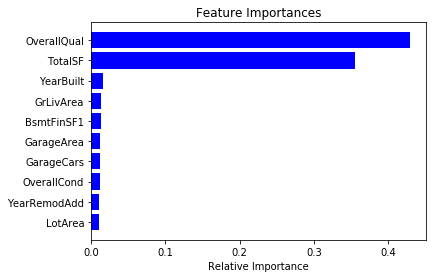
    


```python
feature_importances = pd.DataFrame(rfr.feature_importances_, index = X.columns, 
                                   columns=['importance']).sort_values('importance',ascending=False)

feature_importances.head(20)
```


<div>
<style scoped>
    .dataframe tbody tr th:only-of-type {
        vertical-align: middle;
    }

    .dataframe tbody tr th {
        vertical-align: top;
    }

    .dataframe thead th {
        text-align: right;
    }
</style>
<table border="1" class="dataframe">
  <thead>
    <tr style="text-align: right;">
      <th></th>
      <th>importance</th>
    </tr>
  </thead>
  <tbody>
    <tr>
      <th>OverallQual</th>
      <td>0.429685</td>
    </tr>
    <tr>
      <th>TotalSF</th>
      <td>0.355861</td>
    </tr>
    <tr>
      <th>YearBuilt</th>
      <td>0.015554</td>
    </tr>
    <tr>
      <th>GrLivArea</th>
      <td>0.013061</td>
    </tr>
    <tr>
      <th>BsmtFinSF1</th>
      <td>0.012794</td>
    </tr>
    <tr>
      <th>GarageArea</th>
      <td>0.011899</td>
    </tr>
    <tr>
      <th>GarageCars</th>
      <td>0.011873</td>
    </tr>
    <tr>
      <th>OverallCond</th>
      <td>0.011585</td>
    </tr>
    <tr>
      <th>YearRemodAdd</th>
      <td>0.011061</td>
    </tr>
    <tr>
      <th>LotArea</th>
      <td>0.010480</td>
    </tr>
    <tr>
      <th>BsmtUnfSF</th>
      <td>0.009619</td>
    </tr>
    <tr>
      <th>CentralAir</th>
      <td>0.009562</td>
    </tr>
    <tr>
      <th>GarageYrBlt</th>
      <td>0.006496</td>
    </tr>
    <tr>
      <th>1stFlrSF</th>
      <td>0.006414</td>
    </tr>
    <tr>
      <th>GarageType</th>
      <td>0.006077</td>
    </tr>
    <tr>
      <th>Fireplaces</th>
      <td>0.005345</td>
    </tr>
    <tr>
      <th>LotFrontage</th>
      <td>0.004462</td>
    </tr>
    <tr>
      <th>2ndFlrSF</th>
      <td>0.003897</td>
    </tr>
    <tr>
      <th>SaleCondition</th>
      <td>0.003872</td>
    </tr>
    <tr>
      <th>Neighborhood</th>
      <td>0.003725</td>
    </tr>
  </tbody>
</table>
</div>


```python
X_reduced = X[['OverallQual', 'TotalSF', 'YearRemodAdd', 'GarageArea', 'CentralAir', 'GrLivArea', 
               'BsmtFinSF1', 'OverallCond', 'LotArea', 'GarageCond', 'YearBuilt', 'MSZoning', 
               '1stFlrSF', 'BsmtUnfSF', 'GarageType', 'GarageCars', 'BsmtFinType1', 'LotFrontage', 
               'BsmtQual', 'GarageYrBlt']]

X_reduced.head()
```


<div>
<style scoped>
    .dataframe tbody tr th:only-of-type {
        vertical-align: middle;
    }

    .dataframe tbody tr th {
        vertical-align: top;
    }

    .dataframe thead th {
        text-align: right;
    }
</style>
<table border="1" class="dataframe">
  <thead>
    <tr style="text-align: right;">
      <th></th>
      <th>OverallQual</th>
      <th>TotalSF</th>
      <th>YearRemodAdd</th>
      <th>GarageArea</th>
      <th>CentralAir</th>
      <th>GrLivArea</th>
      <th>BsmtFinSF1</th>
      <th>OverallCond</th>
      <th>LotArea</th>
      <th>GarageCond</th>
      <th>YearBuilt</th>
      <th>MSZoning</th>
      <th>1stFlrSF</th>
      <th>BsmtUnfSF</th>
      <th>GarageType</th>
      <th>GarageCars</th>
      <th>BsmtFinType1</th>
      <th>LotFrontage</th>
      <th>BsmtQual</th>
      <th>GarageYrBlt</th>
    </tr>
  </thead>
  <tbody>
    <tr>
      <th>0</th>
      <td>2.440268</td>
      <td>14.976591</td>
      <td>14.187527</td>
      <td>10.506271</td>
      <td>0.730463</td>
      <td>13.698888</td>
      <td>11.170327</td>
      <td>1.820334</td>
      <td>19.212182</td>
      <td>2.055642</td>
      <td>14.187527</td>
      <td>1.540963</td>
      <td>11.692623</td>
      <td>7.483296</td>
      <td>0.730463</td>
      <td>1.194318</td>
      <td>1.194318</td>
      <td>4.882973</td>
      <td>1.194318</td>
      <td>6.426513</td>
    </tr>
    <tr>
      <th>1</th>
      <td>2.259674</td>
      <td>14.923100</td>
      <td>14.145138</td>
      <td>10.062098</td>
      <td>0.730463</td>
      <td>12.792276</td>
      <td>12.062832</td>
      <td>2.440268</td>
      <td>19.712205</td>
      <td>2.055642</td>
      <td>14.145138</td>
      <td>1.540963</td>
      <td>12.792276</td>
      <td>8.897844</td>
      <td>0.730463</td>
      <td>1.194318</td>
      <td>0.000000</td>
      <td>5.527074</td>
      <td>1.194318</td>
      <td>5.744420</td>
    </tr>
    <tr>
      <th>2</th>
      <td>2.440268</td>
      <td>15.149678</td>
      <td>14.185966</td>
      <td>10.775536</td>
      <td>0.730463</td>
      <td>13.832085</td>
      <td>10.200343</td>
      <td>1.820334</td>
      <td>20.347241</td>
      <td>2.055642</td>
      <td>14.184404</td>
      <td>1.540963</td>
      <td>11.892039</td>
      <td>9.917060</td>
      <td>0.730463</td>
      <td>1.194318</td>
      <td>1.194318</td>
      <td>5.053371</td>
      <td>1.194318</td>
      <td>6.382451</td>
    </tr>
    <tr>
      <th>3</th>
      <td>2.440268</td>
      <td>14.857121</td>
      <td>14.135652</td>
      <td>10.918253</td>
      <td>0.730463</td>
      <td>13.711364</td>
      <td>8.274266</td>
      <td>1.820334</td>
      <td>19.691553</td>
      <td>2.055642</td>
      <td>14.047529</td>
      <td>1.540963</td>
      <td>12.013683</td>
      <td>10.468500</td>
      <td>2.055642</td>
      <td>1.540963</td>
      <td>0.000000</td>
      <td>4.545286</td>
      <td>1.820334</td>
      <td>6.314735</td>
    </tr>
    <tr>
      <th>4</th>
      <td>2.602594</td>
      <td>15.852312</td>
      <td>14.182841</td>
      <td>11.627708</td>
      <td>0.730463</td>
      <td>14.480029</td>
      <td>10.971129</td>
      <td>1.820334</td>
      <td>21.325160</td>
      <td>2.055642</td>
      <td>14.182841</td>
      <td>1.540963</td>
      <td>12.510588</td>
      <td>10.221051</td>
      <td>0.730463</td>
      <td>1.540963</td>
      <td>1.194318</td>
      <td>5.653921</td>
      <td>1.194318</td>
      <td>6.360100</td>
    </tr>
  </tbody>
</table>
</div>


```python
X_train, X_test, y_train, y_test = train_test_split(X_reduced, y, test_size=0.2)
```

### Linear Regression


```python
# Instantiate model and create parameter grid
lr = linear_model.LinearRegression()
grid_params = {'fit_intercept': [True, False],
               'normalize': [True, False], 
               'copy_X' : [True, False]}
```


```python
# Instantiate new grid
grid = GridSearchCV(lr, grid_params, n_jobs=-1, cv=5)
```


```python
# Linear Regression
start = time.time()
grid.fit(X_train, y_train)
y_pred = grid.predict(X_test)
print('Runtime for grid search: {0:.3} s'.format((time.time() - start)))
print('Best Accuracy Score: \n{}'.format(grid.best_score_))
print('Best Parameters: \n{}'.format(grid.best_params_))
```

    Runtime for grid search: 0.568 s
    Best Accuracy Score: 
    0.8815714122815158
    Best Parameters: 
    {'copy_X': True, 'fit_intercept': True, 'normalize': False}


```python
# Instantiate and fit model with best parameters
lr = LinearRegression(fit_intercept=False, normalize=True, copy_X=True)
lr.fit(X_train, y_train)
y_pred = lr.predict(X_test)

# Run cross validation and calculate RMSE
scores = cross_val_score(lr, X_train, y_train, cv=5)

# Print results
print('Score With 20% Holdout:\n{0:.2%}'.format(lr.score(X_test, y_test)))
print('Cross Validation Scores:\n', scores)
print('Average Cross Validation Score:\n{0:.2%}'.format(scores.mean()))

# Calculate root mean squared error
rmse = mean_squared_error(np.expm1(y_test), np.expm1(y_pred))**0.5

# Print result
print('Root Mean Squared Error:\n{}'.format(rmse))
```

    Score With 20% Holdout:
    91.45%
    Cross Validation Scores:
     [0.86964536 0.90312406 0.87734731 0.86610569 0.88772752]
    Average Cross Validation Score:
    88.08%
    Root Mean Squared Error:
    0.3011926609631838


### KNN Regression


```python
# Instantiate model and create parameter grid
knn = neighbors.KNeighborsRegressor()
grid_params = {'n_neighbors': list(range(1, 10)),
               'weights': ['uniform', 'distance'], 
               'algorithm' : ['auto', 'ball_tree', 'kd_tree', 'brute']}
```


```python
# Instantiate new grid
grid = GridSearchCV(knn, grid_params, n_jobs=-1, cv=5)
```


```python
# KNN Regression
start = time.time()
grid.fit(X_train, y_train)
y_pred = grid.predict(X_test)

# Print results
print('Runtime for grid search: {0:.3} s'.format((time.time() - start)))
print('Best Accuracy Score: \n{}'.format(grid.best_score_))
print('Best Parameters: \n{}'.format(grid.best_params_))
```

    Runtime for grid search: 4.46 s
    Best Accuracy Score: 
    0.7573965453742735
    Best Parameters: 
    {'algorithm': 'auto', 'n_neighbors': 7, 'weights': 'distance'}


```python
# Instantiate and fit model with best parameters
knn = neighbors.KNeighborsRegressor(n_neighbors=7, weights='distance', algorithm='auto')
knn.fit(X_train, y_train)
y_pred = knn.predict(X_test)

# Run cross validation and calculate RMSE
scores = cross_val_score(knn, X_train, y_train, cv=5)

# Print results
print('Score With 20% Holdout:\n{0:.2%}'.format(knn.score(X_test, y_test)))
print('Cross Validation Scores:\n', scores)
print('Average Cross Validation Score:\n{0:.2%}'.format(scores.mean()))

# Calculate root mean squared error
rmse = mean_squared_error(np.expm1(y_test), np.expm1(y_pred))**0.5

# Print result
print('Root Mean Squared Error:\n{}'.format(rmse))
```

    Score With 20% Holdout:
    80.35%
    Cross Validation Scores:
     [0.7559988  0.81061274 0.72753457 0.75354858 0.73920998]
    Average Cross Validation Score:
    75.74%
    Root Mean Squared Error:
    0.4564285807903383


### Random Forest Regression


```python
# Instantiate model and create parameter grid
rfr = RandomForestRegressor()
grid_params = {'n_estimators': list(range(1, 10)),
               'criterion': ['mse', 'mae'],
               'max_depth': list(range(1, 10))}
```


```python
# Instantiate new grid
grid = GridSearchCV(rfr, grid_params, n_jobs=-1, cv=5)
```


```python
# KNN Regression
start = time.time()
grid.fit(X_train, y_train)
y_pred = grid.predict(X_test)

# Print results
print('Runtime for grid search: {0:.3} s'.format((time.time() - start)))
print('Best Accuracy Score: \n{}'.format(grid.best_score_))
print('Best Parameters: \n{}'.format(grid.best_params_))
```

    Runtime for grid search: 70.4 s
    Best Accuracy Score: 
    0.8517071234529742
    Best Parameters: 
    {'criterion': 'mse', 'max_depth': 9, 'n_estimators': 8}


    /Users/rakeshbhatia/anaconda/lib/python3.6/site-packages/sklearn/model_selection/_search.py:714: DataConversionWarning: A column-vector y was passed when a 1d array was expected. Please change the shape of y to (n_samples,), for example using ravel().
      self.best_estimator_.fit(X, y, **fit_params)


```python
# Instantiate and fit model with best parameters
rfr = RandomForestRegressor(n_estimators=9, criterion='mse', max_depth=8)
rfr.fit(X_train, y_train.values.ravel())
y_pred = rfr.predict(X_test)

# Run cross validation and calculate RMSE
scores = cross_val_score(rfr, X_train, y_train.values.ravel(), cv=5)

# Print results
print('Score With 20% Holdout:\n{0:.2%}'.format(rfr.score(X_test, y_test.values.ravel())))
print('Cross Validation Scores:\n{}'.format(scores))
print('Average Cross Validation Score:\n{0:.2%}'.format(scores.mean()))

# Calculate root mean squared error
rmse = mean_squared_error(np.expm1(y_test), np.expm1(y_pred))**0.5

# Print result
print('Root Mean Squared Error:\n{}'.format(rmse))
```

    Score With 20% Holdout:
    87.90%
    Cross Validation Scores:
    [0.84591098 0.86758539 0.85590976 0.82783851 0.84731086]
    Average Cross Validation Score:
    84.89%
    Root Mean Squared Error:
    0.3571122712911688


### Ridge Regression


```python
# Instantiate model and create parameter grid
rr = Ridge()
grid_params = {'alpha': [0.0001, 0.001, 0.01, 0.1, 1, 5, 10, 25, 50, 100], 
               'fit_intercept': [True, False],
               'solver': ['cholesky', 'lsqr', 'sparse_cg']}
#               'solver': ['svd', 'cholesky', 'lsqr', 'sparse_cg', 'sag', 'saga']}
```


```python
# Instantiate new grid
grid = GridSearchCV(rr, grid_params, n_jobs=-1, cv=5)
```


```python
# Ridge Regression
start = time.time()
grid.fit(X_train, y_train)
y_pred = grid.predict(X_test)

# Print results
print('Runtime for grid search: {0:.3} s'.format((time.time() - start)))
print('Best Accuracy Score: \n{}'.format(grid.best_score_))
print('Best Parameters: \n{}'.format(grid.best_params_))
```

    Runtime for grid search: 2.3 s
    Best Accuracy Score: 
    0.8816035431498964
    Best Parameters: 
    {'alpha': 0.01, 'fit_intercept': True, 'solver': 'cholesky'}


    /Users/rakeshbhatia/anaconda/lib/python3.6/site-packages/sklearn/model_selection/_search.py:813: DeprecationWarning: The default of the `iid` parameter will change from True to False in version 0.22 and will be removed in 0.24. This will change numeric results when test-set sizes are unequal.
      DeprecationWarning)


```python
# Instantiate and fit model with best parameters
rr = Ridge(alpha=0.01, fit_intercept=True, solver='cholesky')
rr.fit(X_train, y_train)
y_pred = rr.predict(X_test)

# Run cross validation and calculate RMSE
scores = cross_val_score(rr, X_train, y_train, cv=5)

# Print results
print('Score With 20% Holdout:\n{0:.2%}'.format(rr.score(X_test, y_test)))
print('Cross Validation Scores:\n{}'.format(scores))
print('Average Cross Validation Score:\n{0:.2%}'.format(scores.mean()))

# Calculate root mean squared error
rmse = mean_squared_error(np.expm1(y_test), np.expm1(y_pred))**0.5

# Print result
print('Root Mean Squared Error:\n{}'.format(rmse))
```

    Score With 20% Holdout:
    90.10%
    Cross Validation Scores:
    [0.90876598 0.91318546 0.89388285 0.88931054 0.8936684 ]
    Average Cross Validation Score:
    89.98%
    Root Mean Squared Error:
    0.3149498700624098


### Lasso Regression


```python
# Instantiate model and create parameter grid
lasso = Lasso()
grid_params = {'alpha': [0.0001, 0.001, 0.01, 0.1, 1, 5, 10, 25, 50, 100], 
               'fit_intercept': [True, False],
               'max_iter': list(range(10))}
#               'solver': ['svd', 'cholesky', 'lsqr', 'sparse_cg', 'sag', 'saga']}
```


```python
# Instantiate new grid
grid = GridSearchCV(lasso, grid_params, n_jobs=-1, cv=5)
```


```python
# Ridge Regression
start = time.time()
grid.fit(X_train, y_train)
y_pred = grid.predict(X_test)

# Print results
print('Runtime for grid search: {0:.3} s'.format((time.time() - start)))
print('Best Accuracy Score: \n{}'.format(grid.best_score_))
print('Best Parameters: \n{}'.format(grid.best_params_))
```

    Runtime for grid search: 8.92 s
    Best Accuracy Score: 
    0.8717199839344799
    Best Parameters: 
    {'alpha': 0.0001, 'fit_intercept': True, 'max_iter': 9}


    /Users/rakeshbhatia/anaconda/lib/python3.6/site-packages/sklearn/model_selection/_search.py:813: DeprecationWarning: The default of the `iid` parameter will change from True to False in version 0.22 and will be removed in 0.24. This will change numeric results when test-set sizes are unequal.
      DeprecationWarning)
    /Users/rakeshbhatia/anaconda/lib/python3.6/site-packages/sklearn/linear_model/coordinate_descent.py:475: ConvergenceWarning: Objective did not converge. You might want to increase the number of iterations. Duality gap: 0.1345447112339042, tolerance: 0.0002292111729539456
      positive)


```python
# Instantiate and fit model with best parameters
lasso = Lasso(alpha=0.0001, fit_intercept=True, max_iter=9)
lasso.fit(X_train, y_train)
y_pred = rr.predict(X_test)

# Run cross validation and calculate RMSE
scores = cross_val_score(lasso, X_train, y_train, cv=5)

# Print results
print('Score With 20% Holdout:\n{0:.2%}'.format(rr.score(X_test, y_test)))
print('Cross Validation Scores:\n{}'.format(scores))
print('Average Cross Validation Score:\n{0:.2%}'.format(scores.mean()))

# Calculate root mean squared error
rmse = mean_squared_error(np.expm1(y_test), np.expm1(y_pred))**0.5

# Print result
print('Root Mean Squared Error:\n{}'.format(rmse))
```

    Score With 20% Holdout:
    90.10%
    Cross Validation Scores:
    [0.90610849 0.89638496 0.88806663 0.87695657 0.88558265]
    Average Cross Validation Score:
    89.06%
    Root Mean Squared Error:
    0.3149498700624098


    /Users/rakeshbhatia/anaconda/lib/python3.6/site-packages/sklearn/linear_model/coordinate_descent.py:475: ConvergenceWarning: Objective did not converge. You might want to increase the number of iterations. Duality gap: 0.12588123641539328, tolerance: 0.000230805802977206
      positive)
    /Users/rakeshbhatia/anaconda/lib/python3.6/site-packages/sklearn/linear_model/coordinate_descent.py:475: ConvergenceWarning: Objective did not converge. You might want to increase the number of iterations. Duality gap: 0.10174824166285584, tolerance: 0.00018211493454537317
      positive)
    /Users/rakeshbhatia/anaconda/lib/python3.6/site-packages/sklearn/linear_model/coordinate_descent.py:475: ConvergenceWarning: Objective did not converge. You might want to increase the number of iterations. Duality gap: 0.10071330950203666, tolerance: 0.00018551750660764676
      positive)
    /Users/rakeshbhatia/anaconda/lib/python3.6/site-packages/sklearn/linear_model/coordinate_descent.py:475: ConvergenceWarning: Objective did not converge. You might want to increase the number of iterations. Duality gap: 0.09815849040592911, tolerance: 0.00018381355085247963
      positive)
    /Users/rakeshbhatia/anaconda/lib/python3.6/site-packages/sklearn/linear_model/coordinate_descent.py:475: ConvergenceWarning: Objective did not converge. You might want to increase the number of iterations. Duality gap: 0.10004544276933801, tolerance: 0.00018724225322712702
      positive)
    /Users/rakeshbhatia/anaconda/lib/python3.6/site-packages/sklearn/linear_model/coordinate_descent.py:475: ConvergenceWarning: Objective did not converge. You might want to increase the number of iterations. Duality gap: 0.0976469770913432, tolerance: 0.00018434117216229712
      positive)


Our best model in this iteration was Linear Regression with an accuracy score of 91.45% and an RMSE of 0.30119.

## Iteration 3 - PCA
In this iteration, we will use PCA to reduce our feature set and then run the same five models again.

### Train and Test PCA


```python
X_train, X_test, y_train, y_test = train_test_split(X, y, test_size=0.2)
```


```python
# Standardize features
X_scaler = StandardScaler().fit_transform(X_train)
```


```python
# Create PCA that retains 95% of variance
pca = PCA(n_components=0.95, whiten=True)

# Generate PCA
X_pca = pca.fit_transform(X_scaler)
```


```python
# Print results
print('Original number of features:', X.shape[1])
print('Reduced number of features:', X_pca.shape[1])
```

    Original number of features: 74
    Reduced number of features: 55


```python
fig = plt.figure(figsize=(7,5))
ax = plt.subplot(111)
ax.plot(range(X_pca.shape[1]), pca.explained_variance_ratio_, label='Component-wise Explained Variance')
ax.plot(range(X_pca.shape[1]), np.cumsum(pca.explained_variance_ratio_), label='Cumulative Explained Variance')
plt.title('Explained Variance')
plt.xlabel('Components')
plt.ylabel('Variance')
ax.legend()
plt.show()
```


    
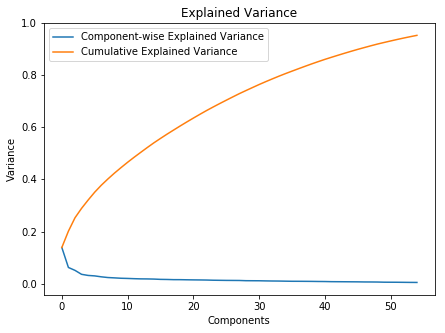
    


### Linear Regression


```python
lr = linear_model.LinearRegression()
pipe = Pipeline([('pca', pca), ('linear', lr)])
pipe.fit(X_train, y_train)
y_pred = pipe.predict(X_test)
```


```python
scores_train = cross_val_score(pipe, X_train, y_train, cv=5)
scores_test = cross_val_score(pipe, X_test, y_test, cv=5)
print('Cross Validation Scores - Training Set: \n{}'.format(scores_train))
print('\nAverage Cross Validation Score - Training Set: \n{:.2%}'.format(scores_train.mean()))
print('\nCross Validation Scores - Test Set: \n{}'.format(scores_train))
print('\nAverage Cross Validation Score - Test Set: \n{:.2%}'.format(scores_test.mean()))

# Calculate root mean squared error
rmse = mean_squared_error(np.expm1(y_test), np.expm1(y_pred))**0.5

# Print result
print('Root Mean Squared Error:\n{}'.format(rmse))
```

    Cross Validation Scores - Training Set: 
    [0.87208941 0.84418757 0.7806751  0.8441039  0.86005551]
    
    Average Cross Validation Score - Training Set: 
    84.02%
    
    Cross Validation Scores - Test Set: 
    [0.87208941 0.84418757 0.7806751  0.8441039  0.86005551]
    
    Average Cross Validation Score - Test Set: 
    72.61%
    Root Mean Squared Error:
    0.4570210334553902


### KNN Regression


```python
knn = neighbors.KNeighborsRegressor(n_neighbors=7, weights='distance', algorithm='auto')
pipe = Pipeline([('pca', pca), ('knn', knn)])
pipe.fit(X_train, y_train)
y_pred = pipe.predict(X_test)
```


```python
scores_train = cross_val_score(pipe, X_train, y_train, cv=5)
scores_test = cross_val_score(pipe, X_test, y_test, cv=5)
print('Cross Validation Scores - Training Set: \n{}'.format(scores_train))
print('\nAverage Cross Validation Score - Training Set: \n{:.2%}'.format(scores_train.mean()))
print('\nCross Validation Scores - Test Set: \n{}'.format(scores_train))
print('\nAverage Cross Validation Score - Test Set: \n{:.2%}'.format(scores_test.mean()))

# Calculate root mean squared error
rmse = mean_squared_error(np.expm1(y_test), np.expm1(y_pred))**0.5

# Print result
print('Root Mean Squared Error:\n{}'.format(rmse))
```

    Cross Validation Scores - Training Set: 
    [0.72190707 0.6670871  0.63802632 0.59866867 0.68857193]
    
    Average Cross Validation Score - Training Set: 
    66.29%
    
    Cross Validation Scores - Test Set: 
    [0.72190707 0.6670871  0.63802632 0.59866867 0.68857193]
    
    Average Cross Validation Score - Test Set: 
    53.20%
    Root Mean Squared Error:
    0.608803837051414


### Random Forest Regression


```python
rfr = RandomForestRegressor(n_estimators=9, criterion='mse', max_depth=8)
pipe = Pipeline([('pca', pca), ('rfr', rfr)])
pipe.fit(X_train, y_train.values.ravel())
y_pred = pipe.predict(X_test)
```


```python
scores_train = cross_val_score(pipe, X_train, y_train.values.ravel(), cv=5)
scores_test = cross_val_score(pipe, X_test, y_test.values.ravel(), cv=5)
print('Cross Validation Scores - Training Set: \n{}'.format(scores_train))
print('\nAverage Cross Validation Score - Training Set: \n{:.2%}'.format(scores_train.mean()))
print('\nCross Validation Scores - Test Set: \n{}'.format(scores_train))
print('\nAverage Cross Validation Score - Test Set: \n{:.2%}'.format(scores_test.mean()))

# Calculate root mean squared error
rmse = mean_squared_error(np.expm1(y_test), np.expm1(y_pred))**0.5

# Print result
print('Root Mean Squared Error:\n{}'.format(rmse))
```

    Cross Validation Scores - Training Set: 
    [0.77341358 0.69389058 0.67620675 0.70998848 0.77364554]
    
    Average Cross Validation Score - Training Set: 
    72.54%
    
    Cross Validation Scores - Test Set: 
    [0.77341358 0.69389058 0.67620675 0.70998848 0.77364554]
    
    Average Cross Validation Score - Test Set: 
    59.05%
    Root Mean Squared Error:
    0.5319618143549292


### Ridge Regression


```python
rr = Ridge()
pipe = Pipeline([('pca', pca), ('ridge', rr)])
pipe.fit(X_train, y_train)
y_pred = pipe.predict(X_test)
```


```python
scores_train = cross_val_score(pipe, X_train, y_train, cv=5)
scores_test = cross_val_score(pipe, X_test, y_test, cv=5)
print('Cross Validation Scores - Training Set: \n{}'.format(scores_train))
print('\nAverage Cross Validation Score - Training Set: \n{:.2%}'.format(scores_train.mean()))
print('\nCross Validation Scores - Test Set: \n{}'.format(scores_train))
print('\nAverage Cross Validation Score - Test Set: \n{:.2%}'.format(scores_test.mean()))

# Calculate root mean squared error
rmse = mean_squared_error(np.expm1(y_test), np.expm1(y_pred))**0.5

# Print result
print('Root Mean Squared Error:\n{}'.format(rmse))
```

    Cross Validation Scores - Training Set: 
    [0.8721049  0.84420952 0.78061565 0.84410179 0.86007169]
    
    Average Cross Validation Score - Training Set: 
    84.02%
    
    Cross Validation Scores - Test Set: 
    [0.8721049  0.84420952 0.78061565 0.84410179 0.86007169]
    
    Average Cross Validation Score - Test Set: 
    72.65%
    Root Mean Squared Error:
    0.4570192792436453


### Lasso Regression


```python
lasso = Lasso(alpha=0.0001, fit_intercept=True, max_iter=9)
pipe = Pipeline([('pca', pca), ('lasso', lasso)])
pipe.fit(X_train, y_train)
y_pred = pipe.predict(X_test)
```


```python
scores_train = cross_val_score(pipe, X_train, y_train, cv=5)
scores_test = cross_val_score(pipe, X_test, y_test, cv=5)
print('Cross Validation Scores - Training Set: \n{}'.format(scores_train))
print('\nAverage Cross Validation Score - Training Set: \n{:.2%}'.format(scores_train.mean()))
print('\nCross Validation Scores - Test Set: \n{}'.format(scores_train))
print('\nAverage Cross Validation Score - Test Set: \n{:.2%}'.format(scores_test.mean()))

# Calculate root mean squared error
rmse = mean_squared_error(np.expm1(y_test), np.expm1(y_pred))**0.5

# Print result
print('Root Mean Squared Error:\n{}'.format(rmse))
```

    Cross Validation Scores - Training Set: 
    [0.87197939 0.84464882 0.78050591 0.84374574 0.85970556]
    
    Average Cross Validation Score - Training Set: 
    84.01%
    
    Cross Validation Scores - Test Set: 
    [0.87197939 0.84464882 0.78050591 0.84374574 0.85970556]
    
    Average Cross Validation Score - Test Set: 
    72.66%
    Root Mean Squared Error:
    0.45644992470380247


Our best model in this iteration was Lasso Regression with an average cross validation score (test set) of 72.66% and an RMSE of 0.45645.

## Conclusion
Overall, the first two iterations appeared to provide the best results. There was even a slight improvement in some of the models from iteration 1 to iteration 2, when we limited the feature set to the 20 most important features. However, there was a significant drop-off when we used a PCA that retained 95% of the variance. Thus, utilizing the feature importances appears to be most optimal way to model this dataset.
