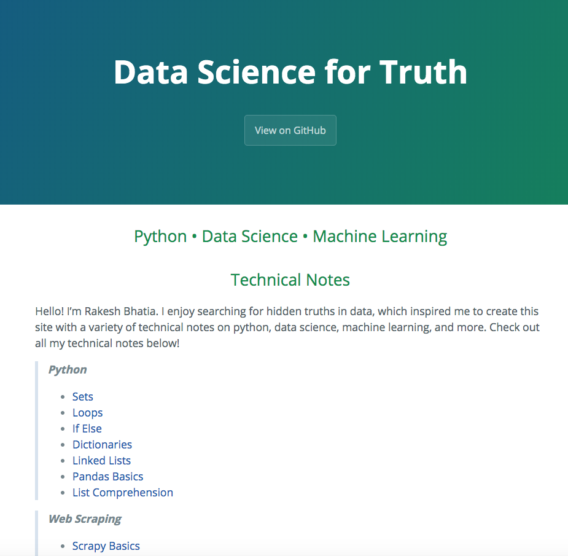

# Beautiful Soup Basics

Let's demonstrate the basics of Beautiful Soup by scraping the homepage of this website. Note: the site has been updated since this notebook was written, so scraped content shown here will not reflect any new changes. It doesn't matter as this notebook is simply for demonstration purposes.



### Import modules


```python
import requests
import bs4
from bs4 import BeautifulSoup
```

### Scrape this site's home page and create a soup object from its html


```python
# Store the url in a variable
url = 'https://rakeshbhatia.github.io/notes/'

# Get the site content using requests
r = requests.get(url)

# Extract text from the content
content = r.text

# Convert html text content into a beautiful soup object
soup = BeautifulSoup(content, 'html.parser')

print(soup)
```

    <!DOCTYPE html>
    
    <html lang="en-US">
    <head>
    <meta charset="utf-8"/>
    <!-- Begin Jekyll SEO tag v2.5.0 -->
    <title>Python • Data Science • Machine Learning | Data Science for Truth</title>
    <meta content="Jekyll v3.8.5" name="generator">
    <meta content="Python • Data Science • Machine Learning" property="og:title"/>
    <meta content="en_US" property="og:locale"/>
    <link href="https://rakeshbhatia.github.io/notes/" rel="canonical"/>
    <meta content="https://rakeshbhatia.github.io/notes/" property="og:url"/>
    <meta content="Data Science for Truth" property="og:site_name"/>
    <script type="application/ld+json">
    {"headline":"Python • Data Science • Machine Learning","@type":"WebSite","url":"https://rakeshbhatia.github.io/notes/","name":"Data Science for Truth","@context":"http://schema.org"}</script>
    <!-- End Jekyll SEO tag -->
    <meta content="width=device-width, initial-scale=1" name="viewport"/>
    <meta content="#157878" name="theme-color"/>
    <link href="/notes/assets/css/style.css?v=c811497a7d1d5a66645989749034b290a11776f8" rel="stylesheet"/>
    </meta></head>
    <body>
    <section class="page-header">
    <h1 class="project-name">Data Science for Truth</h1>
    <h2 class="project-tagline"></h2>
    <a class="btn" href="https://github.com/rakeshbhatia/notes">View on GitHub</a>
    </section>
    <section class="main-content">
    <h2 id="python--data-science--machine-learning"><center>Python • Data Science • Machine Learning</center></h2>
    <h2 id="technical-notes"><center>Technical Notes</center></h2>
    <p>Hello! I’m Rakesh Bhatia. I enjoy searching for hidden truths in data, which inspired me to create this site with a variety of technical notes on python, data science, machine learning, and more. Check out all my technical notes below!</p>
    <blockquote>
    <p><strong><em>Python</em></strong></p>
    <ul>
    <li><a href="https://rakeshbhatia.github.io/notes/content/python/sets">Sets</a></li>
    <li><a href="https://rakeshbhatia.github.io/notes/content/python/loops">Loops</a></li>
    <li><a href="https://rakeshbhatia.github.io/notes/content/python/if_else">If Else</a></li>
    <li><a href="https://rakeshbhatia.github.io/notes/content/python/dictionaries">Dictionaries</a></li>
    <li><a href="https://rakeshbhatia.github.io/notes/content/python/linked_lists">Linked Lists</a></li>
    <li><a href="https://rakeshbhatia.github.io/notes/content/python/pandas_basics">Pandas Basics</a></li>
    <li><a href="https://rakeshbhatia.github.io/notes/content/python/list_comprehension">List Comprehension</a></li>
    </ul>
    </blockquote>
    <blockquote>
    <p><strong><em>Web Scraping</em></strong></p>
    <ul>
    <li><a href="https://rakeshbhatia.github.io/notes/content/web_scraping/scrapy_basics">Scrapy Basics</a></li>
    <li><a href="https://rakeshbhatia.github.io/notes/content/web_scraping/beautiful_soup_basics">Beautiful Soup Basics</a></li>
    <li><a href="https://rakeshbhatia.github.io/notes/content/web_scraping/scrape_historical_ohlc_stock_prices">Scrape Historical OHLC Stock Prices</a></li>
    <li><a href="https://rakeshbhatia.github.io/notes/content/web_scraping/scrape_fanduel_nba_player_stats_with_scrapy">Scrape Fanduel NBA Player Stats with Scrapy</a></li>
    <li><a href="https://rakeshbhatia.github.io/notes/content/web_scraping/scrape_nba_player_rpm_stats_from_espn_with_lxml">Scrape NBA Player RPM Stats from ESPN with lxml</a></li>
    <li><a href="https://rakeshbhatia.github.io/notes/content/web_scraping/scrape_nba_player_game_logs_from_espn_with_lxml">Scrape NBA Player Game Logs from ESPN with lxml</a></li>
    </ul>
    </blockquote>
    <blockquote>
    <p><strong><em>Data Science</em></strong></p>
    <ul>
    <li><a href="https://rakeshbhatia.github.io/notes/content/data_science/preparing_data">Preparing Data</a></li>
    <li><a href="https://rakeshbhatia.github.io/notes/content/data_science/fixing_assumptions">Fixing Assumptions</a></li>
    <li><a href="https://rakeshbhatia.github.io/notes/content/data_science/analysis_of_boston_house_prices">Analysis of Boston House Prices</a></li>
    <li><a href="https://rakeshbhatia.github.io/notes/content/data_science/in_sample_evaluation_and_cross_validation">In Sample Evaluation and Cross Validation</a></li>
    <li><a href="https://rakeshbhatia.github.io/notes/content/data_science/iterate_and_evaluate_a_naive_bayes_classifier">Iterate and Evaluate a Naive Bayes Classifier</a></li>
    <li><a href="https://rakeshbhatia.github.io/notes/content/data_science/house_prices_advanced_regression_techniques">House Prices: Advanced Regression Techniques</a></li>
    <li><a href="https://rakeshbhatia.github.io/notes/content/data_science/author_prediction_unsupervised_nlp_with_bow">Author Prediction: Unsupervised NLP with BOW</a></li>
    </ul>
    </blockquote>
    <blockquote>
    <p><strong><em>Data Engineering</em></strong></p>
    <ul>
    <li><a href="https://rakeshbhatia.github.io/notes/content/data_engineering/plotting_s_parameter_distributions_with_matplotlib">Plotting S-parameter Distributions with Matplotlib</a></li>
    <li><a href="https://rakeshbhatia.github.io/notes/content/data_engineering/plotting_current_and_gain_distributions_with_matplotlib">Plotting Current and Gain Distributions with Matplotlib</a></li>
    </ul>
    </blockquote>
    <p>Copyright © Rakesh Bhatia, September 2019. All notes available on <a href="https://github.com/rakeshbhatia/notes">GitHub</a>.</p>
    <footer class="site-footer">
    <span class="site-footer-owner"><a href="https://github.com/rakeshbhatia/notes">notes</a> is maintained by <a href="https://github.com/rakeshbhatia">rakeshbhatia</a>.</span>
    <span class="site-footer-credits">This page was generated by <a href="https://pages.github.com">GitHub Pages</a>.</span>
    </footer>
    </section>
    </body>
    </html>
    


### Website title


```python
# View the soup object's title tag
soup.title
```


    <title>Python • Data Science • Machine Learning | Data Science for Truth</title>


### Contents of title tag
* Returns a list


```python
soup.title.contents
```


    ['Python • Data Science • Machine Learning | Data Science for Truth']


### String inside title tag


```python
# View the string contained in the title tag
soup.title.string
```


    'Python • Data Science • Machine Learning | Data Science for Truth'


### Parent of the title tag


```python
soup.title.parent.name
```


    'head'


### First paragraph tag


```python
# View the soup object's first paragraph tag
soup.p
```


    <p>Hello! I’m Rakesh Bhatia. I enjoy searching for hidden truths in data, which inspired me to create this site with a variety of technical notes on python, data science, machine learning, and more. Check out all my technical notes below!</p>


### String inside paragraph tag
* Note: if the desired string is contained within a nested tab, it will not show up here
    * The string must be extracted directly from the tag that immediately encloses it


```python
soup.p.string
```


    'Hello! I’m Rakesh Bhatia. I enjoy searching for hidden truths in data, which inspired me to create this site with a variety of technical notes on python, data science, machine learning, and more. Check out all my technical notes below!'


### First link tag


```python
soup.a
```


    <a class="btn" href="https://github.com/rakeshbhatia/notes">View on GitHub</a>


### Find all link tags and print the first three
* The `find_all()` function enables you to search the DOM tree for any desired elements by their tag
* Found tags are returned as a list of `Tag` objects
    * If only a single tag is found, the `find_all()` method will return just a single `Tag` object


```python
soup.find_all('a')[0:2]
```


    [<a class="btn" href="https://github.com/rakeshbhatia/notes">View on GitHub</a>,
     <a href="https://rakeshbhatia.github.io/notes/content/python/sets">Sets</a>]


### Make our soup object's content more readable
* This will appear just like the site's original html


```python
pretty_soup = soup.prettify()
print(pretty_soup)
```

    <!DOCTYPE html>
    <html lang="en-US">
     <head>
      <meta charset="utf-8"/>
      <!-- Begin Jekyll SEO tag v2.5.0 -->
      <title>
       Python • Data Science • Machine Learning | Data Science for Truth
      </title>
      <meta content="Jekyll v3.8.5" name="generator">
       <meta content="Python • Data Science • Machine Learning" property="og:title"/>
       <meta content="en_US" property="og:locale"/>
       <link href="https://rakeshbhatia.github.io/notes/" rel="canonical"/>
       <meta content="https://rakeshbhatia.github.io/notes/" property="og:url"/>
       <meta content="Data Science for Truth" property="og:site_name"/>
       <script type="application/ld+json">
        {"headline":"Python • Data Science • Machine Learning","@type":"WebSite","url":"https://rakeshbhatia.github.io/notes/","name":"Data Science for Truth","@context":"http://schema.org"}
       </script>
       <!-- End Jekyll SEO tag -->
       <meta content="width=device-width, initial-scale=1" name="viewport"/>
       <meta content="#157878" name="theme-color"/>
       <link href="/notes/assets/css/style.css?v=c811497a7d1d5a66645989749034b290a11776f8" rel="stylesheet"/>
      </meta>
     </head>
     <body>
      <section class="page-header">
       <h1 class="project-name">
        Data Science for Truth
       </h1>
       <h2 class="project-tagline">
       </h2>
       <a class="btn" href="https://github.com/rakeshbhatia/notes">
        View on GitHub
       </a>
      </section>
      <section class="main-content">
       <h2 id="python--data-science--machine-learning">
        <center>
         Python • Data Science • Machine Learning
        </center>
       </h2>
       <h2 id="technical-notes">
        <center>
         Technical Notes
        </center>
       </h2>
       <p>
        Hello! I’m Rakesh Bhatia. I enjoy searching for hidden truths in data, which inspired me to create this site with a variety of technical notes on python, data science, machine learning, and more. Check out all my technical notes below!
       </p>
       <blockquote>
        <p>
         <strong>
          <em>
           Python
          </em>
         </strong>
        </p>
        <ul>
         <li>
          <a href="https://rakeshbhatia.github.io/notes/content/python/sets">
           Sets
          </a>
         </li>
         <li>
          <a href="https://rakeshbhatia.github.io/notes/content/python/loops">
           Loops
          </a>
         </li>
         <li>
          <a href="https://rakeshbhatia.github.io/notes/content/python/if_else">
           If Else
          </a>
         </li>
         <li>
          <a href="https://rakeshbhatia.github.io/notes/content/python/dictionaries">
           Dictionaries
          </a>
         </li>
         <li>
          <a href="https://rakeshbhatia.github.io/notes/content/python/linked_lists">
           Linked Lists
          </a>
         </li>
         <li>
          <a href="https://rakeshbhatia.github.io/notes/content/python/pandas_basics">
           Pandas Basics
          </a>
         </li>
         <li>
          <a href="https://rakeshbhatia.github.io/notes/content/python/list_comprehension">
           List Comprehension
          </a>
         </li>
        </ul>
       </blockquote>
       <blockquote>
        <p>
         <strong>
          <em>
           Web Scraping
          </em>
         </strong>
        </p>
        <ul>
         <li>
          <a href="https://rakeshbhatia.github.io/notes/content/web_scraping/scrapy_basics">
           Scrapy Basics
          </a>
         </li>
         <li>
          <a href="https://rakeshbhatia.github.io/notes/content/web_scraping/beautiful_soup_basics">
           Beautiful Soup Basics
          </a>
         </li>
         <li>
          <a href="https://rakeshbhatia.github.io/notes/content/web_scraping/scrape_historical_ohlc_stock_prices">
           Scrape Historical OHLC Stock Prices
          </a>
         </li>
         <li>
          <a href="https://rakeshbhatia.github.io/notes/content/web_scraping/scrape_fanduel_nba_player_stats_with_scrapy">
           Scrape Fanduel NBA Player Stats with Scrapy
          </a>
         </li>
         <li>
          <a href="https://rakeshbhatia.github.io/notes/content/web_scraping/scrape_nba_player_rpm_stats_from_espn_with_lxml">
           Scrape NBA Player RPM Stats from ESPN with lxml
          </a>
         </li>
         <li>
          <a href="https://rakeshbhatia.github.io/notes/content/web_scraping/scrape_nba_player_game_logs_from_espn_with_lxml">
           Scrape NBA Player Game Logs from ESPN with lxml
          </a>
         </li>
        </ul>
       </blockquote>
       <blockquote>
        <p>
         <strong>
          <em>
           Data Science
          </em>
         </strong>
        </p>
        <ul>
         <li>
          <a href="https://rakeshbhatia.github.io/notes/content/data_science/preparing_data">
           Preparing Data
          </a>
         </li>
         <li>
          <a href="https://rakeshbhatia.github.io/notes/content/data_science/fixing_assumptions">
           Fixing Assumptions
          </a>
         </li>
         <li>
          <a href="https://rakeshbhatia.github.io/notes/content/data_science/analysis_of_boston_house_prices">
           Analysis of Boston House Prices
          </a>
         </li>
         <li>
          <a href="https://rakeshbhatia.github.io/notes/content/data_science/in_sample_evaluation_and_cross_validation">
           In Sample Evaluation and Cross Validation
          </a>
         </li>
         <li>
          <a href="https://rakeshbhatia.github.io/notes/content/data_science/iterate_and_evaluate_a_naive_bayes_classifier">
           Iterate and Evaluate a Naive Bayes Classifier
          </a>
         </li>
         <li>
          <a href="https://rakeshbhatia.github.io/notes/content/data_science/house_prices_advanced_regression_techniques">
           House Prices: Advanced Regression Techniques
          </a>
         </li>
         <li>
          <a href="https://rakeshbhatia.github.io/notes/content/data_science/author_prediction_unsupervised_nlp_with_bow">
           Author Prediction: Unsupervised NLP with BOW
          </a>
         </li>
        </ul>
       </blockquote>
       <blockquote>
        <p>
         <strong>
          <em>
           Data Engineering
          </em>
         </strong>
        </p>
        <ul>
         <li>
          <a href="https://rakeshbhatia.github.io/notes/content/data_engineering/plotting_s_parameter_distributions_with_matplotlib">
           Plotting S-parameter Distributions with Matplotlib
          </a>
         </li>
         <li>
          <a href="https://rakeshbhatia.github.io/notes/content/data_engineering/plotting_current_and_gain_distributions_with_matplotlib">
           Plotting Current and Gain Distributions with Matplotlib
          </a>
         </li>
        </ul>
       </blockquote>
       <p>
        Copyright © Rakesh Bhatia, September 2019. All notes available on
        <a href="https://github.com/rakeshbhatia/notes">
         GitHub
        </a>
        .
       </p>
       <footer class="site-footer">
        <span class="site-footer-owner">
         <a href="https://github.com/rakeshbhatia/notes">
          notes
         </a>
         is maintained by
         <a href="https://github.com/rakeshbhatia">
          rakeshbhatia
         </a>
         .
        </span>
        <span class="site-footer-credits">
         This page was generated by
         <a href="https://pages.github.com">
          GitHub Pages
         </a>
         .
        </span>
       </footer>
      </section>
     </body>
    </html>
    

